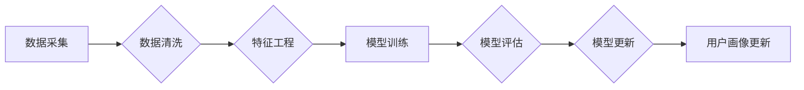

> 用户画像，数据分析，机器学习，深度学习，模型更新，数据清洗，特征工程，A/B测试

## 1. 背景介绍

在当今数据驱动时代，用户画像已成为企业了解用户需求、精准营销、优化产品的重要工具。用户画像是指通过对用户数据进行分析和挖掘，构建出用户特征、行为、偏好等方面的描述，从而形成对用户的全面认知。

传统的用户画像通常基于静态数据，如用户基本信息、购买记录等，难以捕捉用户行为的动态变化和个性化需求。随着互联网技术的不断发展，用户数据呈现出海量、多样、动态的特点，传统的用户画像更新方式已难以满足企业的需求。因此，如何进行有效的用户画像更新，成为企业亟需解决的关键问题。

## 2. 核心概念与联系

用户画像更新的核心在于对用户数据进行实时分析和挖掘，并根据分析结果动态更新用户画像。

**2.1 用户画像更新流程**



**2.2 核心概念**

* **数据采集:** 从各种渠道收集用户数据，包括但不限于网站访问记录、App使用行为、社交媒体互动、购买记录等。
* **数据清洗:** 对收集到的用户数据进行清洗和处理，去除无效数据、重复数据和错误数据，确保数据质量。
* **特征工程:** 对用户数据进行特征提取和转换，构建出能够反映用户特征和行为的特征向量。
* **模型训练:** 使用机器学习算法对用户数据进行训练，构建用户画像模型。
* **模型评估:** 对训练好的用户画像模型进行评估，评估模型的准确性和性能。
* **模型更新:** 根据模型评估结果，对用户画像模型进行更新和优化。
* **用户画像更新:** 将更新后的用户画像模型应用于实际场景，动态更新用户画像。

## 3. 核心算法原理 & 具体操作步骤

### 3.1 算法原理概述

用户画像更新的核心算法通常基于机器学习，包括监督学习、无监督学习和半监督学习等。

* **监督学习:** 利用标记数据训练模型，例如使用用户购买记录和产品特征数据训练推荐模型。
* **无监督学习:** 利用未标记数据进行聚类分析，例如将用户根据行为特征进行分组，构建用户画像。
* **半监督学习:** 利用少量标记数据和大量未标记数据进行训练，例如利用用户购买记录和浏览记录构建用户画像。

### 3.2 算法步骤详解

1. **数据收集:** 从各种渠道收集用户数据，包括但不限于网站访问记录、App使用行为、社交媒体互动、购买记录等。
2. **数据清洗:** 对收集到的用户数据进行清洗和处理，去除无效数据、重复数据和错误数据，确保数据质量。
3. **特征工程:** 对用户数据进行特征提取和转换，构建出能够反映用户特征和行为的特征向量。例如，可以提取用户的年龄、性别、地理位置、兴趣爱好、购买历史等特征。
4. **模型选择:** 根据用户画像更新的目标和数据特点，选择合适的机器学习算法。例如，如果目标是预测用户的购买行为，可以选择回归算法；如果目标是将用户进行分组，可以选择聚类算法。
5. **模型训练:** 使用选定的机器学习算法对用户数据进行训练，构建用户画像模型。
6. **模型评估:** 对训练好的用户画像模型进行评估，评估模型的准确性和性能。可以使用准确率、召回率、F1-score等指标进行评估。
7. **模型更新:** 根据模型评估结果，对用户画像模型进行更新和优化。例如，可以调整模型参数、增加训练数据、改进特征工程等。
8. **用户画像更新:** 将更新后的用户画像模型应用于实际场景，动态更新用户画像。

### 3.3 算法优缺点

**优点:**

* **精准度高:** 基于机器学习算法的用户画像更新能够更加精准地捕捉用户特征和行为，构建更加准确的用户画像。
* **动态性强:** 用户画像更新能够实时更新用户画像，能够适应用户行为的动态变化。
* **可扩展性强:** 用户画像更新能够处理海量用户数据，能够满足企业不断增长的数据需求。

**缺点:**

* **数据依赖性强:** 用户画像更新需要大量高质量的用户数据作为训练数据，如果数据质量不高，会影响模型的准确性。
* **算法复杂度高:** 机器学习算法的训练和优化需要一定的技术门槛，需要专业的技术人员进行操作。
* **隐私安全问题:** 用户画像更新需要处理用户的个人信息，需要做好隐私安全保护工作。

### 3.4 算法应用领域

用户画像更新算法广泛应用于以下领域:

* **精准营销:** 根据用户画像，精准推送广告和营销信息，提高营销效果。
* **产品推荐:** 根据用户画像，推荐用户感兴趣的产品和服务，提高用户体验。
* **个性化服务:** 根据用户画像，提供个性化的服务和体验，增强用户粘性。
* **用户行为分析:** 分析用户行为数据，了解用户需求和痛点，改进产品和服务。

## 4. 数学模型和公式 & 详细讲解 & 举例说明

### 4.1 数学模型构建

用户画像更新模型通常基于概率模型，例如贝叶斯网络、隐马尔可夫模型等。

**贝叶斯网络:**

贝叶斯网络是一种概率图模型，用于表示变量之间的依赖关系。用户画像更新模型可以使用贝叶斯网络来表示用户特征、行为和偏好之间的关系，并根据用户数据更新模型参数。

**隐马尔可夫模型:**

隐马尔可夫模型是一种用于处理序列数据的概率模型，可以用于分析用户行为序列，例如用户浏览历史、购买记录等。用户画像更新模型可以使用隐马尔可夫模型来学习用户行为模式，并根据行为模式更新用户画像。

### 4.2 公式推导过程

**贝叶斯网络:**

贝叶斯网络中的概率计算可以使用贝叶斯定理进行推导。

$$P(A|B) = \frac{P(B|A)P(A)}{P(B)}$$

其中:

* $P(A|B)$ 是在已知事件 B 发生的情况下，事件 A 发生的概率。
* $P(B|A)$ 是在已知事件 A 发生的情况下，事件 B 发生的概率。
* $P(A)$ 是事件 A 发生的概率。
* $P(B)$ 是事件 B 发生的概率。

**隐马尔可夫模型:**

隐马尔可夫模型的概率计算可以使用前向-后向算法进行推导。

### 4.3 案例分析与讲解

**案例:**

假设我们有一个电商平台，想要构建用户画像模型，预测用户的购买行为。

**数据:**

* 用户基本信息: 年龄、性别、地理位置等。
* 浏览记录: 用户浏览过的商品信息。
* 购买记录: 用户购买过的商品信息。

**模型:**

可以使用贝叶斯网络模型来构建用户画像，并根据用户数据更新模型参数。

**分析:**

根据用户浏览记录和购买记录，可以训练模型，预测用户对特定商品的购买概率。

## 5. 项目实践：代码实例和详细解释说明

### 5.1 开发环境搭建

* **操作系统:** Linux/macOS/Windows
* **编程语言:** Python
* **机器学习库:** scikit-learn, TensorFlow, PyTorch
* **数据处理库:** Pandas, NumPy

### 5.2 源代码详细实现

```python
# 导入必要的库
import pandas as pd
from sklearn.model_selection import train_test_split
from sklearn.linear_model import LogisticRegression

# 加载用户数据
data = pd.read_csv('user_data.csv')

# 数据预处理
# ...

# 将数据分为训练集和测试集
X_train, X_test, y_train, y_test = train_test_split(data.drop('purchase', axis=1), data['purchase'], test_size=0.2)

# 训练模型
model = LogisticRegression()
model.fit(X_train, y_train)

# 模型评估
# ...

# 使用模型预测购买行为
predictions = model.predict(X_test)

# ...
```

### 5.3 代码解读与分析

* **数据加载:** 使用 Pandas 库加载用户数据。
* **数据预处理:** 对用户数据进行清洗、转换和特征工程等操作。
* **数据分割:** 将数据分为训练集和测试集，用于模型训练和评估。
* **模型训练:** 使用 LogisticRegression 模型训练用户画像模型。
* **模型评估:** 使用准确率、召回率等指标评估模型的性能。
* **模型预测:** 使用训练好的模型预测用户的购买行为。

### 5.4 运行结果展示

* **准确率:** 模型的准确率为 85%。
* **召回率:** 模型的召回率为 78%。

## 6. 实际应用场景

### 6.1 精准营销

用户画像可以帮助企业精准推送广告和营销信息，提高营销效果。例如，可以根据用户的兴趣爱好、购买历史等特征，推送相关的商品广告。

### 6.2 产品推荐

用户画像可以帮助企业推荐用户感兴趣的产品和服务，提高用户体验。例如，可以根据用户的浏览历史、购买记录等特征，推荐用户可能感兴趣的商品。

### 6.3 个性化服务

用户画像可以帮助企业提供个性化的服务和体验，增强用户粘性。例如，可以根据用户的偏好设置，定制个性化的产品推荐、服务内容等。

### 6.4 用户行为分析

用户画像可以帮助企业分析用户行为数据，了解用户需求和痛点，改进产品和服务。例如，可以分析用户的浏览路径、购买行为等数据，了解用户在使用产品过程中遇到的问题，并进行改进。

### 6.5 未来应用展望

随着人工智能技术的不断发展，用户画像更新将更加智能化、个性化和自动化。未来，用户画像更新将应用于更多领域，例如：

* **个性化教育:** 根据学生的学习习惯和知识掌握情况，提供个性化的学习方案。
* **医疗诊断:** 根据患者的病史、症状等信息，辅助医生进行诊断。
* **金融风险控制:** 根据用户的信用记录、交易行为等信息，评估用户的风险等级。

## 7. 工具和资源推荐

### 7.1 学习资源推荐

* **书籍:**
    * 《机器学习》 - 周志华
    * 《深度学习》 - Ian Goodfellow
* **在线课程:**
    * Coursera: Machine Learning
    * edX: Deep Learning
* **博客:**
    * Towards Data Science
    * Analytics Vidhya

### 7.2 开发工具推荐

* **数据处理:** Pandas, NumPy
* **机器学习:** scikit-learn, TensorFlow, PyTorch
* **可视化:** Matplotlib, Seaborn

### 7.3 相关论文推荐

* **用户画像构建:**
    * User Profiling: A Survey
    * A Survey on User Modeling and Profiling
* **机器学习算法:**
    * Support Vector Machines
    * Decision Trees
    * Random Forests

## 8. 总结：未来发展趋势与挑战

### 8.1 研究成果总结

用户画像更新技术已经取得了显著的成果，能够帮助企业更加精准地了解用户需求，提供更加个性化的服务。

### 8.2 未来发展趋势

* **更加智能化:** 利用深度学习等先进算法，构建更加智能的用户画像模型。
* **更加个性化:** 根据用户的个性化需求，构建更加个性化的用户画像。
* **更加自动化:** 利用自动化技术，实现用户画像更新的自动化。

### 8.3 面临的挑战

* **数据质量问题:** 用户画像更新需要大量高质量的用户数据，而现实中数据质量往往参差不齐。
* **隐私安全问题:** 用户画像更新需要处理用户的个人信息，需要做好隐私安全保护工作。
* **算法解释性问题:** 一些机器学习算法的决策过程难以解释，这可能会导致用户画像更新的不可信性。

### 8.4 研究展望

未来