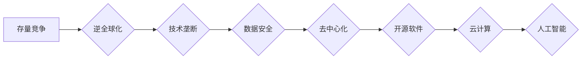

> 存量竞争，逆全球化，技术垄断，数据安全，去中心化，开源软件，云计算，人工智能

## 1. 背景介绍

全球化浪潮席卷全球数十年，推动了经济一体化、技术融合和文化交流。然而，近年来，世界格局正在发生深刻变化，逆全球化浪潮悄然兴起。贸易保护主义抬头，地缘政治紧张，疫情冲击，以及对数据安全和隐私的日益关注，都加速了这一趋势。

在技术领域，存量竞争日益激烈。巨头企业凭借其雄厚的技术实力和庞大的用户基础，占据了市场主导地位，中小企业面临着巨大的挑战。同时，开源软件和去中心化技术的发展，也为打破技术垄断和促进技术创新提供了新的可能性。

## 2. 核心概念与联系

**存量竞争**是指在市场规模趋于饱和的情况下，企业通过争夺现有市场份额来获取利润。这种竞争模式的特点是：

* **竞争激烈:** 企业之间为了争夺有限的市场份额，会采取各种手段，例如价格战、营销大战、产品差异化等。
* **利润空间缩小:** 随着市场竞争的加剧，企业利润空间会不断缩小。
* **创新压力大:** 企业需要不断进行技术创新和产品升级，才能保持竞争优势。

**逆全球化**是指全球化进程放缓或逆转，各国更加注重自身利益，减少对外开放程度。这种趋势的特点是：

* **贸易保护主义:** 各国提高关税壁垒，限制进口商品，保护本国产业。
* **供应链重构:** 企业将生产基地从海外转移回本国，或分散到多个国家，以降低风险。
* **技术壁垒:** 各国加强对关键技术的保护，限制技术外流。

**技术垄断**是指少数企业控制着关键技术，垄断市场，限制竞争。这种现象的特点是：

* **高壁垒:** 技术门槛高，难以进入。
* **高利润:** 垄断企业可以获得高额利润。
* **创新阻碍:** 技术垄断会阻碍技术创新和产业发展。

**数据安全**是指保护个人和组织数据免受未经授权的访问、使用、披露或破坏。随着数据量的爆炸式增长，数据安全问题日益突出。

**去中心化**是指将权力分散到多个节点，而不是集中在单一实体。去中心化技术可以帮助打破技术垄断，提高数据安全性和透明度。

**开源软件**是指源代码公开可供任何人修改和使用的软件。开源软件可以促进技术创新和社区协作。

**云计算**是指通过互联网提供计算资源、存储资源和软件服务的模式。云计算可以降低企业IT成本，提高资源利用率。

**人工智能**是指模拟人类智能的计算机系统。人工智能技术正在各个领域得到广泛应用，并对未来社会产生深远影响。

**Mermaid 流程图:**



## 3. 核心算法原理 & 具体操作步骤

### 3.1  算法原理概述

存量竞争与逆全球化背景下，技术创新和数据安全成为关键。本文将探讨一种基于去中心化和开源软件的算法，用于解决存量竞争中的数据安全和隐私问题。该算法的核心原理是：

* **去中心化数据存储:** 将数据分散存储在多个节点上，而不是集中存储在单一服务器上。
* **加密技术:** 使用加密技术对数据进行保护，防止未经授权的访问。
* **区块链技术:** 利用区块链技术记录数据访问和修改日志，确保数据不可篡改。

### 3.2  算法步骤详解

1. **数据加密:** 将用户数据进行加密，生成密文。
2. **数据分片:** 将密文数据分成多个数据块，每个数据块存储在不同的节点上。
3. **数据存储:** 将数据块存储在去中心化的存储网络中，例如IPFS或Filecoin。
4. **数据访问:** 用户需要提供相应的密钥才能解密数据块并访问数据。
5. **数据修改:** 用户想要修改数据，需要向多个节点提交修改请求，并获得多数节点的同意。
6. **数据日志记录:** 所有数据访问和修改操作都会被记录在区块链上，确保数据不可篡改。

### 3.3  算法优缺点

**优点:**

* **提高数据安全:** 去中心化存储和加密技术可以有效防止数据泄露和篡改。
* **增强用户隐私:** 用户可以控制自己的数据访问权限，保护个人隐私。
* **提高数据可靠性:** 数据分散存储在多个节点上，即使部分节点出现故障，数据也不会丢失。

**缺点:**

* **复杂性:** 该算法的实现较为复杂，需要专业的技术人员进行开发和维护。
* **性能:** 数据访问和修改操作需要经过多个节点的验证，可能会导致性能下降。
* **成本:** 去中心化存储和区块链技术的使用成本较高。

### 3.4  算法应用领域

该算法可以应用于以下领域:

* **医疗保健:** 保护患者医疗数据的安全和隐私。
* **金融服务:** 加强金融交易的安全性和可靠性。
* **供应链管理:** 提高供应链的透明度和可追溯性。
* **教育:** 保护学生个人信息和学习成果。

## 4. 数学模型和公式 & 详细讲解 & 举例说明

### 4.1  数学模型构建

假设有N个节点组成一个去中心化网络，每个节点存储M个数据块。数据块的访问权限由一个加密密钥控制。

**数据安全模型:**

$$
P(S) = 1 - \prod_{i=1}^{N} (1 - P(S_i))
$$

其中：

* $P(S)$ 表示整个网络数据安全的概率。
* $P(S_i)$ 表示第i个节点数据安全的概率。

**数据隐私模型:**

$$
P(P) = \frac{1}{N} \sum_{i=1}^{N} P(P_i)
$$

其中：

* $P(P)$ 表示整个网络数据隐私的概率。
* $P(P_i)$ 表示第i个节点数据隐私的概率。

### 4.2  公式推导过程

数据安全模型的推导过程如下：

1. 假设每个节点的数据安全概率为独立的事件。
2. 整个网络数据安全，意味着所有节点的数据都安全。
3. 因此，整个网络数据安全的概率等于所有节点数据安全概率的乘积。

数据隐私模型的推导过程如下：

1. 假设每个节点的数据隐私概率为独立的事件。
2. 整个网络数据隐私，意味着所有节点的数据都隐私。
3. 因此，整个网络数据隐私的概率等于所有节点数据隐私概率的平均值。

### 4.3  案例分析与讲解

假设一个去中心化网络有10个节点，每个节点的数据安全概率为0.9，数据隐私概率为0.8。

根据上述公式，我们可以计算出：

* 整个网络数据安全的概率为：$1 - (1 - 0.9)^{10} = 0.999999999$
* 整个网络数据隐私的概率为：$\frac{1}{10} \sum_{i=1}^{10} 0.8 = 0.8$

从案例分析可以看出，去中心化网络可以有效提高数据安全，但数据隐私的保护还需要进一步加强。

## 5. 项目实践：代码实例和详细解释说明

### 5.1  开发环境搭建

该项目可以使用以下开发环境搭建：

* 操作系统：Linux或macOS
* 编程语言：Python
* 开发工具：VS Code或Atom
* 依赖库：IPFS、Filecoin、PyCryptodome

### 5.2  源代码详细实现

```python
# 数据加密
from Crypto.Cipher import AES

def encrypt_data(data, key):
    cipher = AES.new(key, AES.MODE_CBC)
    ciphertext = cipher.encrypt(data)
    return ciphertext

# 数据分片
def split_data(data, num_chunks):
    chunk_size = len(data) // num_chunks
    chunks = [data[i:i + chunk_size] for i in range(0, len(data), chunk_size)]
    return chunks

# 数据存储
def store_data(chunks, ipfs_client):
    for chunk in chunks:
        ipfs_client.add(chunk)

# 数据访问
def retrieve_data(ipfs_hashes, ipfs_client):
    data_chunks = [ipfs_client.cat(hash) for hash in ipfs_hashes]
    return ''.join(data_chunks)

# 数据修改
def modify_data(data, ipfs_client, ipfs_hashes):
    # ...

# 数据日志记录
def log_data_changes(changes, blockchain_client):
    # ...
```

### 5.3  代码解读与分析

* `encrypt_data()` 函数使用 AES 加密算法对数据进行加密。
* `split_data()` 函数将数据分成多个数据块。
* `store_data()` 函数将数据块存储在 IPFS 网络中。
* `retrieve_data()` 函数根据 IPFS 哈希值获取数据块并拼接成原始数据。
* `modify_data()` 函数实现数据修改操作，需要考虑数据块的更新和验证。
* `log_data_changes()` 函数将数据修改日志记录到区块链上。

### 5.4  运行结果展示

运行上述代码，可以实现数据加密、分片、存储、访问、修改和日志记录等功能。

## 6. 实际应用场景

### 6.1  医疗保健

* **电子病历安全存储:** 将患者电子病历加密存储在去中心化网络中，防止数据泄露和篡改。
* **基因数据隐私保护:** 将患者基因数据加密存储在去中心化网络中，保护患者隐私。
* **远程医疗数据共享:** 利用去中心化网络安全共享患者医疗数据，方便医生进行远程诊断和治疗。

### 6.2  金融服务

* **银行账户安全:** 将银行账户信息加密存储在去中心化网络中，防止账户被盗。
* **金融交易安全:** 利用区块链技术记录金融交易信息，确保交易安全和不可篡改。
* **数字资产管理:** 利用去中心化网络管理数字资产，提高资产安全性和透明度。

### 6.3  供应链管理

* **产品溯源:** 利用区块链技术记录产品生产和流通信息，实现产品溯源。
* **供应链透明度:** 利用去中心化网络公开供应链信息，提高供应链透明度。
* **防伪溯源:** 利用区块链技术防伪溯源，防止假冒伪劣产品进入市场。

### 6.4  未来应用展望

随着去中心化和开源软件技术的不断发展，该算法将在更多领域得到应用，例如：

* **教育:** 保护学生个人信息和学习成果。
* **政府:** 加强政府数据安全和透明度。
* **科研:** 共享科研数据，促进科研合作。

## 7. 工具和资源推荐

### 7.1  学习资源推荐

* **去中心化网络:** IPFS、Filecoin
* **区块链技术:** Ethereum、Hyperledger Fabric
* **加密算法:** PyCryptodome、Cryptography

### 7.2  开发工具推荐

* **编程语言:** Python
* **开发环境:** VS Code、Atom
* **区块链开发框架:** Truffle、Remix

### 7.3  相关论文推荐

* **去中心化存储网络:** IPFS: A Peer-to-Peer Hypermedia Distribution Protocol
* **区块链技术:** Bitcoin: A Peer-to-Peer Electronic Cash System
* **数据安全与隐私:** Differential Privacy

## 8. 总结：未来发展趋势与挑战

### 8.1  