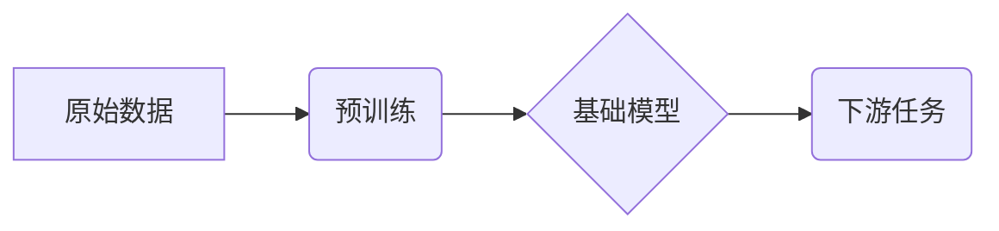

> 基础模型、学术界、研究贡献、算法创新、应用推广、伦理规范、未来趋势

## 1. 背景介绍

近年来，基础模型（Foundation Models）在人工智能领域掀起了一场革命。这些模型通常拥有庞大的参数规模和广泛的知识储备，能够在多种下游任务中表现出惊人的泛化能力。从自然语言处理到计算机视觉，基础模型的应用场景日益拓展，为各行各业带来了前所未有的机遇。

然而，基础模型的开发和应用并非一帆风顺。其训练成本高昂，数据需求巨大，存在潜在的偏见和安全风险。在这样的背景下，学术界扮演着至关重要的角色，推动着基础模型的健康发展和可持续进步。

## 2. 核心概念与联系

基础模型的核心概念在于其“通用性”。与传统机器学习模型相比，基础模型不局限于特定任务，而是通过学习大量的原始数据，掌握了更广泛的知识和技能。这种“零样本学习”的能力使得基础模型能够在面对新任务时，只需进行少量或甚至无需任何微调即可取得令人瞩目的效果。

**基础模型的架构**

## 3. 核心算法原理 & 具体操作步骤

### 3.1  算法原理概述

基础模型的训练主要依赖于**自监督学习**和**迁移学习**两种算法。

* **自监督学习**：通过设计特殊的预训练任务，例如语言建模、图像分类等，让模型在未标记数据上进行训练，学习到数据的潜在结构和规律。
* **迁移学习**：将预训练好的基础模型应用于下游任务，通过微调模型参数，使其适应特定任务的需求。

### 3.2  算法步骤详解

1. **数据收集和预处理**: 收集大量原始数据，并进行清洗、格式化等预处理操作。
2. **模型选择**: 选择合适的基础模型架构，例如Transformer、BERT、GPT等。
3. **预训练**: 使用自监督学习算法，在未标记数据上训练模型，使其学习到数据的潜在结构和规律。
4. **微调**: 将预训练好的模型应用于下游任务，通过微调模型参数，使其适应特定任务的需求。
5. **评估**: 使用测试数据评估模型的性能，并进行调整和优化。

### 3.3  算法优缺点

**优点**:

* **泛化能力强**: 基于大量数据的训练，基础模型能够在多种下游任务中表现出良好的泛化能力。
* **效率高**: 迁移学习可以显著减少下游任务的训练时间和资源消耗。
* **可扩展性强**: 基础模型的架构通常具有良好的可扩展性，可以根据需要增加模型参数规模。

**缺点**:

* **训练成本高**: 基础模型的训练需要大量的计算资源和时间。
* **数据依赖性强**: 基础模型的性能与训练数据的质量和数量密切相关。
* **潜在的偏见**: 基础模型可能继承训练数据中的偏见，导致模型输出存在偏差。

### 3.4  算法应用领域

基础模型在各个领域都有广泛的应用，例如：

* **自然语言处理**: 文本生成、机器翻译、问答系统、情感分析等。
* **计算机视觉**: 图像分类、目标检测、图像生成、视频理解等。
* **语音识别**: 语音转文本、语音合成、语音助手等。
* **药物研发**: 蛋白质结构预测、药物分子设计等。

## 4. 数学模型和公式 & 详细讲解 & 举例说明

### 4.1  数学模型构建

基础模型的训练通常基于**概率模型**，例如**语言模型**和**图像模型**。

* **语言模型**: 使用概率分布来表示单词序列的可能性，例如**n-gram模型**和**Transformer模型**。
* **图像模型**: 使用概率分布来表示图像像素的可能性，例如**卷积神经网络(CNN)**和**生成对抗网络(GAN)**。

### 4.2  公式推导过程

例如，**Transformer模型**的核心是**自注意力机制**，其计算公式如下：

$$
Attention(Q, K, V) = \frac{exp(Q \cdot K^T / \sqrt{d_k})}{exp(Q \cdot K^T / \sqrt{d_k})} \cdot V
$$

其中，$Q$, $K$, $V$ 分别代表查询矩阵、键矩阵和值矩阵，$d_k$ 代表键向量的维度。

### 4.3  案例分析与讲解

例如，**BERT模型**在预训练阶段使用**Masked Language Modeling(MLM)**和**Next Sentence Prediction(NSP)**两个任务。

* **MLM**: 随机掩盖输入文本中的某些单词，让模型预测被掩盖单词的词语。
* **NSP**: 给定两个句子，预测它们是否相邻。

通过这两个任务的训练，BERT模型能够学习到语言的语义和语法结构。

## 5. 项目实践：代码实例和详细解释说明

### 5.1  开发环境搭建

使用Python语言和相关的深度学习框架，例如TensorFlow或PyTorch，搭建开发环境。

### 5.2  源代码详细实现

使用预训练好的基础模型，例如BERT或GPT，进行下游任务的微调。

### 5.3  代码解读与分析

解释代码中使用的函数、类和参数，以及模型训练和评估的过程。

### 5.4  运行结果展示

展示模型在测试数据集上的性能指标，例如准确率、召回率、F1-score等。

## 6. 实际应用场景

### 6.1  自然语言处理

* **聊天机器人**: 基于基础模型的聊天机器人能够进行更自然、更流畅的对话。
* **文本摘要**: 基于基础模型的文本摘要工具能够自动生成高质量的文本摘要。
* **机器翻译**: 基于基础模型的机器翻译系统能够实现更高质量的翻译。

### 6.2  计算机视觉

* **图像识别**: 基于基础模型的图像识别系统能够识别各种物体和场景。
* **目标检测**: 基于基础模型的目标检测系统能够准确地定位图像中的目标。
* **图像生成**: 基于基础模型的图像生成系统能够生成逼真的图像。

### 6.3  语音识别

* **语音转文本**: 基于基础模型的语音转文本系统能够将语音准确地转换为文本。
* **语音合成**: 基于基础模型的语音合成系统能够生成自然流畅的语音。
* **语音助手**: 基于基础模型的语音助手能够理解用户的语音指令并执行相应的操作。

### 6.4  未来应用展望

基础模型的应用前景广阔，未来将应用于更多领域，例如：

* **医疗保健**: 基于基础模型的医疗诊断系统能够辅助医生进行诊断。
* **教育**: 基于基础模型的教育平台能够提供个性化的学习体验。
* **金融**: 基于基础模型的金融风险管理系统能够帮助金融机构识别和规避风险。

## 7. 工具和资源推荐

### 7.1  学习资源推荐

* **书籍**:
    * 《深度学习》
    * 《自然语言处理》
    * 《计算机视觉》
* **在线课程**:
    * Coursera
    * edX
    * Udacity

### 7.2  开发工具推荐

* **深度学习框架**: TensorFlow, PyTorch, Keras
* **编程语言**: Python
* **云计算平台**: AWS, Azure, Google Cloud

### 7.3  相关论文推荐

* **BERT**: Devlin et al., BERT: Pre-training of Deep Bidirectional Transformers for Language Understanding.
* **GPT**: Radford et al., Language Models are Few-Shot Learners.
* **DALL-E**: Ramesh et al., Zero-Shot Text-to-Image Generation.

## 8. 总结：未来发展趋势与挑战

### 8.1  研究成果总结

学术界在基础模型领域取得了显著的成果，例如开发出各种高效的预训练算法和模型架构，推动了基础模型的性能和应用范围的不断拓展。

### 8.2  未来发展趋势

* **模型规模和能力的提升**: 未来基础模型将拥有更大的参数规模和更强的泛化能力。
* **多模态学习**: 基础模型将能够处理多种模态数据，例如文本、图像、音频等。
* **可解释性和可控性**: 研究者将致力于提高基础模型的可解释性和可控性，使其更加安全可靠。

### 8.3  面临的挑战

* **数据安全和隐私**: 基础模型的训练需要大量数据，如何保证数据安全和隐私是一个重要的挑战。
* **算法公平性和偏见**: 基础模型可能继承训练数据中的偏见，如何确保算法公平性和公正性是一个需要解决的问题。
* **伦理规范**: 基础模型的应用可能带来伦理风险，例如深度伪造、信息操控等，需要制定相应的伦理规范和监管机制。

### 8.4  研究展望

未来学术界将继续致力于基础模型的研究，探索其更深层次的潜力，并解决其面临的挑战，推动基础模型的健康发展和可持续进步。

## 9. 附录：常见问题与解答

### 9.1  基础模型和传统机器学习模型有什么区别？

基础模型和传统机器学习模型的主要区别在于：

* **数据规模**: 基础模型通常训练于海量数据上，而传统机器学习模型则通常训练于相对较小的数据集上。
* **泛化能力**: 基础模型具有更强的泛化能力，能够在多种下游任务中表现出良好的性能。
* **训练成本**: 基础模型的训练成本通常更高，需要更多的计算资源和时间。

### 9.2  如何选择合适的基础模型？

选择合适的基础模型需要考虑以下因素：

* **下游任务**: 不同的下游任务需要不同的基础模型。
* **数据规模**: 数据规模越大，可以选择更大型的基础模型。
* **计算资源**: 计算资源有限的情况下，可以选择参数规模较小的基础模型。

### 9.3  基础模型的训练过程如何进行？

基础模型的训练过程通常包括以下步骤：

* **数据收集和预处理**: 收集大量原始数据，并进行清洗、格式化等预处理操作。
* **模型选择**: 选择合适的基础模型架构。
* **预训练**: 使用自监督学习算法，在未标记数据上训练模型。
* **微调**: 将预训练好的模型应用于下游任务，通过微调模型参数，使其适应特定任务的需求。

作者：禅与计算机程序设计艺术 / Zen and the Art of Computer Programming 
<end_of_turn>