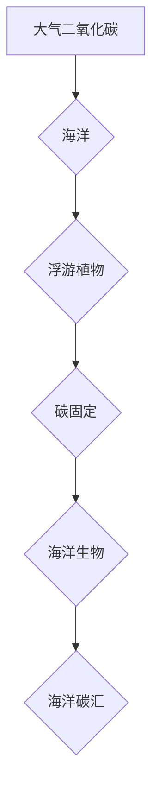
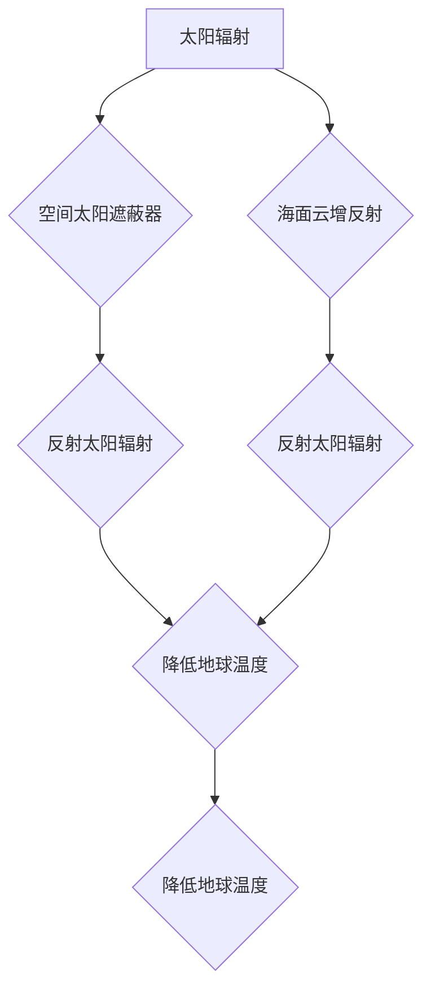

> 全球变暖，海洋施肥，太阳能地球工程，气候干预，人工智能，算法，数学模型，代码实现

## 1. 背景介绍

21世纪初，全球气候变化已成为人类面临的严峻挑战。全球平均气温持续上升，极端天气事件频发，海平面上升，冰川融化，生态系统失衡，给人类社会和自然环境带来巨大威胁。面对这一挑战，国际社会积极寻求应对措施，其中包括减排、适应和干预三大策略。

减排措施旨在减少温室气体排放，例如通过发展可再生能源、提高能源效率、推广绿色交通等。适应措施旨在帮助人类社会和生态系统适应气候变化带来的影响，例如通过建设海堤、开发抗旱作物、加强灾害预警等。干预措施旨在直接改变地球气候系统，例如通过海洋施肥、太阳能地球工程等。

## 2. 核心概念与联系

### 2.1 海洋施肥

海洋施肥是指在海洋中添加营养物质，以促进海洋生物的生长和繁殖，从而吸收大气中的二氧化碳。

**原理：**海洋生物，特别是浮游植物，是海洋中重要的碳汇。它们通过光合作用吸收二氧化碳，并将碳固定在生物体中。通过增加海洋中的营养物质，例如氮和磷，可以促进浮游植物的生长，从而提高海洋的碳吸收能力。

**流程图：**



### 2.2 太阳能地球工程

太阳能地球工程是指通过改变太阳辐射到达地球的量，来调节地球气候的工程项目。

**原理：**太阳能地球工程的原理是通过反射或吸收一部分太阳辐射，从而降低地球的温度。常见的太阳能地球工程方法包括：

* **空间太阳遮蔽器：**在太空中部署巨大的反射镜，反射一部分太阳辐射，从而降低地球的温度。
* **海面云增反射：**在海洋表面喷洒微小的颗粒物，形成云层，反射一部分太阳辐射，从而降低地球的温度。

**流程图：**



## 3. 核心算法原理 & 具体操作步骤

### 3.1 算法原理概述

海洋施肥和太阳能地球工程都需要复杂的算法来进行规划、控制和评估。这些算法通常涉及以下几个方面：

* **海洋动力学模型：**模拟海洋中的物理和化学过程，例如水流、温度、盐度、营养物质的分布等。
* **生物地球化学模型：**模拟海洋生物的生长、繁殖、死亡等过程，以及它们与营养物质和碳的相互作用。
* **气候模型：**模拟地球气候系统，包括大气、海洋、陆地和冰川等，以及它们之间的相互作用。

### 3.2 算法步骤详解

**海洋施肥算法：**

1. **获取海洋数据：**利用卫星遥感、海洋观测站等获取海洋中的物理、化学和生物数据。
2. **构建海洋动力学模型：**根据获取的数据，构建海洋动力学模型，模拟海洋中的营养物质分布。
3. **确定施肥区域和量：**根据模型模拟结果，确定最佳的施肥区域和施肥量，以最大限度地吸收二氧化碳。
4. **实施施肥操作：**利用船只或无人机等设备，将营养物质运送到指定区域并进行施肥。
5. **监测和评估：**定期监测施肥效果，评估碳吸收量和生态影响，并根据结果调整施肥策略。

**太阳能地球工程算法：**

1. **构建气候模型：**利用现有数据和模型，构建地球气候模型，模拟太阳能地球工程对气候的影响。
2. **设计工程方案：**根据模型模拟结果，设计太阳能地球工程的具体方案，例如空间太阳遮蔽器的尺寸、位置和部署方式。
3. **评估工程风险：**评估太阳能地球工程的潜在风险，例如对生态系统、天气模式和人类社会的影响。
4. **制定控制策略：**制定控制策略，确保太阳能地球工程的安全性和可控性。
5. **实施工程项目：**根据设计方案和控制策略，实施太阳能地球工程项目。
6. **监测和评估：**定期监测工程效果，评估对气候的影响和潜在风险，并根据结果调整控制策略。

### 3.3 算法优缺点

**海洋施肥算法：**

* **优点：**
    * 潜在的碳吸收能力强。
    * 相对成本较低。
    * 可以促进海洋生物多样性。
* **缺点：**
    * 可能导致海洋生态系统失衡。
    * 施肥区域的选择和量需要精确控制。
    * 碳吸收量难以精确预测。

**太阳能地球工程算法：**

* **优点：**
    * 能够快速有效地降低地球温度。
    * 可以应对气候变化带来的紧急威胁。
* **缺点：**
    * 潜在的风险和不确定性较大。
    * 需要大量的资金和技术投入。
    * 可能引发国际政治争端。

### 3.4 算法应用领域

海洋施肥和太阳能地球工程算法的应用领域主要包括：

* **气候变化缓解：**通过吸收二氧化碳或降低地球温度，减缓气候变化的影响。
* **海洋资源管理：**通过促进海洋生物生长，提高海洋渔业产量。
* **环境修复：**通过修复受污染的海洋环境。

## 4. 数学模型和公式 & 详细讲解 & 举例说明

### 4.1 数学模型构建

海洋施肥和太阳能地球工程的数学模型通常基于以下几个基本方程：

* **碳循环方程：**描述海洋中碳的吸收、释放和转化过程。
* **营养物质循环方程：**描述海洋中营养物质的分布、转化和利用过程。
* **生物生长方程：**描述海洋生物的生长、繁殖和死亡过程。
* **气候模型方程：**描述地球气候系统的物理和化学过程。

### 4.2 公式推导过程

例如，碳循环方程可以表示为：

$$
\frac{dC}{dt} = P - R - A
$$

其中：

* $C$ 表示海洋中碳的浓度。
* $t$ 表示时间。
* $P$ 表示海洋中碳的输入量，例如大气中的二氧化碳。
* $R$ 表示海洋中碳的输出量，例如海洋生物的呼吸和沉积。
* $A$ 表示海洋中碳的吸收量，例如浮游植物的光合作用。

### 4.3 案例分析与讲解

通过构建和解算这些数学模型，可以模拟海洋施肥和太阳能地球工程对海洋碳循环和气候的影响。例如，可以模拟不同施肥量和区域对碳吸收量的影响，或者模拟不同太阳遮蔽器尺寸和位置对地球温度的影响。

## 5. 项目实践：代码实例和详细解释说明

### 5.1 开发环境搭建

开发海洋施肥和太阳能地球工程算法需要以下开发环境：

* **编程语言：**Python、C++、Fortran等。
* **数值计算库：**NumPy、SciPy、MATLAB等。
* **图形处理库：**Matplotlib、Seaborn、Plotly等。
* **云计算平台：**AWS、Azure、GCP等。

### 5.2 源代码详细实现

以下是一个简单的Python代码示例，用于模拟海洋施肥对碳吸收量的影响：

```python
import numpy as np

# 定义海洋碳循环方程
def carbon_cycle(C, P, R, A, dt):
  return C + dt * (P - R - A)

# 设置初始条件
C0 = 100  # 初始碳浓度
P = 10  # 碳输入量
R = 5  # 碳输出量
A = 0  # 碳吸收量
dt = 0.1  # 时间步长

# 模拟施肥
for i in range(100):
  A = 2  # 施肥后碳吸收量增加
  C = carbon_cycle(C, P, R, A, dt)
  print(f"时间步 {i+1}: 碳浓度 = {C}")
```

### 5.3 代码解读与分析

这段代码定义了一个简单的碳循环方程，并模拟了施肥后碳吸收量的变化。

* `carbon_cycle()` 函数计算了碳浓度的变化量，根据碳输入量、输出量和吸收量进行计算。
* `C0`、`P`、`R`、`A` 和 `dt` 分别表示初始碳浓度、碳输入量、碳输出量、碳吸收量和时间步长。
* 循环语句模拟了施肥过程，在施肥后，碳吸收量增加，导致碳浓度上升。

### 5.4 运行结果展示

运行这段代码后，会输出一系列碳浓度的变化值，显示施肥后碳浓度逐渐上升的趋势。

## 6. 实际应用场景

### 6.1 海洋施肥

海洋施肥技术目前主要应用于以下场景：

* **提高渔业产量：**通过增加海洋中的营养物质，促进浮游植物生长，从而提高鱼类和贝类产量。
* **碳汇增强：**通过促进浮游植物生长，增加海洋的碳吸收能力，缓解气候变化。
* **海洋生态修复：**通过修复受污染的海洋环境，恢复海洋生物多样性。

### 6.2 太阳能地球工程

太阳能地球工程技术目前主要处于研究和开发阶段，尚未有实际应用。

### 6.4 未来应用展望

随着气候变化的加剧，海洋施肥和太阳能地球工程技术有望在未来得到更广泛的应用，例如：

* **大规模碳捕获：**利用海洋施肥技术，大规模吸收大气中的二氧化碳，缓解气候变化。
* **区域气候调节：**利用太阳能地球工程技术，调节特定区域的气候，例如缓解干旱或降雨过量。
* **灾害减缓：**利用太阳能地球工程技术，减缓极端天气事件的强度和频率，例如减轻热浪和洪水的影响。

## 7. 工具和资源推荐

### 7.1 学习资源推荐

* **书籍：**
    * 《气候工程：地球的未来》
    * 《海洋施肥：原理、应用和挑战》
* **在线课程：**
    * Coursera 上的“气候变化与可持续发展”课程
    * edX 上的“海洋科学与技术”课程
* **网站：**
    * 国际气候工程计划 (ICE)
    * 海洋施肥国际合作中心 (IOFC)

### 7.2 开发工具推荐

* **编程语言：**Python、C++、Fortran
* **数值计算库：**NumPy、SciPy、MATLAB
* **图形处理库：**Matplotlib、Seaborn、Plotly
* **云计算平台：**AWS、Azure、GCP

### 7.3 相关论文推荐

* **海洋施肥：**
    * “Ocean fertilization: A review of the potential and risks”
    * “The potential of ocean fertilization to mitigate climate change”
* **太阳能地球工程：**
    * “Solar geoengineering: A review of the science and policy”
    * “The risks and benefits of solar geoengineering”

## 8. 总结：未来发展趋势与挑战

### 8.1 研究成果总结

海洋