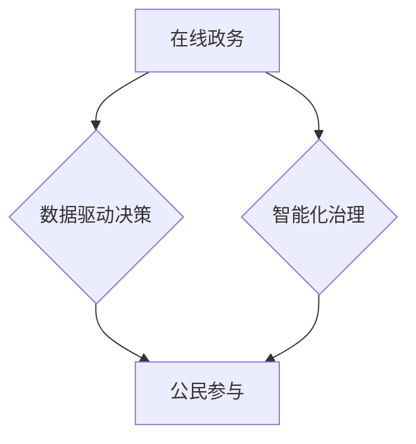

> 数字治理、数字民主、在线政务、公民参与、人工智能、区块链、数据安全、隐私保护、未来趋势

## 1. 背景介绍

21世纪，信息技术飞速发展，深刻改变了人类社会各个方面。互联网、移动互联网、大数据、人工智能等技术的蓬勃发展，为构建更加便捷、高效、透明的数字治理体系提供了新的机遇。数字治理是指利用数字技术手段，优化政府治理结构、流程和服务，提升政府效能和服务水平，促进社会公平正义和可持续发展。

随着数字技术的不断进步，数字治理已成为全球范围内重要的议题。各国政府纷纷探索数字治理的路径，致力于构建更加智能、高效、透明的治理体系。

## 2. 核心概念与联系

数字治理的核心概念包括：

* **在线政务:** 利用互联网平台提供政府公共服务，实现政务信息公开透明、办事流程简化、服务效率提升。
* **数字公民参与:** 利用数字技术平台，鼓励公民参与公共决策、监督政府行为、表达意见和诉求，促进公民参与式治理。
* **数据驱动决策:** 利用大数据分析技术，挖掘政府数据中的价值，为政府决策提供科学依据，提升决策的精准性和有效性。
* **智能化治理:** 利用人工智能技术，构建智能化政务服务平台，实现政府服务自动化、智能化，提升服务质量和效率。

**数字治理架构**



## 3. 核心算法原理 & 具体操作步骤

### 3.1  算法原理概述

数字治理的核心算法原理主要包括：

* **机器学习算法:** 用于分析政府数据，识别趋势和模式，为决策提供支持。
* **自然语言处理算法:** 用于处理公民意见和反馈，理解公民需求，提高政府服务质量。
* **区块链技术:** 用于保障数据安全和透明度，防止数据篡改，提升政府治理的信任度。

### 3.2  算法步骤详解

以机器学习算法为例，其具体操作步骤如下：

1. **数据收集:** 收集政府相关数据，例如人口数据、经济数据、社会发展数据等。
2. **数据预处理:** 对收集到的数据进行清洗、转换、格式化等处理，使其符合机器学习算法的输入要求。
3. **特征提取:** 从预处理后的数据中提取关键特征，例如人口密度、经济增长率、社会满意度等。
4. **模型训练:** 利用机器学习算法，对提取的特征进行训练，建立预测模型。
5. **模型评估:** 对训练好的模型进行评估，测试其预测精度和准确性。
6. **模型部署:** 将经过评估的模型部署到生产环境中，用于实际决策支持。

### 3.3  算法优缺点

**优点:**

* 能够自动分析大量数据，发现隐藏的规律和趋势。
* 能够提高决策的精准性和有效性。
* 能够提升政府服务效率和质量。

**缺点:**

* 需要大量的数据进行训练，数据质量直接影响模型效果。
* 模型训练需要专业的技术人员和计算资源。
* 模型的解释性较差，难以理解模型的决策逻辑。

### 3.4  算法应用领域

机器学习算法在数字治理领域有广泛的应用，例如：

* **预测分析:** 预测人口增长趋势、经济发展状况、社会风险等。
* **风险控制:** 识别和预防政府腐败、欺诈等风险。
* **资源优化:** 优化资源配置，提高资源利用效率。
* **个性化服务:** 提供个性化的政府服务，满足不同公民的需求。

## 4. 数学模型和公式 & 详细讲解 & 举例说明

### 4.1  数学模型构建

数字治理中的数据分析和决策支持通常采用数学模型进行建模和分析。例如，可以使用线性回归模型预测人口增长趋势，可以使用决策树模型识别政府腐败风险。

### 4.2  公式推导过程

以线性回归模型为例，其目标是找到一条直线，使得这条直线与数据点之间的距离最小。

**公式:**

$$y = mx + c$$

其中：

* $y$ 是预测值
* $x$ 是自变量
* $m$ 是斜率
* $c$ 是截距

**推导过程:**

线性回归模型的目标函数是均方误差，即所有数据点与预测值之间的平方差之和。

$$MSE = \sum_{i=1}^{n}(y_i - \hat{y}_i)^2$$

其中：

* $y_i$ 是第 $i$ 个数据点的真实值
* $\hat{y}_i$ 是第 $i$ 个数据点的预测值
* $n$ 是数据点的总数

通过最小化均方误差，可以求解出斜率 $m$ 和截距 $c$ 的最佳值。

### 4.3  案例分析与讲解

假设我们想要预测某个城市的未来人口增长趋势。我们可以收集该城市过去几年的人口数据，并使用线性回归模型进行建模。

**数据:**

| 年份 | 人口 |
|---|---|
| 2010 | 1000000 |
| 2015 | 1200000 |
| 2020 | 1400000 |

**模型训练:**

使用上述数据训练线性回归模型，得到以下模型参数：

* $m = 40000$
* $c = 1000000$

**预测:**

根据模型参数，我们可以预测2025年的城市人口为：

$$y = 40000 \times 5 + 1000000 = 1200000$$

## 5. 项目实践：代码实例和详细解释说明

### 5.1  开发环境搭建

数字治理项目开发环境通常包括：

* **操作系统:** Linux、Windows等
* **编程语言:** Python、Java等
* **数据库:** MySQL、PostgreSQL等
* **云平台:** AWS、Azure、GCP等

### 5.2  源代码详细实现

以下是一个使用Python语言实现的简单数字治理项目代码示例：

```python
import pandas as pd
from sklearn.linear_model import LinearRegression

# 数据加载
data = pd.read_csv("population_data.csv")

# 特征提取
X = data["年份"].values.reshape(-1, 1)
y = data["人口"].values

# 模型训练
model = LinearRegression()
model.fit(X, y)

# 预测
future_year = 2025
future_population = model.predict([[future_year]])

# 结果输出
print(f"2025年的预测人口为: {future_population[0]}")
```

### 5.3  代码解读与分析

* **数据加载:** 使用pandas库加载人口数据。
* **特征提取:** 将年份作为自变量，人口作为因变量。
* **模型训练:** 使用sklearn库的线性回归模型进行训练。
* **预测:** 使用训练好的模型预测未来年份的人口。
* **结果输出:** 打印预测结果。

### 5.4  运行结果展示

运行上述代码，可以得到2025年城市人口的预测结果。

## 6. 实际应用场景

数字治理技术已在多个领域得到实际应用，例如：

* **在线政务:** 提供在线办理各种行政审批、缴费、咨询等服务，提高政府服务效率和便捷性。
* **电子投票:** 利用互联网平台进行电子投票，提高投票率和投票的安全性。
* **公民参与:** 建立公民意见反馈平台，鼓励公民参与公共决策，提升政府的透明度和问责性。
* **数据共享:** 建立数据共享平台，促进政府部门之间的数据共享和协同工作，提高政府治理效率。

### 6.4  未来应用展望

未来，数字治理技术将更加智能化、个性化、协同化。例如：

* **人工智能驱动的智能政务:** 利用人工智能技术，实现政府服务的自动化、智能化，提供更加个性化的服务。
* **区块链技术保障的透明治理:** 利用区块链技术，保障政府数据的安全性和透明度，提升政府治理的信任度。
* **跨部门协同的数字治理平台:** 建立跨部门协同的数字治理平台，促进政府部门之间的数据共享和协同工作，提高政府治理效率。

## 7. 工具和资源推荐

### 7.1  学习资源推荐

* **书籍:**
    * 《数字治理》
    * 《数据驱动决策》
    * 《人工智能与社会》
* **在线课程:**
    * Coursera: 数字治理
    * edX: 数据科学
    * Udacity: 人工智能

### 7.2  开发工具推荐

* **编程语言:** Python, Java
* **数据库:** MySQL, PostgreSQL
* **云平台:** AWS, Azure, GCP
* **机器学习库:** scikit-learn, TensorFlow, PyTorch

### 7.3  相关论文推荐

* **数字治理的理论与实践**
* **人工智能在数字治理中的应用**
* **区块链技术在数字治理中的应用**

## 8. 总结：未来发展趋势与挑战

### 8.1  研究成果总结

数字治理技术的发展取得了显著成果，为构建更加智能、高效、透明的治理体系提供了新的途径。

### 8.2  未来发展趋势

未来，数字治理技术将朝着更加智能化、个性化、协同化的方向发展。

### 8.3  面临的挑战

数字治理技术的发展也面临着一些挑战，例如：

* **数据安全和隐私保护:** 如何保障政府数据和公民隐私的安全，防止数据泄露和滥用。
* **算法偏见:** 如何避免算法的偏见，确保算法公平公正地应用于数字治理。
* **数字鸿沟:** 如何缩小数字鸿沟，让所有公民都能平等地享受数字治理带来的便利。

### 8.4  研究展望

未来，需要加强对数字治理技术的研发和应用，探索更加有效的数字治理模式，促进数字治理技术与社会发展相融合，构建更加公平、正义、可持续的社会。

## 9. 附录：常见问题与解答

**常见问题:**

* 数字治理技术会取代传统政府治理吗？
* 数字治理技术会带来哪些新的伦理问题？
* 如何确保数字治理技术的公平性和透明度？

**解答:**

* 数字治理技术不会取代传统政府治理，而是作为一种补充和提升传统治理效率的手段。
* 数字治理技术的发展会带来一些新的伦理问题，例如数据隐私保护、算法偏见等，需要社会各界共同探讨和解决。
* 确保数字治理技术的公平性和透明度需要建立健全的法律法规、技术标准和监督机制。


作者：禅与计算机程序设计艺术 / Zen and the Art of Computer Programming 
<end_of_turn>