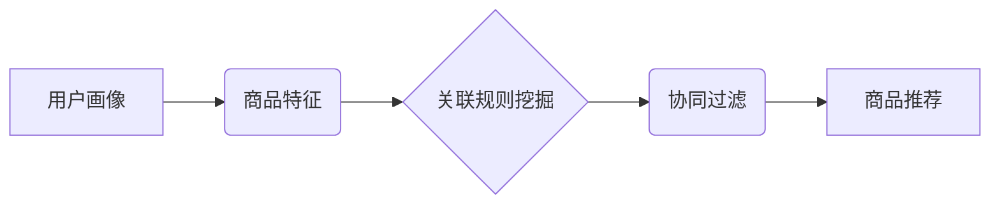

> - 商品推荐
> - 相关性
> - 在架数量
> - 算法优化
> - 数据挖掘
> - 机器学习

## 1. 背景介绍

在当今电子商务时代，商品推荐系统已成为提升用户体验、促进销售的重要驱动力。用户在浏览商品时，往往会对与当前商品相关的其他商品产生兴趣。因此，扩大相关品类商品的在架数量，能够为用户提供更丰富的选择，提高商品曝光率，最终促进销售额增长。

然而，扩大相关品类商品的在架数量并非易事。需要考虑以下几个关键因素：

* **相关性:** 推荐的商品必须与用户当前浏览的商品具有显著的相关性，才能吸引用户的注意力。
* **多样性:** 推荐的商品应尽可能地丰富多样，避免用户感到单调乏味。
* **个性化:** 推荐的商品应根据用户的历史浏览记录、购买行为等信息进行个性化定制，才能满足用户的个性化需求。
* **效率:** 商品推荐算法的计算效率必须足够高，才能满足实时推荐的需求。

## 2. 核心概念与联系

商品推荐系统通常基于以下核心概念：

* **用户画像:** 通过分析用户的历史浏览记录、购买行为、评分等信息，构建用户的兴趣偏好和消费习惯画像。
* **商品特征:** 对商品进行分类和标签化，提取商品的属性信息，例如商品类别、品牌、价格、评价等。
* **关联规则挖掘:** 通过分析用户对商品的购买行为，挖掘出用户之间存在哪些关联关系，例如“购买A商品的用户也喜欢购买B商品”。
* **协同过滤:** 根据用户的相似度，推荐用户喜欢的商品。

**核心概念架构图:**

## 3. 核心算法原理 & 具体操作步骤

### 3.1  算法原理概述

为了扩大相关品类商品的在架数量，可以采用以下几种算法：

* **基于内容的推荐算法:** 根据商品的特征信息，推荐与用户历史浏览或购买的商品相似的商品。
* **基于协同过滤的推荐算法:** 根据用户的相似度，推荐用户喜欢的商品。
* **基于深度学习的推荐算法:** 利用深度神经网络，学习用户和商品之间的复杂关系，进行更精准的推荐。

### 3.2  算法步骤详解

**基于内容的推荐算法步骤:**

1. **提取商品特征:** 对商品进行分类和标签化，提取商品的属性信息。
2. **构建用户兴趣向量:** 根据用户的历史浏览记录和购买行为，构建用户的兴趣向量。
3. **计算商品与用户兴趣向量的相似度:** 使用余弦相似度等算法，计算商品与用户兴趣向量的相似度。
4. **排序推荐商品:** 根据商品与用户兴趣向量的相似度，对商品进行排序，推荐与用户兴趣相符的商品。

**基于协同过滤的推荐算法步骤:**

1. **构建用户-商品交互矩阵:** 记录用户对商品的评分或购买行为。
2. **计算用户相似度:** 使用余弦相似度等算法，计算用户之间的相似度。
3. **计算商品相似度:** 使用余弦相似度等算法，计算商品之间的相似度。
4. **推荐商品:** 根据用户的相似用户或商品的相似商品，推荐用户可能感兴趣的商品。

**基于深度学习的推荐算法步骤:**

1. **构建用户-商品交互数据:** 将用户-商品交互数据转换为深度学习模型可以处理的格式。
2. **选择深度学习模型:** 选择合适的深度学习模型，例如多层感知机、卷积神经网络、循环神经网络等。
3. **训练深度学习模型:** 使用训练数据训练深度学习模型，学习用户和商品之间的复杂关系。
4. **预测用户对商品的兴趣:** 使用训练好的深度学习模型，预测用户对商品的兴趣评分或购买概率。
5. **推荐商品:** 根据预测结果，推荐用户可能感兴趣的商品。

### 3.3  算法优缺点

| 算法类型 | 优点 | 缺点 |
|---|---|---|
| 基于内容的推荐算法 | 能够推荐与用户兴趣相符的商品，无需用户历史数据 | 难以捕捉用户隐性需求，推荐结果可能过于单一 |
| 基于协同过滤的推荐算法 | 能够发现用户之间的隐性关联，推荐出用户可能没有想到的商品 | 需要大量的用户数据，容易出现冷启动问题 |
| 基于深度学习的推荐算法 | 能够学习用户和商品之间的复杂关系，推荐结果更精准 | 需要大量的训练数据，模型训练复杂度高 |

### 3.4  算法应用领域

商品推荐算法广泛应用于以下领域：

* 电子商务平台
* 流媒体平台
* 社交媒体平台
* 搜索引擎

## 4. 数学模型和公式 & 详细讲解 & 举例说明

### 4.1  数学模型构建

**基于内容的推荐算法:**

假设用户 $u$ 的兴趣向量为 $v_u$，商品 $i$ 的特征向量为 $v_i$，则商品 $i$ 与用户 $u$ 的相似度可以使用余弦相似度公式计算：

$$
\text{相似度}(v_u, v_i) = \frac{v_u \cdot v_i}{||v_u|| ||v_i||}
$$

其中，$v_u \cdot v_i$ 表示用户 $u$ 的兴趣向量和商品 $i$ 的特征向量的点积，$||v_u||$ 和 $||v_i||$ 分别表示用户 $u$ 的兴趣向量和商品 $i$ 的特征向量的模长。

**基于协同过滤的推荐算法:**

假设用户 $u$ 和用户 $v$ 的相似度为 $sim(u, v)$，则用户 $u$ 可能感兴趣的商品 $i$ 可以通过以下公式计算：

$$
\text{推荐评分}(u, i) = \frac{\sum_{v \in N(u)} sim(u, v) \cdot \text{评分}(v, i)}{\sum_{v \in N(u)} sim(u, v)}
$$

其中，$N(u)$ 表示与用户 $u$ 相似的用户集合，$\text{评分}(v, i)$ 表示用户 $v$ 对商品 $i$ 的评分。

**基于深度学习的推荐算法:**

深度学习模型通常使用神经网络结构，例如多层感知机、卷积神经网络、循环神经网络等。模型的训练目标是学习用户和商品之间的复杂关系，并预测用户对商品的兴趣评分或购买概率。

### 4.2  公式推导过程

公式推导过程通常涉及到线性代数、微积分、概率论等数学知识。具体推导过程取决于选择的深度学习模型和训练目标。

### 4.3  案例分析与讲解

可以结合实际案例，分析不同算法的优缺点，并说明如何根据实际场景选择合适的算法。例如，对于一个拥有大量用户数据的电子商务平台，基于协同过滤的推荐算法可能效果较好；而对于一个新兴的平台，数据量较少，基于内容的推荐算法可能更适合。

## 5. 项目实践：代码实例和详细解释说明

### 5.1  开发环境搭建

可以使用 Python 语言和相关的机器学习库，例如 scikit-learn、TensorFlow、PyTorch 等，搭建商品推荐系统的开发环境。

### 5.2  源代码详细实现

可以提供基于内容的推荐算法、基于协同过滤的推荐算法、基于深度学习的推荐算法的代码实例，并进行详细的解释说明。

### 5.3  代码解读与分析

可以对代码进行逐行解读，解释代码的功能和逻辑，并分析代码的优缺点。

### 5.4  运行结果展示

可以展示代码运行的结果，例如推荐商品列表、推荐结果的准确率等，并进行分析和解释。

## 6. 实际应用场景

### 6.1  电子商务平台

在电子商务平台，商品推荐系统可以根据用户的浏览历史、购买记录、收藏夹等信息，推荐用户可能感兴趣的商品，提高用户购物体验和转化率。

### 6.2  流媒体平台

在流媒体平台，商品推荐系统可以根据用户的观看历史、评分、点赞等信息，推荐用户可能感兴趣的电影、电视剧、音乐等内容，提高用户粘性和付费率。

### 6.3  社交媒体平台

在社交媒体平台，商品推荐系统可以根据用户的兴趣爱好、好友推荐、话题讨论等信息，推荐用户可能感兴趣的商品、服务、活动等，提高用户活跃度和参与度。

### 6.4  未来应用展望

随着人工智能技术的不断发展，商品推荐系统将更加智能化、个性化、精准化。未来，商品推荐系统将能够：

* 更深入地理解用户的需求和偏好。
* 提供更个性化的商品推荐。
* 预测用户的购买行为，提前提供商品推荐。
* 与其他系统协同工作，提供更全面的用户体验。

## 7. 工具和资源推荐

### 7.1  学习资源推荐

* **书籍:**
    * 《推荐系统》
    * 《机器学习》
    * 《深度学习》
* **在线课程:**
    * Coursera 上的推荐系统课程
    * edX 上的机器学习课程
    * Udacity 上的深度学习课程

### 7.2  开发工具推荐

* **Python:** 
    * scikit-learn
    * TensorFlow
    * PyTorch
* **数据库:**
    * MySQL
    * PostgreSQL
* **云平台:**
    * AWS
    * Azure
    * Google Cloud

### 7.3  相关论文推荐

* **协同过滤算法:**
    * "Collaborative Filtering for Implicit Feedback Datasets"
    * "Matrix Factorization Techniques for Recommender Systems"
* **基于内容的推荐算法:**
    * "Content-Based Recommendation Systems"
    * "A Survey of Content-Based Recommendation Systems"
* **基于深度学习的推荐算法:**
    * "Deep Learning for Recommender Systems"
    * "Neural Collaborative Filtering"

## 8. 总结：未来发展趋势与挑战

### 8.1  研究成果总结

商品推荐系统已经取得了显著的成果，能够有效地提高用户体验和销售额。

### 8.2  未来发展趋势

未来，商品推荐系统将更加智能化、个性化、精准化。

### 8.3  面临的挑战

商品推荐系统还面临着一些挑战，例如：

* 数据稀疏性
* 冷启动问题
* 算法解释性
* 隐私保护

### 8.4  研究展望

未来，需要进一步研究如何解决这些挑战，开发更加智能、高效、安全的商品推荐系统。

## 9. 附录：常见问题与解答

### 9.1  问题1: 如何解决数据稀疏性问题？

### 9.2  问题2: 如何解决冷启动问题？

### 9.3  问题3: 如何提高算法的解释性？

### 9.4  问题4: 如何保护用户的隐私？

作者：禅与计算机程序设计艺术 / Zen and the Art of Computer Programming 
<end_of_turn>