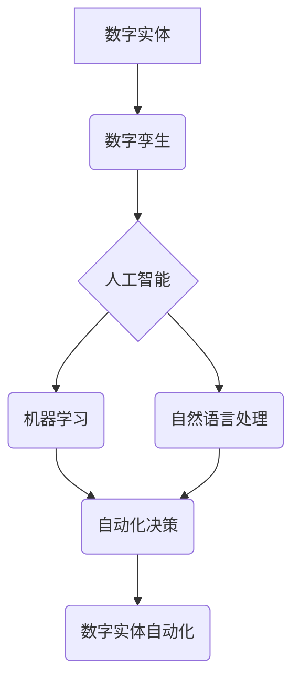

> 数字实体、自动化、人工智能、机器学习、自然语言处理、流程自动化、数据驱动

## 1. 背景介绍

数字时代，数据已成为不可或缺的生产要素。随着互联网、物联网、云计算等技术的蓬勃发展，海量数据不断涌现，为数字实体的自动化提供了广阔的应用空间。数字实体，是指用数字形式表示的物理或抽象实体，例如产品、服务、设备、流程等。数字实体的自动化是指利用人工智能、机器学习等技术，使数字实体能够自主完成预设的任务，提高效率、降低成本，并创造新的价值。

数字实体自动化的发展趋势主要体现在以下几个方面：

* **从单点自动化到全流程自动化:** 过去，自动化主要集中在单一环节，例如生产线上的机器人自动化。未来，将朝着全流程自动化发展，将多个环节串联起来，实现端到端的自动化。
* **从规则驱动到智能驱动:** 传统自动化主要依赖于预设的规则，难以应对复杂、变化的场景。未来，将更加依赖于人工智能和机器学习，使自动化系统能够学习和适应环境，实现智能化决策。
* **从离线自动化到在线自动化:** 传统的自动化系统通常是离线的，无法实时响应变化。未来，将更加注重在线自动化，使系统能够实时获取数据，并根据数据做出调整，实现动态优化。

## 2. 核心概念与联系

数字实体自动化涉及多个核心概念，包括：

* **数字孪生:** 数字孪生是指用数字模型精确地模拟现实世界中的实体，并实时更新其状态。数字孪生是数字实体自动化的基础，为自动化系统提供了真实可靠的数据。
* **人工智能 (AI):** 人工智能是指使机器能够像人类一样学习、思考和解决问题的能力。人工智能技术是数字实体自动化实现智能化的关键。
* **机器学习 (ML):** 机器学习是人工智能的一个子领域，是指通过算法训练模型，使模型能够从数据中学习并做出预测或决策。机器学习技术可以帮助自动化系统识别模式、做出判断，并不断优化自身性能。
* **自然语言处理 (NLP):** 自然语言处理是指使计算机能够理解和处理人类语言的能力。NLP技术可以帮助自动化系统理解用户需求，并以自然语言进行交互。

**核心概念架构图:**



## 3. 核心算法原理 & 具体操作步骤

### 3.1  算法原理概述

数字实体自动化的核心算法主要包括：

* **强化学习:** 强化学习是一种机器学习算法，通过奖励和惩罚机制，训练模型在特定环境中做出最优决策。
* **深度学习:** 深度学习是一种基于多层神经网络的机器学习算法，能够学习复杂的数据模式，并进行高级的推理和决策。
* **贝叶斯网络:** 贝叶斯网络是一种概率图模型，能够表示变量之间的依赖关系，并进行概率推理。

### 3.2  算法步骤详解

以强化学习为例，其具体操作步骤如下：

1. **环境建模:** 建立数字实体的虚拟环境，并定义状态、动作、奖励等要素。
2. **代理设计:** 设计一个代理，代表自动化系统，在环境中进行交互。
3. **策略学习:** 利用强化学习算法，训练代理学习最优策略，即在不同状态下采取最优动作，以获得最大的奖励。
4. **策略部署:** 将训练好的策略部署到实际环境中，使数字实体能够自动完成预设的任务。

### 3.3  算法优缺点

**强化学习:**

* **优点:** 能够学习复杂的任务，并适应动态变化的环境。
* **缺点:** 训练过程需要大量数据和计算资源，并且可能存在探索-利用的困境。

**深度学习:**

* **优点:** 能够学习复杂的数据模式，并进行高级的推理和决策。
* **缺点:** 训练过程需要大量数据和计算资源，并且模型解释性较差。

**贝叶斯网络:**

* **优点:** 能够表示变量之间的依赖关系，并进行概率推理。
* **缺点:** 建立贝叶斯网络需要专家知识，并且难以处理高维数据。

### 3.4  算法应用领域

数字实体自动化算法广泛应用于各个领域，例如：

* **制造业:** 自动化生产线、智能机器人、预测性维护。
* **物流业:** 自动化仓储、智能配送、运输优化。
* **金融业:** 自动化交易、风险管理、欺诈检测。
* **医疗保健:** 智能诊断、个性化治疗、药物研发。

## 4. 数学模型和公式 & 详细讲解 & 举例说明

### 4.1  数学模型构建

强化学习的核心数学模型是**状态-动作-奖励 (SARSA)** 模型。

* **状态 (State):** 数字实体的当前状态，例如机器人的位置、生产线的运行状态等。
* **动作 (Action):** 数字实体可以采取的动作，例如机器人的移动方向、生产线的控制指令等。
* **奖励 (Reward):** 数字实体采取动作后获得的奖励，例如完成任务的奖励、避免错误的惩罚等。

### 4.2  公式推导过程

SARSA 算法的目标是学习一个策略 π(s, a)，该策略能够在每个状态 s 下选择最优动作 a，以最大化累积奖励。

SARSA 算法使用**Q 函数**来评估每个状态-动作对的价值，Q 函数定义为：

$$Q(s, a) = E_{\pi}[R_{t+1} + \gamma \max_{a'} Q(s', a')]$$

其中：

* $R_{t+1}$ 是在状态 s 下采取动作 a 后获得的奖励。
* $\gamma$ 是折扣因子，控制未来奖励的权重。
* $s'$ 是采取动作 a 后进入的下一个状态。
* $a'$ 是在下一个状态 $s'$ 下采取的最优动作。

SARSA 算法通过迭代更新 Q 函数，最终学习到最优策略。

### 4.3  案例分析与讲解

例如，训练一个机器人自动导航到目标位置。

* 状态：机器人的位置。
* 动作：机器人的移动方向 (上、下、左、右)。
* 奖励：到达目标位置的奖励，碰撞障碍物的惩罚。

SARSA 算法可以学习到一个策略，在每个位置选择最优移动方向，以最大化到达目标位置的奖励。

## 5. 项目实践：代码实例和详细解释说明

### 5.1  开发环境搭建

* Python 3.x
* TensorFlow 或 PyTorch
* ROS (Robot Operating System)

### 5.2  源代码详细实现

```python
import tensorflow as tf

# 定义 Q 函数网络
model = tf.keras.Sequential([
    tf.keras.layers.Dense(64, activation='relu', input_shape=(4,)),
    tf.keras.layers.Dense(64, activation='relu'),
    tf.keras.layers.Dense(4)
])

# 定义损失函数和优化器
optimizer = tf.keras.optimizers.Adam()
loss_fn = tf.keras.losses.MeanSquaredError()

# 训练循环
for episode in range(num_episodes):
    state = env.reset()
    done = False
    while not done:
        # 选择动作
        action = model.predict(state)[0]
        # 执行动作
        next_state, reward, done, _ = env.step(action)
        # 更新 Q 函数
        with tf.GradientTape() as tape:
            target = reward + gamma * tf.reduce_max(model.predict(next_state), axis=1)
            loss = loss_fn(target, model.predict(state))
        gradients = tape.gradient(loss, model.trainable_variables)
        optimizer.apply_gradients(zip(gradients, model.trainable_variables))
        # 更新状态
        state = next_state

```

### 5.3  代码解读与分析

* 代码首先定义了 Q 函数网络，该网络接收状态作为输入，输出每个动作的 Q 值。
* 然后定义了损失函数和优化器，用于训练 Q 函数网络。
* 训练循环中，首先获取初始状态，然后循环执行动作，更新状态和 Q 函数。
* 每个动作的选择基于当前状态的 Q 值，通过最大化 Q 值选择最优动作。
* 训练过程不断迭代，最终学习到最优策略。

### 5.4  运行结果展示

训练完成后，可以将学习到的策略应用于实际环境中，观察数字实体的自动化效果。例如，可以测试机器人导航到目标位置的成功率，或者评估自动化生产线的效率提升。

## 6. 实际应用场景

### 6.1  智能制造

数字实体自动化可以实现智能制造，例如：

* **智能机器人:** 利用强化学习训练机器人完成复杂的任务，例如焊接、装配、搬运等。
* **预测性维护:** 通过数据分析预测设备故障，提前进行维护，降低停机时间和维修成本。
* **个性化定制:** 根据客户需求，自动生成个性化产品，满足多样化需求。

### 6.2  智慧物流

数字实体自动化可以提高物流效率，例如：

* **智能仓储:** 利用机器人自动完成货物入库、出库、分拣等操作，提高仓储效率。
* **智能配送:** 利用无人驾驶车辆自动完成配送任务，降低配送成本和时间。
* **运输优化:** 利用数据分析优化运输路线，提高运输效率和降低运输成本。

### 6.3  智慧城市

数字实体自动化可以建设智慧城市，例如：

* **智能交通:** 利用传感器和人工智能优化交通流量，减少拥堵，提高交通效率。
* **智能能源:** 利用数据分析优化能源分配，提高能源利用效率，降低能源消耗。
* **智能环境监测:** 利用传感器监测环境质量，及时发现问题，保护环境。

### 6.4  未来应用展望

数字实体自动化技术将不断发展，并应用于更多领域，例如：

* **医疗保健:** 智能诊断、个性化治疗、药物研发。
* **教育:** 个性化学习、智能辅导、在线教育平台。
* **金融:** 自动化交易、风险管理、欺诈检测。

## 7. 工具和资源推荐

### 7.1  学习资源推荐

* **书籍:**
    * 《Reinforcement Learning: An Introduction》 by Richard S. Sutton and Andrew G. Barto
    * 《Deep Learning》 by Ian Goodfellow, Yoshua Bengio, and Aaron Courville
* **在线课程:**
    * Coursera: Reinforcement Learning Specialization
    * Udacity: Deep Learning Nanodegree
* **博客和论坛:**
    * OpenAI Blog
    * DeepMind Blog
    * Reddit: r/MachineLearning

### 7.2  开发工具推荐

* **Python:** 广泛用于机器学习和深度学习开发。
* **TensorFlow:** 开源深度学习框架，提供丰富的工具和资源。
* **PyTorch:** 开源深度学习框架，以其灵活性和易用性而闻名。
* **ROS:** 用于机器人开发的开源框架，提供丰富的工具和库。

### 7.3  相关论文推荐

* **Deep Reinforcement Learning with Double Q-learning**
* **Proximal Policy Optimization Algorithms**
* **Attention Is All You Need**

## 8. 总结：未来发展趋势与挑战

### 8.1  研究成果总结

数字实体自动化技术取得了显著进展，例如：

* 强化学习算法取得了突破性进展，能够解决更复杂的任务。
* 深度学习模型的性能不断提升，能够学习更复杂的数据模式。
* 数字孪生技术得到广泛应用，为数字实体自动化提供了真实可靠的数据。

### 8.2  未来发展趋势

数字实体自动化技术未来将朝着以下方向发展：

* **更智能的自动化:** 利用更先进的 AI 算法，实现更智能的决策和控制。
* **更广泛的应用:** 应用于更多领域，例如医疗保健、教育、金融等。
* **