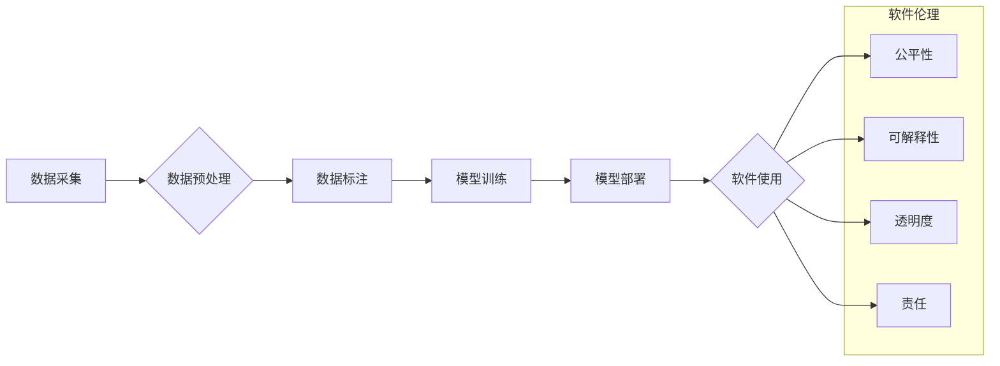

> 数据偏差、软件伦理、人工智能、公平性、可解释性、透明度、责任

## 1. 背景介绍

软件已经深刻地融入到我们生活的方方面面，从智能手机到自动驾驶汽车，再到医疗诊断和金融交易，软件正在塑造着我们的世界。随着人工智能（AI）技术的飞速发展，软件正在朝着更加智能、自动化和自主的方向演进。然而，在软件的快速发展过程中，一个不容忽视的问题逐渐浮出水面：数据偏差。

数据偏差是指训练机器学习模型的数据中存在偏见或不完整性，导致模型输出结果存在不公平、不准确甚至有害的倾向。这种偏差可能源于数据采集、处理、标注等各个环节，最终导致软件系统在特定群体或场景下表现出歧视性、误导性甚至危险性。

## 2. 核心概念与联系

数据偏差问题是软件伦理的核心议题之一。软件伦理是指在软件设计、开发、部署和使用过程中，遵循道德规范、社会责任和伦理原则，以确保软件技术造福人类社会。

数据偏差与软件伦理之间的联系可以用以下流程图来表示：



从流程图可以看出，数据偏差问题可能出现在数据采集、预处理、标注等各个环节，最终影响到软件的公平性、可解释性、透明度和责任等伦理方面。

## 3. 核心算法原理 & 具体操作步骤

### 3.1  算法原理概述

为了解决数据偏差问题，需要采用相应的算法和技术手段进行数据清洗、标注和模型训练。常见的算法包括：

* **数据清洗算法:** 用于识别和处理数据中的缺失值、异常值和重复值等问题。
* **数据标注算法:** 用于对数据进行分类、标记和标注，以提高模型的训练精度。
* **公平性算法:** 用于在模型训练过程中，尽量减少数据偏差对模型输出结果的影响，确保模型输出结果更加公平。

### 3.2  算法步骤详解

以数据清洗算法为例，其具体操作步骤如下：

1. **数据导入:** 将原始数据导入到数据清洗工具中。
2. **数据探索:** 对数据进行初步探索，了解数据的结构、类型和分布情况。
3. **缺失值处理:** 使用插值、删除或其他方法处理数据中的缺失值。
4. **异常值处理:** 使用箱线图、z-score等方法识别异常值，并根据实际情况进行处理。
5. **重复值处理:** 使用聚合函数或其他方法处理数据中的重复值。
6. **数据转换:** 对数据进行格式转换、编码转换等操作，以满足模型训练的要求。
7. **数据导出:** 将清洗后的数据导出到文件或数据库中。

### 3.3  算法优缺点

数据清洗算法的优缺点如下：

* **优点:** 可以有效地处理数据中的脏数据，提高数据质量。
* **缺点:** 算法的选择和参数设置需要根据具体的数据情况进行调整，否则可能会导致数据信息丢失或偏差加剧。

### 3.4  算法应用领域

数据清洗算法广泛应用于各个领域，例如：

* **金融领域:** 用于处理银行交易数据、客户信息等数据，提高数据质量和分析精度。
* **医疗领域:** 用于处理患者病历、医疗影像等数据，提高医疗诊断的准确性。
* **电商领域:** 用于处理商品信息、用户行为等数据，提高商品推荐的精准度。

## 4. 数学模型和公式 & 详细讲解 & 举例说明

### 4.1  数学模型构建

数据偏差问题可以用数学模型来描述。假设数据集D包含n个样本，每个样本包含d个特征。每个样本的标签为y，特征向量为x。

数据偏差可以用以下公式来衡量：

$$Bias(D) = \frac{1}{n} \sum_{i=1}^{n} (y_i - \hat{y}_i)^2$$

其中，$\hat{y}_i$是模型对样本$i$的预测值。

### 4.2  公式推导过程

该公式的推导过程如下：

1. 首先，计算每个样本的预测误差：$e_i = y_i - \hat{y}_i$。
2. 然后，计算所有样本的预测误差平方和：$\sum_{i=1}^{n} e_i^2$。
3. 最后，将预测误差平方和除以样本数量n，得到数据偏差的平均值：$Bias(D) = \frac{1}{n} \sum_{i=1}^{n} e_i^2$。

### 4.3  案例分析与讲解

假设我们有一个用于预测房价的机器学习模型。训练数据中包含来自不同地区、不同户型的房屋信息。如果训练数据中来自某个特定地区的房屋信息过多，那么模型可能会对该地区的房屋价格进行过高或过低的预测，导致数据偏差。

## 5. 项目实践：代码实例和详细解释说明

### 5.1  开发环境搭建

为了演示数据清洗算法的应用，我们可以使用Python语言和Pandas库进行开发。

开发环境搭建步骤如下：

1. 安装Python语言环境。
2. 安装Pandas库：`pip install pandas`

### 5.2  源代码详细实现

```python
import pandas as pd

# 加载数据
data = pd.read_csv('housing_data.csv')

# 处理缺失值
data['price'].fillna(data['price'].mean(), inplace=True)

# 处理异常值
Q1 = data['price'].quantile(0.25)
Q3 = data['price'].quantile(0.75)
IQR = Q3 - Q1
data = data[(data['price'] >= Q1 - 1.5 * IQR) & (data['price'] <= Q3 + 1.5 * IQR)]

# 处理重复值
data.drop_duplicates(inplace=True)

# 保存清洗后的数据
data.to_csv('cleaned_housing_data.csv', index=False)
```

### 5.3  代码解读与分析

这段代码首先使用Pandas库加载数据，然后使用不同的方法处理缺失值、异常值和重复值。

* `fillna()`方法用于填充缺失值，这里使用平均值填充。
* `quantile()`方法用于计算分位数，`IQR`用于计算四分位数间距，用于识别异常值。
* `drop_duplicates()`方法用于删除重复值。

### 5.4  运行结果展示

运行这段代码后，会生成一个名为`cleaned_housing_data.csv`的文件，该文件包含了清洗后的数据。

## 6. 实际应用场景

数据偏差问题在各个领域都有广泛的应用场景，例如：

### 6.1  医疗诊断

如果医疗诊断模型的训练数据中，来自特定种族或性别的人群比例过低，那么模型可能会在诊断这些人群的疾病时表现出偏差，导致误诊或漏诊。

### 6.2  金融贷款

如果金融贷款模型的训练数据中，来自低收入人群的贷款申请数据过少，那么模型可能会对低收入人群的贷款申请进行拒绝，导致金融不平等。

### 6.3  招聘筛选

如果招聘筛选模型的训练数据中，来自特定性别或种族的人群比例过低，那么模型可能会在筛选候选人时表现出偏差，导致招聘歧视。

### 6.4  未来应用展望

随着人工智能技术的不断发展，数据偏差问题将会更加突出。因此，我们需要更加重视数据伦理问题，开发更加公平、透明和可解释的算法和技术，以确保人工智能技术造福人类社会。

## 7. 工具和资源推荐

### 7.1  学习资源推荐

* **书籍:**
    * 《算法导论》
    * 《机器学习》
    * 《深度学习》
* **在线课程:**
    * Coursera
    * edX
    * Udacity

### 7.2  开发工具推荐

* **Python:** 
    * Pandas
    * Scikit-learn
    * TensorFlow
    * PyTorch

### 7.3  相关论文推荐

* **Fairness and Machine Learning**
* **On the Dangers of Stochastic Parrots: Can Language Models Be Too Big?**
* **Towards a Rigorous Science of Interpretable Machine Learning**

## 8. 总结：未来发展趋势与挑战

### 8.1  研究成果总结

数据偏差问题是一个复杂而重要的议题，需要多学科交叉研究才能有效解决。近年来，人工智能领域取得了一些进展，例如开发了公平性算法、可解释性模型等，但仍有很多挑战需要克服。

### 8.2  未来发展趋势

未来，数据偏差问题将继续受到关注，并可能朝着以下几个方向发展：

* **更加精准的数据偏差检测方法:** 开发更加精准、高效的数据偏差检测方法，能够识别不同类型的数据偏差。
* **更加有效的公平性算法:** 开发更加有效的公平性算法，能够在保证模型性能的同时，尽量减少数据偏差的影响。
* **更加透明的可解释性模型:** 开发更加透明、可解释的模型，能够帮助人们理解模型的决策过程，并识别潜在的偏差。

### 8.3  面临的挑战

解决数据偏差问题面临着一些挑战，例如：

* **数据获取和标注:** 获取高质量、代表性强的训练数据是一个难题，特别是对于一些边缘群体的数据。
* **算法设计和评估:** 设计和评估公平性算法是一个复杂的任务，需要考虑多种因素，例如公平性指标、模型性能、数据隐私等。
* **社会伦理和法律规范:** 数据偏差问题涉及到社会伦理和法律规范，需要制定相应的法律法规和伦理准则。

### 8.4  研究展望

未来，我们需要继续加强对数据偏差问题的研究，开发更加有效的解决方案，并推动人工智能技术朝着更加公平、透明和可解释的方向发展。


## 9. 附录：常见问题与解答

### 9.1  常见问题

* **什么是数据偏差？**

数据偏差是指训练机器学习模型的数据中存在偏见或不完整性，导致模型输出结果存在不公平、不准确甚至有害的倾向。

* **数据偏差有哪些类型？**

常见的类型包括样本偏差、特征偏差、标签偏差等。

* **如何解决数据偏差问题？**

可以通过数据清洗、标注、算法设计等方法来解决数据偏差问题。

### 9.2  解答

* **数据清洗:** 用于识别和处理数据中的脏数据，例如缺失值、异常值和重复值。
* **数据标注:** 用于对数据进行分类、标记和标注，以提高模型的训练精度。
* **公平性算法:** 用于在模型训练过程中，尽量减少数据偏差对模型输出结果的影响，确保模型输出结果更加公平。


作者：禅与计算机程序设计艺术 / Zen and the Art of Computer Programming 
<end_of_turn>