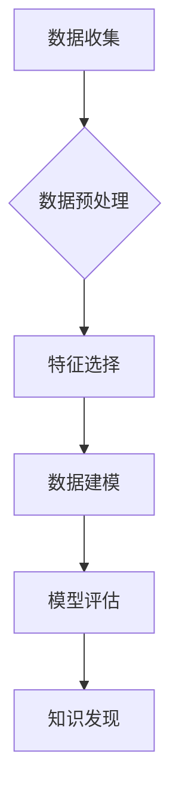

> 数据挖掘, 算法原理, 机器学习, 数据分析, 预测建模, Python, scikit-learn, 案例分析

## 1. 背景介绍

在信息爆炸的时代，海量数据无处不在，蕴藏着丰富的价值。如何从海量数据中提取有价值的信息，洞察隐藏的规律，已成为各行各业亟需解决的关键问题。数据挖掘作为一种从数据中发现模式和知识的科学方法，应运而生。它利用统计学、机器学习、数据库技术等多种学科的知识和工具，对数据进行分析、挖掘，以发现隐藏的模式、趋势和关系，从而为决策提供支持。

数据挖掘技术在各个领域都有广泛的应用，例如：

* **商业领域:** 客户关系管理、市场营销预测、欺诈检测、产品推荐等。
* **金融领域:** 风险评估、信用评分、投资决策、股票预测等。
* **医疗领域:** 疾病诊断、药物研发、患者风险预测等。
* **科学研究:** 数据分析、模式识别、知识发现等。

## 2. 核心概念与联系

数据挖掘的核心概念包括：

* **数据预处理:** 对原始数据进行清洗、转换、整合等操作，使其满足数据挖掘算法的输入要求。
* **特征选择:** 从原始数据中选择最具代表性的特征，用于构建数据挖掘模型。
* **数据建模:** 利用机器学习算法构建数据挖掘模型，例如分类模型、回归模型、聚类模型等。
* **模型评估:** 对构建的模型进行评估，选择性能最好的模型。
* **知识发现:** 从数据挖掘模型中提取有价值的知识，并将其转化为可理解的形式。

数据挖掘流程通常可以概括为以下步骤：



## 3. 核心算法原理 & 具体操作步骤

### 3.1  算法原理概述

**分类算法**

分类算法的目标是将数据样本划分为不同的类别。常见的分类算法包括：

* **决策树算法:** 通过构建决策树模型，将数据样本按照特征进行分类。
* **支持向量机算法:** 通过寻找最佳的分隔超平面，将数据样本划分为不同的类别。
* **逻辑回归算法:** 通过建立逻辑回归模型，预测数据样本属于某个类别的概率。

**回归算法**

回归算法的目标是预测连续数值型变量的值。常见的回归算法包括：

* **线性回归算法:** 通过建立线性回归模型，预测数据样本的连续数值型变量值。
* **逻辑斯谛回归算法:** 通过建立逻辑斯谛回归模型，预测数据样本属于某个类别的概率。
* **支持向量回归算法:** 通过寻找最佳的分隔超平面，预测数据样本的连续数值型变量值。

### 3.2  算法步骤详解

**决策树算法**

1. 选择最优特征作为根节点。
2. 根据特征值将数据样本划分为不同的子集。
3. 对每个子集重复步骤1和步骤2，直到满足停止条件。
4. 将叶子节点标记为最终类别。

**支持向量机算法**

1. 选择核函数。
2. 通过优化目标函数，寻找最佳的分隔超平面。
3. 将数据样本映射到高维空间，找到最佳的分隔超平面。
4. 根据分隔超平面对数据样本进行分类。

### 3.3  算法优缺点

**决策树算法**

* **优点:** 易于理解和解释，可处理混合类型数据，无需数据归一化。
* **缺点:** 容易过拟合，对数据噪声敏感，决策边界可能不连续。

**支持向量机算法**

* **优点:** 泛化能力强，对高维数据处理能力强。
* **缺点:** 训练时间长，参数选择较复杂，对数据噪声敏感。

### 3.4  算法应用领域

**决策树算法**

* **医疗诊断:** 根据患者的症状和病史，预测患者患某种疾病的概率。
* **金融风险评估:** 根据客户的信用记录和财务状况，评估客户的贷款风险。

**支持向量机算法**

* **图像识别:** 将图像分类为不同的类别，例如人脸识别、物体识别。
* **文本分类:** 将文本分类为不同的主题，例如垃圾邮件过滤、情感分析。

## 4. 数学模型和公式 & 详细讲解 & 举例说明

### 4.1  数学模型构建

**线性回归模型**

线性回归模型假设数据样本之间的关系可以用一条直线来表示。模型的数学表达式为：

$$y = w_0 + w_1x_1 + w_2x_2 + ... + w_nx_n + \epsilon$$

其中：

* $y$ 是预测变量。
* $x_1, x_2, ..., x_n$ 是特征变量。
* $w_0, w_1, w_2, ..., w_n$ 是模型参数。
* $\epsilon$ 是误差项。

### 4.2  公式推导过程

**最小二乘法**

最小二乘法是一种常用的线性回归模型参数估计方法。其目标是找到使模型预测值与实际值误差平方和最小的参数值。

误差平方和为：

$$SSE = \sum_{i=1}^{n}(y_i - \hat{y}_i)^2$$

其中：

* $y_i$ 是第 $i$ 个样本的实际值。
* $\hat{y}_i$ 是第 $i$ 个样本的预测值。

最小二乘法通过求解以下优化问题得到参数值：

$$\min_{w_0, w_1, ..., w_n} SSE$$

### 4.3  案例分析与讲解

**房价预测**

假设我们有一组房价数据，包括房屋面积、房间数量、地理位置等特征变量。我们可以使用线性回归模型来预测房价。

通过最小二乘法估计模型参数，得到房价预测模型。然后，我们可以使用该模型预测新房子的价格。

## 5. 项目实践：代码实例和详细解释说明

### 5.1  开发环境搭建

* Python 3.x
* scikit-learn 库

### 5.2  源代码详细实现

```python
import pandas as pd
from sklearn.model_selection import train_test_split
from sklearn.linear_model import LinearRegression
from sklearn.metrics import mean_squared_error

# 加载数据
data = pd.read_csv('housing.csv')

# 选择特征变量和目标变量
X = data[['area', 'rooms']]
y = data['price']

# 将数据划分为训练集和测试集
X_train, X_test, y_train, y_test = train_test_split(X, y, test_size=0.2, random_state=42)

# 创建线性回归模型
model = LinearRegression()

# 训练模型
model.fit(X_train, y_train)

# 预测测试集数据
y_pred = model.predict(X_test)

# 计算模型性能
mse = mean_squared_error(y_test, y_pred)
print(f'Mean Squared Error: {mse}')
```

### 5.3  代码解读与分析

* 首先，我们加载数据并选择特征变量和目标变量。
* 然后，我们将数据划分为训练集和测试集。
* 接下来，我们创建线性回归模型并训练模型。
* 训练完成后，我们可以使用模型预测测试集数据。
* 最后，我们计算模型性能，例如均方误差。

### 5.4  运行结果展示

运行代码后，会输出模型的均方误差值。

## 6. 实际应用场景

### 6.1  电商推荐系统

数据挖掘技术可以用于构建电商推荐系统，根据用户的购买历史、浏览记录等数据，推荐用户可能感兴趣的商品。

### 6.2  欺诈检测

数据挖掘技术可以用于检测金融交易中的欺诈行为，例如信用卡欺诈、网络支付欺诈等。

### 6.3  客户关系管理

数据挖掘技术可以用于分析客户的行为模式，识别潜在的客户流失风险，并制定相应的挽留策略。

### 6.4  未来应用展望

随着数据量的不断增长和计算能力的提升，数据挖掘技术将在更多领域得到应用，例如：

* **个性化医疗:** 根据患者的基因信息、生活习惯等数据，提供个性化的医疗方案。
* **智能交通:** 利用交通数据进行交通流量预测、拥堵情况分析，优化交通管理。
* **精准农业:** 根据土壤信息、天气预报等数据，制定精准的农业生产方案。

## 7. 工具和资源推荐

### 7.1  学习资源推荐

* **书籍:**
    * 《数据挖掘：概念与技术》
    * 《数据挖掘实战》
* **在线课程:**
    * Coursera 上的《数据挖掘》课程
    * edX 上的《数据科学》课程

### 7.2  开发工具推荐

* **Python:** 数据挖掘的常用编程语言。
* **scikit-learn:** Python 的机器学习库。
* **pandas:** Python 的数据分析库。
* **matplotlib:** Python 的数据可视化库。

### 7.3  相关论文推荐

* 《The Elements of Statistical Learning》
* 《Introduction to Machine Learning》

## 8. 总结：未来发展趋势与挑战

### 8.1  研究成果总结

数据挖掘技术在过去几十年取得了长足的进步，已经成为数据分析和知识发现的重要工具。

### 8.2  未来发展趋势

* **深度学习:** 深度学习算法在数据挖掘领域取得了突破性进展，例如在图像识别、自然语言处理等领域表现出色。
* **云计算:** 云计算平台为数据挖掘提供了强大的计算资源和存储空间，推动了大规模数据分析的发展。
* **可解释性:** 如何提高数据挖掘模型的可解释性，使其结果更易于理解和信任，是未来研究的重要方向。

### 8.3  面临的挑战

* **数据质量:** 数据挖掘模型的性能依赖于数据质量，如何处理脏数据、缺失数据等问题是关键挑战。
* **数据隐私:** 数据挖掘过程中需要处理大量敏感数据，如何保护数据隐私是重要的伦理问题。
* **算法效率:** 随着数据量的不断增长，如何提高数据挖掘算法的效率，使其能够处理海量数据，是重要的技术挑战。

### 8.4  研究展望

未来，数据挖掘技术将继续朝着更智能、更可解释、更安全的方向发展，为各个领域带来更多价值。


## 9. 附录：常见问题与解答

**Q1: 数据挖掘和机器学习有什么区别？**

**A1:** 数据挖掘和机器学习都是从数据中提取知识和模式的学科，但侧重点不同。数据挖掘更侧重于发现隐藏的模式和规律，而机器学习更侧重于构建能够自动学习和预测的模型。

**Q2: 数据挖掘有哪些常用算法？**

**A2:** 数据挖掘常用的算法包括分类算法、回归算法、聚类算法、关联规则挖掘算法等。

**Q3: 如何评估数据挖掘模型的性能？**

**A3:** 数据挖掘模型的性能可以通过多种指标来评估，例如准确率、召回率、F1-score、均方误差等。

**Q4: 数据挖掘技术有哪些应用场景？**

**A4:** 数据挖掘技术广泛应用于各个领域，例如电商推荐、欺诈检测、客户关系管理、医疗诊断等。


作者：禅与计算机程序设计艺术 / Zen and the Art of Computer Programming 
<end_of_turn>