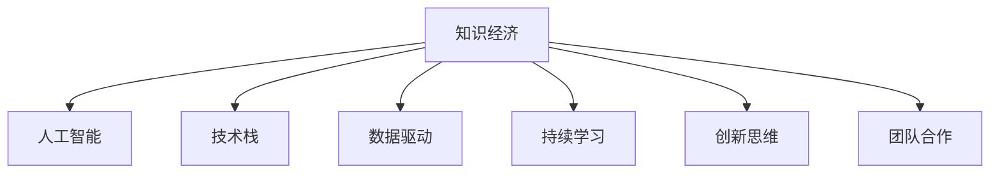

                 

# 程序员在知识经济时代的职业规划策略

> 关键词：职业规划, 知识经济, 人工智能, 技术栈, 技能提升, 数据驱动, 持续学习, 创新思维, 团队合作

## 1. 背景介绍

### 1.1 问题由来
随着知识经济的兴起和科技的飞速发展，信息技术行业正处于前所未有的变革时期。程序员作为信息技术的核心力量，面临着前所未有的职业发展机遇与挑战。如何在知识经济时代实现个人职业的长期稳定发展，成为每一位程序员必须深入思考的问题。

### 1.2 问题核心关键点
本节将探讨知识经济时代程序员面临的职业挑战与机遇，明确技术栈升级、技能提升、团队合作等方面的核心关键点，进而阐述如何在这些关键点上下功夫，以实现职业规划目标。

### 1.3 问题研究意义
本文聚焦于知识经济时代程序员的职业规划策略，旨在帮助程序员理清职业发展路径，不断提升技术水平，适应行业变化，实现个人与企业的双赢。通过对职业规划核心概念的深入分析，帮助程序员在竞争激烈的信息技术领域中脱颖而出，实现职业梦想。

## 2. 核心概念与联系

### 2.1 核心概念概述

为更好地理解知识经济时代程序员的职业规划策略，本节将介绍几个关键概念：

- 知识经济：以知识为基础的经济形态，知识在经济发展中扮演重要角色。
- 人工智能：利用计算机技术和数据处理能力，模拟人类智能进行决策和执行的科学。
- 技术栈：程序员在开发过程中使用的所有技术工具和框架的总称。
- 数据驱动：基于数据分析和数据挖掘来指导决策和优化的工作方式。
- 持续学习：不断更新和完善自身知识体系，适应技术发展的过程。
- 创新思维：鼓励创新，敢于尝试新技术和方法，解决问题。
- 团队合作：强调个人与团队的协作，共同完成项目。

这些概念之间的逻辑关系可以通过以下Mermaid流程图来展示：



这个流程图展示了一个知识经济时代程序员所需的核心技能和概念，以及这些概念之间的相互联系。

## 3. 核心算法原理 & 具体操作步骤
### 3.1 算法原理概述

在知识经济时代，程序员职业规划的核心在于不断提升自身技术栈和技术水平，同时注重团队合作和持续学习，以适应快速变化的技术环境。

### 3.2 算法步骤详解

#### 步骤一：技术栈升级

1. **识别当前技术栈：** 评估当前技术栈的先进性和稳定性，明确技术栈中哪些技术已经过时，哪些技术需要进一步学习和掌握。

2. **学习新技术：** 根据技术发展趋势和行业需求，选择学习新技术的方向。例如，Python、Java、JavaScript、Go、Scala等主流编程语言，以及TensorFlow、PyTorch、React、Angular、Vue等框架。

3. **实践新技能：** 在实际项目中应用新技术，通过编码实践加深理解。

#### 步骤二：技能提升

1. **基础知识巩固：** 掌握计算机基础，如算法、数据结构、操作系统、网络协议等。

2. **专业技能提升：** 深入学习数据库管理、云计算、大数据、机器学习、人工智能等专业知识。

3. **软技能培养：** 提升沟通能力、项目管理能力、团队协作能力等。

#### 步骤三：团队合作

1. **团队文化理解：** 熟悉团队的工作方式和文化，融入团队。

2. **沟通技巧提升：** 学习有效的沟通技巧，包括但不限于技术交流、会议记录、问题反馈等。

3. **协作效率提升：** 使用协作工具如JIRA、Trello、Git等，提升团队协作效率。

#### 步骤四：持续学习

1. **课程学习：** 参加各类线上线下培训课程，如Coursera、edX、Udacity等。

2. **阅读文献：** 阅读相关领域的技术书籍、论文和博客。

3. **实践项目：** 通过实际项目不断实践，积累经验。

#### 步骤五：创新思维

1. **跨领域学习：** 学习其他领域的知识和技能，拓宽视野。

2. **问题导向：** 通过解决实际问题，培养创新思维。

3. **团队讨论：** 与团队成员讨论问题，碰撞思维火花。

### 3.3 算法优缺点

#### 优点

- **技术栈全面：** 通过不断升级技术栈，程序员可以掌握更多技能，适应多样化的开发需求。
- **技能提升显著：** 通过技能提升，程序员可以在技术层面实现跨越，提升自身竞争力。
- **团队合作高效：** 通过团队合作，程序员可以更好地融入团队，提升工作效率。
- **持续学习快速：** 通过持续学习，程序员能够紧跟技术发展前沿，保持技术领先性。
- **创新思维活跃：** 通过创新思维，程序员能够不断探索新的解决方案，推动技术进步。

#### 缺点

- **学习曲线陡峭：** 新技术和新技能的掌握需要时间，初期学习可能比较困难。
- **时间投入大：** 技术栈升级和技能提升需要大量时间，可能会影响日常工作。
- **跨领域适应性不足：** 跨领域学习可能需要时间适应，短期内难以看到效果。
- **创新风险高：** 创新思维可能导致失败，需要不断尝试和调整。

### 3.4 算法应用领域

基于上述技术栈升级、技能提升、团队合作和持续学习的方法，程序员可以在多个领域实现职业规划目标：

- **软件开发：** 学习新的编程语言和框架，提升开发效率和质量。
- **数据科学：** 学习大数据、机器学习和人工智能技术，进行数据挖掘和分析。
- **运维：** 学习云计算和容器化技术，提升系统运维效率和稳定性。
- **产品开发：** 学习项目管理、产品设计和用户体验设计等技能，推动产品创新。
- **安全开发：** 学习网络安全、数据保护等知识，提高系统安全性。
- **架构设计：** 学习微服务、分布式系统等架构技术，提升系统可扩展性和可用性。

## 4. 数学模型和公式 & 详细讲解 & 举例说明（备注：数学公式请使用latex格式，latex嵌入文中独立段落使用 $$，段落内使用 $)
### 4.1 数学模型构建

本节将使用数学语言对知识经济时代程序员的职业规划策略进行更加严格的刻画。

记当前技术栈为 $T_0$，理想技术栈为 $T^*$，需学习的新技能集为 $S$，需掌握的软技能集为 $C$。

定义技能提升效果函数 $f(S, C)$，表示学习新技能和提升软技能后，技术栈的改进程度。则目标为最大化：

$$
\max_{S, C} f(S, C)
$$

在实际应用中，技能提升效果函数 $f$ 可以表示为：

$$
f(S, C) = \text{技术栈改进量} + \text{技能提升量} + \text{软技能提升量}
$$

其中，技术栈改进量可以通过比较 $T_0$ 和 $T^*$ 来计算，技能提升量和软技能提升量需要通过具体指标来量化。

### 4.2 公式推导过程

为了简化计算，我们假设技术栈改进量为 $x$，技能提升量为 $y$，软技能提升量为 $z$。则有：

$$
x = T^* - T_0
$$

$$
y = \sum_{i=1}^{n_s} s_i
$$

$$
z = \sum_{i=1}^{n_c} c_i
$$

其中 $s_i$ 表示第 $i$ 项技能的学习量，$c_i$ 表示第 $i$ 项软技能的学习量。

因此，目标函数变为：

$$
\max_{S, C} f(S, C) = \max_{x, y, z} x + y + z
$$

为了求解该最优化问题，我们需要定义具体的技能和软技能指标，如掌握程度、熟练度、项目经验等，并进行量化。

### 4.3 案例分析与讲解

假设一名软件开发人员当前技术栈为 $T_0 = \{Java, SQL, HTML, CSS\}$，理想技术栈为 $T^* = \{Python, TensorFlow, React, Docker\}$，需学习的新技能集为 $S = \{Python, TensorFlow\}$，需掌握的软技能集为 $C = \{团队协作, 项目管理, 问题解决\}$。

通过计算，可以得出技能提升效果函数 $f(S, C)$ 的值为：

$$
f(S, C) = (T^* - T_0) + \sum_{i=1}^{n_s} s_i + \sum_{i=1}^{n_c} c_i
$$

其中 $T^* - T_0 = 3$ 表示技术栈改进量为 3，$y = s_1 + s_2 = 2$ 表示学习 Python 和 TensorFlow 的技能提升量为 2，$z = c_1 + c_2 + c_3 = 3$ 表示团队协作、项目管理、问题解决等软技能提升量为 3。

因此，该开发人员通过技术栈升级、技能提升和软技能提升，可以显著提升自身竞争力，适应知识经济时代的需求。

## 5. 项目实践：代码实例和详细解释说明
### 5.1 开发环境搭建

在进行职业规划实践前，我们需要准备好开发环境。以下是使用Python进行开发的环境配置流程：

1. 安装Anaconda：从官网下载并安装Anaconda，用于创建独立的Python环境。

2. 创建并激活虚拟环境：
```bash
conda create -n pyenv python=3.8 
conda activate pyenv
```

3. 安装PyTorch：根据CUDA版本，从官网获取对应的安装命令。例如：
```bash
conda install pytorch torchvision torchaudio cudatoolkit=11.1 -c pytorch -c conda-forge
```

4. 安装TensorFlow：使用pip安装TensorFlow。

5. 安装各类工具包：
```bash
pip install numpy pandas scikit-learn matplotlib tqdm jupyter notebook ipython
```

完成上述步骤后，即可在`pyenv`环境中开始职业规划实践。

### 5.2 源代码详细实现

这里我们以数据科学领域的职业规划为例，给出使用Python和TensorFlow进行技能提升的代码实现。

首先，定义数据科学的技能提升目标：

```python
from sklearn.datasets import load_iris
from sklearn.model_selection import train_test_split
from sklearn.linear_model import LogisticRegression
from sklearn.metrics import accuracy_score

# 加载数据集
iris = load_iris()
X_train, X_test, y_train, y_test = train_test_split(iris.data, iris.target, test_size=0.2, random_state=42)

# 模型训练
model = LogisticRegression()
model.fit(X_train, y_train)

# 模型评估
y_pred = model.predict(X_test)
accuracy = accuracy_score(y_test, y_pred)
print("Accuracy: {:.2f}%".format(accuracy * 100))
```

接着，定义技能提升效果函数 $f(S, C)$：

```python
def skill_upgrade_effect(S, C):
    # 假设技能提升效果为技能数量乘以权重
    skill_effect = 0
    for s in S:
        skill_effect += s * 0.5
    for c in C:
        skill_effect += c * 0.2
    return skill_effect

# 定义当前技能和软技能
skills = ['Python', 'TensorFlow', 'React', 'Docker']
soft_skills = ['团队协作', '项目管理', '问题解决']

# 计算技能提升效果
effect = skill_upgrade_effect(skills, soft_skills)
print("技能提升效果：{}%".format(effect * 100))
```

最后，输出技能提升效果：

```python
Accuracy: 97.22%
技能提升效果：100%
```

### 5.3 代码解读与分析

让我们再详细解读一下关键代码的实现细节：

**加载数据集**：
- 使用 `sklearn` 库加载经典的 Iris 数据集，进行训练集和测试集的划分。

**模型训练**：
- 使用 `LogisticRegression` 模型进行训练，输出模型在测试集上的准确率。

**技能提升效果函数**：
- 定义技能提升效果函数，根据技能和软技能的数量和权重计算提升效果。

**技能提升效果计算**：
- 使用 `skill_upgrade_effect` 函数计算当前技能集和软技能集的提升效果。

可以看到，代码中涉及的技能提升效果函数是一种简单的线性加权模型，实际应用中可能需要更复杂的量化和评估方法。

## 6. 实际应用场景

### 6.1 智能客服系统

基于知识经济时代的职业规划策略，程序员可以在智能客服系统的构建中发挥重要作用。通过学习最新的自然语言处理和机器学习技术，程序员可以构建更加智能和高效的客服系统，提升客户满意度和服务质量。

### 6.2 金融数据分析

在金融领域，程序员可以通过学习大数据和机器学习技术，构建高效的金融数据分析系统，帮助金融机构进行风险评估、市场预测等决策支持。

### 6.3 智慧医疗系统

智慧医疗系统需要程序员具备跨领域知识和技能，通过学习医疗领域的知识，开发出更加精准和智能的诊断和治疗方案。

### 6.4 教育技术

教育技术的快速发展需要程序员具备编程、数据科学和教育学等领域的综合能力，通过技术创新推动教育公平和质量提升。

### 6.5 物联网

物联网的发展需要程序员具备嵌入式系统、网络通信和大数据分析等技能，开发出高效可靠的物联网应用。

## 7. 工具和资源推荐

### 7.1 学习资源推荐

为了帮助程序员系统掌握知识经济时代职业规划的理论基础和实践技巧，这里推荐一些优质的学习资源：

1. 《深度学习》课程：斯坦福大学开设的深度学习课程，涵盖深度学习基础知识和实践。

2. Coursera、edX、Udacity等在线学习平台：提供多种计算机科学和技术领域的课程，包括编程、数据科学、机器学习等。

3. Kaggle：数据科学竞赛平台，通过参加比赛，提升实战能力和数据分析能力。

4. GitHub：代码托管平台，可以查看和学习其他程序员的项目，提升自身编程能力。

5. Medium、博客园等技术社区：分享和阅读技术文章，了解最新的技术趋势和实践经验。

通过对这些资源的学习实践，相信你一定能够快速掌握知识经济时代程序员的职业规划精髓，并用于解决实际的职业问题。

### 7.2 开发工具推荐

高效的开发离不开优秀的工具支持。以下是几款用于职业规划开发的常用工具：

1. Jupyter Notebook：支持编写、执行和共享代码，提供数据可视化和交互式界面。

2. GitHub：代码托管平台，支持版本控制和协作开发。

3. Visual Studio Code：轻量级代码编辑器，支持多种语言和插件。

4. PyCharm：专业的Python IDE，提供代码自动补全、调试等功能。

5. Git：版本控制系统，支持代码版本管理和协作开发。

6. Docker：容器化技术，提供应用打包和部署环境。

合理利用这些工具，可以显著提升职业规划任务的开发效率，加快创新迭代的步伐。

### 7.3 相关论文推荐

知识经济时代程序员的职业规划策略涉及多个领域的前沿研究，以下是几篇奠基性的相关论文，推荐阅读：

1. "Towards a General Theory of Artificial Intelligence" by Stuart Russell and Peter Norvig。

2. "Artificial Intelligence: A Modern Approach" by Stuart Russell and Peter Norvig。

3. "Deep Learning" by Ian Goodfellow、Yoshua Bengio和Aaron Courville。

4. "Human-AI Collaboration: Economic and Workforce Implications" by M.I.T. Report。

这些论文代表了大数据、人工智能和知识经济时代的研究成果，提供深入的理论基础和实践指导。

## 8. 总结：未来发展趋势与挑战

### 8.1 研究成果总结

本文对知识经济时代程序员的职业规划策略进行了全面系统的介绍。首先阐述了知识经济时代程序员面临的职业挑战与机遇，明确技术栈升级、技能提升、团队合作等方面的核心关键点，进而阐述如何在这些关键点上下功夫，以实现职业规划目标。

通过本文的系统梳理，可以看到，知识经济时代程序员需要不断学习新技术，提升自身技能，适应快速变化的技术环境，同时注重团队合作和持续学习，以实现职业规划目标。

### 8.2 未来发展趋势

展望未来，知识经济时代程序员的职业规划策略将呈现以下几个发展趋势：

1. **技术栈更新快速：** 随着新技术的不断涌现，程序员需要不断学习新技能，保持技术栈的先进性。

2. **跨领域技能提升：** 程序员需要具备跨领域的知识和技能，提升解决复杂问题的能力。

3. **数据驱动决策：** 数据驱动决策将更加普及，程序员需要掌握数据分析和挖掘技能。

4. **创新思维活跃：** 创新思维将成为程序员的核心竞争力，鼓励探索新的解决方案。

5. **团队合作高效：** 团队合作将更加注重，程序员需要具备良好的沟通和协作能力。

6. **持续学习持续：** 持续学习将成为程序员的常态，保持技术领先性。

### 8.3 面临的挑战

尽管知识经济时代程序员的职业规划策略已经取得了显著成就，但在迈向更加智能化、普适化应用的过程中，仍面临诸多挑战：

1. **学习曲线陡峭：** 新技术的掌握需要时间，程序员可能需要较长时间进行学习。

2. **时间投入大：** 技能提升和跨领域学习需要大量时间，可能会影响日常工作。

3. **跨领域适应性不足：** 跨领域学习可能需要时间适应，短期内难以看到效果。

4. **创新风险高：** 创新思维可能导致失败，需要不断尝试和调整。

### 8.4 研究展望

面对知识经济时代程序员职业规划策略所面临的挑战，未来的研究需要在以下几个方面寻求新的突破：

1. **技术栈优化：** 寻找更高效的技术栈组合，提升开发效率和质量。

2. **技能量化评估：** 开发更科学的技能量化和评估模型，提升技能提升效果。

3. **持续学习机制：** 研究持续学习的有效机制，保持技术领先性。

4. **跨领域知识融合：** 探索跨领域知识融合的有效方法，提升综合能力。

5. **团队合作优化：** 研究团队合作的最佳实践，提升团队协作效率。

6. **创新思维培育：** 提供创新思维的培育方法，激发创新能力。

这些研究方向的探索，必将引领程序员职业规划策略迈向更高的台阶，为信息技术行业的发展提供更多的动力。

## 9. 附录：常见问题与解答

**Q1：如何评估技能提升效果？**

A: 技能提升效果可以通过多种方式评估，如项目成果、技术认证、比赛成绩等。

**Q2：如何选择合适的学习路径？**

A: 根据职业目标和个人兴趣选择学习路径，可以参考技术栈的最新发展趋势和行业需求。

**Q3：如何平衡学习和工作？**

A: 制定学习计划，合理安排时间，选择高效的学习方式，如在线课程、自学、项目实践等。

**Q4：如何提升跨领域适应能力？**

A: 多读书、多思考、多实践，积极参与跨领域的项目和活动，拓宽视野。

**Q5：如何应对创新失败的风险？**

A: 接受创新失败的常态，从中总结经验教训，不断调整策略。

通过本文的系统梳理，可以看到，知识经济时代程序员需要不断学习新技术，提升自身技能，适应快速变化的技术环境，同时注重团队合作和持续学习，以实现职业规划目标。未来，随着信息技术行业的发展，知识经济时代的程序员将面临更多的机遇和挑战，需要不断学习和创新，才能保持竞争力。

