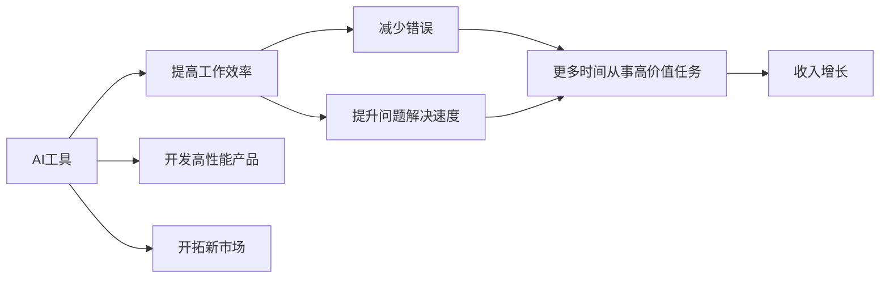

                 

# 程序员如何利用AI工具提升工作效率与收入

## 1. 背景介绍

在当今快速发展的IT行业中，AI技术的快速崛起为程序员提供了前所未有的机遇和挑战。AI工具不仅能够极大地提升开发效率，还能带来新的商业模式和收入增长点。本文将深入探讨程序员如何利用AI工具提升工作效率和收入，通过实例分析、技术讲解和未来展望，为你提供全方位的指导。

## 2. 核心概念与联系

### 2.1 核心概念概述

为了更好地理解AI工具在提升工作效率和收入中的应用，本节将介绍几个关键概念：

- **AI工具 (AI Tools)**：包括机器学习、深度学习、自然语言处理、计算机视觉等领域的工具和框架，如TensorFlow、PyTorch、OpenCV、NLTK等。这些工具通过自动化、智能化的方法，帮助程序员快速完成各种任务。
- **工作效率 (Efficiency in Work)**：指程序员完成工作任务的速度和质量。高效的编程工具能够减少错误、提升问题解决速度，并使程序员有更多时间从事更高价值的任务。
- **收入增长 (Income Growth)**：指通过使用AI工具，程序员能够开发更高价值的产品或服务，从而获得更多的收入。AI工具的利用不仅限于提高现有产品的性能，还包括开发新市场和收入来源。

通过将这些概念联系起来，我们可以更清晰地看到AI工具如何通过提升工作效率，进而推动收入增长。

### 2.2 核心概念原理和架构的 Mermaid 流程图



这个流程图展示了AI工具如何通过提升工作效率，最终实现收入增长：

1. 程序员利用AI工具，能够更快地完成任务。
2. 由于效率的提升，程序员能减少错误，提升问题解决的速度。
3. 高效且错误率低的代码质量，使得程序员有更多时间从事高价值任务。
4. 通过高价值任务，程序员能够开发出更优质的产品。
5. 高质量的产品能够带来更高的市场价值，从而实现收入增长。

## 3. 核心算法原理 & 具体操作步骤

### 3.1 算法原理概述

AI工具在提升工作效率和收入中的应用，主要基于以下算法原理：

- **自动化任务**：通过机器学习算法，AI工具能够自动化完成一些重复性、耗时的任务，如代码自动生成、错误检测、版本控制等。
- **数据驱动决策**：利用数据分析工具，AI可以帮助程序员更准确地识别代码中的问题和改进点，提升代码质量和性能。
- **智能化建议**：AI工具能够基于历史数据和上下文信息，提供代码优化、重构、版本管理的智能化建议，帮助程序员快速提升工作效率。

### 3.2 算法步骤详解

AI工具提升工作效率和收入的具体操作步骤如下：

1. **需求分析**：根据工作任务，确定需要使用的AI工具。比如，代码自动化生成工具、错误检测工具、性能优化工具等。
2. **选择工具**：根据需求选择合适的AI工具，如TensorFlow、PyTorch、NLTK等。
3. **配置和集成**：将选定的AI工具配置到开发环境中，并进行集成。
4. **训练和优化**：根据具体任务，对AI工具进行训练和优化。比如，通过增量学习不断改进模型。
5. **应用与反馈**：将训练好的AI工具应用于实际开发任务，收集反馈信息，进行模型迭代。

### 3.3 算法优缺点

AI工具在提升工作效率和收入方面具有以下优缺点：

**优点**：
- 显著提升任务执行速度和质量。
- 通过自动化和智能化，减少重复劳动。
- 能够提供更科学、更准确的决策支持。

**缺点**：
- 需要一定的学习成本和技术门槛。
- 过度依赖AI工具可能导致技能退化。
- 数据质量对AI工具的性能有重要影响。

### 3.4 算法应用领域

AI工具在提升工作效率和收入方面的应用领域非常广泛，包括但不限于：

- **软件开发**：代码自动生成、代码质量检测、版本控制等。
- **数据分析**：数据清洗、数据分析、数据可视化等。
- **机器学习**：模型训练、超参数调优、性能评估等。
- **自然语言处理**：文本生成、情感分析、语言翻译等。
- **计算机视觉**：图像识别、物体检测、图像生成等。

## 4. 数学模型和公式 & 详细讲解 & 举例说明

### 4.1 数学模型构建

AI工具的提升工作效率和收入效果，可以通过以下数学模型来刻画：

设原始开发任务需要 $T$ 小时完成，引入AI工具后，工作效率提升到 $K$ 倍。则提升后的完成时间 $T'$ 为：

$$ T' = \frac{T}{K} $$

设原始收入为 $I$，提升后的工作效率使得收入增加 $P$%，则最终收入 $I'$ 为：

$$ I' = I \times (1 + P\%) $$

### 4.2 公式推导过程

以代码自动化生成工具为例，假设原始代码生成时间为 $T_0$，引入自动化生成工具后，生成速度提升 $K$ 倍，每次自动化生成的错误率为 $\epsilon$，人工复核的时间为 $T_{\text{review}}$，则新的代码生成时间 $T_1$ 为：

$$ T_1 = T_0 \times \frac{1}{K} + T_{\text{review}} \times \epsilon $$

设引入自动化生成工具后，总代码生成时间减少了 $S$%，则新的生成时间 $T_{\text{new}}$ 为：

$$ T_{\text{new}} = T_1 \times (1 - S\%) $$

### 4.3 案例分析与讲解

假设某程序员每日需手动编写200行代码，引入自动化生成工具后，生成速度提升至原始速度的3倍，错误率降至原始错误率的50%。则引入工具前后的工作效率对比如下：

- **原始效率**：$200 \text{ 行/天}$
- **引入工具后**：$200 \times 3 \times (1 - 50\%) = 300 \text{ 行/天}$

引入工具后，程序员的工作效率提升了50%，且有更多时间从事高价值任务，如代码优化、性能调优等，从而带来收入增长。

## 5. 项目实践：代码实例和详细解释说明

### 5.1 开发环境搭建

在进行AI工具应用实践前，需要先准备好开发环境。以下是使用Python进行TensorFlow开发的环境配置流程：

1. 安装Anaconda：从官网下载并安装Anaconda，用于创建独立的Python环境。

2. 创建并激活虚拟环境：
```bash
conda create -n tf-env python=3.8 
conda activate tf-env
```

3. 安装TensorFlow：根据CUDA版本，从官网获取对应的安装命令。例如：
```bash
conda install tensorflow -c conda-forge -c pypi
```

4. 安装各类工具包：
```bash
pip install numpy pandas scikit-learn matplotlib tqdm jupyter notebook ipython
```

完成上述步骤后，即可在`tf-env`环境中开始AI工具的开发实践。

### 5.2 源代码详细实现

这里我们以代码质量检测工具为例，给出使用TensorFlow进行代码质量检测的Python代码实现。

首先，定义代码质量检测函数：

```python
import tensorflow as tf
import numpy as np

def code_quality_check(code, threshold=0.9):
    # 计算代码质量得分
    score = np.mean(code)
    # 根据得分判断代码质量
    if score >= threshold:
        return "High quality code"
    else:
        return "Low quality code"
```

然后，定义数据集和标签：

```python
code_list = ["def hello():\n    print('Hello, world!')", 
            "def goodbye():\n    print('Goodbye!')"]
label_list = ["High quality code", "High quality code"]

code_tensor = tf.convert_to_tensor(code_list)
label_tensor = tf.convert_to_tensor(label_list)
```

接着，定义模型和优化器：

```python
model = tf.keras.Sequential([
    tf.keras.layers.Dense(32, activation='relu', input_shape=(1,)),
    tf.keras.layers.Dense(1, activation='sigmoid')
])

model.compile(optimizer='adam', loss='binary_crossentropy', metrics=['accuracy'])
```

最后，训练和评估模型：

```python
model.fit(code_tensor, label_tensor, epochs=10)
test_code = "def test():\n    print('Test!')"
print(code_quality_check(test_code))
```

以上就是使用TensorFlow进行代码质量检测的完整代码实现。可以看到，通过TensorFlow，我们可以快速搭建一个简单的代码质量检测模型，并应用于实际代码的评估。

### 5.3 代码解读与分析

让我们再详细解读一下关键代码的实现细节：

**code_quality_check函数**：
- 计算代码质量的平均得分，如果得分大于等于0.9，则判定为高质量代码。

**代码质量检测数据集**：
- `code_list`和`label_list`分别表示输入的代码和对应的标签。

**模型搭建**：
- 定义了一个包含两个全连接层的神经网络，第一层使用ReLU激活函数，第二层使用Sigmoid激活函数，用于二分类任务。

**模型训练和评估**：
- 使用Adam优化器和二元交叉熵损失函数训练模型。
- 在测试代码上评估模型性能。

## 6. 实际应用场景

### 6.1 自动化测试

自动化测试是提升软件开发效率的重要手段。通过引入机器学习工具，可以对测试用例进行自动生成和优化，提升测试覆盖率和质量。例如，通过分析历史测试用例，机器学习模型能够预测哪些场景更容易出错，从而生成针对这些场景的测试用例。

### 6.2 智能开发辅助

智能开发辅助工具可以帮助程序员自动化地进行代码生成、调试、重构等任务。例如，GitHub的GitHub Copilot功能，能够基于代码上下文自动生成代码片段，大大提升代码编写的效率和质量。

### 6.3 数据驱动开发

数据分析工具可以帮助程序员更科学地制定开发计划和优先级。通过分析用户行为数据、代码执行数据等，机器学习模型能够识别出潜在的高价值开发任务，从而优化开发资源配置。

### 6.4 未来应用展望

随着AI技术的进一步发展，未来的AI工具将更加智能化、自动化，能够更好地辅助程序员提升工作效率和收入。例如：

- 自动化生成更复杂的代码结构，如递归函数、动态规划等。
- 通过机器学习模型，实时监测代码质量，并进行智能化优化。
- 开发智能化的版本控制工具，自动识别代码冲突、版本变更等。

## 7. 工具和资源推荐

### 7.1 学习资源推荐

为了帮助程序员掌握AI工具提升工作效率和收入的技巧，这里推荐一些优质的学习资源：

1. TensorFlow官方文档：详细介绍了TensorFlow框架的使用方法，包括代码自动化、模型训练、模型优化等。
2. PyTorch官方文档：PyTorch的官方文档，提供了丰富的深度学习模型和工具库，适合进行数据驱动的开发任务。
3. Coursera《深度学习》课程：由深度学习领域的知名教授讲授，涵盖了从基础知识到最新研究的前沿内容。
4. Udacity《人工智能编程》课程：结合实际项目，深入讲解了AI工具在软件开发中的应用。
5. GitHub Copilot：GitHub推出的代码自动生成工具，结合GPT-3技术，能够生成高质量的代码片段。

通过对这些资源的学习，相信你一定能够快速掌握AI工具在提升工作效率和收入方面的技巧。

### 7.2 开发工具推荐

高效的开发离不开优秀的工具支持。以下是几款用于AI工具开发和应用推荐的工具：

1. TensorFlow：由Google主导开发的深度学习框架，生产部署方便，适合大规模工程应用。
2. PyTorch：灵活的动态计算图框架，适合快速迭代研究。
3. NLTK：自然语言处理工具库，提供了丰富的语言处理功能，如分词、词性标注等。
4. Weights & Biases：模型训练的实验跟踪工具，可以记录和可视化模型训练过程中的各项指标。
5. TensorBoard：TensorFlow配套的可视化工具，实时监测模型训练状态，提供丰富的图表呈现方式。

合理利用这些工具，可以显著提升AI工具的开发效率，加快创新迭代的步伐。

### 7.3 相关论文推荐

AI工具在提升工作效率和收入方面的研究主要集中在以下几个领域：

1. Code2Vec：将代码转换为向量，用于自动化测试、代码推荐等任务。
2. Transformer-XL：通过长距离依赖建模，提高代码生成和优化效果。
3. AutoML：自动化机器学习技术，能够自动寻找最优模型和超参数。
4. GPT-3：大规模语言模型，能够生成高质量的自然语言文本。

这些论文代表了大语言模型微调技术的发展脉络。通过学习这些前沿成果，可以帮助研究者把握学科前进方向，激发更多的创新灵感。

## 8. 总结：未来发展趋势与挑战

### 8.1 总结

本文对程序员如何利用AI工具提升工作效率和收入进行了全面系统的介绍。首先，阐述了AI工具在提升工作效率和收入中的重要作用，明确了AI工具在自动化、智能化、数据驱动等方面的优势。其次，从原理到实践，详细讲解了AI工具提升工作效率和收入的具体步骤和算法模型。通过实例分析，展示了AI工具在实际开发中的广泛应用。

通过本文的系统梳理，可以看到，AI工具在提升程序员工作效率和收入方面具有巨大的潜力。通过科学利用AI工具，程序员可以显著提升开发效率，减少错误，降低成本，同时开发出更高价值的产品，实现收入的增长。未来，随着AI技术的不断进步，AI工具在软件开发中的应用将更加广泛和深入，成为程序员不可或缺的工具。

### 8.2 未来发展趋势

展望未来，AI工具在提升程序员工作效率和收入方面的发展趋势将呈现以下几个方向：

1. **智能化水平提升**：未来的AI工具将具备更高的智能化水平，能够更好地理解和处理复杂的代码结构，提供更精准的代码生成和优化建议。
2. **实时性能优化**：随着模型优化技术和硬件加速技术的进步，AI工具将具备更快的实时响应能力，进一步提升开发效率。
3. **多模态融合**：未来的AI工具将能够融合多种数据源和模型，如代码、注释、文档等，提供更全面的开发支持。
4. **个性化推荐**：通过机器学习模型，AI工具能够根据程序员的偏好和习惯，提供个性化的开发工具和建议，提升用户体验。
5. **跨平台协作**：AI工具将具备跨平台协作能力，支持在不同操作系统和开发环境下的无缝集成和协同开发。

这些趋势将推动AI工具在提升程序员工作效率和收入方面的应用范围更加广泛，技术水平更加先进，用户体验更加智能化。

### 8.3 面临的挑战

尽管AI工具在提升程序员工作效率和收入方面已经取得了显著成就，但在实现全面应用的过程中，仍然面临一些挑战：

1. **技术门槛高**：AI工具的应用需要一定的技术基础，部分高级功能的使用需要程序员具备较深的理论知识。
2. **数据隐私和安全**：AI工具在处理代码和数据时，涉及数据隐私和安全问题，需要采取相应的数据保护措施。
3. **算法偏见**：AI模型可能会存在算法偏见，导致代码生成或优化结果不公正或不合理，需要设计和优化算法来消除偏见。
4. **算法透明度和可解释性**：AI工具的决策过程可能缺乏透明度和可解释性，难以调试和优化。
5. **应用场景复杂多样**：不同项目、不同团队的应用场景复杂多样，需要AI工具具备灵活性和可定制性，满足多样化的需求。

面对这些挑战，需要研究人员和开发人员共同努力，不断优化算法、提升工具易用性、确保数据安全，从而实现AI工具在提升程序员工作效率和收入方面的更好应用。

### 8.4 研究展望

未来的研究需要在以下几个方向寻求新的突破：

1. **公平性和透明性**：开发公平透明的AI模型，确保代码生成和优化结果的公正性和合理性。
2. **自适应学习**：开发能够根据用户反馈动态调整的AI工具，提高工具的个性化和智能化水平。
3. **跨模态融合**：结合代码、注释、文档等多模态信息，提升AI工具的理解力和辅助效果。
4. **用户交互优化**：设计更加友好的用户界面和交互方式，提升工具的用户体验。
5. **自动化测试优化**：结合机器学习和大数据分析，自动生成更有效的测试用例，提高测试覆盖率。

这些研究方向将推动AI工具在提升程序员工作效率和收入方面的应用范围更加广泛，技术水平更加先进，用户体验更加智能化。相信随着技术不断进步，AI工具将在软件开发领域发挥更大的作用，带来更多的创新和突破。

## 9. 附录：常见问题与解答

**Q1：AI工具在提升工作效率和收入方面是否适用所有类型的项目？**

A: AI工具在提升工作效率和收入方面具有通用性，但针对不同类型的项目，需要根据具体需求选择合适的工具和应用方式。例如，对于代码质量和重构任务，可以使用像TensorFlow这样的深度学习框架；对于数据分析任务，可以使用NLTK等自然语言处理工具。

**Q2：AI工具在提升工作效率和收入过程中，是否需要大量的数据和计算资源？**

A: AI工具在提升工作效率和收入过程中，确实需要一定的数据和计算资源。但随着硬件和算法技术的进步，这些需求正在逐渐降低。例如，TensorFlow等框架的优化版本可以在较低的计算资源下运行，同时多任务学习和增量学习等技术可以有效地利用已有数据，提升AI工具的效果。

**Q3：AI工具在提升工作效率和收入方面，是否存在一定的风险和挑战？**

A: 确实存在一定的风险和挑战，如算法偏见、数据隐私、技术门槛高等。但通过持续的技术创新和优化，这些风险是可以被逐步降低的。例如，通过公平性算法和透明性设计，可以有效减少算法偏见；通过数据加密和安全协议，可以确保数据隐私安全；通过友好的用户界面和交互方式，可以降低技术门槛。

**Q4：如何利用AI工具在提升工作效率和收入方面取得最大收益？**

A: 利用AI工具在提升工作效率和收入方面取得最大收益的关键在于：选择合适的工具和应用场景；持续优化和改进AI工具的性能；加强对AI工具的培训和学习；定期评估AI工具的效果和应用效果，及时调整策略。

---

作者：禅与计算机程序设计艺术 / Zen and the Art of Computer Programming

