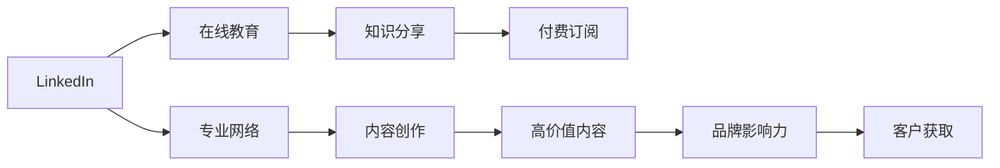

                 

# 程序员如何利用LinkedIn进行知识变现

> 关键词：知识变现, 程序员, LinkedIn, 在线教育, 专业网络

## 1. 背景介绍

在现代数字化时代，知识变现已成为一个热门话题。尤其是对于程序员这一群体，其专业技能和经验价值巨大。而LinkedIn，作为全球最大的专业社交平台，不仅为程序员提供了展示技能和经验的舞台，更开辟了一条有效变现知识的新途径。

本博客旨在深入探讨程序员如何利用LinkedIn进行知识变现，旨在帮助广大程序员理解并掌握这一高效的技能变现方式。

## 2. 核心概念与联系

### 2.1 核心概念概述

为了更好地理解这一话题，先明确几个核心概念：

- **LinkedIn**：全球最大的职业社交平台，汇集了全球的职场精英，覆盖了各行各业的专业人才。
- **知识变现**：通过提供专业知识、技能培训或咨询服务，获取经济收入的行为。
- **在线教育**：通过互联网平台，利用视频、文章、直播等方式提供教育资源，实现知识共享与变现。
- **专业网络**：通过专业社交平台建立的人脉关系网络，有助于知识分享、项目合作及商业机会的获取。
- **内容创作**：创作和分享高质量的专业文章、项目案例、技术总结等内容，提升个人品牌影响力，吸引潜在客户。
- **付费订阅**：通过提供专业订阅服务，向订阅者提供定制化的内容、技术指导或咨询服务，实现长期稳定的变现。

这些核心概念之间存在密切联系，共同构成了利用LinkedIn进行知识变现的基本框架。

### 2.2 核心概念原理和架构的 Mermaid 流程图



此流程图展示了利用LinkedIn进行知识变现的主要路径和环节。

## 3. 核心算法原理 & 具体操作步骤

### 3.1 算法原理概述

利用LinkedIn进行知识变现，本质上是一种基于内容共享和社交关系网络的知识营销策略。其核心原理包括：

- **内容质量驱动**：高质量的技术内容，如深入的技术博客、专业的技术讲解视频、详细的项目案例分析等，是吸引用户关注、建立品牌信任和变现的基础。
- **社交网络效应**：通过在LinkedIn上积极互动，建立和维护专业网络，利用口碑传播和推荐，扩大知识的影响力和变现能力。
- **个性化服务**：根据用户需求，提供定制化的技术咨询、项目指导或培训课程，实现差异化的知识变现策略。
- **持续优化**：通过数据分析和反馈，不断优化内容和营销策略，提高知识变现的效率和效果。

### 3.2 算法步骤详解

以下是一个详细的步骤，帮助程序员通过LinkedIn进行知识变现：

**Step 1: 准备好内容和平台**

1. **内容创作**：
   - **技术博客**：撰写技术深度的博客文章，包含具体案例分析、技术总结和实用技巧。
   - **视频教程**：录制专业的技术讲解视频，通过分步骤讲解技术要点，进行知识普及。
   - **代码示例**：提供代码片段和项目案例，展示技术实践，帮助学习者更好地理解。
   - **技术报告**：撰写详细技术报告，深入分析技术趋势和应用前景，吸引专业观众。

2. **平台准备**：
   - **注册LinkedIn**：创建一个完整的LinkedIn账号，完善个人简历、教育背景和工作经历等信息。
   - **设置个人主页**：设计专业的个人主页，包括个人照片、专业背景介绍、联系方式等，增加信任感。
   - **优化个人主页**：在个人主页上发布高质量内容，并定期更新，保持活跃度。

**Step 2: 发布和推广**

1. **内容发布**：
   - **定期发布**：保持一定频率的内容更新，遵循“高质量、定期更新”的原则。
   - **优化内容**：使用关键词、标签和摘要，提高内容的可见性。
   - **互动参与**：积极参与社区讨论，回复评论和问题，增加互动和曝光。

2. **内容推广**：
   - **利用LinkedIn功能**：使用LinkedIn的分享、转发和推荐功能，扩大内容的传播范围。
   - **跨平台推广**：在其他社交平台（如Twitter、GitHub）同步分享，获取更多流量。
   - **付费推广**：使用LinkedIn广告功能，针对特定受众进行定向推广，增加关注度。

**Step 3: 客户获取和变现**

1. **客户获取**：
   - **建立专业网络**：积极添加行业内专业人士和公司，进行职业交流。
   - **主动联系**：通过私信和邮件，主动与潜在客户建立联系，介绍自己的专业技能和服务内容。
   - **参与项目**：加入LinkedIn上的相关项目组，展示自己的技术能力和经验，吸引客户关注。

2. **变现策略**：
   - **付费订阅**：提供付费订阅服务，向订阅者提供专属的技术文章、在线咨询和项目指导。
   - **项目合作**：承接客户定制化的技术项目，提供专业的技术方案和实施支持。
   - **培训课程**：开设在线技术培训课程，通过收费或免费模式，获取经济收入。
   - **咨询服务**：提供专业的技术咨询服务，帮助客户解决实际问题，收取服务费。

**Step 4: 持续优化和反馈**

1. **数据分析**：
   - **内容效果分析**：使用LinkedIn的数据分析工具，评估内容的表现和用户反馈。
   - **客户反馈**：收集客户对服务的评价和建议，持续改进。

2. **优化策略**：
   - **内容优化**：根据分析结果，优化内容创作方向和形式，提高用户粘性。
   - **互动策略**：增加互动频率，增强与客户的联系和信任感。
   - **服务质量**：确保服务质量，建立良好的客户口碑。

### 3.3 算法优缺点

利用LinkedIn进行知识变现的优点包括：

- **高效触达**：LinkedIn平台汇聚了全球职场精英，能够高效触达潜在客户，扩大知识影响力。
- **专业化**：利用专业社交平台，展示专业背景和技能，提升品牌信任度。
- **多渠道变现**：结合多种变现方式，包括付费订阅、项目合作、培训课程等，多元化获取收入。

但同时也存在一些缺点：

- **时间成本**：内容创作和平台维护需要耗费大量时间和精力。
- **竞争激烈**：LinkedIn上高手如云，如何脱颖而出，需要持续创新和优化。
- **个性化需求**：需要根据不同客户的需求，提供定制化的解决方案，工作量大。
- **信任建立**：仅靠技术展示难以建立信任，需要通过互动和反馈，逐步提升客户信任感。

### 3.4 算法应用领域

利用LinkedIn进行知识变现的应用领域广泛，涵盖以下几类：

- **IT咨询顾问**：利用技术专业知识和咨询经验，为客户提供项目方案和技术支持。
- **技术培训师**：开设在线培训课程，传授专业技能和知识，通过收费获取收入。
- **软件开发师**：通过发布代码示例和项目案例，展示技术能力，吸引客户进行项目合作。
- **产品开发者**：利用LinkedIn发布产品更新和技术总结，展示产品创新和专业能力，吸引潜在用户和合作伙伴。
- **数据科学家**：分享数据分析项目和案例，展示数据分析能力，获取数据咨询和项目合作机会。

## 4. 数学模型和公式 & 详细讲解 & 举例说明

### 4.1 数学模型构建

知识变现的数学模型可以描述为：

$$
R = f(C, S, P)
$$

其中，$R$ 表示变现收入，$C$ 表示内容质量，$S$ 表示社交网络效应，$P$ 表示个性化服务。

### 4.2 公式推导过程

1. **内容质量（$C$）**：
   - **技术深度**：通过技术文章、视频教程的深度和专业性，吸引用户关注。
   - **案例分析**：详细分析具体项目案例，展示技术能力和应用场景。
   - **用户反馈**：通过用户评价和互动，评估内容的质量和实用性。

2. **社交网络效应（$S$）**：
   - **关注量**：通过定期发布和互动，增加个人主页的关注量。
   - **互动频次**：增加互动频次，提升用户粘性和信任感。
   - **推荐算法**：利用LinkedIn的推荐算法，增加内容曝光率。

3. **个性化服务（$P$）**：
   - **定制化服务**：根据客户需求，提供定制化的技术咨询、项目指导和培训课程。
   - **个性化推荐**：利用客户画像和行为数据，推荐个性化的内容和服务。
   - **动态调整**：根据客户反馈，动态调整服务内容和形式，满足客户需求。

### 4.3 案例分析与讲解

以下是一个具体的案例：

**案例：Java专家利用LinkedIn进行知识变现**

- **内容创作**：
  - **博客文章**：撰写关于Java核心技术、框架应用和最佳实践的文章，每周更新一篇。
  - **视频教程**：录制关于Java编程、Spring框架、分布式系统等主题的视频教程，每月更新3-4个视频。
  - **代码示例**：提供具体的Java项目代码示例，展示技术实现和性能优化。

- **平台准备**：
  - **个人主页**：完善个人主页，添加技术博客链接和视频教程列表。
  - **互动参与**：积极参与LinkedIn上的Java技术讨论组，回复问题，分享见解。

- **发布和推广**：
  - **定期发布**：每周定期更新内容，使用关键词和标签优化。
  - **互动推广**：在Twitter、GitHub同步发布内容，使用LinkedIn广告定向推广。

- **客户获取和变现**：
  - **建立专业网络**：添加LinkedIn上的Java开发者和公司，进行职业交流。
  - **主动联系**：通过私信和邮件，向潜在客户介绍自己的专业技能和培训课程。
  - **项目合作**：承接客户Java项目，提供专业的技术支持和项目实施。

- **持续优化和反馈**：
  - **数据分析**：使用LinkedIn的数据分析工具，评估内容的阅读量和用户反馈。
  - **优化策略**：根据反馈，优化内容创作方向和互动策略，提高变现效果。

## 5. 项目实践：代码实例和详细解释说明

### 5.1 开发环境搭建

1. **注册LinkedIn账号**：创建一个完整的LinkedIn账号，上传专业照片，填写详细的简历和教育背景信息。
2. **设置个人主页**：设计专业的个人主页，包含技术博客、视频教程、代码示例等内容的链接。
3. **优化个人主页**：使用高质量的图片、简洁明了的描述和互动元素，吸引访问者。

### 5.2 源代码详细实现

以下是一个简单的Python代码示例，用于生成和发布LinkedIn文章：

```python
import time
from linkedin import API

# 初始化LinkedIn API
api = API()

# 定义发布文章的函数
def publish_article(article_title, article_content):
    # 创建文章对象
    article = api.create_article(article_title, article_content)

    # 发布文章
    response = api.publish_article(article)

    # 等待文章发布完成
    time.sleep(10)

    # 输出发布结果
    print(f"文章发布成功：{article_title}")

# 测试发布文章
article_title = "Python高级编程技巧"
article_content = "本文介绍了Python编程中的高级技巧，包括装饰器、元类、协程等，适用于中高级Python开发者。"
publish_article(article_title, article_content)
```

### 5.3 代码解读与分析

此代码示例使用了LinkedIn官方API，通过Python脚本创建和发布文章。

1. **API调用**：使用LinkedIn API创建文章并发布，支持自动化操作。
2. **参数设置**：文章标题、内容、发布时间等参数，可根据实际情况进行调整。
3. **等待时间**：发布后等待一定时间，确保文章发布完成。
4. **输出结果**：输出文章发布成功的消息。

### 5.4 运行结果展示

成功发布的文章将在LinkedIn个人主页上显示，并可通过邮件、社交媒体等多种渠道进行分享和互动。

## 6. 实际应用场景

### 6.1 在线教育

LinkedIn作为全球最大的在线教育平台之一，提供了丰富的学习资源和知识变现机会。程序员可以利用平台发布高质量的教育内容，吸引学员订阅，实现知识变现。

**应用场景**：
- **在线课程**：开设Java编程、Python开发、机器学习等在线课程，通过付费订阅获取收入。
- **案例分析**：提供具体的编程项目案例分析，展示技术实现和解决方案。
- **技术指导**：通过在线咨询和邮件互动，提供技术指导和问题解答，收取服务费。

### 6.2 技术咨询

LinkedIn为程序员提供了一个展示专业技能和技术能力的平台，利用这一平台可以进行技术咨询和项目合作，实现知识变现。

**应用场景**：
- **技术顾问**：提供Java、Python、大数据等技术领域的咨询和支持。
- **项目评估**：评估客户的技术项目，提供专业的技术建议和改进方案。
- **项目管理**：管理客户的技术项目，提供项目实施和支持，收取项目费用。

### 6.3 产品开发

利用LinkedIn发布技术文章和项目案例，展示专业技能和产品创新，吸引潜在客户和合作伙伴。

**应用场景**：
- **技术博客**：撰写关于产品开发的技术博客，展示技术实现和创新点。
- **项目案例**：提供具体的项目案例分析，展示技术实现和性能优化。
- **产品展示**：利用LinkedIn展示产品功能和应用场景，吸引潜在用户和合作伙伴。

### 6.4 未来应用展望

未来，LinkedIn的知识变现功能将进一步增强，提供更多变现渠道和工具，助力程序员实现知识变现。

- **社区互动**：利用LinkedIn的社区功能，建立专业社群，进行知识分享和技术交流。
- **个性化推荐**：通过数据分析和推荐算法，向用户推荐个性化的内容和服务。
- **多元化变现**：除了内容付费、项目合作，还可能提供基于人工智能的个性化服务和知识变现方案。

## 7. 工具和资源推荐

### 7.1 学习资源推荐

- **LinkedIn官方文档**：提供详细的LinkedIn API和平台使用指南，帮助开发者高效使用平台。
- **Coursera在线课程**：提供丰富的在线教育资源，涵盖多种技术和行业领域，助力程序员提升技能。
- **Stack Overflow**：提供问答社区和技术讨论，帮助程序员解决问题，展示技术能力。
- **GitHub**：提供代码托管和项目管理工具，展示技术成果，吸引合作伙伴。

### 7.2 开发工具推荐

- **Python**：Python语言简洁高效，支持LinkedIn API调用和数据分析。
- **LinkedIn API**：LinkedIn官方提供的API，支持自动化操作和数据获取。
- **Jupyter Notebook**：支持代码编写和数据可视化，方便开发者进行分析和测试。
- **GitHub**：提供代码托管和项目管理，方便开发者协作和分享。

### 7.3 相关论文推荐

- **LinkedIn的个性化推荐算法**：探讨LinkedIn如何通过推荐算法提高内容曝光率和用户粘性。
- **知识变现的商业模型研究**：分析知识变现的多种商业模型和变现策略，提供实证分析。
- **社交媒体上的知识分享和变现**：研究社交媒体平台上的知识分享和变现机制，提出优化策略。

## 8. 总结：未来发展趋势与挑战

### 8.1 总结

本文深入探讨了程序员如何利用LinkedIn进行知识变现，帮助开发者系统掌握这一高效技能变现方式。通过案例分析和实际操作步骤，详细介绍了利用LinkedIn进行内容创作、平台发布、客户获取和变现的全流程，并提供了实用的代码示例和技术资源。

### 8.2 未来发展趋势

未来，LinkedIn的知识变现功能将更加完善，提供更多变现渠道和工具，助力程序员实现知识变现。

- **内容多元化**：除了技术文章和视频教程，还将支持多种形式的内容创作，如音频讲解、直播互动等。
- **技术社区化**：通过建立技术社区，促进知识分享和技术交流，提高用户粘性和互动率。
- **服务定制化**：根据用户需求，提供定制化的技术咨询、项目合作和培训课程，实现差异化服务。

### 8.3 面临的挑战

利用LinkedIn进行知识变现仍面临一些挑战：

- **时间投入**：内容创作和平台维护需要耗费大量时间和精力，需合理安排时间。
- **内容质量**：高质量的内容是吸引用户关注和变现的基础，需持续优化内容创作。
- **客户获取**：需要主动联系和互动，建立和维护客户关系，增加变现机会。
- **信任建立**：仅靠技术展示难以建立信任，需通过互动和反馈，逐步提升客户信任感。

### 8.4 研究展望

未来，知识变现领域的研究将继续探索新的方法和工具，助力程序员实现高效变现。

- **自动化工具**：开发自动化内容创作和平台维护工具，提高效率和效果。
- **数据分析工具**：利用大数据和人工智能技术，优化内容创作和用户互动策略，提高变现效果。
- **多元化变现**：除了内容付费、项目合作，还可能提供基于人工智能的个性化服务和知识变现方案。

总之，利用LinkedIn进行知识变现，为程序员提供了高效展示和变现知识的新途径。通过持续创新和优化，未来的知识变现将更加多元化、个性化，助力程序员实现职业发展和经济变现。

## 9. 附录：常见问题与解答

**Q1: 如何选择合适的LinkedIn文章类型？**

A: 选择合适的LinkedIn文章类型需考虑目标受众和内容形式：
- **技术博客**：适合展示深入的技术分析和实践经验。
- **视频教程**：适合展示复杂的编程技巧和案例分析。
- **代码示例**：适合展示具体的代码实现和项目案例。
- **技术报告**：适合展示详细技术分析和未来展望。

**Q2: 如何提高LinkedIn文章的用户互动率？**

A: 提高用户互动率需注意以下几点：
- **互动元素**：在文章中增加互动元素，如问答、投票、评论等。
- **定期更新**：保持定期更新，吸引用户关注和互动。
- **互动回应**：积极回应用户评论和提问，增加互动频次。
- **个性化内容**：根据用户兴趣和需求，提供个性化内容。

**Q3: 如何利用LinkedIn进行项目合作？**

A: 利用LinkedIn进行项目合作需注意以下几点：
- **建立专业网络**：添加潜在客户和合作伙伴，进行职业交流。
- **主动联系**：通过私信和邮件，主动联系潜在客户，介绍自己的专业技能和服务内容。
- **展示项目案例**：提供具体的项目案例和解决方案，展示技术能力和实施经验。
- **项目洽谈**：在互动中逐步建立信任，进行项目洽谈和合作。

**Q4: 如何利用LinkedIn进行在线培训？**

A: 利用LinkedIn进行在线培训需注意以下几点：
- **课程设计**：设计系统化的课程内容和培训计划，涵盖理论知识和实践技能。
- **视频讲解**：录制高质量的视频讲解，展示技术要点和实践操作。
- **互动练习**：通过在线互动和练习，帮助学员巩固知识。
- **学员管理**：利用LinkedIn社区功能，进行学员管理，跟踪学习进度。

总之，利用LinkedIn进行知识变现，为程序员提供了展示和变现知识的新途径。通过不断优化和创新，未来的知识变现将更加高效、多元化，助力程序员实现职业发展和经济收益。

---

作者：禅与计算机程序设计艺术 / Zen and the Art of Computer Programming

