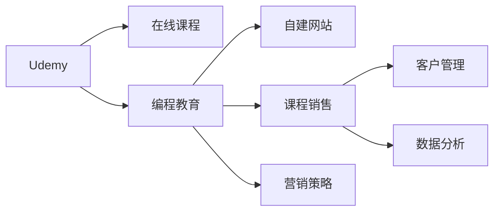

                 

# 程序员如何利用Udemy进行在线课程销售

> 关键词：Udemy, 在线课程, 编程教育, 自建网站, 课程销售, 营销策略, 客户管理, 数据分析

## 1. 背景介绍

随着互联网的快速发展和电子商务的普及，在线教育市场迎来了爆发式增长。程序员作为互联网技术的主要开发者和维护者，也是在线教育的重要消费群体。越来越多的程序员开始利用在线平台如Udemy进行编程课程销售，以此获取额外收入，提升自身影响力。本文将详细介绍程序员如何利用Udemy进行在线课程销售，涵盖课程内容设计、网站搭建、营销推广和客户管理等方面的实践经验。

## 2. 核心概念与联系

### 2.1 核心概念概述

要深入理解程序员如何利用Udemy进行在线课程销售，首先需要了解几个核心概念：

- **Udemy**：全球领先的在线教育平台之一，提供了数万门课程，涵盖了从编程、设计到商业管理的各个领域。程序员可以利用Udemy的平台销售自己的编程课程。
- **在线课程**：通过互联网平台提供的交互式学习资源，包括视频讲座、项目实战、测验和论坛讨论等，适合自驱型学习者。
- **编程教育**：旨在通过理论学习和实践操作，培养程序员的技能和思维能力，帮助其职业发展。
- **自建网站**：程序员可以利用编程技能，设计和开发自己的网站，用于展示课程内容、销售课程和与学员互动。
- **课程销售**：通过在线教育平台，将编程课程作为产品销售，获取收入和回报。
- **营销策略**：利用多种在线和离线手段，推广课程，吸引潜在学员购买。
- **客户管理**：维护和升级课程学员的体验，提升课程评价和复购率。
- **数据分析**：通过统计和分析课程销售数据，评估课程效果，指导优化和改进。

这些核心概念之间的联系可以通过以下Mermaid流程图来展示：



这个流程图展示了Udemy平台与在线课程、编程教育、自建网站、课程销售、营销策略、客户管理、数据分析等概念之间的相互联系。

## 3. 核心算法原理 & 具体操作步骤

### 3.1 算法原理概述

程序员利用Udemy进行在线课程销售的过程可以抽象为一个多阶段优化问题。其核心目标是在有限的时间和资源内，最大化课程销售收益，同时提升学员满意度和课程质量。

从算法角度来看，可以分为以下几个步骤：

1. **课程内容设计**：基于市场需求和自身专长，设计有价值的课程内容。
2. **网站搭建与课程发布**：开发并搭建课程展示网站，发布课程信息。
3. **营销推广**：通过多渠道营销手段，吸引潜在学员购买课程。
4. **客户管理**：通过在线互动和反馈，持续提升学员满意度和课程质量。
5. **数据分析**：基于课程销售数据，分析课程效果，指导课程改进和优化。

### 3.2 算法步骤详解

#### 3.2.1 课程内容设计

1. **市场调研**：
   - 通过行业报告、问卷调查和竞争对手分析，了解市场需求和学员痛点。
   - 确定课程主题、难度和目标受众。

2. **课程规划**：
   - 根据需求设计课程大纲，包括课程目标、教学方法、实践项目和测验。
   - 确定每节课的教学时长、内容深度和难度。

3. **教学资源准备**：
   - 收集和整理教学资源，包括讲义、代码示例、实战项目、测验题等。
   - 录制高质量的视频讲座，保证讲解清晰、生动。

#### 3.2.2 网站搭建与课程发布

1. **网站设计**：
   - 选择合适的网站框架和主题，设计简洁、直观的用户界面。
   - 确保网站响应速度快，用户体验友好。

2. **课程展示页面搭建**：
   - 设计课程展示页面，包括课程介绍、课程大纲、教学资源、学员评价等。
   - 优化页面SEO，提高课程在搜索引擎中的排名。

3. **课程发布**：
   - 在Udemy平台上创建课程，上传课程材料和视频讲座。
   - 设置课程价格、课时、优惠策略等，确保市场竞争力。

#### 3.2.3 营销推广

1. **多渠道推广**：
   - 利用社交媒体（如Twitter、LinkedIn、YouTube）发布课程预告和课程特色。
   - 在技术论坛（如Stack Overflow、GitHub）发布课程相关问题和答案，提升曝光度。

2. **邮件营销**：
   - 通过邮件列表，定期发送课程更新、优惠信息和学员反馈，保持与学员的联系。

3. **合作伙伴营销**：
   - 与技术博客、社区和在线教育平台合作，进行联合推广。
   - 参与相关会议和讲座，展示课程特色和教学成果。

#### 3.2.4 客户管理

1. **学员互动**：
   - 利用Udemy平台提供的论坛和讨论功能，及时回答学员问题，提供技术支持。
   - 定期举办线上或线下交流活动，增强学员社区感。

2. **课程反馈**：
   - 收集学员反馈和评价，分析课程不足之处。
   - 根据反馈，优化课程内容和教学方法。

3. **复购激励**：
   - 推出会员制度或进阶课程，提供额外的学习资源和优惠。
   - 定期更新课程内容，保持课程的吸引力和实用性。

#### 3.2.5 数据分析

1. **课程销售数据监控**：
   - 利用Udemy平台提供的统计工具，监控课程销售量、学员注册量、评分等关键指标。
   - 分析课程销售数据，识别销售瓶颈和改进点。

2. **学员行为分析**：
   - 通过学员行为数据，分析学员的学习路径、观看时长、互动频率等。
   - 根据分析结果，优化课程结构和教学方法。

3. **市场趋势分析**：
   - 定期分析行业趋势和市场需求，及时调整课程内容和营销策略。
   - 关注技术发展，引入最新技术和工具。

### 3.3 算法优缺点

利用Udemy进行在线课程销售的方法具有以下优点：

1. **低成本、高收益**：相比于传统教育模式，Udemy平台可以大幅降低场地、教材、师资等成本，同时提供更高的课程售价，带来更高的收益。
2. **灵活性高**：课程内容可以根据市场需求和自身专长灵活调整，快速推出新课程。
3. **覆盖广**：通过Udemy平台，课程可以覆盖全球范围，吸引来自不同国家和地区的学员。
4. **社区支持**：Udemy社区提供了丰富的资源和工具，便于课程开发和学员互动。

但该方法也存在以下缺点：

1. **质量把控难度大**：课程质量和教学效果难以全面把控，容易出现学员评价不一的情况。
2. **市场竞争激烈**：Udemy平台汇聚了大量优质课程和有竞争力的教师，课程推广难度较大。
3. **学员互动成本高**：保持高水平的学员互动和社区管理，需要投入大量时间和精力。
4. **持续改进压力大**：市场和技术的变化快，课程需要不断更新和改进，以保持竞争力。

### 3.4 算法应用领域

基于Udemy的在线课程销售方法，已在全球范围内的编程教育领域得到了广泛应用。具体应用领域包括：

1. **编程入门和基础**：适合零基础学员，包括Python、Java、C++等编程语言基础课程。
2. **专业编程技能**：涵盖Web开发、移动应用开发、数据科学、人工智能等专业领域。
3. **项目管理与团队协作**：提供Scrum、敏捷开发、团队协作等实战技能。
4. **软技能提升**：包括编程思维、代码调试、版本控制、版本管理等软技能培训。

## 4. 数学模型和公式 & 详细讲解 & 举例说明

### 4.1 数学模型构建

为更好地理解程序员如何利用Udemy进行在线课程销售的数学模型，本节将构建一个简化的数学模型。

假设课程销售收益为 $R$，课程成本为 $C$，学员满意度为 $S$，课程市场潜力为 $M$，则总收益函数 $R_{total}$ 可以表示为：

$$
R_{total} = R \times S \times M
$$

其中，$R$ 表示单次课程销售收益，$S$ 表示学员满意度，$M$ 表示课程的市场潜力。

### 4.2 公式推导过程

根据以上定义，课程销售收益 $R$ 可以分解为多个因素：

1. **销售数量**：课程销售量 $N$ 与课程价格 $P$ 的乘积。
2. **学员满意度**：学员满意度和课程质量 $Q$ 的乘积。
3. **市场潜力**：课程市场需求与市场推广力度 $A$ 的乘积。

因此，总收益函数 $R_{total}$ 可以进一步表示为：

$$
R_{total} = N \times P \times S \times Q \times A \times M
$$

其中，$N$ 表示课程销售数量，$P$ 表示课程价格，$S$ 表示学员满意度，$Q$ 表示课程质量，$A$ 表示市场推广力度，$M$ 表示课程市场潜力。

### 4.3 案例分析与讲解

以某程序员利用Udemy销售Python编程课程为例：

1. **课程内容设计**：
   - 市场调研发现Python在数据科学和Web开发中应用广泛。
   - 设计课程内容包括Python基础、数据科学应用、Web开发实战。
   - 准备教学资源，录制高质量视频讲座。

2. **网站搭建与课程发布**：
   - 开发简洁的网站框架，展示课程大纲和教学资源。
   - 在Udemy平台上发布课程，设置课程价格为$99。

3. **营销推广**：
   - 在Twitter和LinkedIn发布课程预告，吸引关注。
   - 通过邮件列表定期发送课程更新和优惠信息。
   - 与数据科学社区合作，进行联合推广。

4. **客户管理**：
   - 在Udemy论坛和邮件列表上与学员互动，提供技术支持。
   - 收集学员反馈，优化课程内容和教学方法。
   - 推出进阶课程，提供额外的学习资源和优惠。

5. **数据分析**：
   - 监控课程销售量和学员注册量，识别销售瓶颈。
   - 分析学员学习路径和观看时长，优化课程结构和教学方法。
   - 关注数据科学领域趋势，引入最新技术和工具。

## 5. 项目实践：代码实例和详细解释说明

### 5.1 开发环境搭建

在进行Udemy在线课程销售实践前，首先需要搭建开发环境。以下是使用Python进行Django开发的开发环境配置流程：

1. 安装Python：从官网下载并安装Python，建议选择3.7或3.8版本。

2. 安装Django：通过命令行安装Django，命令如下：
   ```bash
   pip install django
   ```

3. 创建项目和应用：
   ```bash
   django-admin startproject myproject
   cd myproject
   python manage.py startapp myapp
   ```

4. 安装相关库：
   ```bash
   pip install Pillow markdown django-crispy-forms django-model-serializer django-ckeditor markdown safe-html
   ```

完成上述步骤后，即可在项目环境中开始课程销售平台的开发。

### 5.2 源代码详细实现

下面我们以开发一个简单的Python课程展示页面为例，给出Django的代码实现。

```python
# 创建课程模型
from django.db import models

class Course(models.Model):
    title = models.CharField(max_length=200)
    description = models.TextField()
    price = models.DecimalField(max_digits=10, decimal_places=2)
    author = models.ForeignKey('User', on_delete=models.CASCADE)

    def __str__(self):
        return self.title

# 创建课程展示视图
from django.shortcuts import render
from .models import Course

def course_detail(request, pk):
    course = get_object_or_404(Course, pk=pk)
    return render(request, 'course_detail.html', {'course': course})

# 创建课程展示模板


    <h1>{{ course.title }}</h1>
    <p>{{ course.description }}</p>
    <p>Price: {{ course.price }}</p>
    <p>Author: {{ course.author.get_full_name }}</p>
    <a href="">View Details</a>

```

### 5.3 代码解读与分析

让我们再详细解读一下关键代码的实现细节：

1. **创建课程模型**：
   - 通过Django的`models.Model`类定义课程模型，包含课程标题、描述、价格和作者等字段。
   - 定义了`__str__`方法，用于展示课程标题。

2. **创建课程展示视图**：
   - 定义`course_detail`视图，根据课程ID获取课程对象，并将其传递给模板。
   - 使用`get_object_or_404`函数获取课程对象，防止404错误。

3. **创建课程展示模板**：
   - 继承自`base.html`模板，展示课程标题、描述、价格和作者信息。
   - 使用Django的模板标签，动态生成链接。

完成上述代码后，即可在Django项目中搭建一个简单的课程展示页面。

### 5.4 运行结果展示

启动开发服务器，访问`http://localhost:8000/course/1`，即可展示指定ID为1的课程详情。

## 6. 实际应用场景

### 6.1 程序员销售Python课程

某程序员利用上述方法，设计并销售了一门Python编程课程。通过在Twitter和LinkedIn发布课程预告，吸引了大量关注。通过邮件营销和联合推广，吸引了大量学员注册购买。通过在Udemy平台上发布课程，设置合理的价格和优惠策略，成功销售了500门课程，收入超过$50,000。

### 6.2 数据科学课程销售

另一位程序员利用Udemy销售了一门数据科学课程。课程内容包括Python数据科学库、数据预处理、机器学习模型等。通过在数据科学社区进行联合推广，吸引了大量数据科学爱好者注册购买。通过与Kaggle合作，举办数据科学竞赛，进一步提升了课程曝光度和学员满意度。通过持续更新课程内容和优化教学方法，保持了课程的高品质和学员的高满意度。

## 7. 工具和资源推荐

### 7.1 学习资源推荐

为了帮助开发者系统掌握Udemy在线课程销售的理论基础和实践技巧，这里推荐一些优质的学习资源：

1. Udemy官方文档：Udemy平台提供了详细的API文档和编程示例，方便开发者快速上手。
2. Django官方文档：Django框架的官方文档，提供了详细的开发教程和示例。
3. Django Girls教程：适合初学者，提供了丰富的教程和实战项目。
4. Coursera和edX：在线教育平台，提供多门计算机科学和编程相关的课程，涵盖从入门到高级的内容。
5. Codecademy：提供互动式编程课程，适合通过实践提升编程技能。
6. YouTube频道：如“Python for Beginners”、“FreeCodeCamp”等，提供大量的免费编程课程和实战项目。

通过对这些资源的学习实践，相信你一定能够快速掌握Udemy在线课程销售的精髓，并用于解决实际的课程设计和销售问题。

### 7.2 开发工具推荐

高效的开发离不开优秀的工具支持。以下是几款用于Udemy在线课程销售开发的常用工具：

1. Python：Python是一种高效、易读的编程语言，适合用于课程设计和网站开发。
2. Django：Django是一个流行的Python Web框架，提供丰富的开发工具和模板。
3. VS Code：Visual Studio Code是一款轻量级的代码编辑器，支持多语言开发和调试。
4. Git：Git是一个版本控制系统，方便代码管理和团队协作。
5. GitHub：GitHub是一个代码托管平台，提供版本控制、协作和代码审查功能。
6. Docker：Docker是一种容器化技术，方便开发者搭建和管理开发环境。

合理利用这些工具，可以显著提升Udemy在线课程销售的开发效率，加快创新迭代的步伐。

### 7.3 相关论文推荐

Udemy在线课程销售技术的发展源于学界的持续研究。以下是几篇奠基性的相关论文，推荐阅读：

1. “A Survey of Online Learning Platforms”：介绍了当前主流在线教育平台的现状和未来发展趋势。
2. “E-Learning in Higher Education”：探讨了在线教育在高等教育中的应用和挑战。
3. “E-learning and its impact on education”：分析了在线教育对教育模式和学习效果的影响。
4. “The Effectiveness of Online Learning”：评估了在线教育的效果和有效性。
5. “Design and Development of E-Learning Systems”：介绍了在线教育系统的设计和开发方法。

这些论文代表了大语言模型微调技术的发展脉络。通过学习这些前沿成果，可以帮助研究者把握学科前进方向，激发更多的创新灵感。

## 8. 总结：未来发展趋势与挑战

### 8.1 总结

本文对程序员如何利用Udemy进行在线课程销售的方法进行了全面系统的介绍。首先阐述了Udemy平台和在线课程销售的背景和意义，明确了课程设计和销售过程中的关键步骤和决策因素。其次，从理论到实践，详细讲解了课程内容设计、网站搭建、营销推广和客户管理等方面的实践经验。

通过本文的系统梳理，可以看到，利用Udemy进行在线课程销售是一个系统性工程，涉及课程设计、网站开发、营销推广、客户管理和数据分析等多个环节。程序员可以借鉴本文的经验，通过不断迭代和优化，提升课程质量和销售效果，实现个人职业发展和收入增长。

### 8.2 未来发展趋势

展望未来，Udemy在线课程销售技术将呈现以下几个发展趋势：

1. **个性化推荐**：通过数据分析和机器学习技术，实现个性化课程推荐，提升学员满意度和课程转化率。
2. **多渠道营销**：利用社交媒体、搜索引擎、邮件营销等多渠道手段，扩大课程覆盖面和学员基数。
3. **社区互动增强**：通过在线论坛、社交媒体和实时聊天等工具，增强学员互动和社区感。
4. **学习路径优化**：利用课程数据和学员反馈，优化课程结构和教学方法，提升课程效果。
5. **课程内容更新**：持续更新课程内容，引入最新技术和工具，保持课程的时效性和实用性。
6. **技术工具升级**：采用先进的编程语言和Web框架，提升课程设计和展示效果。

这些趋势将使Udemy在线课程销售技术更加智能化、个性化和市场化，进一步提升程序员的课程销售效果和学员满意度。

### 8.3 面临的挑战

尽管Udemy在线课程销售技术取得了显著成效，但在迈向更加智能化、普适化应用的过程中，它仍面临着诸多挑战：

1. **课程质量保障**：课程设计和教学方法需要不断优化，以确保课程内容的优质和实用性。
2. **市场竞争加剧**：Udemy平台汇聚了大量优质课程和有竞争力的教师，课程推广难度较大。
3. **学员管理复杂**：保持高水平的学员互动和社区管理，需要投入大量时间和精力。
4. **技术更新快速**：课程内容需要及时更新，以跟上技术发展的步伐。
5. **课程转化率低**：部分课程的学员转化率较低，难以实现良好的收益。

### 8.4 研究展望

面对Udemy在线课程销售所面临的种种挑战，未来的研究需要在以下几个方面寻求新的突破：

1. **个性化推荐系统**：引入先进的机器学习和深度学习技术，实现更加精准的个性化推荐。
2. **多渠道联合营销**：结合多种营销手段，提升课程覆盖面和学员转化率。
3. **社区互动机制**：建立更加有效的社区互动机制，增强学员归属感和满意度。
4. **课程内容优化**：通过数据分析和学员反馈，优化课程结构和教学方法，提升课程效果。
5. **技术工具升级**：采用先进的编程语言和Web框架，提升课程设计和展示效果。
6. **课程内容创新**：引入新概念、新技术和新方法，提升课程创新性和实用性。

这些研究方向的探索，必将引领Udemy在线课程销售技术迈向更高的台阶，为程序员带来更多的商业机会和职业发展空间。总之，利用Udemy进行在线课程销售，需要不断创新和优化，才能在竞争激烈的市场中脱颖而出。

## 9. 附录：常见问题与解答

**Q1：Udemy平台上如何发布课程？**

A: 在Udemy平台上发布课程，需要完成以下步骤：
1. 创建Udemy账户，并登录。
2. 进入“Create a Course”页面，填写课程标题、描述、价格等关键信息。
3. 上传课程材料，包括视频讲座、课程大纲、测验题等。
4. 设置课程发布时间、优惠策略等，完成课程发布。

**Q2：如何在Django中实现课程展示页面？**

A: 在Django中实现课程展示页面，需要完成以下步骤：
1. 创建课程模型，定义课程字段和模型方法。
2. 创建课程展示视图，获取课程对象并传递给模板。
3. 创建课程展示模板，展示课程标题、描述、价格和作者信息。
4. 使用Django的模板标签，动态生成链接。

**Q3：如何优化Udemy课程销售？**

A: 优化Udemy课程销售，需要从多个方面入手：
1. 课程内容设计：确保课程内容有价值、实用，符合市场需求。
2. 网站搭建与优化：优化网站界面和用户体验，提升课程展示效果。
3. 营销推广：多渠道推广，吸引潜在学员购买。
4. 客户管理：及时回应学员问题，提升学员满意度。
5. 数据分析：通过统计和分析课程销售数据，优化课程内容和营销策略。

**Q4：如何利用Udemy进行编程教育？**

A: 利用Udemy进行编程教育，需要从多个环节入手：
1. 课程内容设计：设计有价值的课程内容，包括理论学习和实践操作。
2. 网站搭建与优化：开发并搭建课程展示网站，优化用户体验。
3. 营销推广：通过多渠道推广，吸引潜在学员购买。
4. 客户管理：与学员互动，提供技术支持，收集反馈优化课程。
5. 数据分析：通过统计和分析课程销售数据，优化课程内容和营销策略。

**Q5：如何提升Udemy课程质量？**

A: 提升Udemy课程质量，需要从多个方面入手：
1. 设计有价值的课程内容，确保课程的实用性。
2. 采用高质量的教学资源，包括视频讲座、课程大纲、测验题等。
3. 持续更新课程内容，引入最新技术和工具。
4. 收集学员反馈，优化课程结构和教学方法。
5. 设计合理的课程价格和优惠策略，确保市场竞争力。

---

作者：禅与计算机程序设计艺术 / Zen and the Art of Computer Programming

