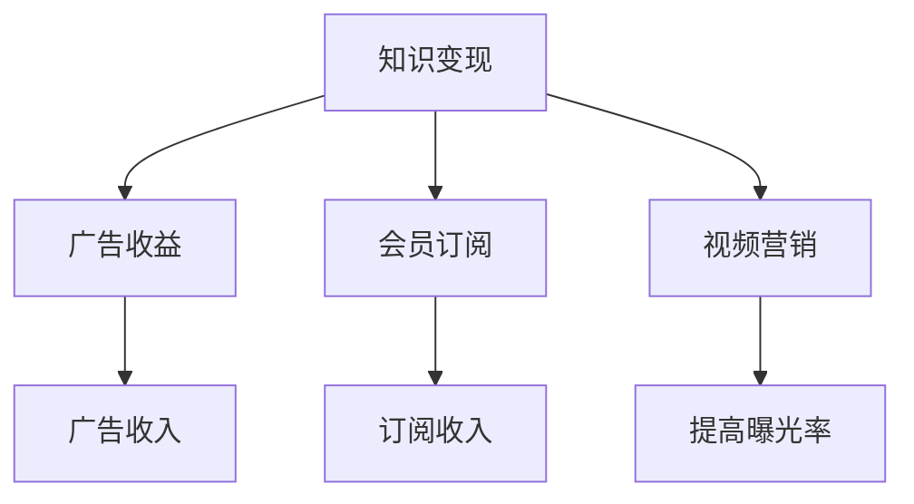

                 

# 程序员如何利用YouTube进行知识变现

> 关键词：知识变现、YouTube、程序员、教学视频、在线教育、内容创作、广告收益、会员订阅、视频营销

## 1. 背景介绍

在互联网时代，技术的更新迭代速度加快，程序员需要不断学习新的知识和技术才能保持竞争力。然而，传统的学习方式（如报名线下课程、购买纸质书籍等）往往成本较高、信息过时，且学习过程缺乏互动和反馈。YouTube作为一个免费且易于访问的视频平台，为程序员提供了一种新的学习和知识变现方式。

### 1.1 背景分析

YouTube作为全球最大的视频分享平台，吸引了大量的用户和内容创作者。随着移动互联网的普及，用户对短视频、直播等形式的消费需求日益增长，这也为内容创作者提供了广阔的市场机会。对于程序员来说，通过在YouTube上发布教学视频，不仅能传播知识和技能，还能通过广告收益、会员订阅等方式获得收入，实现知识变现。

### 1.2 市场需求

编程、软件开发、人工智能等技术领域的人才需求量大，程序员在就业市场具有较高的竞争优势。同时，越来越多的人希望通过学习编程技能，提高自己的职业竞争力或作为第二职业。因此，面向这些用户群体的在线教育市场需求巨大。

## 2. 核心概念与联系

### 2.1 核心概念概述

- **YouTube**：全球最大的视频分享平台，拥有海量的用户和内容。程序员可以通过创建频道，上传教学视频，吸引观众。
- **知识变现**：通过传授知识、技能，获取收入的过程。在YouTube上，知识变现主要通过广告收益、会员订阅、商品销售等方式实现。
- **教学视频**：面向特定受众群体，提供系统化、结构化的知识讲解和技术分享的视频内容。
- **广告收益**：YouTube为视频创作者提供了一种广告收入模式，观众观看视频时可能会被展示广告，创作者因此获得收益。
- **会员订阅**：订阅者支付费用，观看创作者上传的专属视频内容。创作者可以通过设置价格和内容门槛，增加收入来源。
- **视频营销**：利用YouTube的视频推广工具，提高视频曝光率，吸引更多观众。

### 2.2 核心概念原理和架构的 Mermaid 流程图



这个流程图展示了知识变现的不同方式和它们之间的联系：

1. **广告收益**：YouTube广告系统根据视频内容及观众兴趣，自动匹配广告主。创作者从广告展示中获取收入。
2. **会员订阅**：观众付费成为订阅者，观看创作者的视频内容。创作者可以提供专属内容，吸引更多订阅。
3. **视频营销**：通过优化视频标题、标签和简介，提高视频在YouTube搜索中的排名，吸引更多观众。

这些方式共同构成了YouTube上程序员进行知识变现的主要途径。

## 3. 核心算法原理 & 具体操作步骤

### 3.1 算法原理概述

基于YouTube的知识变现过程，主要分为以下步骤：

1. **内容创作**：通过系统化、结构化的方式，创建面向特定受众群体的教学视频。
2. **视频上传与优化**：选择合适的视频格式，优化视频标题、描述、标签等，提高搜索引擎排名。
3. **用户互动**：与观众进行互动，解答问题，收集反馈，持续改进内容。
4. **收入获取**：通过广告收益、会员订阅等方式，实现知识变现。

### 3.2 算法步骤详解

#### 3.2.1 内容创作

1. **确定目标受众**：明确视频面向的用户群体，如初级、中级、高级开发者，或是特定编程语言的用户。
2. **规划视频结构**：确定视频的主题、时长、所需素材和讲解内容。
3. **制作视频**：使用视频编辑工具，如Adobe Premiere、DaVinci Resolve等，进行视频录制、剪辑和后期处理。

#### 3.2.2 视频上传与优化

1. **选择合适的视频格式**：YouTube支持多种视频格式，如MP4、AVI、MOV等。
2. **优化视频标题和描述**：确保标题简洁明了，描述中包含关键词，提高搜索引擎排名。
3. **设置标签和分类**：合理设置视频标签和分类，有助于观众快速找到相关视频。
4. **添加缩略图**：高质量、有吸引力的缩略图，能提高视频的点击率。

#### 3.2.3 用户互动

1. **回复评论**：积极与观众互动，回答观众提出的问题，收集反馈。
2. **定期更新内容**：根据观众反馈和最新技术动态，定期更新视频内容，保持内容新鲜度和吸引力。
3. **发布预告片**：发布视频预告片，吸引观众的注意力。

#### 3.2.4 收入获取

1. **广告收益**：YouTube的收入计划通常与视频观看时长和观看次数挂钩，创作者因此获得广告收入。
2. **会员订阅**：创作者可以提供会员专属内容，如高级教程、实时直播等，吸引观众订阅。
3. **商品销售**：通过视频内链接，推广商品，如编程书籍、工具软件等，实现间接变现。

### 3.3 算法优缺点

#### 3.3.1 算法优点

1. **低门槛**：YouTube平台免费开放，程序员只需具备基本的计算机技能和视频编辑知识即可创建频道。
2. **多收入渠道**：除了广告收益，还有会员订阅、商品销售等多元化收入方式，提升变现潜力。
3. **覆盖广泛**：YouTube拥有全球用户，创作者可以面向全球受众，扩大市场覆盖。
4. **可扩展性强**：随着内容创作和视频观看量的增加，创作者可以获得更高的广告收入和订阅量。

#### 3.3.2 算法缺点

1. **竞争激烈**：YouTube上的内容创作者众多，获得高观看量的难度较大。
2. **收入不稳定**：广告收益和会员订阅收入受观众行为和平台政策影响，不够稳定。
3. **内容更新难度大**：保持视频内容的新鲜度和吸引力，需要持续的创作和更新。
4. **技术门槛高**：高质量视频制作和后期处理需要一定的技术储备和设备投入。

### 3.4 算法应用领域

YouTube知识变现的应用领域广泛，特别是在以下几方面：

1. **编程教程**：提供面向不同层次的编程语言和技术的教程，如Python、Java、Web开发、人工智能等。
2. **软件开发**：分享软件开发最佳实践、框架使用、项目案例等。
3. **技术访谈**：邀请行业专家进行技术讨论和经验分享，吸引更多观众。
4. **在线课程**：提供系统化、结构化的课程，涵盖特定编程语言或技术的全栈知识。
5. **企业培训**：企业可以通过YouTube进行员工培训，提高员工技术水平。

## 4. 数学模型和公式 & 详细讲解 & 举例说明

### 4.1 数学模型构建

假设创作者在YouTube上传视频，视频编号为$i$，时间为$t$，观看次数为$w_i(t)$，平均观看时长为$d_i(t)$，视频总收入为$P_i(t)$。

根据YouTube的收入模型，广告收益$P^{ads}_i(t)$与广告展示次数和点击率有关，设每次展示的平均收入为$C^{ads}$，则有：

$$
P^{ads}_i(t) = C^{ads} \times N^{ads}_i(t)
$$

其中$N^{ads}_i(t)$为广告展示次数。

会员订阅收入$P^{sub}_i(t)$与订阅用户数和订阅时长有关，设每位订阅用户每月支付的费用为$F^{sub}$，则有：

$$
P^{sub}_i(t) = F^{sub} \times U_i(t) \times M^{sub}(t)
$$

其中$U_i(t)$为订阅用户数，$M^{sub}(t)$为订阅时长。

视频营销收益$P^{mark}_i(t)$与视频的曝光率和观众行为有关，设每次曝光的平均收入为$C^{mark}$，则有：

$$
P^{mark}_i(t) = C^{mark} \times N^{mark}_i(t)
$$

其中$N^{mark}_i(t)$为视频的曝光次数。

### 4.2 公式推导过程

根据上述模型，总收益$P_i(t)$可以表示为：

$$
P_i(t) = P^{ads}_i(t) + P^{sub}_i(t) + P^{mark}_i(t)
$$

将广告收益、会员订阅收入和视频营销收益的公式代入上式，得：

$$
P_i(t) = C^{ads} \times N^{ads}_i(t) + F^{sub} \times U_i(t) \times M^{sub}(t) + C^{mark} \times N^{mark}_i(t)
$$

对上述公式进行化简和推导，可以得到最终的视频总收入模型。

### 4.3 案例分析与讲解

假设某程序员创建一个Python编程教程频道，每月上传两部视频。第一部视频上传第1个月时观看次数为1000次，平均观看时长为5分钟，广告展示次数为5000次，点击率为0.2；第二部视频上传第2个月时观看次数为1500次，平均观看时长为10分钟，广告展示次数为6000次，点击率为0.25。假设每月订阅用户数和订阅时长不变，均为10000人，订阅费用为$5。

根据上述模型，第一部视频在第1个月的广告收益为：

$$
P^{ads}_1 = C^{ads} \times N^{ads}_1 = 0.5 \times 5000 \times 0.2 = 500
$$

第二部视频在第2个月的广告收益为：

$$
P^{ads}_2 = C^{ads} \times N^{ads}_2 = 0.5 \times 6000 \times 0.25 = 750
$$

两部视频在第1个月的会员订阅收入为：

$$
P^{sub}_1 = F^{sub} \times U_1 \times M^{sub}_1 = 5 \times 10000 \times 1 = 50000
$$

两部视频在第2个月的会员订阅收入为：

$$
P^{sub}_2 = F^{sub} \times U_2 \times M^{sub}_2 = 5 \times 10000 \times 1 = 50000
$$

两部视频在第1个月的视频营销收入为：

$$
P^{mark}_1 = C^{mark} \times N^{mark}_1 = 2 \times 1000 = 2000
$$

两部视频在第2个月的视频营销收入为：

$$
P^{mark}_2 = C^{mark} \times N^{mark}_2 = 2 \times 1500 = 3000
$$

两部视频在第1个月的总收入为：

$$
P_1 = P^{ads}_1 + P^{sub}_1 + P^{mark}_1 = 500 + 50000 + 2000 = 52500
$$

两部视频在第2个月的总收入为：

$$
P_2 = P^{ads}_2 + P^{sub}_2 + P^{mark}_2 = 750 + 50000 + 3000 = 55750
$$

通过以上分析，可以看出视频的收益不仅与广告展示次数和观看次数有关，还与订阅用户和订阅时长等策略相关。创作者需要不断优化内容质量和推广策略，才能提升收益。

## 5. 项目实践：代码实例和详细解释说明

### 5.1 开发环境搭建

要开始在YouTube上发布视频并进行知识变现，首先需要搭建开发环境：

1. **安装YouTube API**：在开发环境下安装YouTube API，并获取API密钥。
2. **选择视频编辑工具**：如Adobe Premiere、DaVinci Resolve等，进行视频录制、剪辑和后期处理。
3. **创建YouTube频道**：登录YouTube账户，创建个人或企业频道。
4. **设置视频上传工具**：使用如Handbrake、FFmpeg等工具，进行视频格式转换和优化。
5. **优化视频上传**：通过测试不同的上传时间和格式，找到最佳的上传方式。

### 5.2 源代码详细实现

以下是使用Python和YouTube API进行视频上传和优化的代码实现：

```python
from googleapiclient.discovery import build
from google.oauth2 import service_account

# 设置API密钥
API_KEY = 'YOUR_API_KEY_HERE'
CREDENTIALS = service_account.Credentials.from_service_account_file('YOUR_SERVICE_ACCOUNT_FILE')

# 创建YouTube客户端
client = build('youtube', 'v3', credentials=CREDENTIALS)

# 获取频道ID
channel_id = 'YOUR_CHANNEL_ID'

# 上传视频
video_id = 'YOUR_VIDEO_ID'
video_content = {
    'part': 'snippet',
    'snippet': {
        'title': 'Python基础教程视频',
        'channelId': channel_id,
        'description': 'Python编程基础教程，适合初学者',
    }
}

client.youtube().videos().insert(body=video_content).execute()

# 优化视频上传
upload_response = client.upload('YOUR_VIDEO_ID', file='your-video-file.mp4', snippet=video_content)

# 设置视频标签和分类
labels = 'label1, label2, label3'
category_id = 'your-category-id'
video_update = {
    'part': 'contentDetails',
    'contentDetails': {
        'contentType': 'USER_UPLOAD'
    }
}

client.videos().update(videoId=upload_response['id'], body=video_update).execute()
```

### 5.3 代码解读与分析

上述代码展示了如何使用YouTube API进行视频上传和优化。其中，API密钥和频道ID需要根据实际环境配置。视频上传时，设置标题、描述和标签等元数据，以便观众能够快速找到视频。上传完成后，可以通过API获取视频ID，设置标签和分类，提高视频的搜索引擎排名。

## 6. 实际应用场景

### 6.1 在线教育

YouTube作为在线教育的重要平台，为程序员提供了一个展示知识和技能的舞台。在线教育不仅限于编程课程，还可以包括软件开发、人工智能、数据分析等技术领域的课程。

### 6.2 技术分享

技术分享类视频，如技术访谈、最佳实践分享等，可以吸引更多的技术爱好者和开发者，增加观众互动和反馈，提升内容质量。

### 6.3 企业培训

企业可以通过YouTube进行员工培训，分享最新技术和项目案例，提高员工的技术水平和团队协作能力。

### 6.4 未来应用展望

未来，随着5G、VR/AR等技术的发展，YouTube将更加适合进行实时直播、虚拟培训等新型教育形式。创作者可以利用这些技术，提升观众的参与度和互动效果。

## 7. 工具和资源推荐

### 7.1 学习资源推荐

1. **YouTube官方教程**：YouTube提供详细的API使用教程，帮助开发者快速上手视频上传和优化。
2. **YouTube Creator Academy**：提供系统化的视频内容创作和运营培训，帮助创作者提升技能。
3. **Udemy《YouTube频道创建与运营》**：详细的课程，涵盖YouTube频道创建、视频上传、广告设置等所有环节。
4. **Coursera《YouTube内容创作与营销》**：系统化的课程，帮助创作者学习视频制作和营销策略。
5. **YouTube社区和论坛**：加入YouTube创作者社区，与同行交流学习经验，获取最新行业动态。

### 7.2 开发工具推荐

1. **Adobe Premiere**：专业的视频编辑工具，提供丰富的剪辑和特效功能。
2. **DaVinci Resolve**：功能强大的视频编辑工具，支持高效的视频剪辑和后期处理。
3. **Handbrake**：免费的视频转换工具，支持多种视频格式转换和优化。
4. **FFmpeg**：开源的视频处理工具，支持多种视频编解码和格式转换。
5. **YouTube Studio**：YouTube官方的视频管理和运营平台，提供视频上传、优化、推广等功能。

### 7.3 相关论文推荐

1. **《YouTube的收入模式分析》**：分析YouTube的广告收入和会员订阅收入模型，探讨其收益来源和优化策略。
2. **《YouTube视频优化策略》**：介绍YouTube视频标题、描述和标签等优化技巧，提高视频的搜索引擎排名。
3. **《在线教育的未来发展》**：探讨在线教育的发展趋势和技术创新，提出未来教育平台的构建方向。
4. **《在线课程设计原则》**：详细介绍在线课程的设计原则和方法，帮助创作者制作优质视频内容。
5. **《视频营销策略分析》**：分析YouTube视频营销的各种策略，如视频标题优化、视频标签设置等。

## 8. 总结：未来发展趋势与挑战

### 8.1 研究成果总结

本文通过系统介绍YouTube知识变现的过程和策略，探讨了程序员如何在平台上进行内容创作和知识变现。YouTube作为免费且易于访问的视频平台，为程序员提供了一个展示知识和技能、获取收入的新途径。通过内容创作、视频上传与优化、用户互动和收入获取等步骤，创作者可以实现视频收益最大化。

### 8.2 未来发展趋势

1. **5G和VR/AR技术的应用**：随着5G和VR/AR等新技术的发展，YouTube将支持更加实时和互动的教育形式，提升观众的参与度和互动效果。
2. **在线教育的多样化**：在线教育将涵盖更多技术领域，包括软件开发、人工智能、数据分析等，帮助更多人掌握新技能。
3. **内容创作的智能化**：通过AI工具，如自动字幕、视频剪辑等，提升内容创作的效率和质量。
4. **创作者社区的繁荣**：创作者社区的不断发展将带来更多的交流和合作机会，促进知识分享和技术创新。
5. **广告收入的多元化**：广告收入将向更加精准和高效的广告展示和点击方向发展，提升广告收益的效率和效果。

### 8.3 面临的挑战

1. **内容创作的持续性**：创作者需要不断更新内容，保持观众的兴趣和互动。
2. **竞争激烈的市场环境**：YouTube上内容创作者众多，如何吸引更多观众并提升观看时长是主要挑战。
3. **广告收益的不确定性**：广告收入受观众行为和平台政策的影响，不够稳定。
4. **技术门槛和设备投入**：高质量的视频制作和后期处理需要一定的技术储备和设备投入。
5. **用户互动的维护**：与观众建立良好的互动关系，需要不断回应用户反馈和问题。

### 8.4 研究展望

未来的研究可以集中在以下几个方向：

1. **内容创作自动化**：利用AI技术，自动生成视频标题、描述和标签，提升内容创作的效率。
2. **视频内容智能推荐**：通过算法推荐系统，推荐观众感兴趣的视频，提高视频曝光率。
3. **广告收入优化**：研究更加精准和高效的广告展示和点击策略，提升广告收益。
4. **用户互动分析**：通过数据分析，了解观众行为和偏好，优化视频内容和推广策略。
5. **跨平台内容分发**：将YouTube上的视频内容分发至其他平台，如Bilibili、抖音等，扩大观众覆盖。

总之，通过不断创新和优化，YouTube平台将为程序员提供更多知识变现的机会，助力技术人才的发展和成长。

## 9. 附录：常见问题与解答

**Q1：如何提高视频在YouTube的搜索排名？**

A: 优化视频标题、描述和标签，确保包含关键词。同时，提供高质量的缩略图，提升点击率。

**Q2：如何获得更多的观众互动？**

A: 在视频下方积极回复观众评论，解答问题，鼓励观众点赞、分享和订阅。定期更新视频内容，保持观众的兴趣。

**Q3：如何提升视频的广告收益？**

A: 优化视频质量和用户体验，确保观看时长和观看次数。通过广告设置工具，选择适合的广告类型和展示位置。

**Q4：如何进行视频内容创作？**

A: 确定目标受众和视频主题，规划视频结构和内容。使用视频编辑工具，进行视频录制、剪辑和后期处理。发布预告片，吸引观众的注意力。

**Q5：如何利用YouTube进行在线教育？**

A: 创建系统化、结构化的视频课程，涵盖编程语言、软件开发、人工智能等技术领域。提供实时直播和互动功能，增强教学效果。

---

作者：禅与计算机程序设计艺术 / Zen and the Art of Computer Programming

