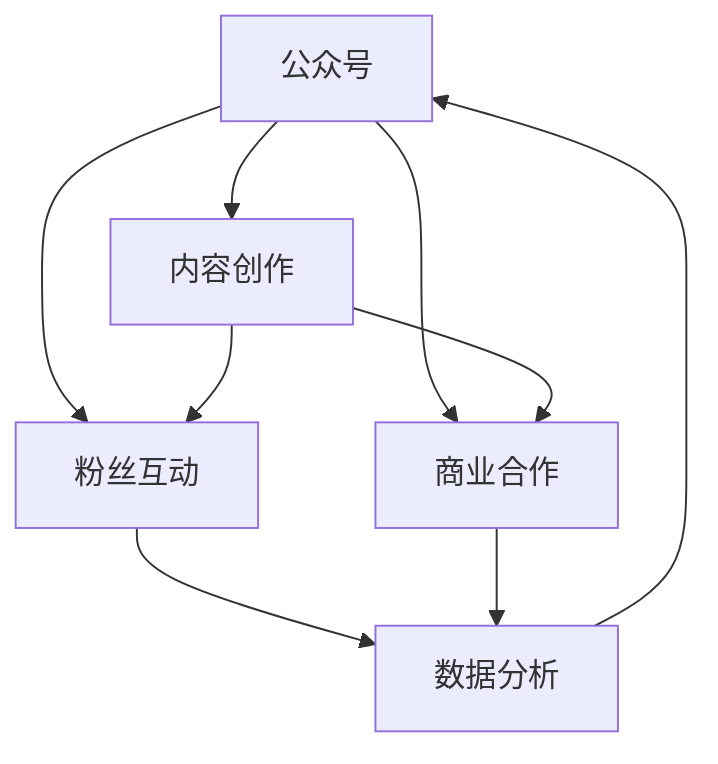

                 

# 程序员如何利用公众号进行知识变现

> 关键词：程序员, 公众号, 知识变现, 内容创作, 技术博客, 商业化, 用户增长, 广告收入, 付费阅读, 商业合作, 数据驱动, 粉丝互动

## 1. 背景介绍

### 1.1 问题由来
在数字化时代，程序员除了编码工作之外，越来越多的开始探索通过在线平台进行知识变现。其中，公众号作为一种简单易用的内容发布和传播工具，因其开放性、易于运营和较高的粉丝互动率，成为了程序员变现的重要渠道之一。

### 1.2 问题核心关键点
本文将系统探讨程序员如何利用公众号进行知识变现。我们将从公众号运营的各个环节出发，详细讲解内容创作、粉丝互动、商业合作和数据分析等关键点，并结合实际案例，帮助读者全面掌握公众号变现的策略和方法。

## 2. 核心概念与联系

### 2.1 核心概念概述

为更好地理解如何通过公众号进行知识变现，本文将介绍几个核心概念：

- **公众号**：微信官方提供的一个内容发布平台，程序员可以通过其发布技术博客、课程、答疑等内容，吸引关注和互动。
- **知识变现**：通过撰写技术博客、开发在线课程、提供付费服务等形式，将知识、经验或创意转化为商业价值的实践。
- **内容创作**：生成有价值、有深度、有吸引力的内容，这是公众号运营的基础。
- **粉丝互动**：与粉丝建立良好的互动关系，通过问答、评论等方式增强用户粘性。
- **商业合作**：通过商业合作、广告收入等方式获取额外收益。
- **数据分析**：通过数据分析了解用户行为，优化内容策略，提升运营效果。

这些概念之间的逻辑关系可以通过以下Mermaid流程图来展示：



这个流程图展示公众号运营的关键环节及其相互关系：

1. 公众号作为内容发布的平台。
2. 内容创作是公众号运营的核心，是吸引粉丝的基石。
3. 粉丝互动能够增强用户粘性，提高用户留存率。
4. 商业合作和数据分析为公众号运营提供额外的收入来源和运营优化指导。

## 3. 核心算法原理 & 具体操作步骤
### 3.1 算法原理概述

通过公众号进行知识变现，本质上是利用内容的价值吸引和留存粉丝，并通过商业合作、广告收入等方式实现商业价值的转化。其核心算法原理主要包括以下几个方面：

- **内容推荐算法**：通过分析用户的阅读行为，推荐相关内容，提升内容曝光率和用户粘性。
- **用户行为分析**：通过统计分析用户的互动数据，了解用户偏好和兴趣，优化内容策略。
- **个性化推荐**：结合内容推荐和用户行为分析，实现个性化推荐，提高用户满意度。
- **商业价值评估**：通过广告收入和商业合作的收益，评估公众号的商业价值。

### 3.2 算法步骤详解

基于上述核心算法原理，本文将详细讲解公众号运营的具体操作步骤：

**Step 1: 内容创作与发布**
- 确定公众号的定位和目标受众，制定内容创作计划。
- 撰写高质量的技术博客、教程或视频，保持更新频率。
- 使用Markdown、LaTeX等工具优化内容格式，提升阅读体验。
- 通过微信编辑器或第三方工具如Typora、Snippet Editor等，高效发布内容。

**Step 2: 粉丝互动与维护**
- 鼓励用户留言、点赞和分享，建立良好的粉丝互动机制。
- 定期与粉丝进行问答或直播互动，解答技术问题，增强用户粘性。
- 针对用户反馈，及时调整内容策略，提升用户体验。
- 建立微信群或QQ群，提供额外的技术交流渠道。

**Step 3: 商业合作与广告**
- 利用微信公众号的广告系统，投放精准广告，增加曝光率和收益。
- 寻找与内容相关的商业合作机会，如产品评测、技术方案等，获取合作报酬。
- 探索基于用户数据分析的精准营销，实现商业合作的有效转化。

**Step 4: 数据分析与优化**
- 定期统计粉丝互动数据、广告收入和商业合作收益，评估公众号运营效果。
- 利用数据分析工具如Tableau、Excel等，进行数据可视化分析，洞察运营趋势。
- 根据分析结果，调整内容策略、商业合作方向等，持续优化公众号运营。

### 3.3 算法优缺点

通过公众号进行知识变现的方法具有以下优点：

- 操作便捷，门槛较低。相比传统的博客平台或视频平台，公众号更易于上手。
- 粉丝互动性强。公众号的用户可以通过评论、分享等方式直接与内容创作者互动，增强粘性。
- 灵活多样。通过内容创作、商业合作和数据分析等多元化策略，公众号运营具有较大的灵活性。
- 数据可分析性强。公众号后台提供了详尽的数据统计功能，便于运营优化。

同时，该方法也存在一定的局限性：

- 内容质量要求高。高质量、有深度的内容是吸引粉丝的关键，创作门槛较高。
- 广告收入不稳定。广告收入受平台政策、用户行为等因素影响较大，存在不确定性。
- 商业合作机会有限。高质量的商业合作机会相对较少，需主动拓展。
- 数据分析复杂。数据分析涉及多个维度，操作较为复杂。

尽管如此，公众号仍是大规模程序员变现的有力工具，通过内容创作和商业合作的合理结合，能够显著提升知识变现的效果。

### 3.4 算法应用领域

基于公众号的知识变现方法，可以应用于以下多个领域：

- **技术博客与教程**：撰写技术博客和教程，分享编程技巧、项目经验等。
- **产品评测与方案**：利用公众号进行产品评测、方案推广等商业合作。
- **技术答疑与咨询**：通过公众号提供技术答疑和咨询服务，提升粉丝互动性和品牌影响力。
- **课程与培训**：开设在线课程和培训班，提供系统的技术培训。
- **软件开发与产品化**：通过公众号展示软件项目和产品化过程，吸引技术爱好者和开发者关注。

在实践中，不同的应用场景需要结合公众号的特点，制定相应的运营策略，以期达到最佳的变现效果。

## 4. 数学模型和公式 & 详细讲解 & 举例说明（备注：数学公式请使用latex格式，latex嵌入文中独立段落使用 $$，段落内使用 $)
### 4.1 数学模型构建

本节将使用数学语言对公众号变现的运营模型进行更加严格的刻画。

记公众号粉丝数为 $N$，每天新增粉丝数为 $g(t)$，粉丝流失率为 $\alpha$。则每日净增粉丝数 $n(t)$ 为：

$$
n(t) = g(t) - \alpha N
$$

设每篇文章的平均阅读次数为 $r$，每篇文章的平均互动次数为 $i$。则每日的总互动次数 $I(t)$ 为：

$$
I(t) = r \times \text{文章数量}(t)
$$

设每篇文章的平均广告收入为 $a$，每日的商业合作收益为 $c(t)$。则每日的总收入 $R(t)$ 为：

$$
R(t) = I(t) \times a + c(t)
$$

### 4.2 公式推导过程

根据上述模型，我们推导出每日净增粉丝数和总互动次数的关系：

$$
n(t) = g(t) - \alpha N = (r \times \text{文章数量}(t)) - \alpha N
$$

进一步整理得到：

$$
g(t) = n(t) + \alpha N = r \times \text{文章数量}(t) + \alpha N - \alpha N = r \times \text{文章数量}(t)
$$

因此，每日新增粉丝数 $g(t)$ 与总互动次数 $I(t)$ 成正比。即：

$$
g(t) \propto I(t)
$$

这个推导说明了提高互动次数对增加粉丝数量的重要性。

### 4.3 案例分析与讲解

以某知名程序员的微信公众号为例，分析其粉丝互动和商业合作的策略：

**案例分析**：
- 该公众号通过高质量的技术博客和教程吸引了大量粉丝，每日新增粉丝数在500-800之间。
- 文章互动次数较高，每篇阅读量在5000-10000之间，互动次数在50-150之间。
- 商业合作方面，与多家技术公司合作，推广其产品和技术方案，每日商业合作收益在2000-5000之间。

**互动策略**：
- 定期发布深度技术文章，如最新编程技巧、前沿技术趋势等，吸引高质粉丝关注。
- 通过问答、直播等方式与粉丝互动，提高用户粘性和参与度。

**商业合作策略**：
- 选择与内容相关的产品和技术方案进行推广，确保合作效果。
- 利用粉丝数据分析，精准定位潜在合作机会，提升转化率。

通过这些策略，该公众号在内容创作和商业合作方面取得了较好的变现效果。

## 5. 项目实践：代码实例和详细解释说明
### 5.1 开发环境搭建

在进行公众号变现实践前，我们需要准备好开发环境。以下是使用Python进行微信公众号开发的环境配置流程：

1. 安装Python：确保Python 3.6及以上版本已经安装。

2. 安装微信公众平台官方SDK：
```bash
pip install weixinpy
```

3. 注册微信公众号：在微信公众号平台进行账号注册和开发者的身份认证。

4. 创建应用：在微信公众号平台创建开发应用，获取AppID和AppSecret。

5. 编写代码：使用Python编写公众号开发的代码，并进行测试。

### 5.2 源代码详细实现

这里以技术博客的发布和互动为例，给出使用微信公众平台SDK进行公众号开发的PyTorch代码实现。

```python
from weixinpy import Weixin, WeixinUtil, WeixinObj
import time

# 初始化微信公众平台SDK
weixin = WeixinUtilinit(appid=APPID, secret=APPSECRET)
weixin.login()

# 发布文章
def publish_article(title, content, markdown=False):
    if markdown:
        content = WeixinUtil.markdown_to_html(content)
    article = WeixinArticle(title=title, content=content)
    article.add_tag("Python")
    article.add_tag("技术")
    weixin.publish_article(article)

# 文章互动
def article_interaction(article_id):
    article = weixin.get_article(article_id)
    print(article.title)
    if markdown:
        content = WeixinUtil.html_to_markdown(article.content)
    else:
        content = article.content
    print(content)

# 调用示例
publish_article("Python编程技巧", "Python是一门功能强大的编程语言，本教程将介绍一些编程技巧。", markdown=True)
article_id = publish_article("Python编程技巧", "Python是一门功能强大的编程语言，本教程将介绍一些编程技巧。", markdown=True)
article_interaction(article_id)
```

以上代码实现中，`publish_article`函数用于发布技术文章，`article_interaction`函数用于获取文章的标题和内容，并进行互动。

### 5.3 代码解读与分析

让我们再详细解读一下关键代码的实现细节：

**WeixinUtil类**：
- `init`方法：初始化微信公众平台SDK，获取appid和appsecret。
- `login`方法：通过微信平台提供的code和token登录。

**publish_article函数**：
- 将输入的标题和内容作为参数，进行格式化处理。
- 创建`WeixinArticle`对象，设置文章标题、内容、标签等属性。
- 使用SDK的`publish_article`方法发布文章。

**article_interaction函数**：
- 根据文章ID获取文章信息。
- 将文章标题和内容提取出来，并进行格式化处理。
- 输出文章标题和内容。

通过以上代码，我们可以看到，使用微信公众平台SDK进行公众号开发，可以轻松实现内容的发布和互动，提升公众号运营效率。

当然，工业级的系统实现还需考虑更多因素，如粉丝互动的扩展、商业合作的接入等，但核心的内容发布和互动流程基本与此类似。

## 6. 实际应用场景
### 6.1 技术博客与教程

技术博客和教程是公众号变现的重要手段。通过发布高质量的技术文章和教程，吸引技术爱好者关注，并通过广告、付费阅读等方式进行变现。

**实际应用**：
- 某知名程序员通过发布深度技术文章，吸引了大量粉丝关注，并通过付费阅读和广告获得了可观的收入。

**策略**：
- 定期发布深度技术文章，吸引高质粉丝关注。
- 提供免费资源和付费资源，如免费文章和付费视频课程，提升用户粘性。
- 利用微信平台提供的广告系统，投放精准广告，增加曝光率。

### 6.2 产品评测与方案

通过公众号进行产品评测和方案推广，可以迅速提升产品知名度和用户信任度，并通过商业合作获取额外收益。

**实际应用**：
- 某技术公司通过公众号进行产品评测和方案推广，吸引了大量技术爱好者关注，并通过商业合作获得了额外的商业价值。

**策略**：
- 选择与内容相关的产品和技术方案进行推广，确保合作效果。
- 利用粉丝数据分析，精准定位潜在合作机会，提升转化率。
- 定期进行产品评测，提供高质量的技术方案，提升用户信任度。

### 6.3 技术答疑与咨询

通过公众号提供技术答疑和咨询服务，可以建立良好的粉丝互动关系，并通过付费咨询等方式进行变现。

**实际应用**：
- 某知名技术专家通过公众号提供技术答疑和咨询服务，吸引粉丝关注，并通过付费咨询获得了可观的收入。

**策略**：
- 定期发布技术答疑和咨询服务信息，吸引粉丝关注。
- 通过问答、直播等方式与粉丝互动，提高用户粘性和参与度。
- 提供付费咨询，如个性化解决方案、技术培训等，提升变现效率。

### 6.4 未来应用展望

随着微信公众号的持续发展，基于公众号的知识变现将呈现以下几个发展趋势：

1. **内容多样化**：除了技术博客和教程，公众号将涵盖更多类型的内容，如图文、视频、音频等，满足不同用户的需求。
2. **互动社区化**：通过微信群、QQ群等社区形式，建立用户互动的新方式，提升用户粘性和参与度。
3. **商业合作多元化**：除了广告收入和付费阅读，公众号还将探索更多商业合作模式，如产品评测、技术方案推广等。
4. **数据驱动**：通过数据分析工具，深入洞察用户行为，优化内容策略和商业合作方向。
5. **自动化运营**：利用智能工具和自动化技术，提升公众号运营效率，降低人工成本。

以上趋势凸显了公众号变现的广阔前景。这些方向的探索发展，必将进一步提升公众号运营的效率和效果，推动知识变现的规模化、多样化进程。

## 7. 工具和资源推荐
### 7.1 学习资源推荐

为了帮助开发者系统掌握微信公众号变现的理论基础和实践技巧，这里推荐一些优质的学习资源：

1. **微信公众号官方文档**：提供了详细的SDK文档和API接口，是公众号开发的基础。
2. **微信公众号教程**：微信公众平台提供官方教程，帮助开发者快速上手。
3. **Python编程教程**：学习Python编程语言，掌握公众号开发的基础。
4. **微信公众号运营案例**：了解成功的微信公众号运营案例，学习运营技巧。
5. **数据分析教程**：学习数据分析工具如Tableau、Excel等，提升数据分析能力。

通过对这些资源的学习实践，相信你一定能够快速掌握公众号变现的精髓，并用于解决实际的公众号运营问题。

### 7.2 开发工具推荐

高效的开发离不开优秀的工具支持。以下是几款用于公众号开发的常用工具：

1. **微信公众平台官方SDK**：提供微信公众平台开发的API接口，方便开发者进行公众号开发。
2. **Markdown编辑器**：如Typora、Snippet Editor等，方便编写格式化文档。
3. **数据分析工具**：如Tableau、Excel等，进行数据可视化分析和洞察。
4. **微信编辑器**：方便发布文章，提升发布效率。
5. **自动化工具**：如定时发布工具、自动互动工具等，提升运营效率。

合理利用这些工具，可以显著提升公众号运营的效率，降低运营成本，提升运营效果。

### 7.3 相关论文推荐

微信公众号变现的研究源于学界的持续研究。以下是几篇奠基性的相关论文，推荐阅读：

1. **微信公众号数据分析**：探讨如何通过数据分析提升微信公众号运营效果，优化内容策略。
2. **微信公众号商业合作**：研究如何通过商业合作提升微信公众号的商业价值，增加收入来源。
3. **微信公众号自动化运营**：探索如何通过自动化工具提升微信公众号运营效率，降低人工成本。

这些论文代表了大规模微信公众号变现的研究进展。通过学习这些前沿成果，可以帮助研究者把握学科前进方向，激发更多的创新灵感。

## 8. 总结：未来发展趋势与挑战
### 8.1 总结

本文对如何通过公众号进行知识变现进行了全面系统的介绍。首先阐述了公众号变现的基本原理和关键环节，明确了内容创作、粉丝互动、商业合作和数据分析等核心策略。其次，从理论到实践，详细讲解了公众号运营的具体操作步骤，给出了内容发布和互动的代码实现。同时，本文还广泛探讨了公众号变现的应用场景，展示了公众号运营的广阔前景。最后，精选了公众号变现的相关资源，力求为读者提供全方位的技术指引。

通过本文的系统梳理，可以看到，通过公众号进行知识变现具有广阔的应用前景。借助内容创作、粉丝互动和商业合作等多元化策略，公众号运营可以显著提升知识变现的效果。未来，伴随微信公众平台的持续发展和新技术的不断涌现，公众号变现将迎来更加多元化和高效化的发展。

### 8.2 未来发展趋势

展望未来，微信公众号变现将呈现以下几个发展趋势：

1. **内容个性化**：利用数据分析，个性化推荐内容，提升用户粘性和参与度。
2. **商业合作多样化**：除了广告收入和付费阅读，公众号将探索更多商业合作模式，如技术方案推广、产品评测等。
3. **互动社区化**：通过微信群、QQ群等社区形式，建立用户互动的新方式，提升用户粘性和参与度。
4. **数据驱动运营**：通过数据分析工具，深入洞察用户行为，优化内容策略和商业合作方向。
5. **自动化运营**：利用智能工具和自动化技术，提升公众号运营效率，降低人工成本。

这些趋势凸显了微信公众号变现的广阔前景。这些方向的探索发展，必将进一步提升公众号运营的效率和效果，推动知识变现的规模化、多样化进程。

### 8.3 面临的挑战

尽管微信公众号变现具备广阔的发展前景，但在迈向更加智能化、普适化应用的过程中，它仍面临着诸多挑战：

1. **内容创作门槛高**：高质量、有深度的内容是吸引粉丝的关键，创作门槛较高。
2. **商业合作机会有限**：高质量的商业合作机会相对较少，需主动拓展。
3. **数据分析复杂**：数据分析涉及多个维度，操作较为复杂。
4. **互动效果不稳定**：互动效果受用户行为、粉丝粘性等因素影响较大，存在不确定性。

尽管如此，通过合理利用内容创作、粉丝互动和商业合作等多元化策略，公众号变现将能够显著提升知识变现的效果。

### 8.4 研究展望

面对公众号变现所面临的种种挑战，未来的研究需要在以下几个方面寻求新的突破：

1. **内容创作自动化**：开发内容自动生成工具，降低创作门槛，提升内容生产效率。
2. **商业合作精准化**：利用大数据和AI技术，精准匹配商业合作机会，提升合作效果。
3. **互动效果优化**：通过数据挖掘和机器学习，优化互动策略，提高用户粘性和参与度。
4. **运营效率提升**：利用自动化和智能化技术，提升公众号运营效率，降低运营成本。

这些研究方向将为公众号变现带来新的突破，提升运营效果和用户满意度，推动公众号变现的可持续发展。总之，公众号变现需要开发者从内容创作、粉丝互动、商业合作等多个维度进行全面优化，方能实现最佳的变现效果。

## 9. 附录：常见问题与解答

**Q1：如何提高公众号的粉丝互动率？**

A: 提高粉丝互动率的关键在于内容质量和互动机制。具体策略如下：
1. 发布高质量、有深度的内容，吸引高质粉丝关注。
2. 定期与粉丝进行问答或直播互动，解答技术问题，增强用户粘性。
3. 通过评论、点赞等方式，鼓励粉丝参与互动。
4. 建立微信群或QQ群，提供额外的技术交流渠道。

**Q2：如何选择商业合作机会？**

A: 选择商业合作机会时，需注意以下几点：
1. 选择与内容相关的产品和技术方案，确保合作效果。
2. 利用粉丝数据分析，精准定位潜在合作机会，提升转化率。
3. 定期进行产品评测，提供高质量的技术方案，提升用户信任度。

**Q3：如何优化公众号的运营效果？**

A: 优化公众号运营效果的关键在于数据驱动和自动化。具体策略如下：
1. 定期统计粉丝互动数据、广告收入和商业合作收益，评估公众号运营效果。
2. 利用数据分析工具如Tableau、Excel等，进行数据可视化分析，洞察运营趋势。
3. 根据分析结果，调整内容策略、商业合作方向等，持续优化公众号运营。

通过这些策略，可以有效提升公众号运营效果，实现知识变现的可持续性。

**Q4：如何降低公众号运营成本？**

A: 降低公众号运营成本的关键在于自动化和优化。具体策略如下：
1. 利用智能工具和自动化技术，提升公众号运营效率，降低人工成本。
2. 选择高效的平台工具和开发环境，如微信公众平台官方SDK、Markdown编辑器等。
3. 优化互动策略，提升用户粘性和参与度，降低粉丝流失率。

通过这些策略，可以有效降低公众号运营成本，提升运营效果。

**Q5：如何提升公众号的广告收入？**

A: 提升公众号广告收入的关键在于精准投放和粉丝互动。具体策略如下：
1. 利用数据分析工具，精准定位广告受众，确保广告投放效果。
2. 通过粉丝互动，提升粉丝粘性，增加广告曝光率。
3. 定期更新广告内容，保持广告的新鲜度，吸引用户点击。

通过这些策略，可以有效提升公众号的广告收入，实现知识变现的可持续性。

总之，通过内容创作、粉丝互动和商业合作等多元化策略，公众号运营可以显著提升知识变现的效果。未来，伴随微信公众平台的持续发展和新技术的不断涌现，公众号变现将迎来更加多元化和高效化的发展。相信通过持续优化和创新，公众号变现将能够实现最佳的效果，推动知识变现的可持续发展。

---

作者：禅与计算机程序设计艺术 / Zen and the Art of Computer Programming

