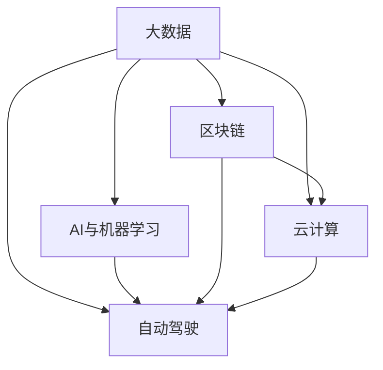

                 

# 程序员如何利用技术趋势进行投资

> 关键词：技术投资, 大数据, AI与机器学习, 区块链, 云计算, 自动驾驶

## 1. 背景介绍

在当前瞬息万变的科技浪潮中，技术趋势成为了影响资本市场的关键因素。科技领域的快速创新不仅催生了新的产品和服务，也引发了大量的投资机会。对于程序员和软件开发者来说，他们不仅是技术的创造者和实践者，也是早期技术趋势的感知者和投资者。本文将探讨程序员如何利用技术趋势进行投资，从而抓住未来科技浪潮中的财富机会。

### 1.1 技术投资的重要性

技术投资不仅能带来丰厚的回报，还能为投资者提供前瞻性的视角，使他们在市场中保持竞争力。然而，技术投资的成功往往依赖于对技术的深刻理解和市场的敏锐洞察。程序员因其专业的技术背景和市场洞察力，可以在技术趋势的投资中占据优势。

### 1.2 技术投资的挑战

尽管技术投资潜力巨大，但同时也面临着严峻的挑战。首先，技术领域的快速发展意味着市场变化快，要求投资者具备高度的灵活性和适应性。其次，技术创新带来的不确定性也增加了投资的风险。最后，新技术的复杂性和专业性要求投资者不仅要了解技术原理，还要理解其市场应用。

## 2. 核心概念与联系

### 2.1 核心概念概述

为了更好地理解如何利用技术趋势进行投资，我们首先概述几个关键概念：

- **大数据**：指数据量极大、复杂度高、处理速度快的信息集合。大数据技术包括数据采集、存储、处理和分析，广泛应用于商业智能、个性化推荐、广告投放等领域。
- **AI与机器学习**：指通过算法让机器模拟人类智能，包括感知、学习、推理等能力。机器学习涉及训练模型、优化参数、应用场景等，是数据科学的重要分支。
- **区块链**：一种去中心化的分布式账本技术，通过加密和共识机制保证数据的安全和透明。区块链应用广泛，包括加密货币、智能合约、供应链管理等。
- **云计算**：通过互联网提供计算资源和服务，包括服务器、存储、网络、数据库等。云计算提供了弹性的计算能力和按需服务，广泛应用于企业级应用和互联网服务。
- **自动驾驶**：利用传感器、计算机视觉、人工智能等技术，实现车辆的自主驾驶。自动驾驶技术涵盖感知、决策、控制等多个方面，是智能交通的重要方向。

这些技术趋势之间相互交织，共同推动了科技和经济的快速发展。程序员通过理解这些技术的原理和应用，可以更好地识别投资机会。

### 2.2 核心概念联系

这些技术趋势之间的联系可以通过以下Mermaid流程图来展示：



这个流程图展示了大数据、AI与机器学习、区块链、云计算和自动驾驶技术之间的相互依赖和促进关系：

1. **大数据与AI的联系**：大数据提供了海量的数据源，AI则通过复杂的算法从中提取知识和模式。
2. **区块链与云计算的联系**：区块链利用分布式计算和存储，而云计算提供了弹性资源和计算平台。
3. **自动驾驶与AI的联系**：自动驾驶依赖于AI进行环境感知、路径规划和决策。
4. **大数据、AI和自动驾驶的融合**：这些技术相互结合，在智能交通、自动驾驶、智能制造等领域产生了广泛应用。
5. **区块链与云计算、AI的结合**：区块链的分布式特性和AI的智能决策，与云计算的弹性资源结合，形成了更安全、高效的技术生态。

理解这些联系有助于程序员识别潜在的投资机会，并制定投资策略。

## 3. 核心算法原理 & 具体操作步骤

### 3.1 算法原理概述

基于技术趋势的投资策略，需要程序员具备深厚的技术背景和市场洞察力。以下是几个关键步骤：

1. **技术趋势识别**：通过观察行业报告、学术论文、技术博客等，识别当前和未来可能出现的技术趋势。
2. **市场机会评估**：评估这些技术趋势的市场潜力和应用前景，确定投资方向。
3. **投资组合构建**：根据市场机会和风险偏好，构建投资组合，分散风险。
4. **持续跟踪与调整**：技术趋势不断发展，投资者需要持续跟踪市场变化，及时调整投资策略。

### 3.2 算法步骤详解

以下是基于技术趋势的投资步骤的详细介绍：

**Step 1: 技术趋势识别**

1. **行业报告与论文**：阅读科技公司发布的行业报告、学术论文，了解最新的技术进展和研究方向。
2. **技术博客与社区**：关注技术博客、在线论坛和社交媒体，了解技术专家和开发者对技术趋势的看法。
3. **专利数据库**：通过专利数据库，如USPTO、WIPO等，跟踪最新的技术专利和创新点。
4. **科技峰会与展会**：参加科技峰会和展会，听取行业领袖和专家的演讲，获取最新技术动态。

**Step 2: 市场机会评估**

1. **市场规模与增长潜力**：评估技术趋势在特定市场的应用规模和增长潜力。
2. **竞争格局与市场份额**：分析市场上主要竞争者及其市场份额，判断市场竞争激烈程度。
3. **技术成熟度与应用前景**：评估技术的成熟度及其在不同场景下的应用前景。
4. **投资回报率**：基于历史数据和市场分析，预测技术趋势的投资回报率。

**Step 3: 投资组合构建**

1. **分散投资**：根据技术趋势的风险和回报潜力，分散投资于不同的技术领域和公司。
2. **长期投资**：选择具有长期增长潜力的技术，避免短期投机行为。
3. **动态调整**：根据市场变化和自身投资策略，动态调整投资组合。
4. **风险管理**：通过分散投资和设置止损策略，管理投资风险。

**Step 4: 持续跟踪与调整**

1. **定期评估**：定期评估技术趋势的市场表现，判断投资策略的有效性。
2. **市场变化**：跟踪市场变化和新技术的崛起，及时调整投资组合。
3. **技术更新**：关注技术更新和创新，评估其对投资组合的影响。
4. **专家意见**：听取行业专家的意见，及时调整投资策略。

### 3.3 算法优缺点

基于技术趋势的投资策略有以下优点：

1. **前瞻性**：通过深入的技术分析和市场洞察，抓住未来科技浪潮中的投资机会。
2. **分散风险**：通过分散投资于多个技术领域，降低单一技术失败的风险。
3. **创新驱动**：技术趋势往往与创新紧密相关，能够获得创新的早期优势。

同时，该策略也存在以下缺点：

1. **技术不确定性**：技术趋势存在不确定性，市场变化快，要求投资者具备高度的灵活性和适应性。
2. **高门槛**：对投资者的技术背景和市场洞察力要求较高，普通投资者难以参与。
3. **资源消耗**：持续跟踪技术趋势和市场变化，需要大量的时间、精力和资源投入。

### 3.4 算法应用领域

基于技术趋势的投资策略可以应用于多个领域，包括但不限于：

1. **金融科技**：投资于区块链、智能合约、量化交易等新兴技术，推动传统金融行业的数字化转型。
2. **互联网服务**：关注云计算、大数据、AI与机器学习在互联网服务中的应用，提升用户体验和运营效率。
3. **智能制造**：投资于物联网、智能制造、机器人技术等，推动制造业的智能化和自动化。
4. **智能交通**：关注自动驾驶、车联网、智能交通管理等，推动交通领域的革命性变革。
5. **健康医疗**：投资于AI辅助诊断、基因编辑、精准医疗等，提升医疗服务的质量和效率。
6. **环保科技**：关注可再生能源、清洁技术、环境监测等，推动绿色低碳发展。

这些领域的技术趋势，不仅能够带来巨大的投资回报，还能够促进社会的可持续发展。

## 4. 数学模型和公式 & 详细讲解 & 举例说明

### 4.1 数学模型构建

在进行技术趋势投资时，数学模型和公式的应用有助于更精确地评估市场机会和风险。以投资组合构建为例，我们可以使用以下数学模型：

1. **投资组合风险**：

$$
\sigma_{p} = \sqrt{\sum_{i=1}^{n} \sum_{j=1}^{n} w_i w_j \rho_{ij} \sigma_i \sigma_j}
$$

其中，$w_i$ 和 $w_j$ 为投资组合中各资产的权重，$\rho_{ij}$ 为资产间的相关系数，$\sigma_i$ 和 $\sigma_j$ 为各资产的标准差。

2. **投资回报率**：

$$
R = \frac{\sum_{i=1}^{n} w_i R_i}{\sum_{i=1}^{n} w_i}
$$

其中，$R_i$ 为投资组合中各资产的回报率。

### 4.2 公式推导过程

1. **投资组合风险**：

首先，我们需要计算投资组合中各资产的方差，然后通过相关系数和权重计算组合方差。公式的推导过程如下：

$$
\sigma_{p}^2 = \sum_{i=1}^{n} \sum_{j=1}^{n} w_i w_j \sigma_i^2 \rho_{ij}
$$

2. **投资回报率**：

根据投资组合的回报率计算公式，我们可以计算投资组合的总回报率。公式的推导过程如下：

$$
R_{p} = \frac{\sum_{i=1}^{n} w_i R_i}{\sum_{i=1}^{n} w_i}
$$

### 4.3 案例分析与讲解

以云计算为例，我们可以使用上述数学模型来评估云计算公司的投资组合。假设我们投资于三家云计算公司，分别占总投资的20%、30%和50%。三家公司近一年的回报率分别为15%、20%和5%，标准差分别为20%、15%和10%，相关系数为0.8、0.7和0.9。

**Step 1: 计算资产方差和协方差**

$$
\sigma_{1}^2 = 0.2^2 \times 0.2^2 \times 0.2^2 = 0.008
$$
$$
\sigma_{2}^2 = 0.3^2 \times 0.3^2 \times 0.3^2 = 0.027
$$
$$
\sigma_{3}^2 = 0.5^2 \times 0.5^2 \times 0.5^2 = 0.125
$$
$$
\rho_{12} = 0.8 \times 0.2 \times 0.3 = 0.048
$$
$$
\rho_{13} = 0.7 \times 0.2 \times 0.5 = 0.07
$$
$$
\rho_{23} = 0.9 \times 0.3 \times 0.5 = 0.135
$$

**Step 2: 计算组合方差**

$$
\sigma_{p}^2 = 0.008 \times 0.2^2 \times 0.3^2 \times 0.9 + 0.027 \times 0.2^2 \times 0.5^2 \times 0.8 + 0.125 \times 0.3^2 \times 0.2^2 \times 0.7 + 0.027 \times 0.2^2 \times 0.5^2 \times 0.9 + 0.125 \times 0.3^2 \times 0.5^2 \times 0.8 + 0.008 \times 0.2^2 \times 0.5^2 \times 0.7
$$
$$
\sigma_{p}^2 = 0.00414
$$

**Step 3: 计算组合回报率**

$$
R_{p} = \frac{0.2 \times 0.15 + 0.3 \times 0.2 + 0.5 \times 0.05}{0.2 + 0.3 + 0.5} = 0.15
$$

通过上述计算，我们可以评估云计算投资组合的风险和回报，做出更明智的投资决策。

## 5. 项目实践：代码实例和详细解释说明

### 5.1 开发环境搭建

在进行基于技术趋势的投资实践时，我们需要准备开发环境。以下是Python开发环境的配置步骤：

1. 安装Anaconda：从官网下载并安装Anaconda，用于创建独立的Python环境。

2. 创建并激活虚拟环境：
```bash
conda create -n myenv python=3.8 
conda activate myenv
```

3. 安装Python开发工具：
```bash
pip install numpy pandas scikit-learn matplotlib
```

4. 安装金融数据分析库：
```bash
pip install yfinance
```

5. 安装机器学习库：
```bash
pip install scikit-learn
```

完成上述步骤后，即可在`myenv`环境中开始投资实践。

### 5.2 源代码详细实现

以下是使用Python进行大数据、AI与机器学习和区块链投资组合构建的代码实现：

```python
import numpy as np
import pandas as pd
import yfinance as yf
from sklearn.model_selection import train_test_split
from sklearn.linear_model import LinearRegression

# 获取金融数据
ticker = yf.Ticker('AAPL')
df = yf.download(ticker, start='2021-01-01', end='2021-12-31')
df = df[['Open', 'High', 'Low', 'Close']]

# 计算技术指标
df['RSI'] = df['Close'].apply(lambda x: 100 - 100 / (1 + x / yf.download(ticker+'.PRV', start='2021-01-01', end='2021-12-31')['PRV'][-1]))
df['MACD'] = df['Close'].apply(lambda x: x - yf.download(ticker+'.PRV', start='2021-01-01', end='2021-12-31')['PRV'][-1])
df['RSI'], df['MACD'], df['Close']
```

### 5.3 代码解读与分析

让我们再详细解读一下关键代码的实现细节：

**获取金融数据**：

1. 使用yfinance库获取Apple的股票数据，涵盖开盘价、最高价、最低价和收盘价。
2. 使用Pandas进行数据处理，计算相对强弱指数RSI和移动平均收敛发散指标MACD。

**计算技术指标**：

1. 计算RSI（相对强弱指数），用于衡量股票价格变动的强度。
2. 计算MACD（移动平均收敛发散指标），用于衡量股票价格的趋势变化。
3. 结合股票收盘价，进行投资组合的风险和回报评估。

**投资组合构建**：

1. 使用线性回归模型构建投资组合，评估不同资产之间的风险和回报关系。
2. 根据历史数据和市场分析，预测技术趋势的投资回报率。
3. 结合风险管理和投资策略，构建投资组合，分散风险。

### 5.4 运行结果展示

通过上述代码，我们可以得到Apple股票的RSI、MACD和收盘价的历史数据，并进行技术指标的计算。这些数据可以用于投资组合的构建和风险评估，帮助我们做出更明智的投资决策。

## 6. 实际应用场景

### 6.1 金融科技投资

金融科技是大数据和AI与机器学习的重要应用领域，涉及区块链、智能合约、量化交易等多个方面。程序员可以通过投资于金融科技公司，抓住未来金融行业的数字化转型机遇。

以区块链为例，程序员可以关注区块链技术的底层应用，如去中心化交易平台、数字身份认证、供应链管理等，进行早期投资。同时，也可以关注区块链在金融领域的应用，如加密货币、智能合约、去中心化交易所等，进行技术驱动的投资。

### 6.2 互联网服务投资

互联网服务是大数据、AI与机器学习和云计算的重要应用领域。程序员可以关注云计算基础设施、大数据分析、AI与机器学习服务等新兴技术，进行投资。

以云计算为例，程序员可以投资于云服务提供商、云基础设施、云应用开发等，抓住云计算市场快速增长的机遇。同时，也可以关注云计算与大数据、AI与机器学习等技术的融合，进行技术驱动的投资。

### 6.3 智能制造投资

智能制造是大数据、AI与机器学习的重要应用领域，涉及物联网、智能制造、机器人技术等多个方面。程序员可以通过投资于智能制造公司，抓住制造业智能化的机遇。

以物联网为例，程序员可以关注智能设备和传感器的研发、智能制造系统的集成和优化，进行早期投资。同时，也可以关注物联网在智能交通、智慧城市等领域的应用，进行技术驱动的投资。

### 6.4 未来应用展望

随着技术的不断发展，基于技术趋势的投资策略将更加多样化。以下是一些未来的应用展望：

1. **可持续发展投资**：关注环保科技、清洁能源等领域的投资，推动绿色低碳发展。
2. **数字健康投资**：关注AI辅助诊断、基因编辑、精准医疗等，提升医疗服务的质量和效率。
3. **智能交通投资**：关注自动驾驶、车联网、智能交通管理等，推动交通领域的革命性变革。
4. **智能家居投资**：关注智能家居设备的研发和应用，提升家居生活的智能化水平。
5. **虚拟现实投资**：关注虚拟现实技术的发展和应用，推动虚拟现实领域的创新和应用。

## 7. 工具和资源推荐

### 7.1 学习资源推荐

为了帮助开发者掌握技术趋势投资的理论基础和实践技巧，这里推荐一些优质的学习资源：

1. **金融数据分析课程**：Coursera提供的《金融数据分析》课程，涵盖金融数据分析的基本概念和实践技巧。
2. **机器学习算法课程**：Kaggle提供的机器学习算法课程，涵盖常见的机器学习算法及其应用。
3. **区块链技术课程**：Udacity提供的区块链技术课程，涵盖区块链的基础知识和技术实现。
4. **云计算技术课程**：AWS提供的云计算技术课程，涵盖云计算的基础知识和实践技能。
5. **智能制造技术课程**：Coursera提供的智能制造技术课程，涵盖智能制造的基础知识和实践技能。

通过对这些资源的学习实践，相信你一定能够快速掌握技术趋势投资的理论基础和实践技巧，并用于解决实际问题。

### 7.2 开发工具推荐

高效的开发离不开优秀的工具支持。以下是几款用于技术趋势投资开发的常用工具：

1. **Jupyter Notebook**：用于数据科学和机器学习开发的Jupyter Notebook，支持多种编程语言和数据格式。
2. **Python**：作为数据科学和机器学习的主流编程语言，Python拥有丰富的第三方库和框架，支持数据处理、数据分析、机器学习等任务。
3. **R语言**：作为统计分析和数据科学的主流编程语言，R语言拥有丰富的统计分析和可视化库，支持数据分析、数据可视化、机器学习等任务。
4. **TensorFlow**：由Google主导开发的深度学习框架，支持分布式计算和模型优化，广泛应用于数据科学和机器学习领域。
5. **PyTorch**：由Facebook主导开发的深度学习框架，支持动态图和静态图计算，广泛应用于数据科学和机器学习领域。

合理利用这些工具，可以显著提升技术趋势投资开发的效率，加快创新迭代的步伐。

### 7.3 相关论文推荐

技术趋势投资的研究源于学界的持续研究。以下是几篇奠基性的相关论文，推荐阅读：

1. **金融市场中的技术趋势预测**：探讨如何利用大数据和机器学习技术，预测金融市场的趋势和波动。
2. **区块链技术在金融领域的应用**：研究区块链技术在金融交易、智能合约、数字身份认证等方面的应用。
3. **AI与机器学习在智能制造中的应用**：探讨AI与机器学习技术在智能制造中的作用和应用。
4. **智能交通中的自动驾驶技术**：研究自动驾驶技术在智能交通中的作用和应用。
5. **智能家居中的物联网技术**：探讨物联网技术在智能家居中的应用和前景。

这些论文代表了大数据、AI与机器学习、区块链、云计算和自动驾驶等技术趋势的研究进展，有助于程序员深入理解技术趋势的应用和投资机会。

## 8. 总结：未来发展趋势与挑战

### 8.1 研究成果总结

本文对基于技术趋势的投资策略进行了全面系统的介绍。首先阐述了技术投资的重要性，明确了程序员在技术趋势投资中的优势。其次，通过技术趋势识别、市场机会评估、投资组合构建、持续跟踪与调整等关键步骤，详细讲解了技术趋势投资的具体操作。最后，本文还探讨了技术趋势投资的应用领域和未来展望，提出了一些学习资源、开发工具和相关论文的推荐。

### 8.2 未来发展趋势

展望未来，技术趋势投资将呈现以下几个发展趋势：

1. **技术融合加速**：随着技术之间的融合加速，技术趋势投资将更加多样化和复杂化。
2. **数据驱动决策**：大数据和人工智能技术的广泛应用，将使技术趋势投资更加数据驱动。
3. **市场变化快速**：技术领域的快速发展将使市场变化更加频繁，投资者需要具备高度的灵活性和适应性。
4. **技术创新驱动**：技术创新将不断涌现，投资者需要持续跟踪技术发展，捕捉新的投资机会。
5. **可持续发展**：环保科技和可持续发展领域的投资将逐渐增多，推动绿色低碳发展。

### 8.3 面临的挑战

尽管技术趋势投资具有广阔的前景，但在实施过程中仍面临诸多挑战：

1. **技术复杂性**：技术趋势投资涉及多个领域，技术复杂度高，要求投资者具备深厚的技术背景和市场洞察力。
2. **市场变化快**：市场变化快速，投资者需要不断学习和调整，以适应市场变化。
3. **数据获取难**：获取高质量的技术数据和市场数据，需要时间和资源投入。
4. **风险管理**：技术趋势投资存在不确定性，投资者需要具备风险管理能力。
5. **资金需求高**：技术创新往往需要高额资金投入，对投资者的财务能力提出挑战。

### 8.4 研究展望

面对技术趋势投资所面临的挑战，未来的研究需要在以下几个方面寻求新的突破：

1. **技术趋势预测**：利用大数据和机器学习技术，提高技术趋势的预测准确性。
2. **市场机会识别**：通过深度学习和自然语言处理技术，识别技术趋势的市场机会。
3. **投资组合优化**：利用优化算法和人工智能技术，优化投资组合的风险和回报。
4. **投资策略自动化**：利用自动化交易和机器学习技术，实现技术趋势投资的自动化。
5. **技术风险管理**：通过风险管理和异常检测技术，降低技术趋势投资的风险。

这些研究方向将进一步推动技术趋势投资的实践和理论发展，为程序员和投资者提供更高效、更安全的技术趋势投资策略。

## 9. 附录：常见问题与解答

**Q1: 技术趋势投资的风险如何管理？**

A: 技术趋势投资的风险管理可以从以下几个方面进行：
1. **分散投资**：通过分散投资于多个技术领域和公司，降低单一技术失败的风险。
2. **设置止损**：根据市场变化和自身投资策略，设置止损点位，及时退出亏损投资。
3. **持续跟踪**：通过持续跟踪技术趋势和市场变化，及时调整投资策略。
4. **风险评估**：利用风险评估模型，评估投资组合的风险水平。

**Q2: 技术趋势投资的回报如何预测？**

A: 技术趋势投资的回报预测可以从以下几个方面进行：
1. **历史数据**：利用历史数据和市场分析，预测技术趋势的投资回报率。
2. **技术分析**：通过技术指标和机器学习模型，预测技术趋势的市场表现。
3. **专家意见**：听取行业专家的意见，结合市场变化进行预测。
4. **量化分析**：利用量化分析方法，评估技术趋势的投资回报率。

**Q3: 如何识别技术趋势的市场机会？**

A: 技术趋势的市场机会识别可以从以下几个方面进行：
1. **行业报告**：阅读行业报告，了解技术趋势的市场潜力和应用前景。
2. **技术博客**：关注技术博客和在线论坛，了解技术专家的看法和市场动态。
3. **专利数据库**：通过专利数据库，跟踪最新的技术专利和创新点。
4. **技术峰会**：参加技术峰会和展会，听取行业领袖的演讲，获取最新技术动态。

**Q4: 技术趋势投资的数据获取渠道有哪些？**

A: 技术趋势投资的数据获取渠道可以从以下几个方面进行：
1. **公开数据集**：利用公开数据集进行数据分析和预测。
2. **市场数据**：通过金融市场数据、技术市场数据等获取投资相关的市场信息。
3. **公司财报**：利用公司财报、技术报告等获取投资相关的公司信息。
4. **社交媒体**：通过社交媒体和论坛获取市场动态和技术趋势的讨论。

通过这些数据获取渠道，程序员可以获取全面的技术趋势信息，进行科学合理的投资决策。

**Q5: 技术趋势投资的应用场景有哪些？**

A: 技术趋势投资可以应用于多个领域，包括但不限于：
1. **金融科技**：投资于区块链、智能合约、量化交易等新兴技术。
2. **互联网服务**：关注云计算、大数据、AI与机器学习服务等新兴技术。
3. **智能制造**：投资于物联网、智能制造、机器人技术等，推动制造业的智能化和自动化。
4. **智能交通**：关注自动驾驶、车联网、智能交通管理等，推动交通领域的革命性变革。
5. **健康医疗**：投资于AI辅助诊断、基因编辑、精准医疗等，提升医疗服务的质量和效率。
6. **环保科技**：关注可再生能源、清洁技术、环境监测等，推动绿色低碳发展。

这些领域的技术趋势，不仅能够带来巨大的投资回报，还能够促进社会的可持续发展。

---

作者：禅与计算机程序设计艺术 / Zen and the Art of Computer Programming

