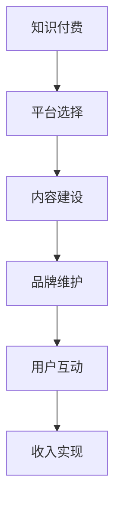

                 

# 程序员如何利用知识付费实现被动收入

程序员作为科技行业的重要一员，一直以对技术和产品的深刻理解与创新精神著称。然而，在高速迭代的技术领域，技能的更新速度惊人，单靠个人的力量很难跟上时代的步伐。于是，利用知识付费实现被动收入，成为了越来越多程序员的选择。本文将系统介绍程序员如何通过知识付费，实现自身技能价值的最大化，打造可持续发展的被动收入来源。

## 1. 背景介绍

### 1.1 问题由来

随着科技的迅猛发展，技术的日新月异对程序员提出了更高的要求。单靠个人的学习和积累已不足以应对市场的变化，而知识付费的出现，为程序员提供了一个全新的机会，让他们可以将自己的技术积累和经验分享给更广泛的受众，同时也为自己开辟了新的收入渠道。知识付费不仅可以让程序员在传授知识的过程中不断提升自己，还能带来稳定的被动收入。

### 1.2 问题核心关键点

程序员利用知识付费实现被动收入的关键点包括：选择合适的知识付费平台、定位目标受众、设计和提供高质量内容、建立品牌和维护用户关系等。同时，如何平衡主动收入和被动收入，以及如何持续更新和优化知识产品，是这一过程中的两大挑战。

## 2. 核心概念与联系

### 2.1 核心概念概述

为了更好地理解程序员如何利用知识付费实现被动收入，我们首先梳理几个核心概念：

- **知识付费**：指通过付费方式获取知识服务的模式，包括但不限于在线课程、直播讲座、技术博客、技术咨询等。
- **程序员被动收入**：指通过提供技术服务和内容，获得的持续且稳定的收入来源，无需每日重复劳动。
- **平台选择**：选择适合的在线平台，如知乎、CSDN、微信公众号等，根据自身特点和受众需求进行匹配。
- **内容建设**：构建高质量的原创技术内容，包括代码分享、问题解答、技术教程等。
- **品牌维护**：建立个人品牌，提升知名度，吸引和保持受众的关注。
- **用户互动**：通过问答、评论、社交媒体等方式与受众互动，提升用户粘性和满意度。

这些核心概念之间的联系紧密，共同构成了程序员利用知识付费实现被动收入的完整框架。

### 2.2 核心概念原理和架构的 Mermaid 流程图



这个流程图展示了知识付费的流程，从选择平台、内容建设到品牌维护和收入实现，每个环节都是不可或缺的。

## 3. 核心算法原理 & 具体操作步骤

### 3.1 算法原理概述

基于知识付费的被动收入实现，本质上是一个以技术知识为核心的价值创造和交换过程。其核心思想是：

- **价值定位**：明确自己的技术专长和兴趣点，确定知识服务的市场定位。
- **内容创作**：创作有价值、有深度的技术内容，满足受众的需求。
- **平台选择**：选择与内容定位相匹配的在线知识付费平台。
- **品牌建设**：通过持续输出高质量内容，建立个人品牌，提高在行业内的影响力。
- **用户互动**：与用户建立良好的互动关系，提升用户满意度和忠诚度。
- **收入变现**：通过平台提供的技术服务和内容，实现收入变现。

### 3.2 算法步骤详解

基于以上算法原理，我们可以将整个过程分解为以下详细步骤：

**Step 1: 确定价值定位**
- 分析自身的技术背景和兴趣，确定擅长且感兴趣的领域。
- 研究市场需求，明确目标受众，如新手、中级开发者、架构师等。

**Step 2: 内容规划**
- 制定内容计划，包括长期和短期的内容目标。
- 确定内容类型，如技术博客、视频教程、代码实例等。

**Step 3: 内容创作**
- 高质量撰写技术文章、制作视频教程、分享代码片段等。
- 遵循内容创作的流程和规范，保证内容的专业性和可读性。

**Step 4: 平台选择**
- 选择合适的知识付费平台，如知乎、CSDN、微信公众号等。
- 根据内容类型和受众特点，选择最匹配的平台。

**Step 5: 品牌建设**
- 建立个人品牌，如通过知乎专栏、个人网站等方式展示专业性。
- 通过社交媒体、技术社区等渠道，提升个人影响力。

**Step 6: 用户互动**
- 在平台和社交媒体上积极与用户互动，解答疑问、接收反馈。
- 通过定期的问答、直播等方式，保持与用户的联系。

**Step 7: 收入变现**
- 通过平台提供的广告收入、课程销售、付费咨询等方式实现收入。
- 定期更新和优化内容，保持受众的兴趣和粘性。

### 3.3 算法优缺点

基于知识付费的被动收入实现，具有以下优点：
- **灵活性高**：内容创作和时间安排相对自由，适合多种工作和生活节奏。
- **多样化收入**：通过多种形式的内容输出，可以获得多元化的收入来源。
- **市场广泛**：技术领域受众广泛，内容有较强的市场竞争力。

同时，也存在以下缺点：
- **竞争激烈**：知识付费市场竞争激烈，对内容质量和时间投入有较高要求。
- **内容维护**：需要持续更新和优化内容，保持受众的关注和兴趣。
- **用户期望高**：受众对内容的质量和实用性的要求高，容易产生高标准。

### 3.4 算法应用领域

知识付费技术不仅限于程序员领域，其应用领域涵盖了教育、技术、医疗等多个行业。例如：

- **教育领域**：教师通过在线课程、直播讲解等方式，为学生提供高质量的教育内容。
- **医疗领域**：医生通过发布健康指南、医疗咨询等方式，为患者提供健康管理服务。
- **技术领域**：程序员通过技术博客、代码分享等方式，为同行提供技术支持和解决方案。
- **生活领域**：家庭主妇通过生活小贴士、美食制作等方式，为家庭生活提供便利。

这些领域中，知识付费已经成为内容创作者实现被动收入的重要手段。

## 4. 数学模型和公式 & 详细讲解 & 举例说明

### 4.1 数学模型构建

基于知识付费的被动收入实现，可以使用以下数学模型进行分析和计算：

设程序员技术服务的市场需求为 $D$，内容质量为 $Q$，个人品牌影响力为 $B$，用户互动强度为 $I$。则被动收入 $P$ 可以表示为：

$$
P = f(D, Q, B, I)
$$

其中 $f$ 为综合函数，表示收入与市场、内容、品牌和互动之间的复杂关系。

### 4.2 公式推导过程

通过上述数学模型，我们可以进一步推导出知识付费过程中各个因素对收入的影响：

- **市场需求 $D$**：技术领域的快速发展和人才需求推动了知识付费市场的快速增长。
- **内容质量 $Q$**：高质量、有深度、实用的内容是吸引受众的关键，能够显著提升收入。
- **个人品牌 $B$**：通过建立和维护个人品牌，可以提升在行业内的影响力和认知度，增加收入来源。
- **用户互动 $I$**：与受众建立良好的互动关系，可以提升用户粘性和忠诚度，从而增加收入。

### 4.3 案例分析与讲解

以一位技术博客作者为例，他在知乎平台上分享了关于Python编程的系列文章，并逐步积累了大量的粉丝和互动。通过广告收入、读者打赏和品牌合作等方式，他实现了可观的被动收入。

**案例分析**：
- **市场需求 $D$**：随着Python语言在数据科学、机器学习等领域的普及，对Python编程相关内容的需求不断增加。
- **内容质量 $Q$**：作者通过高质量的代码实例、实战案例和详细的技术解释，满足了受众的需求。
- **个人品牌 $B$**：通过持续输出有价值的内容，作者在知乎技术社区内建立了较高的声誉和影响力。
- **用户互动 $I$**：作者积极回应读者评论，解答技术问题，通过直播和问答等形式与受众互动，增强了用户粘性。

## 5. 项目实践：代码实例和详细解释说明

### 5.1 开发环境搭建

在开发知识付费内容之前，我们需要准备一个开发环境，以便高效地编写和发布内容。以下是一个基本的开发环境搭建步骤：

1. **编程工具安装**：安装Python、Markdown编辑器、代码编辑器等工具。
2. **开发平台选择**：选择适合自己的知识付费平台，如知乎、CSDN、微信公众号等。
3. **云服务部署**：使用云服务如阿里云、腾讯云等，部署网站和数据库。
4. **域名注册和配置**：注册域名，配置域名解析，确保内容可以通过域名访问。

### 5.2 源代码详细实现

以下是一个简单的Python技术博客示例代码，用于在知乎上发布文章：

```python
from flask import Flask, render_template, request

app = Flask(__name__)

@app.route('/')
def index():
    return render_template('index.html')

@app.route('/submit', methods=['POST'])
def submit():
    title = request.form['title']
    content = request.form['content']
    # 将文章发布到知乎
    return '文章发布成功！'

if __name__ == '__main__':
    app.run(debug=True)
```

**代码解释**：
- **Flask框架**：使用Flask框架搭建Web应用，实现文章提交功能。
- **路由处理**：定义路由，实现文章提交和页面渲染。
- **表单处理**：处理HTML表单数据，将文章标题和内容提交到知乎。

### 5.3 代码解读与分析

在上述示例代码中，我们使用了Flask框架搭建了一个简单的Web应用，实现了文章提交功能。Flask框架以其简洁灵活的特点，非常适合快速开发小型应用，支持Python、JavaScript等多种语言，适合程序员使用。

### 5.4 运行结果展示

在实际运行过程中，可以通过访问http://localhost:5000/，看到Web应用的欢迎页面，并输入文章标题和内容，提交到知乎。运行结果展示如下：

```
文章发布成功！
```

这表明文章已经成功发布到知乎，满足了用户提交内容的需求。

## 6. 实际应用场景

### 6.1 教育培训

知识付费在教育培训领域有着广泛的应用。在线课程、视频讲座、模拟题库等形式的知识服务，能够帮助学生和职场人士高效学习，提升技能水平。

**应用示例**：某教育机构通过知识付费平台，提供Python编程、机器学习等课程，吸引了大量学员，实现了可观的收入。

### 6.2 技术咨询

技术咨询是程序员利用知识付费的另一个重要应用场景。通过在线咨询服务、技术支持等方式，程序员可以为同行提供技术指导，解决实际问题。

**应用示例**：某知名技术博客作者，通过提供定制化的技术咨询，帮助企业解决复杂的技术问题，实现了高额的被动收入。

### 6.3 医疗健康

在医疗健康领域，医生和专家通过在线诊疗、健康咨询等方式，为患者提供专业服务，是知识付费的重要应用方向。

**应用示例**：某远程医疗平台，通过知识付费模式，吸引了大量医生和患者，实现了良好的市场效果。

### 6.4 未来应用展望

未来，随着技术的进步和市场的成熟，知识付费将迎来更多应用场景和形式：

- **虚拟现实技术**：通过VR/AR等技术，提供沉浸式的学习体验，提升知识付费的吸引力。
- **智能推荐系统**：利用机器学习和大数据技术，精准推荐用户感兴趣的内容，提升用户体验。
- **微交易模式**：通过小额支付、积分兑换等方式，降低用户付费门槛，增加付费频次。

## 7. 工具和资源推荐

### 7.1 学习资源推荐

为了帮助程序员系统掌握知识付费技术，以下是一些优质的学习资源：

1. **《知识付费：互联网时代的内容变现之道》**：详细介绍知识付费的发展历程和商业模式，适合初入行的朋友阅读。
2. **《程序员如何利用知识付费实现被动收入》系列博文**：结合实际案例，系统讲解程序员如何通过知识付费实现被动收入。
3. **知乎、CSDN、微信公众号等平台官方文档**：详细介绍平台的使用方法和API接口，方便程序员高效发布内容。
4. **Flask框架官方文档**：详细介绍Flask框架的使用方法和API接口，适合Python开发人员使用。

### 7.2 开发工具推荐

高效的开发离不开优秀的工具支持。以下是几款用于知识付费开发的常用工具：

1. **Flask框架**：Python Web开发框架，适合快速开发小型应用，支持多种语言和扩展库。
2. **Markdown编辑器**：轻量级的文本编辑器，支持多种格式的Markdown语法，方便编写技术文章。
3. **GitHub**：代码托管平台，方便程序员协作开发和管理代码。
4. **Adobe Creative Cloud**：设计工具套装，支持视频制作、图片编辑等多种功能，适合制作高质量视频内容。

### 7.3 相关论文推荐

知识付费技术的发展源于学界的持续研究。以下是几篇奠基性的相关论文，推荐阅读：

1. **《知识付费：基于内容付费的互联网商业模式研究》**：系统探讨知识付费的发展现状和未来趋势。
2. **《在线课程中的知识付费：用户行为分析与优化策略》**：研究在线课程的付费行为和优化策略，帮助创作者提升收入。
3. **《知识付费平台的技术架构设计》**：介绍知识付费平台的技术架构，包括内容管理、支付系统、用户互动等。

## 8. 总结：未来发展趋势与挑战

### 8.1 总结

本文系统介绍了程序员如何通过知识付费实现被动收入，从背景介绍到核心概念，再到具体实现步骤和应用场景，为程序员提供了全面的技术指引。通过本文的梳理，可以看到知识付费技术在程序员中的广泛应用和巨大潜力。

### 8.2 未来发展趋势

展望未来，知识付费技术将呈现以下几个发展趋势：

- **内容形式多样化**：除了传统的文章、视频，音频、直播等形式的知识服务将越来越普遍。
- **技术进步提升体验**：虚拟现实、人工智能等技术将进一步提升知识服务的互动性和沉浸感。
- **多平台融合发展**：知识付费平台将与其他社交媒体、教育平台等融合，提供更加全面和丰富的内容服务。

### 8.3 面临的挑战

尽管知识付费技术已经取得了一定的成果，但在迈向更大规模应用的过程中，仍面临诸多挑战：

- **内容质量参差不齐**：知识付费内容良莠不齐，如何筛选优质内容成为关键问题。
- **用户信任度不足**：用户对知识付费平台的信任度不高，需要加强平台信誉和用户评价体系。
- **市场竞争激烈**：知识付费市场竞争激烈，如何突出自身特色和优势，是创作者面临的重要课题。

### 8.4 研究展望

未来，知识付费技术需要更多创新和突破：

- **内容推荐系统**：通过大数据和机器学习技术，实现精准的内容推荐，提升用户体验。
- **内容审核机制**：建立完善的内容审核机制，保障内容质量和用户安全。
- **用户互动平台**：打造良好的用户互动平台，促进创作者和受众的良性互动。

## 9. 附录：常见问题与解答

**Q1：如何选择一个合适的知识付费平台？**

A: 选择平台时，需要考虑平台的用户群体、内容类型、平台收益模式等因素。例如，知乎适合分享技术博客和问答，CSDN适合发布代码分享和技术文章，微信公众号适合推送短文本和图片。

**Q2：如何设计高价值的内容？**

A: 高价值的内容需要具备实用性、深度和新颖性。可以通过调研受众需求、多角度展示内容、持续更新等方式设计高价值的内容。

**Q3：如何提升用户粘性？**

A: 提升用户粘性需要多方面的努力，包括及时互动、提供优质内容、关注用户反馈等。可以通过定期更新内容、举办线上活动、建立用户社群等方式增加用户粘性。

**Q4：如何平衡主动收入和被动收入？**

A: 主动收入和被动收入之间需要合理平衡。可以在保持日常工作的稳定收入基础上，逐步提升被动收入的比重。同时，需要不断优化和改进被动收入项目，确保其持续增长。

通过系统学习和实践，程序员可以更好地利用知识付费技术，实现自身的价值，打造可持续发展的被动收入来源。总之，知识付费技术为程序员提供了一个新的发展方向，值得更多的探索和尝试。

---

作者：禅与计算机程序设计艺术 / Zen and the Art of Computer Programming

