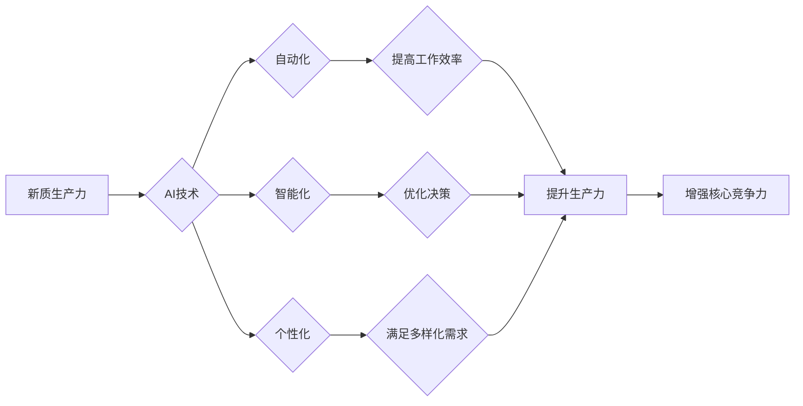

> 新质生产力、人工智能、机器学习、深度学习、算法优化、数据驱动、核心竞争力、数字化转型

## 1. 背景介绍

在当今数字化时代，科技创新正以惊人的速度推动着社会发展。人工智能（AI）作为科技发展的重要驱动力，正在深刻地改变着生产方式和生活方式。从自动驾驶汽车到智能语音助手，从个性化推荐系统到医疗诊断辅助，AI技术的应用场景日益广泛，为人类社会带来了前所未有的机遇。

然而，AI技术的应用并非一帆风顺。如何有效地利用AI技术提升生产力，增强核心竞争力，成为众多企业和组织面临的共同挑战。

## 2. 核心概念与联系

**2.1 新质生产力**

新质生产力是指在信息化、数字化、智能化时代，以数据为驱动，以算法为引擎，以智能技术为核心，实现生产要素高效配置、生产过程智能化、生产模式创新，从而实现生产力跃升的新型生产力。

**2.2 核心竞争力**

核心竞争力是指企业在市场竞争中能够持续保持优势，并抵御竞争对手挑战的独特能力。它通常由以下几个方面构成：

* **资源优势:** 拥有稀缺、难以复制的资源，例如人才、技术、品牌等。
* **能力优势:** 具备独特的技能和能力，例如创新能力、管理能力、营销能力等。
* **网络优势:** 建立强大的合作网络，例如供应商网络、客户网络、合作伙伴网络等。

**2.3 AI与新质生产力**

AI技术作为新质生产力的关键驱动力，能够通过以下方式提升生产力：

* **自动化:** AI可以自动化完成许多重复性、繁琐性任务，例如数据录入、报表生成、客户服务等，释放人力资源，提高工作效率。
* **智能化:** AI可以利用数据分析和机器学习算法，识别模式、预测趋势，帮助企业做出更智能化决策，优化生产流程，提高资源利用率。
* **个性化:** AI可以根据用户的需求和喜好，提供个性化服务和产品，满足用户的多样化需求，提升用户体验。

**2.4 AI与核心竞争力**

AI技术可以帮助企业提升核心竞争力，例如：

* **创新能力:** AI可以加速研发过程，帮助企业更快地开发新产品和新服务，保持市场竞争优势。
* **运营效率:** AI可以优化生产流程、供应链管理、客户关系管理等，提高企业运营效率，降低成本。
* **客户体验:** AI可以提供个性化服务、智能客服等，提升客户体验，增强客户忠诚度。

**2.5  核心概念关系流程图**



## 3. 核心算法原理 & 具体操作步骤

**3.1 算法原理概述**

深度学习算法是人工智能领域的核心算法之一，它能够通过多层神经网络结构，学习数据中的复杂模式和特征，从而实现对数据的理解和预测。

**3.2 算法步骤详解**

深度学习算法的训练过程通常包括以下步骤：

1. **数据预处理:** 将原始数据进行清洗、转换、格式化等操作，使其适合深度学习模型的训练。
2. **模型构建:** 根据具体任务需求，选择合适的深度学习模型架构，例如卷积神经网络（CNN）、循环神经网络（RNN）、生成对抗网络（GAN）等。
3. **模型训练:** 使用训练数据，通过反向传播算法，调整模型参数，使模型能够准确地预测目标变量。
4. **模型评估:** 使用测试数据，评估模型的性能，例如准确率、召回率、F1-score等。
5. **模型调优:** 根据评估结果，调整模型参数、学习率、训练 epochs 等，进一步提高模型性能。
6. **模型部署:** 将训练好的模型部署到实际应用场景中，用于预测、分类、识别等任务。

**3.3 算法优缺点**

**优点:**

* **高准确率:** 深度学习算法能够学习数据中的复杂模式，实现对数据的精准预测。
* **自动化特征提取:** 深度学习模型能够自动提取数据的特征，无需人工特征工程。
* **泛化能力强:** 深度学习模型能够对新的数据进行泛化，实现对未知数据的预测。

**缺点:**

* **数据依赖性强:** 深度学习算法需要大量的训练数据才能达到较高的准确率。
* **计算资源消耗大:** 深度学习模型训练需要大量的计算资源，例如GPU、TPU等。
* **可解释性差:** 深度学习模型的决策过程较为复杂，难以解释模型的决策逻辑。

**3.4 算法应用领域**

深度学习算法广泛应用于以下领域：

* **计算机视觉:** 图像识别、物体检测、图像分割、人脸识别等。
* **自然语言处理:** 文本分类、情感分析、机器翻译、对话系统等。
* **语音识别:** 语音转文本、语音合成等。
* **医疗诊断:** 疾病预测、影像分析、药物研发等。
* **金融分析:** 风险评估、欺诈检测、投资预测等。

## 4. 数学模型和公式 & 详细讲解 & 举例说明

**4.1 数学模型构建**

深度学习模型通常由多层神经网络组成，每层神经网络包含多个神经元。每个神经元接收来自上一层的输入信号，并通过激活函数进行处理，输出到下一层神经元。

**4.2 公式推导过程**

深度学习模型的训练过程基于反向传播算法，其核心思想是通过计算模型输出与真实值的误差，反向传播误差信号，调整模型参数，使模型输出更接近真实值。

反向传播算法的具体推导过程较为复杂，涉及到微积分、线性代数等数学知识。

**4.3 案例分析与讲解**

以卷积神经网络（CNN）为例，其数学模型可以表示为：

$$
y = f(W_L * ReLU(W_{L-1} * ... * ReLU(W_1 * x)) + b_L)
$$

其中：

* $x$ 是输入数据
* $W_i$ 是第 $i$ 层神经网络的权重矩阵
* $b_i$ 是第 $i$ 层神经网络的偏置向量
* $ReLU$ 是激活函数
* $f$ 是输出层激活函数
* $y$ 是模型输出

通过调整 $W_i$ 和 $b_i$ 的值，可以使模型输出更接近真实值。

## 5. 项目实践：代码实例和详细解释说明

**5.1 开发环境搭建**

深度学习模型的开发通常需要使用 Python 语言和相关的深度学习框架，例如 TensorFlow、PyTorch 等。

**5.2 源代码详细实现**

以下是一个使用 TensorFlow 实现简单的 CNN 模型的代码示例：

```python
import tensorflow as tf

# 定义模型结构
model = tf.keras.models.Sequential([
    tf.keras.layers.Conv2D(32, (3, 3), activation='relu', input_shape=(28, 28, 1)),
    tf.keras.layers.MaxPooling2D((2, 2)),
    tf.keras.layers.Conv2D(64, (3, 3), activation='relu'),
    tf.keras.layers.MaxPooling2D((2, 2)),
    tf.keras.layers.Flatten(),
    tf.keras.layers.Dense(10, activation='softmax')
])

# 编译模型
model.compile(optimizer='adam',
              loss='sparse_categorical_crossentropy',
              metrics=['accuracy'])

# 训练模型
model.fit(x_train, y_train, epochs=5)

# 评估模型
loss, accuracy = model.evaluate(x_test, y_test)
print('Test loss:', loss)
print('Test accuracy:', accuracy)
```

**5.3 代码解读与分析**

这段代码定义了一个简单的 CNN 模型，用于手写数字识别任务。

* `tf.keras.models.Sequential` 创建了一个顺序模型，即层级结构。
* `tf.keras.layers.Conv2D` 定义了卷积层，用于提取图像特征。
* `tf.keras.layers.MaxPooling2D` 定义了最大池化层，用于降维和提高模型鲁棒性。
* `tf.keras.layers.Flatten` 将多维数据转换为一维数据，以便输入全连接层。
* `tf.keras.layers.Dense` 定义了全连接层，用于分类。
* `model.compile` 编译模型，指定优化器、损失函数和评价指标。
* `model.fit` 训练模型，使用训练数据进行训练。
* `model.evaluate` 评估模型，使用测试数据评估模型性能。

**5.4 运行结果展示**

训练完成后，模型可以用于预测新的手写数字图像。

## 6. 实际应用场景

**6.1 自动驾驶**

深度学习算法可以用于自动驾驶汽车的图像识别、目标检测、路径规划等任务，实现自动驾驶功能。

**6.2 医疗诊断**

深度学习算法可以用于医疗影像分析、疾病预测、药物研发等，辅助医生进行诊断和治疗。

**6.3 金融风险管理**

深度学习算法可以用于金融数据分析、欺诈检测、风险评估等，帮助金融机构降低风险。

**6.4 个性化推荐**

深度学习算法可以用于用户行为分析、商品推荐、内容推荐等，提供个性化服务和产品推荐。

**6.5 未来应用展望**

随着人工智能技术的不断发展，深度学习算法将在更多领域得到应用，例如：

* **智能制造:** 智能机器人、智能工厂、预测性维护等。
* **智慧城市:** 交通管理、环境监测、公共安全等。
* **教育科技:** 个性化学习、智能辅导、在线教育等。

## 7. 工具和资源推荐

**7.1 学习资源推荐**

* **书籍:**
    * 深度学习 (Deep Learning) - Ian Goodfellow, Yoshua Bengio, Aaron Courville
    * 构建深度学习模型 (Hands-On Machine Learning with Scikit-Learn, Keras & TensorFlow) - Aurélien Géron
* **在线课程:**
    * 深度学习 Specialization - Andrew Ng (Coursera)
    * fast.ai - Practical Deep Learning for Coders
* **博客和网站:**
    * TensorFlow Blog
    * PyTorch Blog
    * Towards Data Science

**7.2 开发工具推荐**

* **深度学习框架:** TensorFlow, PyTorch, Keras
* **数据处理工具:** Pandas, NumPy
* **可视化工具:** Matplotlib, Seaborn

**7.3 相关论文推荐**

* AlexNet: ImageNet Classification with Deep Convolutional Neural Networks (Krizhevsky et al., 2012)
* VGGNet: Very Deep Convolutional Networks for Large-Scale Image Recognition (Simonyan & Zisserman, 2014)
* ResNet: Deep Residual Learning for Image Recognition (He et al., 2015)

## 8. 总结：未来发展趋势与挑战

**8.1 研究成果总结**

近年来，深度学习算法取得了显著的成果，在图像识别、自然语言处理、语音识别等领域取得了突破性进展。

**8.2 未来发展趋势**

* **模型规模和复杂度提升:** 随着计算资源的不断发展，深度学习模型的规模和复杂度将进一步提升，模型性能将得到进一步提高。
* **算法效率和可解释性提升:** 研究者将致力于开发更高效、更易解释的深度学习算法，降低模型训练成本，提高模型可信度。
* **跨模态学习:** 深度学习算法将跨越不同模态的数据，例如文本、图像、音频等，