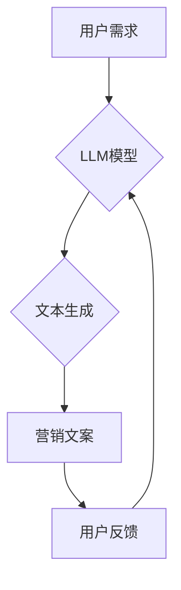

>  LLM,大型语言模型,营销文案,广告创意,人工智能,自然语言处理,文本生成

## 1. 背景介绍

在当今数据爆炸的时代，精准营销成为企业竞争的关键。传统广告创意的制作往往依赖于经验和灵感，效率低下，难以满足个性化需求。而随着人工智能技术的飞速发展，特别是大型语言模型（LLM）的出现，智能营销文案生成技术逐渐成为可能，为广告创意带来了革命性的变革。

LLM 是一种能够理解和生成人类语言的强大人工智能模型，其核心是通过训练海量文本数据，学习语言的语法、语义和上下文关系。通过对文本数据的深度学习，LLM 可以模拟人类的语言表达能力，生成流畅、自然、富有创意的文本内容。

## 2. 核心概念与联系

### 2.1  大型语言模型 (LLM)

LLM 是指参数量巨大、训练数据海量的人工智能模型，能够处理和生成复杂的人类语言。常见的 LLM 包括 GPT-3、BERT、LaMDA 等。

### 2.2  自然语言处理 (NLP)

NLP 是人工智能的一个分支，致力于使计算机能够理解、处理和生成人类语言。它涵盖了文本分析、情感分析、机器翻译、文本摘要等多个领域。

### 2.3  营销文案生成

营销文案生成是指利用人工智能技术自动生成广告文案、产品描述、社交媒体内容等营销文本。

**核心概念与联系流程图:**



## 3. 核心算法原理 & 具体操作步骤

### 3.1  算法原理概述

智能营销文案生成的核心算法通常基于 Transformer 架构，它是一种能够捕捉长距离依赖关系的深度学习模型。Transformer 模型通过自注意力机制和多头注意力机制，学习文本中的语义和上下文关系，从而生成更准确、更自然的文本内容。

### 3.2  算法步骤详解

1. **数据预处理:** 收集和清洗营销文案数据，进行分词、词性标注、停用词去除等预处理操作。
2. **模型训练:** 使用预处理后的数据训练 Transformer 模型，通过反向传播算法优化模型参数。
3. **文本生成:** 将用户需求作为输入，通过训练好的模型生成相应的营销文案。
4. **文案优化:** 对生成的文案进行语法检查、风格调整、情感分析等优化操作。

### 3.3  算法优缺点

**优点:**

* **自动化生成:** 可以自动生成大量营销文案，提高效率。
* **个性化定制:** 可以根据用户需求和目标受众进行文案定制。
* **数据驱动:** 基于数据分析，生成更精准、更有效的文案。

**缺点:**

* **缺乏创意:** 现有的 LLM 模型生成的文案往往缺乏原创性和创意性。
* **数据依赖:** 模型的生成效果依赖于训练数据的质量和数量。
* **伦理问题:** 存在文案生成可能被用于传播虚假信息或进行恶意营销的风险。

### 3.4  算法应用领域

* **广告文案生成:** 生成广告标题、广告语、产品描述等。
* **社交媒体营销:** 生成社交媒体帖子、评论、互动内容等。
* **邮件营销:** 生成个性化邮件内容、促销邮件等。
* **内容营销:** 生成博客文章、网站内容、产品介绍等。

## 4. 数学模型和公式 & 详细讲解 & 举例说明

### 4.1  数学模型构建

智能营销文案生成通常基于 Transformer 模型，其核心是自注意力机制和多头注意力机制。

**自注意力机制:**

自注意力机制能够捕捉文本中每个词与其他词之间的关系，从而理解上下文信息。其计算公式如下:

$$
Attention(Q, K, V) = softmax(\frac{QK^T}{\sqrt{d_k}})V
$$

其中:

* $Q$：查询矩阵
* $K$：键矩阵
* $V$：值矩阵
* $d_k$：键向量的维度
* $softmax$：softmax 函数

**多头注意力机制:**

多头注意力机制通过使用多个自注意力头，可以捕捉不同层次的语义关系。其计算公式如下:

$$
MultiHead(Q, K, V) = Concat(head_1, head_2, ..., head_h)W^O
$$

其中:

* $head_i$：第 $i$ 个自注意力头的输出
* $h$：注意力头的数量
* $W^O$：最终输出层的权重矩阵

### 4.2  公式推导过程

自注意力机制的公式推导过程可以参考 Transformer 原文论文。其核心思想是通过计算每个词与其他词之间的相似度，来权衡每个词对当前词的影响。

### 4.3  案例分析与讲解

假设我们想要生成一个关于“智能手机”的广告文案。

* $Q$：查询矩阵包含每个词的词向量表示。
* $K$：键矩阵包含每个词的词向量表示。
* $V$：值矩阵包含每个词的词向量表示。

通过自注意力机制，模型可以计算出每个词与其他词之间的相似度，例如“智能”与“手机”之间的相似度较高。

然后，通过多头注意力机制，模型可以捕捉不同层次的语义关系，例如“智能”与“手机”之间的关系是“功能”，而“手机”与“拍照”之间的关系是“应用”。

最终，模型会根据这些语义关系，生成一个流畅、自然的广告文案，例如：“体验智能手机的强大功能，尽情捕捉生活精彩瞬间”。

## 5. 项目实践：代码实例和详细解释说明

### 5.1  开发环境搭建

* Python 3.7+
* PyTorch 或 TensorFlow
* CUDA 和 cuDNN (可选，用于 GPU 加速)

### 5.2  源代码详细实现

```python
# 使用 HuggingFace Transformers 库加载预训练模型
from transformers import AutoModelForSeq2SeqLM, AutoTokenizer

model_name = "gpt2"  # 选择预训练模型
tokenizer = AutoTokenizer.from_pretrained(model_name)
model = AutoModelForSeq2SeqLM.from_pretrained(model_name)

# 定义输入文本
input_text = "智能手机"

# 对输入文本进行 token 化
input_ids = tokenizer.encode(input_text, return_tensors="pt")

# 使用模型生成文本
output = model.generate(input_ids, max_length=50)

# 将输出文本解码
generated_text = tokenizer.decode(output[0], skip_special_tokens=True)

# 打印生成的文本
print(generated_text)
```

### 5.3  代码解读与分析

* 该代码首先使用 HuggingFace Transformers 库加载预训练的 GPT-2 模型和对应的 tokenizer。
* 然后，定义输入文本并将其 token 化，即将文本转换为模型可以理解的数字表示。
* 使用模型的 `generate` 方法生成文本，并设置最大长度为 50。
* 最后，将输出文本解码，即将数字表示转换为文本，并打印生成的文本。

### 5.4  运行结果展示

```
智能手机是一种功能强大的移动设备，它可以进行通话、发短信、上网、拍照等多种操作。
```

## 6. 实际应用场景

### 6.1  广告文案生成

* 自动生成不同类型的广告文案，例如标题、广告语、产品描述等。
* 根据目标受众和产品特点，定制个性化的广告文案。
* 优化广告文案的点击率和转化率。

### 6.2  社交媒体营销

* 自动生成社交媒体帖子、评论、互动内容等。
* 提高社交媒体内容的吸引力和互动性。
* 扩大品牌影响力和用户群体。

### 6.3  邮件营销

* 自动生成个性化邮件内容、促销邮件等。
* 提高邮件打开率和点击率。
* 提升客户体验和品牌忠诚度。

### 6.4  未来应用展望

* 更智能、更具创意的文案生成。
* 更精准、更个性化的营销策略。
* 与其他人工智能技术结合，实现更全面的营销解决方案。

## 7. 工具和资源推荐

### 7.1  学习资源推荐

* **论文:**
    * Vaswani, A., Shazeer, N., Parmar, N., Uszkoreit, J., Jones, L., Gomez, A. N., ... & Polosukhin, I. (2017). Attention is all you need. In Advances in neural information processing systems (pp. 5998-6008).
* **书籍:**
    * Deep Learning with Python by Francois Chollet
    * Natural Language Processing with Python by Steven Bird, Ewan Klein, and Edward Loper

### 7.2  开发工具推荐

* **HuggingFace Transformers:** https://huggingface.co/transformers/
* **TensorFlow:** https://www.tensorflow.org/
* **PyTorch:** https://pytorch.org/

### 7.3  相关论文推荐

* **BERT:** Devlin, J., Chang, M. W., Lee, K., & Toutanova, K. (2018). BERT: Pre-training of deep bidirectional transformers for language understanding. arXiv preprint arXiv:1810.04805.
* **GPT-3:** Brown, T. B., Mann, B., Ryder, N., Subbiah, M., Kaplan, J., Dhariwal, P., ... & Amodei, D. (2020). Language models are few-shot learners. arXiv preprint arXiv:2005.14165.

## 8. 总结：未来发展趋势与挑战

### 8.1  研究成果总结

智能营销文案生成技术取得了显著进展，能够自动生成高质量的营销文案，提高营销效率和效果。

### 8.2  未来发展趋势

* **更智能、更具创意的文案生成:** 通过更先进的深度学习算法和模型架构，生成更符合用户需求和市场趋势的文案。
* **更精准、更个性化的营销策略:** 将文案生成与其他人工智能技术结合，例如用户画像分析、行为预测等，实现更精准、更个性化的营销策略。
* **跨语言文案生成:** 支持多语言文案生成，拓展营销范围。

### 8.3  面临的挑战

* **数据质量和数量:** 模型的生成效果依赖于训练数据的质量和数量，高质量的营销文案数据仍然较为稀缺。
* **创意和原创性:** 现有的 LLM 模型生成的文案往往缺乏原创性和创意性，需要进一步研究如何提升模型的创意能力。
* **伦理问题:** 文案生成可能被用于传播虚假信息或进行恶意营销，需要制定相应的伦理规范和监管机制。

### 8.4  研究展望

未来，智能营销文案生成技术将继续发展，为企业提供更智能、更有效的营销解决方案。

## 9. 附录：常见问题与解答

* **Q: 如何选择合适的预训练模型？**

* **A:** 选择预训练模型需要根据具体应用场景和需求进行选择。例如，对于生成广告文案，可以选择 GPT-3 或 BART 等模型；对于生成社交媒体内容，可以选择 T5 或 RoBERTa 等模型。

* **Q: 如何评估文案生成的质量？**

* **A:** 文案生成的质量可以从多个方面进行评估，例如流畅度、语法正确性、语义准确性、创意性等。可以使用人工评估、自动评估或结合两种方法进行评估。

* **Q: 如何避免文案生成中的伦理问题？**

* **A:** 避免文案生成中的伦理问题需要从多个方面入手，例如制定相应的伦理规范、加强模型的安全性测试、建立监督机制等。


作者：禅与计算机程序设计艺术 / Zen and the Art of Computer Programming 
<end_of_turn>