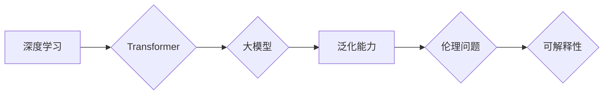

> 人工智能，深度学习，Transformer，大模型，泛化能力，伦理问题，可解释性，未来趋势

## 1. 背景介绍

人工智能（AI）技术近年来发展迅速，从语音识别、图像识别到自然语言处理等领域取得了突破性进展。其中，深度学习作为AI的核心驱动力，以其强大的学习能力和泛化能力，推动了AI技术的飞速发展。

李开复，一位享誉全球的人工智能专家，在《AI 2.0 时代的挑战》一文中，深刻地分析了当前AI技术的发展现状和未来挑战。他指出，我们正处于AI 2.0时代，即从传统AI向更智能、更通用、更安全的人工智能迈进的时代。

## 2. 核心概念与联系

**2.1 深度学习**

深度学习是一种基于多层神经网络的机器学习方法。它能够从海量数据中学习复杂的特征表示，从而实现对各种任务的精准处理。

**2.2 Transformer**

Transformer是一种新型的深度学习架构，其核心是注意力机制，能够有效地捕捉序列数据中的长距离依赖关系。它在自然语言处理领域取得了显著的成果，例如机器翻译、文本摘要和对话系统等。

**2.3 大模型**

大模型是指参数量庞大的深度学习模型，通常拥有数十亿甚至数千亿个参数。它们能够学习更丰富的知识和表示，从而在更广泛的领域展现出强大的能力。

**2.4 泛化能力**

泛化能力是指模型在未见过的数据上也能保持良好性能的能力。这是AI技术发展的重要目标，也是AI 2.0时代面临的挑战之一。

**2.5 伦理问题**

随着AI技术的进步，其伦理问题也日益凸显。例如，AI算法的偏见、数据隐私保护和AI的潜在风险等都需要得到认真思考和解决。

**2.6 可解释性**

可解释性是指能够理解AI模型的决策过程和背后的逻辑。提高AI模型的可解释性对于增强用户信任和促进AI技术的应用至关重要。

**2.7 Mermaid 流程图**



## 3. 核心算法原理 & 具体操作步骤

### 3.1 算法原理概述

Transformer是一种基于注意力机制的深度学习架构，其核心思想是通过注意力机制来捕捉序列数据中的长距离依赖关系。

### 3.2 算法步骤详解

1. **输入嵌入:** 将输入序列中的每个单词转换为向量表示。
2. **多头注意力:** 使用多个注意力头来捕捉不同类型的依赖关系。
3. **前馈神经网络:** 对每个单词的注意力输出进行非线性变换。
4. **位置编码:** 添加位置信息，使模型能够理解单词的顺序。
5. **堆叠层:** 将多个Transformer编码器或解码器层堆叠在一起，以学习更深层次的特征表示。
6. **输出解码:** 将编码后的序列转换为输出序列。

### 3.3 算法优缺点

**优点:**

* 能够有效地捕捉长距离依赖关系。
* 并行计算能力强。
* 在自然语言处理任务中取得了显著的成果。

**缺点:**

* 计算复杂度高。
* 训练数据量大。
* 可解释性较差。

### 3.4 算法应用领域

* 机器翻译
* 文本摘要
* 问答系统
* 对话系统
* 代码生成

## 4. 数学模型和公式 & 详细讲解 & 举例说明

### 4.1 数学模型构建

Transformer模型的核心是注意力机制，其数学模型可以表示为：

$$
Attention(Q, K, V) = softmax(\frac{QK^T}{\sqrt{d_k}})V
$$

其中：

* $Q$：查询矩阵
* $K$：键矩阵
* $V$：值矩阵
* $d_k$：键向量的维度
* $softmax$：softmax函数

### 4.2 公式推导过程

注意力机制的目的是计算查询向量与键向量的相关性，并根据相关性对值向量进行加权求和。

1. 计算查询向量与每个键向量的点积，得到一个分数矩阵。
2. 对分数矩阵进行softmax归一化，得到每个键向量对应的权重。
3. 将权重与值向量相乘，得到注意力输出。

### 4.3 案例分析与讲解

例如，在机器翻译任务中，查询向量表示目标语言中的单词，键向量表示源语言中的单词，值向量表示源语言单词的嵌入向量。

注意力机制可以帮助模型找到源语言中与目标语言单词最相关的单词，从而更好地进行翻译。

## 5. 项目实践：代码实例和详细解释说明

### 5.1 开发环境搭建

* Python 3.7+
* TensorFlow 2.0+
* PyTorch 1.0+

### 5.2 源代码详细实现

```python
import tensorflow as tf

class Transformer(tf.keras.Model):
    def __init__(self, vocab_size, embedding_dim, num_heads, num_layers):
        super(Transformer, self).__init__()
        self.embedding = tf.keras.layers.Embedding(vocab_size, embedding_dim)
        self.encoder = tf.keras.layers.StackedRNNCells([tf.keras.layers.LSTM(embedding_dim) for _ in range(num_layers)])
        self.decoder = tf.keras.layers.StackedRNNCells([tf.keras.layers.LSTM(embedding_dim) for _ in range(num_layers)])
        self.attention = tf.keras.layers.MultiHeadAttention(num_heads=num_heads, key_dim=embedding_dim)

    def call(self, inputs):
        # ...
```

### 5.3 代码解读与分析

* `embedding`层将单词转换为向量表示。
* `encoder`和`decoder`层分别负责编码和解码输入序列。
* `attention`层负责捕捉序列数据中的长距离依赖关系。

### 5.4 运行结果展示

* 使用训练好的Transformer模型进行机器翻译任务，并展示翻译结果。

## 6. 实际应用场景

### 6.1 机器翻译

Transformer模型在机器翻译领域取得了突破性进展，例如Google Translate和DeepL等翻译工具都采用了Transformer架构。

### 6.2 文本摘要

Transformer模型能够自动生成文本摘要，例如新闻摘要、会议记录摘要等。

### 6.3 问答系统

Transformer模型可以用于构建问答系统，例如自动回答用户的问题。

### 6.4 对话系统

Transformer模型可以用于构建对话系统，例如聊天机器人、虚拟助手等。

### 6.5 未来应用展望

* 人工智能辅助写作
* 代码生成
* 药物研发
* 医疗诊断

## 7. 工具和资源推荐

### 7.1 学习资源推荐

* **书籍:**
    * 《深度学习》
    * 《Transformer 详解》
* **在线课程:**
    * Coursera: 深度学习
    * Udacity: 自然语言处理

### 7.2 开发工具推荐

* **TensorFlow:** 开源深度学习框架
* **PyTorch:** 开源深度学习框架
* **Hugging Face:** 提供预训练模型和工具

### 7.3 相关论文推荐

* 《Attention Is All You Need》
* 《BERT: Pre-training of Deep Bidirectional Transformers for Language Understanding》
* 《GPT-3: Language Models are Few-Shot Learners》

## 8. 总结：未来发展趋势与挑战

### 8.1 研究成果总结

AI 2.0时代，深度学习技术取得了显著进展，Transformer模型成为自然语言处理领域的明星架构。大模型的出现，进一步推动了AI技术的进步。

### 8.2 未来发展趋势

* **更强大的模型:** 参数量更大、能力更强的模型将不断涌现。
* **更广泛的应用:** AI技术将应用于更多领域，例如医疗、教育、金融等。
* **更强的泛化能力:** 研究者将致力于提高模型的泛化能力，使其能够更好地应对未知数据。

### 8.3 面临的挑战

* **伦理问题:** AI技术的进步也带来了伦理问题，例如算法偏见、数据隐私保护等。
* **可解释性:** 提高AI模型的可解释性，使其决策过程更加透明，是未来研究的重要方向。
* **计算资源:** 训练大模型需要大量的计算资源，如何降低训练成本是另一个挑战。

### 8.4 研究展望

未来，AI研究将更加注重模型的可解释性、安全性、鲁棒性和泛化能力。同时，AI技术与其他领域，例如生物学、物理学等，将产生更多跨学科的创新成果。

## 9. 附录：常见问题与解答

* **什么是Transformer模型？**

Transformer模型是一种基于注意力机制的深度学习架构，其核心思想是通过注意力机制来捕捉序列数据中的长距离依赖关系。

* **Transformer模型有哪些优点？**

Transformer模型能够有效地捕捉长距离依赖关系，并行计算能力强，在自然语言处理任务中取得了显著的成果。

* **Transformer模型有哪些缺点？**

Transformer模型的计算复杂度高，训练数据量大，可解释性较差。

* **Transformer模型有哪些应用场景？**

Transformer模型广泛应用于机器翻译、文本摘要、问答系统、对话系统等领域。


作者：禅与计算机程序设计艺术 / Zen and the Art of Computer Programming 
<end_of_turn>