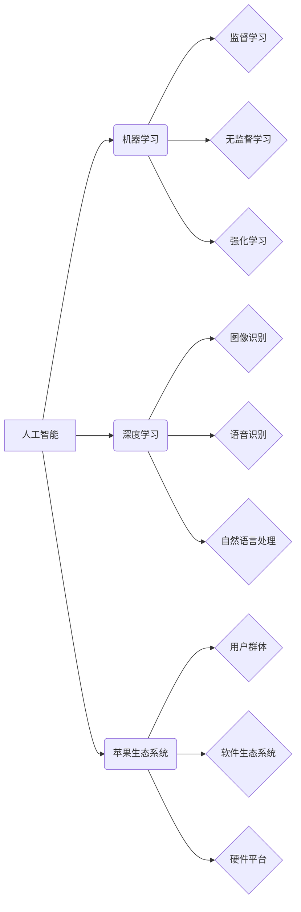

> 苹果, AI, 应用, 机遇, 发展趋势, 挑战

## 1. 背景介绍

近年来，人工智能（AI）技术取得了飞速发展，并在各个领域展现出巨大的应用潜力。从自动驾驶到医疗诊断，从语音识别到图像生成，AI正在深刻地改变着我们的生活。作为科技巨头，苹果也积极布局AI领域，并不断将AI技术融入其产品和服务中。

李开复，一位享誉全球的人工智能专家，曾指出苹果发布AI应用的机会巨大。他认为，苹果拥有强大的硬件、软件和生态系统，以及对用户体验的极致追求，这些优势使其成为AI应用的理想平台。

## 2. 核心概念与联系

### 2.1  人工智能 (AI)

人工智能是指模拟人类智能行为的计算机系统。它涵盖了多种技术，例如机器学习、深度学习、自然语言处理和计算机视觉等。

### 2.2  机器学习 (ML)

机器学习是人工智能的一个重要分支，它使计算机能够从数据中学习，并根据学习到的知识进行预测或决策。机器学习算法可以分为监督学习、无监督学习和强化学习三大类。

### 2.3  深度学习 (DL)

深度学习是机器学习的一个子领域，它利用多层神经网络来模拟人类大脑的学习过程。深度学习算法在图像识别、语音识别和自然语言处理等领域取得了突破性的进展。

### 2.4  苹果生态系统

苹果拥有庞大的用户群体、完善的软件生态系统和强大的硬件平台。这些优势为AI应用提供了广阔的市场空间和技术基础。

**核心概念与联系流程图:**



## 3. 核心算法原理 & 具体操作步骤

### 3.1  算法原理概述

深度学习算法的核心是多层神经网络。神经网络由多个节点（神经元）组成，每个节点都连接着其他节点，并通过权重来传递信息。通过训练神经网络，可以调整权重，使网络能够学习数据中的模式和关系。

### 3.2  算法步骤详解

1. **数据预处理:** 将原始数据转换为深度学习算法可以理解的格式。
2. **网络结构设计:** 根据任务需求设计神经网络的结构，包括层数、节点数和激活函数等。
3. **参数初始化:** 为神经网络的参数（权重和偏置）进行随机初始化。
4. **前向传播:** 将输入数据通过神经网络传递，并计算输出结果。
5. **反向传播:** 计算输出结果与真实值的误差，并根据误差反向调整神经网络的参数。
6. **优化算法:** 使用优化算法（例如梯度下降）来更新神经网络的参数，降低误差。
7. **训练与评估:** 循环进行前向传播和反向传播，直到网络的性能达到预期的水平。

### 3.3  算法优缺点

**优点:**

* 能够学习复杂的数据模式。
* 性能优于传统机器学习算法。
* 在图像识别、语音识别和自然语言处理等领域取得了突破性进展。

**缺点:**

* 需要大量的训练数据。
* 计算资源需求高。
* 训练过程复杂，需要专业知识。

### 3.4  算法应用领域

* **图像识别:** 人脸识别、物体检测、图像分类。
* **语音识别:** 语音转文本、语音助手。
* **自然语言处理:** 机器翻译、文本摘要、情感分析。
* **推荐系统:** 产品推荐、内容推荐。
* **医疗诊断:** 病情预测、疾病诊断。

## 4. 数学模型和公式 & 详细讲解 & 举例说明

### 4.1  数学模型构建

深度学习算法的核心是多层神经网络。每个神经元接收多个输入信号，并通过加权求和和激活函数来生成输出信号。

**神经元模型:**

$$
y = f(w_1x_1 + w_2x_2 + ... + w_nx_n + b)
$$

其中:

* $y$ 是神经元的输出信号。
* $x_1, x_2, ..., x_n$ 是输入信号。
* $w_1, w_2, ..., w_n$ 是权重。
* $b$ 是偏置。
* $f$ 是激活函数。

### 4.2  公式推导过程

深度学习算法的训练过程是通过反向传播算法来调整神经网络的参数。反向传播算法的核心是计算误差梯度，并根据梯度更新参数。

**误差梯度:**

$$
\frac{\partial E}{\partial w_i} = \frac{\partial E}{\partial y} \cdot \frac{\partial y}{\partial w_i}
$$

其中:

* $E$ 是误差函数。
* $w_i$ 是需要更新的参数。

### 4.3  案例分析与讲解

**图像分类:**

假设我们有一个图像分类任务，目标是将图像分类为不同的类别（例如猫、狗、鸟）。我们可以使用卷积神经网络（CNN）来解决这个问题。CNN 是一种专门用于处理图像数据的深度学习算法。

CNN 的结构包括多个卷积层、池化层和全连接层。卷积层用于提取图像特征，池化层用于降低特征维度，全连接层用于分类。

训练 CNN 时，我们会使用大量的标记图像数据。通过反向传播算法，CNN 会学习到图像特征和类别之间的映射关系。最终，CNN 可以将新的图像分类为不同的类别。

## 5. 项目实践：代码实例和详细解释说明

### 5.1  开发环境搭建

为了实现深度学习项目，我们需要搭建相应的开发环境。常用的开发环境包括：

* **Python:** 深度学习的编程语言。
* **TensorFlow/PyTorch:** 深度学习框架。
* **GPU:** 加速深度学习训练的硬件。

### 5.2  源代码详细实现

以下是一个简单的深度学习代码示例，使用 TensorFlow 框架实现一个简单的线性回归模型。

```python
import tensorflow as tf

# 定义模型
model = tf.keras.models.Sequential([
    tf.keras.layers.Dense(units=1, input_shape=[1])
])

# 编译模型
model.compile(optimizer='sgd', loss='mean_squared_error')

# 训练模型
model.fit(x=tf.constant([[1.0], [2.0], [3.0]]), y=tf.constant([[2.0], [4.0], [6.0]]), epochs=100)

# 预测结果
prediction = model.predict(tf.constant([[4.0]]))
print(prediction)
```

### 5.3  代码解读与分析

这段代码定义了一个简单的线性回归模型，包含一个全连接层。模型的输入是一个单一的特征，输出是一个预测值。

模型使用随机梯度下降（SGD）作为优化算法，并使用均方误差（MSE）作为损失函数。

训练模型时，我们使用三个样本点进行训练，每个样本点包含一个特征和一个目标值。模型经过 100 个 epochs 的训练后，可以预测新的特征值对应的目标值。

### 5.4  运行结果展示

运行这段代码后，会输出预测结果，例如：

```
[[7.0]]
```

这表示模型预测特征值为 4.0 时，对应的目标值为 7.0。

## 6. 实际应用场景

### 6.1  智能助手

苹果的 Siri 智能助手已经应用了深度学习技术，能够理解用户的语音指令，并提供相应的回复。

### 6.2  图像识别

iPhone 的相机应用已经内置了深度学习算法，能够识别物体、场景和人脸。

### 6.3  个性化推荐

App Store 和 Apple Music 使用深度学习算法进行个性化推荐，根据用户的喜好推荐相关的应用和音乐。

### 6.4  未来应用展望

随着深度学习技术的不断发展，苹果未来将有更多机会将 AI 应用于其产品和服务中。例如：

* **增强现实 (AR):** 深度学习可以帮助 AR 应用更好地理解周围环境，并提供更逼真的体验。
* **自动驾驶:** 深度学习是自动驾驶的关键技术，苹果可能会在未来推出自动驾驶汽车。
* **医疗保健:** 深度学习可以帮助诊断疾病、预测病情和个性化治疗方案。

## 7. 工具和资源推荐

### 7.1  学习资源推荐

* **Coursera:** 提供深度学习相关的在线课程。
* **Udacity:** 提供深度学习相关的在线课程和项目。
* **Stanford CS231n:** 深度学习课程的公开课视频和笔记。

### 7.2  开发工具推荐

* **TensorFlow:** 开源深度学习框架。
* **PyTorch:** 开源深度学习框架。
* **Keras:** 高级深度学习 API，可以运行在 TensorFlow 或 Theano 上。

### 7.3  相关论文推荐

* **AlexNet:** ImageNet Classification with Deep Convolutional Neural Networks
* **VGGNet:** Very Deep Convolutional Networks for Large-Scale Image Recognition
* **ResNet:** Deep Residual Learning for Image Recognition

## 8. 总结：未来发展趋势与挑战

### 8.1  研究成果总结

深度学习技术取得了显著的进展，在图像识别、语音识别和自然语言处理等领域取得了突破性成果。

### 8.2  未来发展趋势

* **模型更深更复杂:** 研究人员将继续探索更深更复杂的深度学习模型，以提高模型的性能。
* **数据更丰富更多样:** 深度学习算法需要大量的训练数据，未来将会有更多数据资源可用。
* **硬件加速:** GPU 和 TPU 等硬件加速器将继续发展，加速深度学习训练过程。

### 8.3  面临的挑战

* **数据隐私:** 深度学习算法需要大量数据，如何保护用户数据隐私是一个重要的挑战。
* **算法可解释性:** 深度学习模型的决策过程往往难以理解，如何提高算法的可解释性是一个重要的研究方向。
* **公平性与偏见:** 深度学习模型可能存在公平性问题和偏见问题，需要进行相应的研究和改进。

### 8.4  研究展望

未来，深度学习技术将继续发展，并在更多领域得到应用。研究人员将继续探索深度学习算法的潜力，并解决其面临的挑战。


## 9. 附录：常见问题与解答

### 9.1  深度学习和机器学习有什么区别？

深度学习是机器学习的一个子领域，它利用多层神经网络来模拟人类大脑的学习过程。

### 9.2  如何选择合适的深度学习框架？

选择深度学习框架需要考虑项目需求、开发经验和社区支持等因素。

### 9.3  如何解决深度学习模型的过拟合问题？

过拟合是指模型在训练数据上表现很好，但在测试数据上表现较差。

解决过拟合问题的方法包括：

* 使用更小的模型。
* 使用正则化技术。
* 使用交叉验证。
* 使用数据增强。

作者：禅与计算机程序设计艺术 / Zen and the Art of Computer Programming


<end_of_turn>