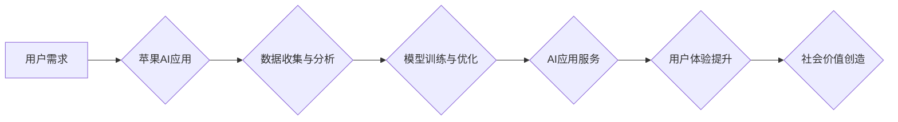

> 苹果, AI应用, 社会价值, 伦理, 责任, 创新, 影响

## 1. 背景介绍

近年来，人工智能（AI）技术飞速发展，已渗透到生活的方方面面。从智能手机的语音助手到自动驾驶汽车，AI正在改变着我们的生活方式。作为科技巨头，苹果也积极布局AI领域，并将其应用于其产品和服务中。2023年，苹果发布了一系列AI应用，引发了广泛的关注和讨论。

李开复，作为一位享誉全球的人工智能专家，对苹果发布AI应用的社会价值进行了深入的思考和分析。他认为，苹果的AI应用不仅具有强大的技术实力，更重要的是，它们能够为社会带来积极的影响，推动人类文明的进步。

## 2. 核心概念与联系

### 2.1 AI应用的本质

AI应用的核心是利用机器学习、深度学习等算法，使计算机能够模拟人类的智能行为，例如识别图像、理解语言、做出决策等。苹果的AI应用，例如Siri语音助手、Face ID人脸识别、智能推荐等，都基于这些核心技术。

### 2.2 苹果生态系统

苹果拥有庞大的用户群体和完善的生态系统，这为AI应用的推广和普及提供了坚实的基础。苹果的硬件、软件和服务相互协同，能够更好地发挥AI技术的优势。例如，iPhone手机强大的处理器和摄像头，配合苹果的AI算法，能够提供更精准的图像识别和语音识别体验。

### 2.3 社会价值

AI应用能够为社会带来诸多价值，例如：

* **提高效率:** AI可以自动化完成许多重复性任务，例如数据处理、客户服务等，从而提高工作效率。
* **改善生活:** AI可以帮助人们解决生活中的各种问题，例如导航、翻译、健康管理等，从而改善人们的生活质量。
* **促进创新:** AI可以为人类创造新的可能性，例如开发新的药物、设计新的产品等，从而推动社会创新。

**Mermaid 流程图**



## 3. 核心算法原理 & 具体操作步骤

### 3.1 算法原理概述

苹果的AI应用主要基于以下核心算法：

* **机器学习:** 是一种算法，通过学习数据中的模式，使计算机能够从数据中学习知识，并做出预测或决策。
* **深度学习:** 是一种更高级的机器学习算法，它使用多层神经网络来模拟人类大脑的学习过程，能够处理更复杂的数据，并取得更优的性能。

### 3.2 算法步骤详解

**机器学习算法步骤:**

1. **数据收集:** 收集大量相关数据，例如图像、文本、音频等。
2. **数据预处理:** 对数据进行清洗、转换、特征提取等操作，使其适合算法训练。
3. **模型选择:** 选择合适的机器学习算法，例如线性回归、逻辑回归、决策树等。
4. **模型训练:** 使用训练数据训练模型，调整模型参数，使其能够准确地预测或决策。
5. **模型评估:** 使用测试数据评估模型的性能，例如准确率、召回率、F1-score等。
6. **模型部署:** 将训练好的模型部署到实际应用场景中，例如服务器、移动设备等。

**深度学习算法步骤:**

1. **数据收集:** 与机器学习算法类似，需要收集大量相关数据。
2. **数据预处理:** 对数据进行清洗、转换、特征提取等操作。
3. **网络结构设计:** 设计多层神经网络的结构，例如卷积神经网络、循环神经网络等。
4. **模型训练:** 使用训练数据训练模型，调整模型参数，使其能够准确地预测或决策。
5. **模型评估:** 使用测试数据评估模型的性能。
6. **模型部署:** 将训练好的模型部署到实际应用场景中。

### 3.3 算法优缺点

**机器学习算法:**

* **优点:** 算法相对简单，易于理解和实现。
* **缺点:** 对于复杂的数据，性能可能不如深度学习算法。

**深度学习算法:**

* **优点:** 能够处理更复杂的数据，取得更优的性能。
* **缺点:** 算法复杂，需要大量的计算资源和训练数据。

### 3.4 算法应用领域

机器学习和深度学习算法广泛应用于各个领域，例如：

* **图像识别:** 用于识别物体、场景、人脸等。
* **语音识别:** 用于识别语音、翻译语言等。
* **自然语言处理:** 用于理解和生成文本，例如聊天机器人、机器翻译等。
* **推荐系统:** 用于推荐产品、服务、内容等。
* **医疗诊断:** 用于辅助医生诊断疾病。

## 4. 数学模型和公式 & 详细讲解 & 举例说明

### 4.1 数学模型构建

机器学习算法的核心是构建数学模型，将数据映射到预测结果。例如，线性回归模型可以表示为：

$$y = w_0 + w_1x_1 + w_2x_2 + ... + w_nx_n$$

其中：

* $y$ 是预测结果
* $w_0, w_1, w_2, ..., w_n$ 是模型参数
* $x_1, x_2, ..., x_n$ 是输入特征

### 4.2 公式推导过程

模型参数的学习过程通常使用梯度下降算法，通过不断调整参数，使模型预测结果与真实结果之间的误差最小化。梯度下降算法的核心公式为：

$$w_i = w_i - \alpha \frac{\partial Loss}{\partial w_i}$$

其中：

* $w_i$ 是模型参数
* $\alpha$ 是学习率
* $\frac{\partial Loss}{\partial w_i}$ 是损失函数对参数 $w_i$ 的梯度

### 4.3 案例分析与讲解

例如，假设我们想要预测房价，输入特征包括房屋面积、房间数量、地理位置等。我们可以使用线性回归模型构建数学模型，并使用梯度下降算法训练模型参数。通过训练，模型能够学习到房屋面积、房间数量、地理位置等特征与房价之间的关系，从而能够预测新房子的价格。

## 5. 项目实践：代码实例和详细解释说明

### 5.1 开发环境搭建

* 操作系统: macOS, Windows, Linux
* Python版本: 3.7+
* 库依赖: TensorFlow, PyTorch, scikit-learn

### 5.2 源代码详细实现

```python
# 导入必要的库
import tensorflow as tf

# 定义模型结构
model = tf.keras.models.Sequential([
    tf.keras.layers.Dense(64, activation='relu', input_shape=(784,)),
    tf.keras.layers.Dense(10, activation='softmax')
])

# 编译模型
model.compile(optimizer='adam',
              loss='sparse_categorical_crossentropy',
              metrics=['accuracy'])

# 训练模型
model.fit(x_train, y_train, epochs=10)

# 评估模型
loss, accuracy = model.evaluate(x_test, y_test)
print('Test loss:', loss)
print('Test accuracy:', accuracy)
```

### 5.3 代码解读与分析

这段代码实现了简单的深度学习模型训练。

* 首先，导入必要的库，例如TensorFlow。
* 然后，定义模型结构，包括输入层、隐藏层和输出层。
* 接着，编译模型，选择优化器、损失函数和评估指标。
* 接下来，训练模型，使用训练数据进行训练。
* 最后，评估模型，使用测试数据评估模型的性能。

### 5.4 运行结果展示

训练完成后，可以查看模型的训练损失和准确率，以及测试损失和准确率。

## 6. 实际应用场景

### 6.1 智能助手

苹果的Siri语音助手是AI应用的典型例子。Siri能够理解用户的语音指令，并执行相应的操作，例如发送短信、设置提醒、播放音乐等。

### 6.2 人脸识别

Face ID是苹果手机的人脸识别技术，它能够使用深度学习算法识别用户的面部特征，从而实现手机解锁、支付等功能。

### 6.3 智能推荐

苹果的App Store和iTunes Store都使用AI算法进行智能推荐，根据用户的历史行为和偏好，推荐相关的应用和音乐。

### 6.4 未来应用展望

随着AI技术的不断发展，苹果的AI应用将有更广泛的应用场景，例如：

* **医疗保健:** AI可以辅助医生诊断疾病、制定治疗方案。
* **教育:** AI可以个性化学习，为学生提供定制化的教学内容。
* **交通运输:** AI可以用于自动驾驶汽车、智能交通管理等。

## 7. 工具和资源推荐

### 7.1 学习资源推荐

* **在线课程:** Coursera, edX, Udacity
* **书籍:** 《深度学习》、《机器学习实战》
* **博客:** Towards Data Science, Machine Learning Mastery

### 7.2 开发工具推荐

* **Python:** 广泛用于AI开发
* **TensorFlow:** 开源深度学习框架
* **PyTorch:** 开源深度学习框架
* **Jupyter Notebook:** 用于代码编写和可视化

### 7.3 相关论文推荐

* **《ImageNet Classification with Deep Convolutional Neural Networks》**
* **《Attention Is All You Need》**
* **《BERT: Pre-training of Deep Bidirectional Transformers for Language Understanding》**

## 8. 总结：未来发展趋势与挑战

### 8.1 研究成果总结

苹果的AI应用取得了显著的成果，为社会带来了诸多价值。

### 8.2 未来发展趋势

AI技术将继续发展，苹果的AI应用也将更加智能化、个性化和泛化。

### 8.3 面临的挑战

AI技术也面临着一些挑战，例如：

* **数据隐私:** AI算法需要大量数据进行训练，如何保护用户数据隐私是一个重要问题。
* **算法偏见:** AI算法可能存在偏见，导致不公平的结果。
* **伦理问题:** AI技术的发展引发了一些伦理问题，例如人工智能的责任和义务。

### 8.4 研究展望

未来，需要加强对AI技术的伦理规范和法律监管，确保AI技术安全、可控和可持续发展。

## 9. 附录：常见问题与解答

### 9.1 如何选择合适的AI算法？

选择合适的AI算法取决于具体的应用场景和数据特点。

### 9.2 如何解决AI算法的偏见问题？

可以通过数据预处理、算法设计和模型评估等方式来解决AI算法的偏见问题。

### 9.3 如何保护用户数据隐私？

可以通过数据加密、匿名化和联邦学习等技术来保护用户数据隐私。


作者：禅与计算机程序设计艺术 / Zen and the Art of Computer Programming 
<end_of_turn>