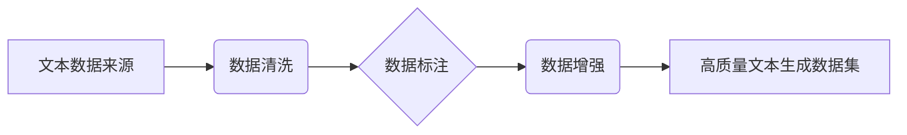

> 文本生成、数据集构建、自然语言处理、机器学习、深度学习、预训练模型、数据清洗、数据标注、数据增强

## 1. 背景介绍

文本生成任务是自然语言处理 (NLP) 领域的核心任务之一，它旨在训练模型能够根据给定的输入生成流畅、语法正确、语义相关的文本。近年来，随着深度学习技术的快速发展，文本生成模型取得了显著的进展，例如 GPT-3、BERT、T5 等模型在各种文本生成任务中展现出强大的能力，例如机器翻译、文本摘要、对话系统、代码生成等。

然而，高质量的文本生成模型的训练离不开高质量的数据集。数据集是模型学习和训练的基础，其质量直接影响模型的性能。构建高质量的文本生成数据集是一个复杂且耗时的过程，需要考虑数据来源、数据清洗、数据标注、数据增强等多个方面。

## 2. 核心概念与联系

文本生成任务的数据集构建主要涉及以下核心概念：

* **文本数据来源**: 数据集的来源可以是公开的文本语料库、网络爬虫抓取的数据、用户生成的内容等。
* **数据清洗**: 数据清洗是指对原始文本数据进行预处理，去除噪声、重复数据、格式错误等，以提高数据质量。
* **数据标注**: 数据标注是指为文本数据添加人工标签，例如文本类别、情感倾向、实体识别等，以便模型能够学习文本的语义信息。
* **数据增强**: 数据增强是指通过对文本数据进行一定的变换，例如 synonym replacement, back translation, paraphrasing 等，以增加数据集的规模和多样性。

这些核心概念相互关联，共同构成了文本生成任务的数据集构建流程。



## 3. 核心算法原理 & 具体操作步骤

### 3.1  算法原理概述

文本生成任务的数据集构建主要依赖于自然语言处理 (NLP) 算法和机器学习 (ML) 算法。

* **NLP 算法**: 用于文本预处理、分词、词性标注、依存句法分析等，帮助提取文本的语义信息。
* **ML 算法**: 用于数据标注、数据分类、数据聚类等，帮助构建高质量的文本生成数据集。

### 3.2  算法步骤详解

1. **数据收集**: 从公开的文本语料库、网络爬虫抓取的数据、用户生成的内容等来源收集文本数据。
2. **数据清洗**: 使用 NLP 算法对文本数据进行预处理，去除噪声、重复数据、格式错误等，并进行文本标准化，例如统一大小写、去除停用词等。
3. **数据标注**: 根据具体的文本生成任务，对文本数据进行人工标注，例如文本类别、情感倾向、实体识别等。
4. **数据增强**: 使用数据增强技术对文本数据进行变换，例如 synonym replacement, back translation, paraphrasing 等，以增加数据集的规模和多样性。
5. **数据评估**: 使用评估指标，例如 BLEU、ROUGE、Perplexity 等，评估数据集的质量和有效性。

### 3.3  算法优缺点

* **优点**: 可以构建高质量的文本生成数据集，提高模型的性能。
* **缺点**: 数据标注和数据增强需要人工参与，成本较高，且算法效果受数据质量影响。

### 3.4  算法应用领域

* **机器翻译**: 构建包含不同语言文本对的数据集，训练机器翻译模型。
* **文本摘要**: 构建包含原始文本和摘要对的数据集，训练文本摘要模型。
* **对话系统**: 构建包含对话历史和回复对的数据集，训练对话系统模型。
* **代码生成**: 构建包含代码和注释对的数据集，训练代码生成模型。

## 4. 数学模型和公式 & 详细讲解 & 举例说明

### 4.1  数学模型构建

文本生成任务的数据集构建可以看作是一个概率模型的构建过程。

假设我们有一个文本序列 $x = (x_1, x_2, ..., x_T)$，其中 $x_i$ 表示序列中第 i 个单词。我们的目标是学习一个概率分布 $P(x)$，能够预测给定输入序列 $x$ 的下一个单词 $x_{T+1}$。

### 4.2  公式推导过程

可以使用最大似然估计 (MLE) 方法来学习概率分布 $P(x)$。MLE 的目标是找到参数 $\theta$，使得模型在训练数据上的似然概率最大化。

$$
\theta = \arg \max_{\theta} \prod_{i=1}^{N} P(x^{(i)})
$$

其中，$N$ 是训练数据的样本数量，$x^{(i)}$ 表示第 i 个训练样本。

### 4.3  案例分析与讲解

例如，在机器翻译任务中，我们可以使用条件概率分布 $P(y|x)$ 来表示给定源语言文本 $x$ 的目标语言文本 $y$ 的概率。

$$
P(y|x) = \prod_{i=1}^{T'} P(y_i|y_{1:i-1}, x)
$$

其中，$T'$ 是目标语言文本的长度。

## 5. 项目实践：代码实例和详细解释说明

### 5.1  开发环境搭建

* Python 3.6+
* TensorFlow/PyTorch
* NLTK/SpaCy

### 5.2  源代码详细实现

```python
import nltk
from nltk.corpus import stopwords
from nltk.tokenize import word_tokenize

# 下载停用词列表
nltk.download('stopwords')

# 定义数据清洗函数
def clean_text(text):
    # 分词
    tokens = word_tokenize(text)
    # 去除停用词
    stop_words = set(stopwords.words('english'))
    tokens = [word for word in tokens if word.lower() not in stop_words]
    # 返回清洗后的文本
    return ' '.join(tokens)

# 示例代码
text = "This is a sample text for data cleaning."
cleaned_text = clean_text(text)
print(cleaned_text)
```

### 5.3  代码解读与分析

* 该代码首先使用 NLTK 库对文本进行分词和停用词去除。
* `word_tokenize()` 函数将文本分割成单词列表。
* `stopwords.words('english')` 函数返回英文停用词列表。
* 循环遍历单词列表，去除停用词，并使用 `' '.join()` 函数将单词列表重新拼接成字符串。

### 5.4  运行结果展示

```
sample text data cleaning
```

## 6. 实际应用场景

文本生成任务的数据集在各种实际应用场景中发挥着重要作用。

* **聊天机器人**: 构建包含对话历史和回复对的数据集，训练聊天机器人模型，使其能够进行自然流畅的对话。
* **内容创作**: 构建包含不同类型文章、故事、诗歌等文本的数据集，训练内容创作模型，使其能够生成高质量的文本内容。
* **代码生成**: 构建包含代码和注释对的数据集，训练代码生成模型，使其能够自动生成代码。

### 6.4  未来应用展望

随着人工智能技术的不断发展，文本生成任务的数据集将应用于更多领域，例如：

* **个性化教育**: 构建包含学生学习数据和个性化学习内容的数据集，训练个性化教育模型，为学生提供定制化的学习体验。
* **医疗诊断**: 构建包含患者病历和诊断结果的数据集，训练医疗诊断模型，辅助医生进行诊断。
* **法律文本生成**: 构建包含法律法规和案例判决的数据集，训练法律文本生成模型，自动生成法律文件。

## 7. 工具和资源推荐

### 7.1  学习资源推荐

* **斯坦福大学 NLP课程**: https://web.stanford.edu/class/cs224n/
* **DeepLearning.AI 自然语言处理课程**: https://www.deeplearning.ai/courses/natural-language-processing-specialization/

### 7.2  开发工具推荐

* **TensorFlow**: https://www.tensorflow.org/
* **PyTorch**: https://pytorch.org/
* **NLTK**: https://www.nltk.org/
* **SpaCy**: https://spacy.io/

### 7.3  相关论文推荐

* **BERT**: https://arxiv.org/abs/1810.04805
* **GPT-3**: https://openai.com/blog/gpt-3/
* **T5**: https://arxiv.org/abs/1910.10683

## 8. 总结：未来发展趋势与挑战

### 8.1  研究成果总结

近年来，文本生成任务取得了显著的进展，模型性能不断提升，应用场景不断拓展。

### 8.2  未来发展趋势

* **更强大的预训练模型**: 预训练模型的规模和能力将继续提升，例如 Transformer 架构的改进、参数量的增加等。
* **更细粒度的文本生成**: 模型将能够生成更细粒度的文本，例如特定风格、特定领域、特定情感的文本。
* **更安全的文本生成**: 模型将更加注重安全性，避免生成有害、偏见、虚假信息等文本。

### 8.3  面临的挑战

* **数据质量**: 高质量的文本生成数据集仍然是一个挑战，需要不断探索新的数据来源和数据标注方法。
* **模型可解释性**: 现有的文本生成模型往往是黑盒模型，难以解释模型的决策过程，这限制了模型的应用和信任度。
* **伦理问题**: 文本生成模型可能被用于生成虚假信息、进行网络攻击等恶意用途，需要关注模型的伦理问题。

### 8.4  研究展望

未来，文本生成任务的研究将继续深入，探索更强大的模型、更细粒度的生成、更安全的应用，并解决数据质量、模型可解释性和伦理问题等挑战。

## 9. 附录：常见问题与解答

* **如何评估文本生成数据集的质量？**

可以使用 BLEU、ROUGE、Perplexity 等评估指标来评估文本生成数据集的质量。

* **如何进行数据增强？**

常用的数据增强技术包括 synonym replacement, back translation, paraphrasing 等。

* **如何构建特定领域的文本生成数据集？**

需要根据特定领域的文本特点和需求，收集相关数据并进行数据标注。


作者：禅与计算机程序设计艺术 / Zen and the Art of Computer Programming 
<end_of_turn>