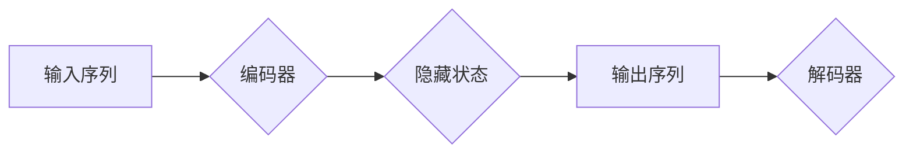

> Seq2Seq, 编码器-解码器, 自然语言处理, 机器翻译, 文本生成, 循环神经网络, 长短期记忆网络

## 1. 背景介绍

在人工智能领域，自然语言处理 (NLP) 始终是研究的热点之一。从机器翻译到文本摘要，从对话系统到问答机器人，Seq2Seq 编码器-解码器架构在众多 NLP 任务中展现出强大的能力。

传统的机器翻译方法通常依赖于统计模型和规则引擎，难以捕捉语言的复杂性和语义关系。随着深度学习的兴起，Seq2Seq 架构为机器翻译带来了革命性的改变。它将输入序列映射到输出序列，能够学习复杂的语言映射关系，从而实现更准确、更流畅的翻译。

## 2. 核心概念与联系

Seq2Seq 架构的核心思想是将一个序列映射到另一个序列。它由两个主要部分组成：编码器和解码器。

* **编码器:** 负责将输入序列编码成一个固定长度的向量表示，该向量包含了输入序列的信息摘要。
* **解码器:** 根据编码器的输出向量，生成目标序列。

**Mermaid 流程图:**



## 3. 核心算法原理 & 具体操作步骤

### 3.1  算法原理概述

Seq2Seq 架构的核心算法是循环神经网络 (RNN)，特别是长短期记忆网络 (LSTM) 或其变体。RNN 能够处理序列数据，并学习序列中元素之间的依赖关系。LSTM 则通过引入门控机制，能够更好地捕捉长距离依赖关系。

编码器和解码器都由多个 LSTM 层组成。编码器将输入序列逐个元素地处理，并将每个元素的隐藏状态拼接成一个向量表示。解码器则根据编码器的输出向量，逐个生成目标序列的元素。

### 3.2  算法步骤详解

1. **编码阶段:**
    * 将输入序列中的每个元素作为输入，依次传递给编码器的 LSTM 层。
    * 每个 LSTM 层会输出一个隐藏状态，该隐藏状态包含了该元素的信息以及之前元素的信息。
    * 将所有隐藏状态拼接成一个向量表示，作为编码器的输出。

2. **解码阶段:**
    * 将编码器的输出向量作为解码器的初始输入。
    * 解码器会根据输入向量，逐个生成目标序列的元素。
    * 在每个时间步，解码器会输出一个概率分布，表示生成下一个元素的可能性。
    * 根据概率分布选择最可能的元素，并将其添加到目标序列中。
    * 将生成的元素作为解码器的下一个输入，继续生成下一个元素。

### 3.3  算法优缺点

**优点:**

* 能够处理任意长度的输入和输出序列。
* 能够学习复杂的语言映射关系。
* 在机器翻译、文本摘要、对话系统等 NLP 任务中取得了优异的性能。

**缺点:**

* 训练过程复杂，需要大量的训练数据。
* 对于长序列数据，可能存在梯度消失或梯度爆炸的问题。

### 3.4  算法应用领域

Seq2Seq 架构在 NLP 领域有着广泛的应用，包括：

* **机器翻译:** 将一种语言翻译成另一种语言。
* **文本摘要:** 将长文本压缩成短文本摘要。
* **对话系统:** 建立人机对话系统，实现自然流畅的对话。
* **问答机器人:** 回答用户提出的问题。
* **文本生成:** 生成各种类型的文本，例如诗歌、小说、新闻报道等。

## 4. 数学模型和公式 & 详细讲解 & 举例说明

### 4.1  数学模型构建

Seq2Seq 架构的数学模型可以概括为以下公式：

* **编码器输出:**  $h_t = f(x_t, h_{t-1})$
* **解码器输出:** $y_t = g(h_t, y_{t-1})$

其中:

* $x_t$ 是输入序列的第 $t$ 个元素。
* $h_t$ 是编码器在第 $t$ 个时间步的隐藏状态。
* $y_t$ 是解码器在第 $t$ 个时间步生成的输出元素。
* $f$ 和 $g$ 分别是编码器和解码器的激活函数。

### 4.2  公式推导过程

编码器和解码器都使用循环神经网络 (RNN) 实现，其核心思想是通过隐藏状态 $h_t$ 来捕捉序列信息。

* 编码器: 对于输入序列 $x = (x_1, x_2, ..., x_n)$，编码器会依次处理每个元素，并更新隐藏状态。最终的隐藏状态 $h_n$ 包含了整个输入序列的信息。

* 解码器: 解码器接收编码器的输出 $h_n$ 作为初始输入，并根据 $h_n$ 和之前生成的输出 $y_{t-1}$，生成下一个输出元素 $y_t$。

### 4.3  案例分析与讲解

假设我们想要使用 Seq2Seq 架构进行机器翻译，将英文句子 "The cat sat on the mat" 翻译成中文。

* 编码器会将英文句子中的每个单词作为输入，并将其编码成一个向量表示。
* 解码器会根据编码器的输出向量，逐个生成中文句子的单词。

最终，解码器会生成中文句子 "猫坐在垫子上"。

## 5. 项目实践：代码实例和详细解释说明

### 5.1  开发环境搭建

* Python 3.6+
* TensorFlow 或 PyTorch
* CUDA 和 cuDNN (可选，用于 GPU 加速)

### 5.2  源代码详细实现

```python
import tensorflow as tf

# 定义编码器模型
class Encoder(tf.keras.Model):
    def __init__(self, vocab_size, embedding_dim, hidden_dim):
        super(Encoder, self).__init__()
        self.embedding = tf.keras.layers.Embedding(vocab_size, embedding_dim)
        self.lstm = tf.keras.layers.LSTM(hidden_dim)

    def call(self, inputs):
        embedded = self.embedding(inputs)
        output, state = self.lstm(embedded)
        return output, state

# 定义解码器模型
class Decoder(tf.keras.Model):
    def __init__(self, vocab_size, embedding_dim, hidden_dim):
        super(Decoder, self).__init__()
        self.embedding = tf.keras.layers.Embedding(vocab_size, embedding_dim)
        self.lstm = tf.keras.layers.LSTM(hidden_dim)
        self.dense = tf.keras.layers.Dense(vocab_size)

    def call(self, inputs, state):
        embedded = self.embedding(inputs)
        output, state = self.lstm(embedded, initial_state=state)
        output = self.dense(output)
        return output, state

# 定义 Seq2Seq 模型
class Seq2Seq(tf.keras.Model):
    def __init__(self, encoder, decoder):
        super(Seq2Seq, self).__init__()
        self.encoder = encoder
        self.decoder = decoder

    def call(self, inputs, targets):
        encoder_output, encoder_state = self.encoder(inputs)
        decoder_output, _ = self.decoder(targets, encoder_state)
        return decoder_output

# 实例化模型
encoder = Encoder(vocab_size=10000, embedding_dim=128, hidden_dim=256)
decoder = Decoder(vocab_size=10000, embedding_dim=128, hidden_dim=256)
model = Seq2Seq(encoder, decoder)

# 训练模型
model.compile(optimizer='adam', loss='sparse_categorical_crossentropy')
model.fit(train_data, train_targets, epochs=10)
```

### 5.3  代码解读与分析

* 编码器和解码器分别使用 LSTM 层实现，并包含嵌入层、全连接层等。
* 编码器将输入序列编码成一个向量表示，解码器根据编码器的输出向量生成目标序列。
* Seq2Seq 模型将编码器和解码器组合在一起，并使用 Adam 优化器和交叉熵损失函数进行训练。

### 5.4  运行结果展示

训练完成后，可以将模型应用于新的输入序列，并生成对应的输出序列。

## 6. 实际应用场景

Seq2Seq 架构在 NLP 领域有着广泛的应用，例如：

* **机器翻译:** Google Translate、DeepL 等机器翻译系统都使用了 Seq2Seq 架构。
* **文本摘要:** BART、T5 等文本摘要模型都基于 Seq2Seq 架构。
* **对话系统:** ChatGPT、LaMDA 等对话系统也采用了 Seq2Seq 架构。

### 6.4  未来应用展望

随着深度学习技术的不断发展，Seq2Seq 架构在未来将有更广泛的应用，例如：

* **代码生成:** 使用 Seq2Seq 架构生成代码，提高软件开发效率。
* **药物研发:** 使用 Seq2Seq 架构预测药物的活性，加速药物研发过程。
* **个性化教育:** 使用 Seq2Seq 架构生成个性化的学习内容，提高教育效率。

## 7. 工具和资源推荐

### 7.1  学习资源推荐

* **书籍:**
    * "Deep Learning" by Ian Goodfellow, Yoshua Bengio, and Aaron Courville
    * "Speech and Language Processing" by Daniel Jurafsky and James H. Martin
* **在线课程:**
    * Coursera: "Natural Language Processing Specialization"
    * Udacity: "Deep Learning Nanodegree"

### 7.2  开发工具推荐

* **TensorFlow:** https://www.tensorflow.org/
* **PyTorch:** https://pytorch.org/
* **Hugging Face Transformers:** https://huggingface.co/transformers/

### 7.3  相关论文推荐

* "Sequence to Sequence Learning with Neural Networks" by Sutskever et al. (2014)
* "Attention Is All You Need" by Vaswani et al. (2017)
* "BERT: Pre-training of Deep Bidirectional Transformers for Language Understanding" by Devlin et al. (2018)

## 8. 总结：未来发展趋势与挑战

### 8.1  研究成果总结

Seq2Seq 架构在 NLP 领域取得了显著的成果，为机器翻译、文本摘要、对话系统等任务带来了革命性的改变。

### 8.2  未来发展趋势

* **更强大的模型:** 研究人员将继续探索更强大的模型架构，例如 Transformer、T5 等，以提高模型的性能和效率。
* **更丰富的应用场景:** Seq2Seq 架构将应用于更多领域，例如代码生成、药物研发、个性化教育等。
* **更有效的训练方法:** 研究人员将继续探索更有效的训练方法，例如自监督学习、迁移学习等，以降低模型训练成本。

### 8.3  面临的挑战

* **数据稀缺:** 许多 NLP 任务的数据量有限，这限制了模型的训练效果。
* **计算资源:** 训练大型语言模型需要大量的计算资源，这对于资源有限的机构来说是一个挑战。
* **伦理问题:** 随着人工智能技术的进步，也带来了伦理问题，例如模型的偏见、虚假信息生成等，需要引起重视。

### 8.4  研究展望

未来，Seq2Seq 架构将继续朝着更强大、更灵活、更安全的方向发展，为人类社会带来更多价值。

## 9. 附录：常见问题与解答

* **Q: Seq2Seq 架构的编码器和解码器分别做什么？**
* **A:** 编码器负责将输入序列编码成一个向量表示，解码器根据编码器的输出向量生成目标序列。
* **Q: Seq2Seq 架构如何处理长序列数据？