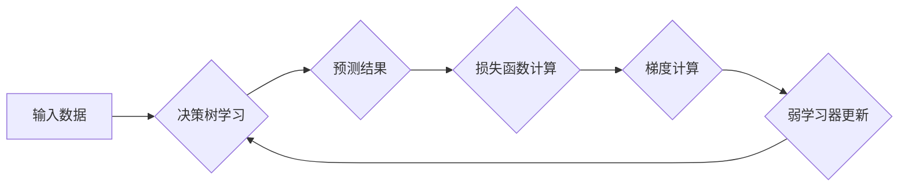

> 梯度提升，决策树，GBDT，机器学习，算法原理，代码实现，实践应用

## 1. 背景介绍

在机器学习领域，分类和回归任务占据着重要地位。为了提升模型的预测精度，人们不断探索新的算法和方法。梯度提升决策树（Gradient Boosting Decision Tree，简称GBDT）作为一种强大的机器学习算法，凭借其高精度和广泛的应用场景，在近年来备受关注。

GBDT算法的核心思想是通过迭代地构建多个弱学习器（通常是决策树），并通过加权求和的方式组合这些弱学习器，最终形成一个强学习器。每个弱学习器都试图学习前一轮弱学习器的错误，从而不断提升模型的整体性能。

## 2. 核心概念与联系

**2.1 决策树**

决策树是一种树形结构的分类或回归模型，通过一系列的决策节点和分支，将数据划分为不同的类别或预测连续值。

**2.2 梯度提升**

梯度提升是一种迭代算法，其核心思想是利用梯度下降法不断优化模型参数。在GBDT算法中，梯度提升用于更新每个弱学习器的权重，使得模型朝着更准确的方向发展。

**2.3 弱学习器**

弱学习器是指性能略逊于随机猜测的学习器，例如决策树的深度限制为1。GBDT算法通过组合多个弱学习器，提升模型的整体性能。

**2.4 强学习器**

强学习器是指性能优于随机猜测的学习器，通常由多个弱学习器组合而成。GBDT算法最终的目标是构建一个强学习器，以实现更高的预测精度。

**2.5 损失函数**

损失函数用于衡量模型预测结果与真实值的差距。GBDT算法选择合适的损失函数，并利用梯度下降法不断优化模型参数，以最小化损失函数的值。

**2.6 正则化**

正则化技术用于防止模型过拟合，即模型在训练数据上表现良好，但在测试数据上表现较差。GBDT算法通常采用L1或L2正则化，以控制模型的复杂度，提高模型的泛化能力。

**2.7 流程图**



## 3. 核心算法原理 & 具体操作步骤

### 3.1 算法原理概述

GBDT算法的核心思想是通过迭代地构建多个弱学习器，并通过加权求和的方式组合这些弱学习器，最终形成一个强学习器。每个弱学习器都试图学习前一轮弱学习器的错误，从而不断提升模型的整体性能。

具体来说，GBDT算法的训练过程可以分为以下几个步骤：

1. **初始化:** 使用一个简单的模型，例如平均值或常数，作为初始预测结果。
2. **迭代:** 对于每个迭代轮次，计算当前模型的残差，即预测结果与真实值的差值。
3. **拟合:** 使用决策树模型拟合残差，得到一个新的弱学习器。
4. **更新:** 将新的弱学习器添加到模型中，并根据其性能调整其权重。
5. **重复:** 重复步骤2-4，直到达到预设的迭代次数或模型性能不再提升。

### 3.2 算法步骤详解

1. **初始化:** 首先，使用一个简单的模型，例如平均值或常数，作为初始预测结果。

2. **残差计算:** 计算当前模型的预测结果与真实值的差值，即残差。残差代表了模型在当前迭代轮次中需要改进的部分。

3. **决策树拟合:** 使用决策树模型拟合残差，得到一个新的弱学习器。决策树的深度和复杂度可以根据实际情况进行调整。

4. **权重更新:** 将新的弱学习器添加到模型中，并根据其性能调整其权重。权重更新的目标是使得模型的整体性能得到提升。

5. **迭代:** 重复步骤2-4，直到达到预设的迭代次数或模型性能不再提升。

### 3.3 算法优缺点

**优点:**

* **高精度:** GBDT算法通常能够达到较高的预测精度，尤其是在分类和回归任务中。
* **灵活度高:** GBDT算法可以处理各种类型的特征，包括连续型、离散型和类别型特征。
* **可解释性强:** 决策树模型的结构相对简单，可以直观地理解模型的决策过程。

**缺点:**

* **训练时间长:** GBDT算法的训练过程相对耗时，尤其是在数据量较大时。
* **过拟合风险:** 如果决策树的深度过大，或者迭代次数过多，GBDT算法可能会出现过拟合现象。

### 3.4 算法应用领域

GBDT算法在许多领域都有广泛的应用，例如：

* **金融领域:** 欺诈检测、信用评分、风险评估
* **电商领域:** 商品推荐、用户画像、点击率预测
* **医疗领域:** 疾病诊断、患者风险预测、药物研发
* **自然语言处理:** 文本分类、情感分析、机器翻译

## 4. 数学模型和公式 & 详细讲解 & 举例说明

### 4.1 数学模型构建

GBDT算法的目标是学习一个能够最小化损失函数的强学习器。假设我们有训练数据$(x_1, y_1), (x_2, y_2), ..., (x_N, y_N)$, 其中$x_i$是输入特征，$y_i$是目标值。GBDT算法的目标函数可以表示为：

$$
F(x) = \sum_{m=1}^{M} \alpha_m h_m(x)
$$

其中：

* $F(x)$是强学习器的预测结果
* $M$是弱学习器的数量
* $\alpha_m$是第$m$个弱学习器的权重
* $h_m(x)$是第$m$个弱学习器的预测结果

### 4.2 公式推导过程

GBDT算法利用梯度下降法不断优化模型参数。具体来说，在每个迭代轮次中，GBDT算法会计算当前模型的残差，并利用残差的梯度来更新弱学习器的权重。

假设损失函数为$L(y, F(x))$, 则梯度下降法的更新公式为：

$$
\alpha_m = \arg \min_{\alpha} \sum_{i=1}^{N} L(y_i, F(x_i) + \alpha h_m(x_i))
$$

其中：

* $\alpha$是需要优化的参数

### 4.3 案例分析与讲解

假设我们有一个简单的回归问题，目标是预测房屋价格。GBDT算法可以将房屋价格预测问题分解成多个子问题，每个子问题都试图预测房屋价格的残差。

例如，在第一个迭代轮次中，GBDT算法会使用一个简单的模型，例如平均值，作为初始预测结果。然后，它会计算预测结果与真实值的差值，即残差。接着，GBDT算法会使用决策树模型拟合残差，得到一个新的弱学习器。

在第二个迭代轮次中，GBDT算法会将第一个弱学习器的预测结果与真实值相加，作为新的预测结果。然后，它会计算新的预测结果与真实值的差值，即残差。接着，GBDT算法会使用决策树模型拟合残差，得到一个新的弱学习器。

这个过程会重复进行多次，直到达到预设的迭代次数或模型性能不再提升。最终，GBDT算法会得到一个强学习器，能够准确地预测房屋价格。

## 5. 项目实践：代码实例和详细解释说明

### 5.1 开发环境搭建

为了实现GBDT算法，我们可以使用Python语言和相应的机器学习库，例如XGBoost或LightGBM。

**依赖库:**

```python
pip install xgboost
```

### 5.2 源代码详细实现

```python
import xgboost as xgb
from sklearn.datasets import load_boston
from sklearn.model_selection import train_test_split
from sklearn.metrics import mean_squared_error

# 加载数据
boston = load_boston()
X = boston.data
y = boston.target

# 数据划分
X_train, X_test, y_train, y_test = train_test_split(X, y, test_size=0.2, random_state=42)

# 创建GBDT模型
model = xgb.XGBRegressor(objective='reg:squarederror', n_estimators=100, learning_rate=0.1)

# 模型训练
model.fit(X_train, y_train)

# 模型预测
y_pred = model.predict(X_test)

# 模型评估
mse = mean_squared_error(y_test, y_pred)
print(f'Mean Squared Error: {mse}')
```

### 5.3 代码解读与分析

1. **数据加载和预处理:** 使用`load_boston()`函数加载波士顿房价数据集，并将数据分为训练集和测试集。

2. **模型创建:** 使用`xgb.XGBRegressor()`函数创建GBDT模型，并设置模型参数，例如目标函数、弱学习器的数量和学习率。

3. **模型训练:** 使用`model.fit()`函数训练GBDT模型，将训练数据作为输入。

4. **模型预测:** 使用`model.predict()`函数对测试数据进行预测。

5. **模型评估:** 使用`mean_squared_error()`函数计算模型的均方误差，作为模型性能的指标。

### 5.4 运行结果展示

运行上述代码后，会输出模型的均方误差值。

## 6. 实际应用场景

GBDT算法在许多实际应用场景中都取得了优异的性能，例如：

### 6.1 金融领域

* **欺诈检测:** GBDT算法可以用于识别信用卡欺诈交易，通过分析交易数据中的异常特征，识别潜在的欺诈行为。
* **信用评分:** GBDT算法可以用于评估借款人的信用风险，通过分析借款人的财务状况和历史记录，预测其还款能力。
* **风险评估:** GBDT算法可以用于评估投资项目的风险，通过分析项目的财务数据和市场环境，预测其潜在的收益和损失。

### 6.2 电商领域

* **商品推荐:** GBDT算法可以用于推荐用户可能感兴趣的商品，通过分析用户的购买历史和浏览记录，预测其潜在的需求。
* **用户画像:** GBDT算法可以用于构建用户的画像，通过分析用户的行为数据和特征，了解用户的兴趣爱好和消费习惯。
* **点击率预测:** GBDT算法可以用于预测用户点击广告的概率，通过分析广告的特征和用户的行为数据，优化广告投放策略。

### 6.3 医疗领域

* **疾病诊断:** GBDT算法可以用于辅助医生诊断疾病，通过分析患者的症状、检查结果和病史，预测其患病概率。
* **患者风险预测:** GBDT算法可以用于预测患者的风险，例如院感风险、并发症风险等，帮助医生制定相应的治疗方案。
* **药物研发:** GBDT算法可以用于药物研发，通过分析药物的结构和生物活性，预测其疗效和安全性。

### 6.4 未来应用展望

随着机器学习技术的不断发展，GBDT算法在未来将有更广泛的应用场景，例如：

* **自动驾驶:** GBDT算法可以用于自动驾驶系统的决策控制，例如路径规划、障碍物避让等。
* **自然语言处理:** GBDT算法可以用于更复杂的自然语言处理任务，例如机器翻译、文本摘要等。
* **个性化推荐:** GBDT算法可以用于提供更个性化的推荐服务，例如个性化新闻推荐、个性化商品推荐等。

## 7. 工具和资源推荐

### 7