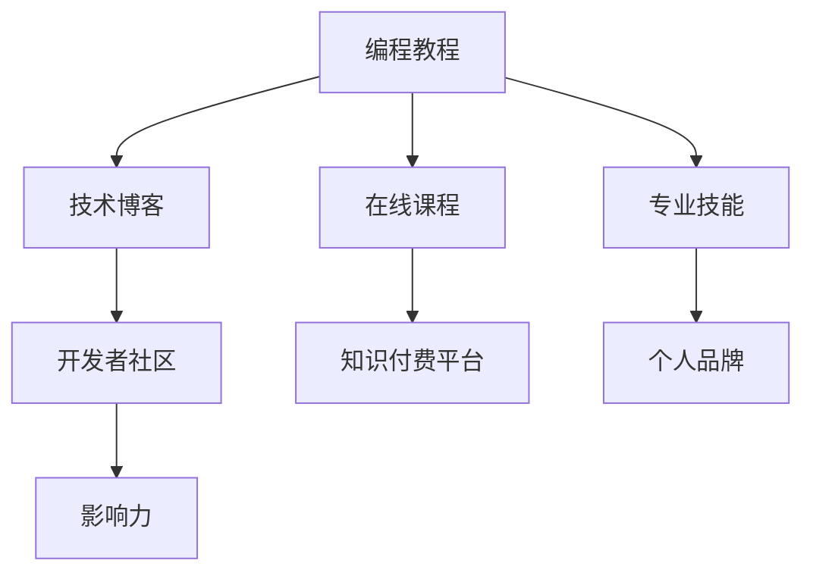

                 

# 程序员如何利用知识付费打造个人影响力

> 关键词：知识付费, 编程教程, 开发者社区, 技术博客, 在线课程, 专业技能, 个人品牌, 影响力

## 1. 背景介绍

在知识经济快速发展的今天，知识付费成为了一个热门话题。对于程序员而言，如何利用知识付费打造个人影响力，不仅关乎职业发展，也是实现价值变现的重要途径。本文将从背景介绍、核心概念、算法原理、项目实践、应用场景、工具资源、未来展望和常见问题等八个方面，深入探讨程序员如何利用知识付费打造个人影响力。

## 2. 核心概念与联系

### 2.1 核心概念概述

本文涉及的核心概念主要包括：

- **知识付费**：通过付费方式获取有价值的知识、技术和信息，从而提升个人或组织的竞争力。
- **编程教程**：涵盖编程语言、开发框架、算法数据结构等内容，为程序员提供系统学习路径。
- **开发者社区**：程序员通过参与社区讨论、交流经验，提升技术水平，并建立个人品牌。
- **技术博客**：程序员通过撰写技术文章，分享技术见解，提高专业影响力。
- **在线课程**：提供系统的、结构化的编程知识，帮助新手快速入门，提升开发者技能。
- **专业技能**：针对特定编程语言或技术的深入研究与实践。
- **个人品牌**：程序员通过技术输出、公开演讲等形式，建立专业形象，提升市场价值。
- **影响力**：通过知识分享、技术贡献等方式，在业界建立广泛影响力，获取更多机会。

这些概念之间相互关联，共同构成程序员利用知识付费打造个人影响力的完整框架。

### 2.2 核心概念原理和架构的 Mermaid 流程图



## 3. 核心算法原理 & 具体操作步骤

### 3.1 算法原理概述

程序员利用知识付费打造个人影响力的核心算法原理主要包括以下几点：

1. **价值交换**：知识付费平台通过提供高质量的编程教程、在线课程等资源，与用户进行价值交换。
2. **技能提升**：程序员通过付费获取这些资源，提升自身的专业技能。
3. **品牌建设**：在技术博客、开发者社区等平台分享专业知识，逐步建立个人品牌。
4. **影响力扩大**：通过品牌影响力，获取更多的职业机会，实现价值变现。

### 3.2 算法步骤详解

#### 3.2.1 选择平台

首先，选择合适的知识付费平台。目前市面上常见的平台包括但不限于：

- **Udemy**：提供多种编程语言和技术栈的课程，价格相对亲民。
- **Coursera**：与各大高校合作，提供高质量的课程和认证。
- **Udacity**：注重实践项目，提供就业导向的项目课程。
- **Pluralsight**：提供专业技能培训，适合技能提升和职业发展。

#### 3.2.2 规划学习路径

根据个人职业发展需求，制定系统的学习路径。建议步骤包括：

1. **基础入门**：选择基础编程语言和开发框架的课程，打好基础。
2. **进阶学习**：学习高级技术，如数据结构、算法、网络编程等。
3. **项目实践**：通过实际项目积累经验，提升解决问题的能力。
4. **技能认证**：获取相关证书，提升职业竞争力。

#### 3.2.3 实践与输出

通过编程教程、技术博客等形式，不断实践和输出所学知识。建议步骤包括：

1. **实践项目**：通过实际项目应用所学知识，加深理解。
2. **撰写博客**：在技术博客或个人网站撰写技术文章，分享学习心得和实践经验。
3. **参与社区**：在开发者社区如GitHub、Stack Overflow等平台，参与讨论和问题解决，积累经验和影响力。

### 3.3 算法优缺点

#### 3.3.1 优点

1. **系统学习**：通过付费平台获取系统化的编程知识和技能，避免盲目自学。
2. **快速提升**：有针对性的课程和实践项目，能够快速提升专业技能。
3. **专家指导**：平台上的讲师通常是行业专家，提供高质量的指导和反馈。
4. **社区支持**：通过社区交流，获得实时帮助和资源支持。
5. **品牌建设**：通过技术输出和社区参与，逐步建立个人品牌。

#### 3.3.2 缺点

1. **成本较高**：付费平台的课程和资源通常价格不菲，需要一定的经济投入。
2. **时间投入**：系统学习需要大量时间，初学者可能难以坚持。
3. **学习自主性**：付费平台的课程内容固定，学习过程缺乏灵活性和自主性。
4. **实践不足**：课程往往侧重理论学习，实际项目实践机会较少。
5. **平台选择**：需要选择合适的平台，找到适合自己的学习资源。

### 3.4 算法应用领域

知识付费的应用领域广泛，程序员可以结合自身职业发展需求，选择相应的应用领域。例如：

- **技术栈学习**：通过知识付费平台获取特定技术栈的知识，如Java、Python、React等。
- **技术深度挖掘**：针对某一技术领域进行深入研究，如人工智能、区块链、大数据等。
- **项目实践**：通过付费平台获取项目实战课程，积累项目经验。
- **职业发展**：利用知识付费平台的职业发展资源，如就业指导、简历优化等。

## 4. 数学模型和公式 & 详细讲解 & 举例说明

### 4.1 数学模型构建

设程序员i在某知识付费平台P上，每天用于学习的时间为t_i（单位：小时），平台提供的课程内容为c_i（单位：Gb），课程价格为p_i（单位：元），程序员i的学习效率为e_i（单位：小时/课程），i的学习效果为s_i（单位：技能提升量），i的社交影响力为f_i（单位：影响力值），则数学模型可表示为：

$$
s_i = e_i \times t_i \times c_i
$$

$$
f_i = k \times s_i
$$

其中k为影响力系数，反映了学习效果对社交影响力的影响。

### 4.2 公式推导过程

对于程序员i，每天学习获得的技能提升量为：

$$
s_i = e_i \times t_i \times c_i
$$

而社交影响力f_i的计算公式为：

$$
f_i = k \times s_i
$$

代入s_i的公式，得到：

$$
f_i = k \times e_i \times t_i \times c_i
$$

这一模型展示了学习时间、学习效率、课程内容和影响力系数对社交影响力的综合影响。

### 4.3 案例分析与讲解

假设某程序员i每天投入4小时学习，学习效率为0.5小时/课程，平台提供的课程量为10Gb，每门课程价格为500元，影响力系数k为0.8。则每天的学习效果s_i为：

$$
s_i = 0.5 \times 4 \times 10 = 20
$$

社交影响力f_i为：

$$
f_i = 0.8 \times 20 = 16
$$

这表明，该程序员每天通过付费平台的学习，不仅能提升专业技能，还能显著提升社交影响力。

## 5. 项目实践：代码实例和详细解释说明

### 5.1 开发环境搭建

首先，确保开发环境满足以下条件：

1. **编程语言**：建议使用Python，因为Python在知识付费领域的应用广泛。
2. **IDE**：建议使用PyCharm或VSCode，这两款IDE都支持Python开发，功能强大，界面友好。
3. **开发框架**：建议使用Flask或Django，这两个框架都可以快速搭建Web应用，实现技术博客和开发者社区功能。
4. **数据库**：建议使用MySQL或PostgreSQL，因为这两种数据库在Web应用中应用广泛，性能稳定。

### 5.2 源代码详细实现

下面是一个简单的技术博客实现代码示例：

```python
from flask import Flask, render_template

app = Flask(__name__)

@app.route('/')
def index():
    return render_template('index.html')

if __name__ == '__main__':
    app.run(debug=True)
```

这段代码创建了一个Flask应用，定义了一个首页路由，并启动了应用。在实际开发中，需要根据需求扩展应用的功能，如添加文章管理、用户认证、社区讨论等模块。

### 5.3 代码解读与分析

上述代码实现了一个简单的技术博客应用，核心步骤如下：

1. **安装Flask**：通过pip安装Flask框架，即可在Python中创建Web应用。
2. **创建应用实例**：使用Flask类创建应用实例app，定义路由函数。
3. **定义路由**：使用@app.route装饰器定义路由函数，返回模板文件。
4. **启动应用**：调用app.run方法启动应用，并设置debug=True，开启调试模式。

### 5.4 运行结果展示

运行上述代码后，在浏览器中访问http://127.0.0.1:5000/，即可访问技术博客首页。在实际开发中，可以添加更多功能，如文章管理、用户认证、社区讨论等，提升用户体验。

## 6. 实际应用场景

### 6.1 技术博客与知识分享

通过技术博客分享编程知识，不仅能够展示个人的技术实力，还能吸引潜在的用户和合作伙伴。例如，某程序员在GitHub上贡献了大量的开源代码，并在博客上分享编程心得，逐渐积累了一群忠实的粉丝，并成功拿到了一份高薪工作。

### 6.2 开发者社区与交流

通过参与开发者社区，程序员可以与其他开发者交流经验，解决技术难题。例如，某程序员在Stack Overflow上积极回答问题，帮助他人解决问题，逐渐建立了社区领袖的声誉，并成为一家知名企业的技术顾问。

### 6.3 在线课程与技能提升

通过在线课程学习，程序员可以快速提升专业技能。例如，某程序员通过Udacity的机器学习课程，掌握了深度学习技术，并在工作中成功应用，获得了显著的业绩提升。

### 6.4 未来应用展望

未来，随着知识付费市场的进一步成熟，程序员可以通过更多的方式实现个人影响力的提升：

1. **多平台整合**：将编程教程、技术博客、开发者社区等多平台整合，形成一个完整的知识生态系统。
2. **社区众筹**：利用社区众筹模式，实现知识的按需定制和快速迭代。
3. **虚拟现实**：利用虚拟现实技术，提供沉浸式的编程学习体验。
4. **AI辅助**：引入AI技术，如自然语言处理、推荐系统等，提升知识付费平台的用户体验。
5. **全球化**：知识付费市场全球化，为程序员提供更多的学习资源和职业机会。

## 7. 工具和资源推荐

### 7.1 学习资源推荐

为了帮助程序员更好地利用知识付费，推荐以下学习资源：

1. **Udemy**：提供多种编程语言和技术栈的课程，价格相对亲民。
2. **Coursera**：与各大高校合作，提供高质量的课程和认证。
3. **Udacity**：注重实践项目，提供就业导向的项目课程。
4. **Pluralsight**：提供专业技能培训，适合技能提升和职业发展。
5. **freeCodeCamp**：提供免费的编程课程，适合新手快速入门。
6. **LeetCode**：提供算法和数据结构练习，适合提升编程能力。

### 7.2 开发工具推荐

为了提高程序员的开发效率，推荐以下开发工具：

1. **PyCharm**：功能强大、界面友好的IDE，支持Python开发。
2. **VSCode**：轻量级、可扩展的IDE，支持Python和多种编程语言。
3. **GitHub**：全球最大的代码托管平台，提供代码管理、协作功能。
4. **Git**：分布式版本控制系统，支持多人协作开发。
5. **Docker**：容器化技术，支持应用程序的快速部署和扩展。

### 7.3 相关论文推荐

为了深入理解知识付费对程序员的影响，推荐以下相关论文：

1. **《知识付费：新时代的教育模式》**：讨论知识付费在教育领域的应用和发展。
2. **《技术博客对程序员职业发展的影响》**：分析技术博客对程序员职业发展的影响和作用。
3. **《开发者社区中的知识传播和交流》**：研究开发者社区对知识传播和交流的促进作用。
4. **《在线课程对编程技能提升的影响》**：分析在线课程对编程技能提升的效果和影响。
5. **《编程教程和实践项目对职业发展的贡献》**：讨论编程教程和实践项目对程序员职业发展的作用。

## 8. 总结：未来发展趋势与挑战

### 8.1 研究成果总结

本文探讨了程序员如何利用知识付费打造个人影响力，并从背景介绍、核心概念、算法原理、项目实践、应用场景、工具资源、未来展望和常见问题等八个方面进行了详细阐述。

### 8.2 未来发展趋势

未来知识付费领域的发展趋势包括：

1. **个性化定制**：利用AI技术，提供个性化的编程课程和实践项目，满足不同用户的需求。
2. **跨平台整合**：将编程教程、技术博客、开发者社区等多平台整合，形成一个完整的知识生态系统。
3. **虚拟现实**：利用虚拟现实技术，提供沉浸式的编程学习体验。
4. **全球化**：知识付费市场全球化，为程序员提供更多的学习资源和职业机会。
5. **AI辅助**：引入AI技术，提升知识付费平台的用户体验。

### 8.3 面临的挑战

程序员在利用知识付费打造个人影响力的过程中，面临以下挑战：

1. **成本较高**：付费平台的课程和资源通常价格不菲，需要一定的经济投入。
2. **时间投入**：系统学习需要大量时间，初学者可能难以坚持。
3. **学习自主性**：付费平台的课程内容固定，学习过程缺乏灵活性和自主性。
4. **实践不足**：课程往往侧重理论学习，实际项目实践机会较少。
5. **平台选择**：需要选择合适的平台，找到适合自己的学习资源。

### 8.4 研究展望

未来的研究可以从以下几个方向进行：

1. **学习效果评估**：研究如何评估学习效果，提升学习质量。
2. **职业发展模型**：建立职业发展模型，量化技术输出对职业发展的影响。
3. **影响力传播模型**：研究如何提升社交影响力，建立有效的传播模型。
4. **数据驱动决策**：利用大数据技术，分析知识付费市场的发展趋势，指导决策。
5. **社区互动研究**：研究社区互动对知识传播和交流的影响，提升社区活跃度。

总之，程序员利用知识付费打造个人影响力，需要在知识付费平台、编程教程、技术博客、开发者社区等多个方面进行综合施策，不断提升个人品牌和社交影响力，最终实现职业发展目标。

## 9. 附录：常见问题与解答

**Q1：程序员应该选择哪些知识付费平台？**

A: 选择知识付费平台时，需要考虑平台的课程质量、教学资源、社区活跃度、价格等因素。通常，Udemy、Coursera、Udacity等平台提供的课程质量较高，适合系统学习。freeCodeCamp、LeetCode等平台提供的免费课程和练习项目，适合快速入门和巩固基础。

**Q2：如何制定个人学习路径？**

A: 制定个人学习路径时，需要结合自身的职业发展需求和兴趣方向，制定系统化的学习计划。建议步骤包括：

1. **基础入门**：选择基础编程语言和开发框架的课程，打好基础。
2. **进阶学习**：学习高级技术，如数据结构、算法、网络编程等。
3. **项目实践**：通过实际项目应用所学知识，加深理解。
4. **技能认证**：获取相关证书，提升职业竞争力。

**Q3：如何提升技术博客的影响力？**

A: 提升技术博客的影响力，需要从内容质量、推广方式、互动交流等多个方面进行优化：

1. **高质量内容**：提供高质量、有价值的编程知识，解决实际问题。
2. **多渠道推广**：通过社交媒体、技术社区、邮件列表等渠道推广技术博客。
3. **积极互动**：与读者积极互动，回答评论和问题，提升用户粘性。

**Q4：如何加入开发者社区？**

A: 加入开发者社区，需要积极参与讨论、贡献代码、解决问题。建议步骤包括：

1. **选择社区**：选择适合自己技术栈和兴趣方向的开发者社区，如GitHub、Stack Overflow等。
2. **提交代码**：积极提交自己的代码项目，参与开源项目。
3. **回答问题**：在社区中积极回答问题，帮助他人解决问题。

**Q5：如何提升在线课程的学习效果？**

A: 提升在线课程的学习效果，需要从学习策略、时间管理、反馈机制等多个方面进行优化：

1. **制定计划**：制定系统化的学习计划，合理安排学习时间。
2. **主动互动**：积极参与课程讨论，向讲师和同伴请教问题。
3. **实践项目**：通过实际项目应用所学知识，加深理解。
4. **及时反馈**：及时获取讲师的反馈和指导，优化学习路径。

作者：禅与计算机程序设计艺术 / Zen and the Art of Computer Programming

