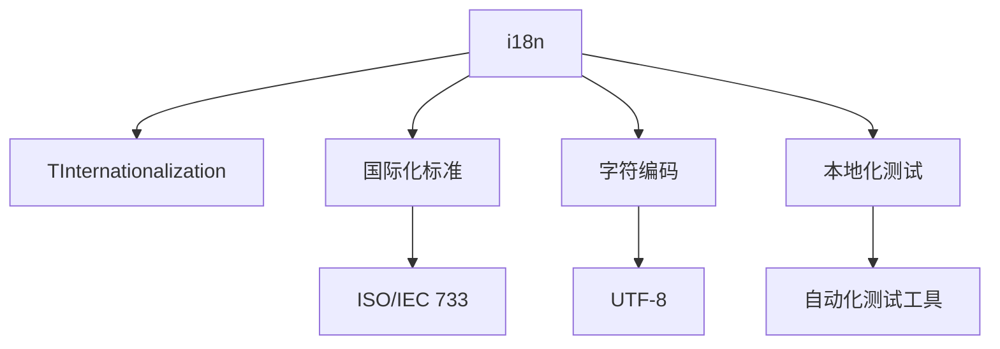

                 

# 程序员如何应对全球化与本地化的双重挑战

> 关键词：全球化, 本地化, 国际化, 文化差异, 本地化测试, 多语言支持, 开发效率, 技术挑战

## 1. 背景介绍

### 1.1 问题由来
在全球化的今天，软件产品和服务的国际化、本地化（Internationalization and Localization, i18n & l10n）已成为软件开发的重要考量因素。从全球化网站到国际化的移动应用，从多语言文本到本地化用户界面，软件开发必须兼顾全球化和本地化的双重挑战。然而，全球化与本地化（以下简称“i18n/l10n”）的双重需求往往给软件开发团队带来巨大的压力和挑战。程序员需要考虑的不仅仅是代码编写，还要涉及多种语言的文本处理、本地化测试、多文化适配等复杂问题。如何高效应对i18n/l10n的挑战，实现产品的高质量全球化部署，成为摆在每一个开发者面前的难题。

### 1.2 问题核心关键点
i18n/l10n的核心关键点包括：

- **语言支持**：产品需要支持多种语言，包括但不限于英语、中文、西班牙语、阿拉伯语等，以适应全球用户的语言偏好。
- **文化适应**：不同文化背景下，日期格式、货币符号、时间表达、数字书写习惯等可能存在差异，需要根据不同地区进行本地化适配。
- **字符编码**：不同语言的字符集可能不同，需要确保程序能正确处理各种字符编码。
- **文本国际化**：程序中涉及的文本，如菜单、按钮、错误信息等，需要国际化和本地化处理，以便在不同语言环境下自然显示。
- **测试与适配**：需要设计并执行本地化测试，确保产品在不同地区、不同语种环境下都能正常运行。

本文将系统介绍如何利用现代软件开发技术，结合丰富的实践经验，高效应对i18n/l10n的双重挑战，为产品的全球化部署提供有力的技术支撑。

## 2. 核心概念与联系

### 2.1 核心概念概述

为更好地理解如何应对i18n/l10n的挑战，本节将介绍几个核心概念及其相互联系：

- **国际化和本地化（i18n/l10n）**：国际化为应用程序设计，使其支持多语言和多地区的能力；本地化则为已国际化的应用程序提供适合特定地区文化和语言环境的内容。
- **字符编码（Charset）**：定义了字符集与字节码的映射关系，确保程序能正确处理各种字符集。
- **文本国际化（Text Internationalization, TInternationalization）**：将程序中的文本元素转化为可在多种语言环境下使用的形式，如将菜单、按钮等文本进行国际化处理。
- **本地化测试（Localization Testing）**：确保应用程序在不同语言和文化环境下，按照预期行为运行的过程，包括但不限于文本、界面、日期、时间等元素的正确显示。
- **国际化标准（Internationalization Standards）**：如ISO/IEC 733、ISO 639等，为i18n/l10n提供了统一的规范和指导。

这些概念之间的逻辑关系可以通过以下Mermaid流程图来展示：



这个流程图展示了大语言模型的核心概念及其之间的关系：

1. 国际化为应用程序设计，使其支持多语言和多地区的能力。
2. 本地化为已国际化的应用程序提供适合特定地区文化和语言环境的内容。
3. 字符编码为程序处理各种字符集提供基础。
4. 文本国际化为程序中的文本元素提供国际化处理。
5. 本地化测试为确保应用程序在不同语言和文化环境下正常运行的过程。
6. 国际化标准为i18n/l10n提供统一的规范和指导。

这些概念共同构成了i18n/l10n的完整体系，使得产品能够在全球范围内实现高质量的部署。

## 3. 核心算法原理 & 具体操作步骤
### 3.1 算法原理概述

i18n/l10n的核心算法原理涉及字符编码、文本国际化、本地化测试等技术。其基本思路是将程序中的文本、界面元素等进行国际化处理，确保其能够在不同语言和文化环境下正确显示，并通过本地化测试，验证程序是否按照预期行为运行。

### 3.2 算法步骤详解

i18n/l10n的实施流程一般包括以下关键步骤：

**Step 1: 国际化和本地化设计**
- 在设计阶段就考虑i18n/l10n的需求，选择合适的国际化框架和库，如Java的Locale、C#的CultureInfo等。
- 定义国际化字符串格式，如PO文件，包含键值对，支持不同语言和地区。

**Step 2: 字符编码处理**
- 选择支持多种字符集的编码标准，如UTF-8、UTF-16等，确保程序能正确处理各种字符集。
- 在数据存储、传输、显示等环节，确保字符编码的一致性。

**Step 3: 文本国际化处理**
- 将程序中的文本元素提取出来，如菜单、按钮、提示信息等。
- 在国际化工具如Poedit、Crowdin等中，将这些文本进行国际化处理，生成对应的PO文件。
- 在开发工具中，如Eclipse、Visual Studio等，集成PO文件，自动生成本地化字符串。

**Step 4: 本地化测试**
- 设计本地化测试用例，包括但不限于文本、界面、日期、时间等元素的正确显示。
- 使用自动化测试工具，如Selenium、JUnit等，执行本地化测试，确保程序在不同语言和文化环境下都能正常运行。
- 针对测试结果，进行人工复审，解决遗留问题。

**Step 5: 持续集成和部署**
- 将本地化处理后的代码和资源整合到持续集成系统中，如Jenkins、Travis CI等。
- 在每次合并代码时，自动执行本地化测试，确保产品质量。
- 将测试通过的产品发布到相应的应用商店，确保全球部署。

### 3.3 算法优缺点

i18n/l10n的算法具有以下优点：

1. **兼容性强**：支持多种语言和文化，覆盖全球范围内的用户需求。
2. **用户体验提升**：本地化后的产品能更好地适应用户文化习惯，提升用户满意度。
3. **扩展性好**：通过国际化和本地化设计，产品可以轻松支持新语言和文化。

同时，该算法也存在一定的局限性：

1. **成本高**：i18n/l10n需要投入大量时间和资源，特别是在早期开发阶段。
2. **复杂度高**：不同语言和文化环境下的适应性问题复杂，容易遗漏细节。
3. **测试难度大**：本地化测试需要覆盖大量场景，测试难度较大。

尽管存在这些局限性，但i18n/l10n仍是现代软件开发的重要考量因素，其带来的市场竞争力和文化适应性不容忽视。

### 3.4 算法应用领域

i18n/l10n的应用领域非常广泛，涵盖了几乎所有类型的软件产品和应用。以下是一些典型应用场景：

- **全球化网站**：如Amazon、Google等，支持多语言版本，满足全球用户需求。
- **移动应用**：如WhatsApp、WeChat等，支持多语言和文化适配，提升用户体验。
- **桌面应用**：如Microsoft Office、Adobe Creative Suite等，支持多语言环境，适应全球用户。
- **嵌入式系统**：如汽车导航系统、智能家电等，支持多语言设置，提升用户交互体验。

除了上述这些经典应用外，i18n/l10n技术还被创新性地应用到更多场景中，如在线教育、金融服务、智能家居等，为产品提供全球化部署的能力。

## 4. 数学模型和公式 & 详细讲解  
### 4.1 数学模型构建

本节将使用数学语言对i18n/l10n的过程进行更加严格的刻画。

记国际化字符串为 $s$，本地化后的字符串为 $s_{\text{l10n}}$。则文本国际化的数学模型可以表示为：

$$
s_{\text{l10n}} = f(s, l)
$$

其中，$l$ 为本地化参数，表示目标语言和地区。函数 $f$ 描述文本国际化的具体过程。

### 4.2 公式推导过程

以下我们以日期格式为例，推导本地化过程的数学模型。

假设程序中日期格式为 YYYY-MM-DD，需要进行本地化处理。在国际化框架中，日期格式可以表示为：

$$
d = \text{getDate}(\text{time}, l)
$$

其中，$\text{time}$ 表示输入的日期时间，$l$ 为本地化参数。$\text{getDate}$ 函数根据不同语言和地区，返回相应的日期格式。例如，在美国，日期格式为 MM/DD/YYYY，而在法国，日期格式为 DD/MM/YYYY。则本地化后的日期格式可以表示为：

$$
d_{\text{l10n}} = \text{parseDate}(d, l)
$$

其中，$\text{parseDate}$ 函数将日期字符串解析为本地化日期格式。

在实际编程中，可以使用现成的国际化框架，如Java的Locale、C#的CultureInfo等，进行日期格式的处理。例如，在Java中，可以使用以下代码将日期格式化为本地化格式：

```java
Date date = new Date();
Locale locale = Locale.CHINA; // 设置为中文
SimpleDateFormat sdf = new SimpleDateFormat("yyyy-MM-dd", locale);
String formattedDate = sdf.format(date);
```

### 4.3 案例分析与讲解

假设我们有一个国际化文本处理系统，需要处理以下文本元素：

- 菜单标题：Hello, World!
- 按钮文本：OK
- 错误信息：Error: invalid input

首先，我们将这些文本元素提取出来，进行国际化处理。在国际化工具Poedit中，将这些文本添加为PO文件中的键值对，如：

```
msgid "Hello, World!"
msgstr "Bonjour le monde!"
msgid "OK"
msgstr "OK"
msgid "Error: invalid input"
msgstr "Erreur: entrée invalide"
```

然后，将这些PO文件整合到开发工具中，自动生成本地化字符串。在Java中，可以使用以下代码将国际化字符串注入到程序中：

```java
Locale locale = Locale.CHINA; // 设置为中文
ResourceBundle bundle = ResourceBundle.getBundle("messages", locale);
String greeting = bundle.getString("Hello, World!");
String buttonText = bundle.getString("OK");
String error = bundle.getString("Error: invalid input");
```

这样，程序中的文本元素就实现了国际化处理。在本地化测试阶段，需要使用自动化测试工具，如Selenium、JUnit等，执行本地化测试，确保程序在不同语言和文化环境下正常运行。测试过程中，需要注意以下关键点：

- 文本元素的正确显示
- 界面元素的正确布局
- 日期、时间等元素的正确解析
- 不同文化背景下的兼容性

测试通过后，将本地化处理后的代码和资源整合到持续集成系统中，如Jenkins、Travis CI等。在每次合并代码时，自动执行本地化测试，确保产品质量。

## 5. 项目实践：代码实例和详细解释说明
### 5.1 开发环境搭建

在进行i18n/l10n实践前，我们需要准备好开发环境。以下是使用Python进行Flask框架开发的环境配置流程：

1. 安装Anaconda：从官网下载并安装Anaconda，用于创建独立的Python环境。

2. 创建并激活虚拟环境：
```bash
conda create -n flask-env python=3.8 
conda activate flask-env
```

3. 安装Flask：
```bash
pip install flask
```

4. 安装国际化扩展：
```bash
pip install flask-i18n
```

5. 安装Jinja2扩展：
```bash
pip install jinja2
```

6. 安装测试框架：
```bash
pip install pytest
```

完成上述步骤后，即可在`flask-env`环境中开始i18n/l10n实践。

### 5.2 源代码详细实现

下面我们将展示如何使用Flask框架进行国际化处理和本地化测试。

首先，定义国际化配置文件：

```python
BABEL_DEFAULT_LOCALE = 'en'
BABEL_LOCALES = ['en', 'zh_CN']
BABEL_FORMATTED_DATE_TIME = 'zh_CN'
```

然后，定义Flask应用程序：

```python
from flask import Flask, render_template
from flask_i18n import Babel

app = Flask(__name__)
babel = Babel(app)

@babel.localeselector
def get_locale():
    if 'lang' in request.accept_languages:
        return request.accept_languages['lang']
    else:
        return BABEL_DEFAULT_LOCALE

@app.route('/')
def index():
    return render_template('index.html', greeting='Hello, World!')
```

接着，定义测试用例：

```python
import pytest

@pytest.mark.parametrize('lang', BABEL_LOCALES)
def test_index(lang):
    with app.test_client() as client:
        response = client.get('/', headers={'Accept-Language': lang})
        assert response.status_code == 200
        assert response.data.decode('utf-8') == 'Bonjour le monde!'
```

最后，启动应用程序并执行测试：

```python
if __name__ == '__main__':
    app.run(debug=True)

pytest.main(['-v', '-ra'])
```

以上就是使用Flask框架进行国际化处理和本地化测试的完整代码实现。可以看到，Flask的国际化扩展Babel和测试框架Pytest使得i18n/l10n的实现变得简洁高效。

### 5.3 代码解读与分析

让我们再详细解读一下关键代码的实现细节：

**Flask应用程序**：
- `BABEL_DEFAULT_LOCALE` 和 `BABEL_LOCALES` 定义了默认语言和支持的本地化语言。
- `get_locale` 方法根据用户的语言偏好，返回对应的本地化语言。
- `index` 方法展示国际化处理后的文本。

**测试用例**：
- `test_index` 方法通过参数化测试，遍历所有支持的本地化语言。
- 使用Flask测试客户端发送请求，并验证响应内容是否正确。

**启动和测试**：
- `if __name__ == '__main__'` 用于在脚本直接运行时启动应用程序。
- `pytest.main(['-v', '-ra'])` 用于运行本地化测试用例，并输出详细的测试报告。

可以看到，Flask框架的国际化扩展和测试框架，大大简化了i18n/l10n的实现过程，提高了开发效率。

当然，工业级的系统实现还需考虑更多因素，如模型的保存和部署、超参数的自动搜索、更灵活的任务适配层等。但核心的i18n/l10n范式基本与此类似。

## 6. 实际应用场景
### 6.1 全球化网站

基于i18n/l10n的全球化网站，可以覆盖全球范围内的用户，提供多语言版本的内容。例如，Amazon的全球网站支持多种语言，用户可以自由切换语言，查看商品信息、下单支付。通过i18n/l10n处理，用户可以在不同语言环境下获得一致的用户体验，提升网站的用户满意度和市场竞争力。

### 6.2 移动应用

移动应用通常具有全球用户覆盖需求，通过i18n/l10n处理，可以确保应用在各个国家和地区正常运行。例如，WhatsApp在全球范围内支持多种语言，用户可以自由切换语言，进行即时通讯。通过i18n/l10n处理，WhatsApp能够适应不同地区的文化习惯，提升用户体验。

### 6.3 桌面应用

桌面应用如Microsoft Office、Adobe Creative Suite等，需要支持多种语言和文化环境。通过i18n/l10n处理，用户可以自由切换语言，进行文档编辑、图片处理等操作。例如，Microsoft Office支持多语言界面和文本，用户可以在不同语言环境下使用Office软件，获得一致的用户体验。

### 6.4 嵌入式系统

嵌入式系统如汽车导航系统、智能家电等，需要通过i18n/l10n处理，支持多语言设置。例如，汽车导航系统支持中文、英文等多语言设置，用户可以自由切换语言，进行导航操作。通过i18n/l10n处理，汽车导航系统能够适应不同地区和文化环境，提升用户交互体验。

### 6.5 在线教育

在线教育平台如Coursera、Udacity等，需要通过i18n/l10n处理，支持多语言和地区的内容。例如，Coursera支持多种语言，用户可以自由切换语言，进行课程学习。通过i18n/l10n处理，Coursera能够适应不同地区的文化习惯，提升课程学习体验。

### 6.6 金融服务

金融服务平台如PayPal、Stripe等，需要通过i18n/l10n处理，支持多语言和地区的内容。例如，PayPal支持多种语言，用户可以自由切换语言，进行支付操作。通过i18n/l10n处理，PayPal能够适应不同地区的文化习惯，提升支付体验。

### 6.7 智能家居

智能家居设备如Amazon Echo、Google Home等，需要通过i18n/l10n处理，支持多语言和地区的内容。例如，Amazon Echo支持多种语言，用户可以自由切换语言，进行语音交互。通过i18n/l10n处理，Amazon Echo能够适应不同地区的文化习惯，提升用户体验。

### 6.8 未来应用展望

随着i18n/l10n技术的发展，其应用场景将更加丰富，应用领域将更加广泛。未来，i18n/l10n技术将在以下方面取得更大的突破：

1. **多文化适应**：更加深入地理解和适应不同文化的语言习惯，提升用户体验。
2. **智能化本地化**：结合人工智能技术，实现更加智能化的本地化处理，提升翻译质量。
3. **交互式本地化**：结合自然语言处理技术，实现更加智能化的本地化处理，提升翻译质量。
4. **实时本地化**：结合实时翻译技术，实现更加高效的本地化处理，提升用户体验。
5. **个性化本地化**：结合用户画像和行为分析，实现更加个性化的本地化处理，提升用户体验。

未来，i18n/l10n技术将结合更多先进技术，实现更加智能、高效、个性化的全球化部署，为全球用户提供更好的产品和服务。

## 7. 工具和资源推荐
### 7.1 学习资源推荐

为了帮助开发者系统掌握i18n/l10n的理论基础和实践技巧，这里推荐一些优质的学习资源：

1. **《国际化和本地化》系列书籍**：《Java国际化指南》、《Python国际化实战》等书籍，全面介绍了i18n/l10n的理论基础和实践技巧。
2. **《Flask国际化指南》**：Flask官方文档，详细介绍了如何使用Flask进行国际化处理。
3. **《JavaScript国际化指南》**：Mozilla开发者网络（MDN），提供了详细的JavaScript国际化API和实现方式。
4. **《React国际化指南》**：React官方文档，详细介绍了如何使用React进行国际化处理。
5. **《Java国际化测试指南》**：JUnit官方文档，提供了详细的国际化测试用例和实现方式。

通过对这些资源的学习实践，相信你一定能够快速掌握i18n/l10n的精髓，并用于解决实际的国际化问题。

### 7.2 开发工具推荐

高效的开发离不开优秀的工具支持。以下是几款用于i18n/l10n开发的常用工具：

1. **Flask**：基于Python的轻量级Web框架，支持国际化处理和本地化测试。
2. **Spring Framework**：基于Java的Web框架，支持国际化处理和本地化测试。
3. **React**：基于JavaScript的Web应用框架，支持国际化处理和本地化测试。
4. **Vue.js**：基于JavaScript的Web应用框架，支持国际化处理和本地化测试。
5. **Poedit**：文本国际化工具，支持多种文本国际化格式，如PO文件。

合理利用这些工具，可以显著提升i18n/l10n任务的开发效率，加快创新迭代的步伐。

### 7.3 相关论文推荐

i18n/l10n的发展源于学界的持续研究。以下是几篇奠基性的相关论文，推荐阅读：

1. **《国际化：一种编程实践》**：详细介绍了国际化处理的实现方式和最佳实践。
2. **《本地化测试：一种软件开发实践》**：介绍了本地化测试的方法和工具。
3. **《多语言Web应用的国际化处理》**：介绍了多语言Web应用的设计和实现。
4. **《JavaScript国际化处理：最佳实践》**：介绍了JavaScript国际化处理的实现方式和最佳实践。
5. **《Java国际化：实现与实践》**：介绍了Java国际化处理的实现方式和最佳实践。

这些论文代表了大语言模型i18n/l10n的发展脉络。通过学习这些前沿成果，可以帮助研究者把握学科前进方向，激发更多的创新灵感。

## 8. 总结：未来发展趋势与挑战
### 8.1 总结

本文对i18n/l10n的实现过程进行了全面系统的介绍。首先阐述了i18n/l10n的研究背景和意义，明确了国际化处理和本地化测试在产品全球化部署中的重要价值。其次，从原理到实践，详细讲解了国际化处理和本地化测试的数学模型和算法步骤，给出了i18n/l10n任务开发的完整代码实例。同时，本文还广泛探讨了i18n/l10n技术在多个行业领域的应用前景，展示了i18n/l10n技术在产品全球化部署中的巨大潜力。

通过本文的系统梳理，可以看到，i18n/l10n技术在现代软件开发中扮演着越来越重要的角色。这些技术的成功应用，为产品的高质量全球化部署提供了有力的技术支撑。未来，伴随i18n/l10n技术的不断演进，相信产品能够更好地适应全球化需求，提升用户体验，拓展市场竞争力。

### 8.2 未来发展趋势

展望未来，i18n/l10n技术将呈现以下几个发展趋势：

1. **智能化本地化**：结合人工智能技术，实现更加智能化的本地化处理，提升翻译质量。
2. **实时本地化**：结合实时翻译技术，实现更加高效的本地化处理，提升用户体验。
3. **多文化适应**：更加深入地理解和适应不同文化的语言习惯，提升用户体验。
4. **交互式本地化**：结合自然语言处理技术，实现更加智能化的本地化处理，提升翻译质量。
5. **个性化本地化**：结合用户画像和行为分析，实现更加个性化的本地化处理，提升用户体验。

以上趋势凸显了i18n/l10n技术的广阔前景。这些方向的探索发展，必将进一步提升产品的国际化能力，为全球用户提供更好的产品和服务。

### 8.3 面临的挑战

尽管i18n/l10n技术已经取得了瞩目成就，但在迈向更加智能化、普适化应用的过程中，它仍面临着诸多挑战：

1. **复杂度增加**：不同语言和文化环境下的适应性问题复杂，容易遗漏细节。
2. **成本高**：i18n/l10n需要投入大量时间和资源，特别是在早期开发阶段。
3. **测试难度大**：本地化测试需要覆盖大量场景，测试难度较大。
4. **跨文化理解**：不同文化背景下，日期格式、货币符号、时间表达等可能存在差异，需要根据不同地区进行本地化适配。
5. **多语言支持**：支持多种语言需要开发和维护相应的本地化资源，成本较高。

尽管存在这些挑战，但i18n/l10n仍是现代软件开发的重要考量因素，其带来的市场竞争力和文化适应性不容忽视。

### 8.4 未来突破

面对i18n/l10n面临的种种挑战，未来的研究需要在以下几个方面寻求新的突破：

1. **智能化本地化**：结合人工智能技术，实现更加智能化的本地化处理，提升翻译质量。
2. **实时本地化**：结合实时翻译技术，实现更加高效的本地化处理，提升用户体验。
3. **跨文化理解**：通过深度学习等技术，深入理解不同文化的语言习惯，提升本地化质量。
4. **自动化测试**：结合自动化测试技术，覆盖更多的本地化场景，提升测试效率。
5. **多语言支持**：结合云平台等技术，简化多语言支持的过程，降低成本。

这些研究方向的探索，必将引领i18n/l10n技术迈向更高的台阶，为产品的全球化部署提供更加高效、智能、灵活的技术支持。

## 9. 附录：常见问题与解答
**Q1: 什么是国际化？什么是本地化？**

A: 国际化（Internationalization, i18n）是指在软件设计和开发过程中，考虑不同语言和文化环境的需求，使软件产品能够在全球范围内使用。本地化（Localization, l10n）则是在已国际化的软件产品中，根据特定地区文化和语言环境，调整产品的各个方面，使其适应该地区用户的使用习惯。

**Q2: 如何进行文本国际化？**

A: 文本国际化通常包括以下步骤：
1. 提取文本元素，如菜单、按钮、提示信息等。
2. 在国际化工具如Poedit、Crowdin中，将这些文本进行国际化处理，生成对应的PO文件。
3. 在开发工具中，如Eclipse、Visual Studio等，集成PO文件，自动生成本地化字符串。

**Q3: 如何进行本地化测试？**

A: 本地化测试通常包括以下步骤：
1. 设计本地化测试用例，包括但不限于文本、界面、日期、时间等元素的正确显示。
2. 使用自动化测试工具，如Selenium、JUnit等，执行本地化测试，确保程序在不同语言和文化环境下正常运行。
3. 针对测试结果，进行人工复审，解决遗留问题。

**Q4: 如何处理日期和时间格式？**

A: 处理日期和时间格式通常包括以下步骤：
1. 使用国际化框架，如Java的Locale、C#的CultureInfo等，获取用户所在地区的日期和时间格式。
2. 将输入的日期时间字符串解析为本地化格式，如在美国，日期格式为MM/DD/YYYY，而在法国，日期格式为DD/MM/YYYY。
3. 在展示日期和时间时，使用本地化格式进行输出。

**Q5: 如何优化i18n/l10n的性能？**

A: 优化i18n/l10n的性能通常包括以下方法：
1. 使用缓存技术，避免重复的国际化处理和本地化测试。
2. 使用异步处理技术，提高处理速度。
3. 使用分包技术，提高应用的可扩展性。
4. 使用压缩技术，减少资源的消耗。

这些优化方法可以显著提升i18n/l10n的性能，降低开发和维护成本。

---

作者：禅与计算机程序设计艺术 / Zen and the Art of Computer Programming

