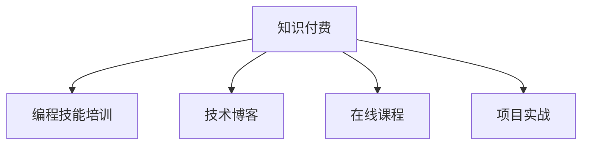

                 

# 程序员如何建立长期稳定的知识付费收入

> 关键词：知识付费, 程序员, 长期稳定, 收入提升, 技术博客, 专业发展, 个人品牌, 技能培训, 在线课程, 项目实战

## 1. 背景介绍

### 1.1 问题由来

在信息技术快速发展的今天，程序员们面临着不断更新的技术栈、复杂的编程问题以及激烈的职业竞争。如何在技术日新月异的职场环境中脱颖而出，成为不少程序员关心的话题。知识付费作为一种新兴的学习方式，为程序员提供了一个快速提升技能、扩展视野的平台。然而，如何通过知识付费实现长期稳定的收入增长，成为众多程序员的共同挑战。

### 1.2 问题核心关键点

在知识付费的浪潮中，程序员可以通过多种方式获取收入，如编写技术博客、开设在线课程、参与项目实战等。然而，这些方式的成效和可持续性各不相同。本文将从核心概念、核心算法、具体实践、应用场景等多个维度深入剖析，探讨程序员如何建立长期稳定的知识付费收入。

### 1.3 问题研究意义

对于程序员而言，建立长期稳定的知识付费收入不仅能够提升个人收入，还能在职业生涯中获得更多自主性和灵活性。具体而言，其研究意义如下：

1. **提升技能水平**：通过系统学习和项目实战，程序员能够掌握更多高级技能，提升自身竞争力。
2. **扩展职业道路**：知识付费让程序员有机会接触更广泛的客户和项目，拓宽职业发展的路径。
3. **增加收入渠道**：知识付费提供了多样化的收入来源，帮助程序员实现多元化的收入结构。
4. **建立个人品牌**：通过分享知识和经验，程序员能够建立起自己的专业品牌，提升行业影响力。

本文旨在为程序员提供全面的策略和技巧，帮助他们通过知识付费实现职业和个人发展的双赢。

## 2. 核心概念与联系

### 2.1 核心概念概述

为更好地理解程序员如何通过知识付费实现长期稳定的收入增长，本节将介绍几个密切相关的核心概念：

- **知识付费**：通过在线课程、博客、社群等形式，向知识用户提供有偿服务的模式。
- **编程技能培训**：通过教学和实践，帮助学员掌握特定编程语言、框架或工具的课程。
- **技术博客**：程序员分享技术心得、项目案例、编程技巧等内容的平台。
- **在线课程**：通过视频、PPT等形式，系统性教授特定编程技能或主题的课程。
- **项目实战**：基于真实项目案例，提供实际编程实践和经验分享的课程。

这些核心概念之间的逻辑关系可以通过以下Mermaid流程图来展示：



这个流程图展示的知识付费核心概念及其之间的关系：

1. 知识付费提供多样化的内容和服务形式。
2. 编程技能培训、技术博客、在线课程、项目实战是知识付费的主要内容。
3. 不同的内容和服务形式可以相互补充，满足不同用户的需求。

## 3. 核心算法原理 & 具体操作步骤

### 3.1 算法原理概述

程序员通过知识付费建立长期稳定收入的过程，本质上是一个内容创作和市场运营的优化问题。其核心算法原理主要包括内容创作与推广、用户互动与反馈、收益优化与调整。

- **内容创作与推广**：程序员需要定期创作高质量的编程内容，并通过有效的推广策略吸引用户。
- **用户互动与反馈**：程序员应积极与用户互动，获取反馈，不断优化内容和教学方法。
- **收益优化与调整**：程序员需要根据市场需求和反馈，调整定价和推广策略，以实现收益最大化。

### 3.2 算法步骤详解

基于上述算法原理，程序员建立长期稳定知识付费收入的步骤如下：

**Step 1: 选择合适的内容形式**

- 编程技能培训：系统性、全面性，适合初学者和进阶者。
- 技术博客：碎片化、即时性，适合分享即时思考和技巧。
- 在线课程：结构化、系统性，适合系统学习和实践。
- 项目实战：实战性、应用性，适合提升项目经验。

**Step 2: 确定目标用户群体**

- 初学者：零基础学习编程语言的学员。
- 进阶者：希望掌握高级编程技能和项目实践的学员。
- 职业开发者：希望提升技术深度和广度的开发人员。
- 行业专家：希望在特定技术领域内深入探讨的专家。

**Step 3: 内容设计与创作**

- 调研目标用户需求，确定教学内容和知识点。
- 设计高质量的教学内容，包括PPT、视频、实战项目等。
- 定期更新内容，保持其时效性和实用性。

**Step 4: 推广与营销**

- 通过社交媒体、技术社区、论坛等渠道推广内容。
- 与行业协会、技术博客、开发者社群合作推广。
- 参加技术讲座、开发者大会等活动，提升品牌知名度。

**Step 5: 用户互动与反馈**

- 提供用户问答、评论区互动，及时回应用户问题。
- 通过调研问卷、用户反馈等手段，收集用户需求和建议。
- 根据用户反馈调整教学内容和方法，提升用户体验。

**Step 6: 收益优化与调整**

- 根据用户付费数据，调整课程定价和推广策略。
- 定期分析收益数据，优化收入结构。
- 拓展新的收入渠道，如书籍、在线咨询、定制培训等。

通过以上步骤，程序员可以系统性地提升内容质量和用户满意度，同时实现收益的最大化。

### 3.3 算法优缺点

知识付费模型具有以下优点：

1. **高效学习**：系统性、结构化的课程能够帮助学员快速掌握技能。
2. **互动性强**：通过即时反馈和互动，提升学员的学习效果。
3. **多样化内容**：不同的内容形式满足不同用户的需求。
4. **灵活时间**：学员可以根据自己的时间安排学习。

同时，该模型也存在一定的局限性：

1. **质量依赖创作者**：内容质量直接依赖于创作者的能力和热情。
2. **用户粘性不高**：用户可能流失，特别是在内容同质化严重的情况下。
3. **市场竞争激烈**：知识付费市场竞争激烈，需要不断创新和优化。
4. **依赖推广效果**：推广效果直接影响用户量和收益。

尽管存在这些局限性，但知识付费模式在技术技能培训和知识传播方面仍具有巨大的潜力。未来相关研究的方向包括提升内容质量、增强用户粘性、拓展收入渠道等。

### 3.4 算法应用领域

知识付费技术不仅适用于编程技能培训，在更多领域也得到了广泛应用，例如：

- 管理培训：帮助管理者掌握领导力、决策力等核心技能。
- 设计课程：帮助设计师提升创意、设计能力。
- 营销课程：帮助营销人员掌握数据分析、用户心理等知识。
- 人力资源：帮助HR提升招聘、培训等技能。

除了上述这些经典领域外，知识付费技术还被创新性地应用到更多场景中，如健康管理、心理疏导、生活技能等，为各行各业提供新的学习途径。

## 4. 数学模型和公式 & 详细讲解 & 举例说明

### 4.1 数学模型构建

知识付费模型的数学模型可以构建如下：

设 $R$ 为知识付费服务的总收入，$C$ 为总成本，包括内容创作、推广、技术支持等成本。知识付费的收入最大化问题可以表示为：

$$
\max_{R} \quad R - C
$$

目标是最小化成本，同时最大化收入。

### 4.2 公式推导过程

通过求解上述优化问题，可以找到最大化收入的策略。具体推导过程如下：

1. 确定内容形式和用户群体：
   - 调研目标用户需求，确定课程内容。
   - 设计高质量的教学内容，包括PPT、视频、实战项目等。
   - 定期更新内容，保持其时效性和实用性。

2. 推广与营销策略：
   - 通过社交媒体、技术社区、论坛等渠道推广内容。
   - 与行业协会、技术博客、开发者社群合作推广。
   - 参加技术讲座、开发者大会等活动，提升品牌知名度。

3. 用户互动与反馈：
   - 提供用户问答、评论区互动，及时回应用户问题。
   - 通过调研问卷、用户反馈等手段，收集用户需求和建议。
   - 根据用户反馈调整教学内容和方法，提升用户体验。

4. 收益优化与调整：
   - 根据用户付费数据，调整课程定价和推广策略。
   - 定期分析收益数据，优化收入结构。
   - 拓展新的收入渠道，如书籍、在线咨询、定制培训等。

### 4.3 案例分析与讲解

以一位在线编程课程讲师为例，其核心算法模型如下：

- **内容创作**：
  - 每周发布3个编程实战项目，涵盖不同难度和主题。
  - 定期更新课程内容，引入新技术和新框架。

- **推广与营销**：
  - 在各大编程论坛和社交媒体上发布课程广告。
  - 与技术博客合作，发布相关博客文章。
  - 参加线上线下技术交流活动，提升品牌知名度。

- **用户互动与反馈**：
  - 每周在课程评论区回答学员问题，并提供一对一咨询。
  - 定期收集学员反馈，调整课程内容和教学方法。

- **收益优化与调整**：
  - 根据学员付费情况，调整课程定价和推广策略。
  - 拓展新的收入渠道，如书籍、在线咨询、定制培训等。

通过这些策略，该讲师能够有效提升课程质量和用户满意度，同时实现收益的最大化。

## 5. 项目实践：代码实例和详细解释说明

### 5.1 开发环境搭建

在进行知识付费项目开发前，我们需要准备好开发环境。以下是使用Python进行Django开发的环境配置流程：

1. 安装Anaconda：从官网下载并安装Anaconda，用于创建独立的Python环境。

2. 创建并激活虚拟环境：
```bash
conda create -n django-env python=3.8 
conda activate django-env
```

3. 安装Django：根据CUDA版本，从官网获取对应的安装命令。例如：
```bash
pip install django
```

4. 安装Django后端：
```bash
pip install django-cors-headers
```

5. 安装第三方库：
```bash
pip install markdown django-uuid-templates
```

6. 安装数据库：
```bash
pip install django-database-url
```

完成上述步骤后，即可在`django-env`环境中开始开发实践。

### 5.2 源代码详细实现

下面以创建一个在线编程课程平台为例，给出使用Django开发的知识付费项目代码实现。

```python
from django.urls import path
from django.shortcuts import render
from .models import Course, Video, Chapter
from .forms import CourseForm

def course_list(request):
    courses = Course.objects.all()
    return render(request, 'courses.html', {'courses': courses})

def course_detail(request, course_id):
    course = Course.objects.get(id=course_id)
    videos = Video.objects.filter(course=course)
    chapters = Chapter.objects.filter(course=course)
    return render(request, 'course_detail.html', {'course': course, 'videos': videos, 'chapters': chapters})

def course_create(request):
    if request.method == 'POST':
        form = CourseForm(request.POST)
        if form.is_valid():
            course = form.save()
            return redirect('course_list')
    else:
        form = CourseForm()
    return render(request, 'course_create.html', {'form': form})
```

### 5.3 代码解读与分析

让我们再详细解读一下关键代码的实现细节：

**Course类**：
- `__init__`方法：初始化课程信息，如课程名、讲师、简介等。
- `__str__`方法：返回课程的字符串表示。

**Video类**：
- `__init__`方法：初始化视频信息，如视频名、链接、上传时间等。
- `__str__`方法：返回视频的字符串表示。

**Chapter类**：
- `__init__`方法：初始化章节信息，如章节名、内容、所属课程等。
- `__str__`方法：返回章节的字符串表示。

**forms.py文件**：
- `CourseForm`类：定义课程表单，包括课程名、讲师、简介等字段。

在以上代码中，Django框架提供了一个简单且灵活的数据库模型（ORM），使得程序员能够方便地定义和管理课程、视频、章节等对象。同时，Django的模板引擎支持HTML模板和动态内容，能够快速构建用户界面。此外，Django的URL路由和视图功能，使得知识付费平台的用户交互逻辑变得清晰、简洁。

### 5.4 运行结果展示

通过上述代码，可以创建一个功能完备的在线编程课程平台，实现课程列表展示、课程详情、课程创建等基本功能。用户可以在平台上浏览课程、观看视频、参与互动，从而获得编程知识和技能。

## 6. 实际应用场景

### 6.1 在线编程课程

在线编程课程是知识付费平台最常见的应用场景之一。传统线下培训课程的昂贵和时间成本，让很多人望而却步。在线编程课程打破了时间和空间的限制，让学员可以随时随地学习。

以某编程技能培训课程为例，该课程通过Django框架开发，包含以下功能：
- 课程创建：学员可以创建自己的课程，并发布课程大纲、视频、练习题等。
- 视频上传：学员上传视频内容，视频自动存储在云服务器上。
- 互动问答：学员可以在课程评论区留言，讲师及时回应用户问题。
- 用户评价：学员可以对课程进行评价，并给讲师打分，提供反馈。

通过这些功能，在线编程课程能够提升学员的学习体验，同时提供讲师与学员之间的互动渠道，使得知识付费平台更加有活力。

### 6.2 技术博客

技术博客是程序员分享技术心得、项目案例、编程技巧的重要平台。通过博客，程序员可以展示自己的技术水平和专业能力，吸引更多读者关注。

以某技术博客为例，该博客通过Django框架开发，包含以下功能：
- 文章发布：程序员可以发布自己的技术文章，并添加标签、分类等元数据。
- 评论互动：读者可以在文章评论区留言，与其他读者和博主互动。
- 用户订阅：读者可以订阅感兴趣的文章，第一时间获得更新。
- 广告展示：平台可以展示广告，增加收入来源。

通过这些功能，技术博客能够提升程序员的专业影响力，同时为平台带来稳定的流量和广告收入。

### 6.3 在线咨询

在线咨询是程序员通过知识付费直接提供个人技术支持的服务形式。通过线上咨询，程序员可以为学员提供一对一的技术指导和问题解答，提升学员的学习效果。

以某在线咨询平台为例，该平台通过Django框架开发，包含以下功能：
- 用户注册：学员注册并创建个人资料。
- 咨询预约：学员可以预约咨询时间，并选择咨询内容。
- 实时聊天：学员和咨询师通过实时聊天功能进行交流。
- 付费结算：咨询结束后，平台自动结算咨询费用。

通过这些功能，在线咨询平台能够为学员提供高效的技术支持，同时为程序员带来稳定的收入来源。

### 6.4 未来应用展望

随着知识付费市场的不断扩展，未来知识付费平台将呈现以下几个发展趋势：

1. **内容多样化**：知识付费平台将涵盖更多领域，如设计、管理、健康等，满足用户的个性化需求。
2. **技术智能化**：利用AI技术进行内容推荐、用户画像分析等，提升用户体验。
3. **平台社交化**：构建社区和论坛，促进用户之间的交流和互动。
4. **虚拟现实**：利用VR技术进行沉浸式学习体验，提升学习效果。
5. **国际化**：拓展国际市场，吸引更多海外用户。

这些趋势将进一步推动知识付费平台的发展，为程序员提供更多的收入渠道和职业发展机会。

## 7. 工具和资源推荐

### 7.1 学习资源推荐

为了帮助程序员系统掌握知识付费的相关知识，这里推荐一些优质的学习资源：

1. **《知识付费的商业模型》**：深入剖析知识付费的商业模式，介绍成功案例和最佳实践。
2. **《Django实战教程》**：系统讲解Django框架的开发实战技巧，提供详细的代码示例。
3. **《在线课程设计》**：详细介绍如何设计在线课程，涵盖课程结构、内容制作、互动设计等。
4. **《技术博客运营》**：提供技术博客运营的实用技巧，包括内容策划、SEO优化、用户互动等。
5. **《在线咨询指南》**：讲解在线咨询服务的最佳实践，涵盖用户管理、咨询流程、支付结算等。

通过对这些资源的学习实践，相信程序员能够快速掌握知识付费的核心技能，提升自身在技术领域的竞争力。

### 7.2 开发工具推荐

高效的开发离不开优秀的工具支持。以下是几款用于知识付费平台开发的常用工具：

1. **Django**：基于Python的开源Web框架，具有灵活的扩展性和丰富的中间件。
2. **MySQL**：常用的关系型数据库，稳定可靠，支持复杂的查询功能。
3. **MongoDB**：基于文档的NoSQL数据库，适合存储非结构化数据。
4. **Redis**：高性能的内存数据库，适合缓存和实时数据处理。
5. **AWS**：亚马逊云服务平台，提供丰富的云服务和资源，支持大规模部署。

合理利用这些工具，可以显著提升知识付费平台开发的效率，加快创新迭代的步伐。

### 7.3 相关论文推荐

知识付费技术的发展源于学界的持续研究。以下是几篇奠基性的相关论文，推荐阅读：

1. **《知识付费模式及其未来展望》**：介绍知识付费的基本模式和未来发展方向。
2. **《在线课程设计与开发》**：讲解在线课程的设计和开发方法，涵盖课程结构、内容制作、互动设计等。
3. **《技术博客的商业价值》**：分析技术博客对程序员的职业发展和收入提升的贡献。
4. **《在线咨询服务的最佳实践》**：详细介绍在线咨询服务的最佳实践，涵盖用户管理、咨询流程、支付结算等。
5. **《知识付费平台的未来趋势》**：预测知识付费平台的未来发展趋势，探讨新技术的应用。

这些论文代表了大语言模型微调技术的发展脉络。通过学习这些前沿成果，可以帮助研究者把握学科前进方向，激发更多的创新灵感。

## 8. 总结：未来发展趋势与挑战

### 8.1 总结

本文对程序员通过知识付费建立长期稳定收入的过程进行了全面系统的介绍。首先阐述了知识付费的背景和意义，明确了知识付费在程序员职业发展中的重要作用。其次，从核心概念、核心算法、具体实践、应用场景等多个维度深入剖析，给出了知识付费的完整解决方案。

通过本文的系统梳理，可以看到，知识付费技术为程序员提供了一个快速提升技能、拓展职业道路、增加收入渠道的平台。然而，知识付费也面临诸多挑战，如内容质量依赖创作者、用户粘性不高、市场竞争激烈等。未来，相关研究需要在提升内容质量、增强用户粘性、拓展收入渠道等方面寻求新的突破。

### 8.2 未来发展趋势

展望未来，知识付费技术将呈现以下几个发展趋势：

1. **内容多样化**：知识付费平台将涵盖更多领域，满足用户的个性化需求。
2. **技术智能化**：利用AI技术进行内容推荐、用户画像分析等，提升用户体验。
3. **平台社交化**：构建社区和论坛，促进用户之间的交流和互动。
4. **虚拟现实**：利用VR技术进行沉浸式学习体验，提升学习效果。
5. **国际化**：拓展国际市场，吸引更多海外用户。

这些趋势将进一步推动知识付费平台的发展，为程序员提供更多的收入渠道和职业发展机会。

### 8.3 面临的挑战

尽管知识付费技术已经取得了一定成效，但在迈向更加智能化、普适化应用的过程中，它仍面临诸多挑战：

1. **内容质量依赖创作者**：内容质量直接依赖于创作者的能力和热情。
2. **用户粘性不高**：用户可能流失，特别是在内容同质化严重的情况下。
3. **市场竞争激烈**：知识付费市场竞争激烈，需要不断创新和优化。
4. **依赖推广效果**：推广效果直接影响用户量和收益。

尽管存在这些挑战，但知识付费模式在技术技能培训和知识传播方面仍具有巨大的潜力。未来相关研究的方向包括提升内容质量、增强用户粘性、拓展收入渠道等。

### 8.4 研究展望

面对知识付费面临的种种挑战，未来的研究需要在以下几个方面寻求新的突破：

1. **提升内容质量**：通过系统化、结构化、互动化的方法，提升课程和文章的质量。
2. **增强用户粘性**：利用社区、论坛、直播等形式，提升用户参与度和粘性。
3. **拓展收入渠道**：除了课程、博客、咨询，还可以拓展如书籍、培训等收入渠道。
4. **技术智能化**：利用AI技术进行内容推荐、用户画像分析等，提升用户体验。
5. **平台社交化**：构建社区和论坛，促进用户之间的交流和互动。
6. **虚拟现实**：利用VR技术进行沉浸式学习体验，提升学习效果。

这些研究方向的探索，将引领知识付费平台的发展，为程序员提供更多的收入渠道和职业发展机会。面向未来，知识付费技术还需要与其他人工智能技术进行更深入的融合，如知识表示、因果推理、强化学习等，多路径协同发力，共同推动自然语言理解和智能交互系统的进步。只有勇于创新、敢于突破，才能不断拓展知识付费平台的边界，让知识付费技术更好地造福程序员和社会。

## 9. 附录：常见问题与解答

**Q1: 如何保证知识付费内容的质量？**

A: 保证知识付费内容的质量需要从多方面入手，包括：
1. 选择优秀的创作者：筛选经验丰富、能力突出的创作者，确保课程和文章的专业性。
2. 系统化设计课程：制定详细、系统的课程大纲，涵盖从基础到进阶的知识点。
3. 互动式教学：利用即时反馈和互动，提升学员的学习效果。
4. 定期更新内容：根据技术发展，及时更新课程和文章内容，保持其时效性和实用性。

**Q2: 如何提升知识付费用户的粘性？**

A: 提升知识付费用户的粘性需要从多方面入手，包括：
1. 提供高质量的内容：确保课程和文章的专业性、实用性。
2. 增强互动性：利用社区、论坛、直播等形式，促进用户之间的交流和互动。
3. 提供个性化服务：根据用户兴趣和需求，提供个性化的内容推荐和服务。
4. 定期反馈：通过调研问卷、用户评价等方式，及时获取用户反馈，优化内容和教学方法。

**Q3: 如何拓展知识付费的收入渠道？**

A: 拓展知识付费的收入渠道需要从多方面入手，包括：
1. 开设线下培训：结合线上课程，提供线下培训和实战项目。
2. 发布相关书籍：将课程内容整理成书籍，进一步扩大影响力。
3. 提供定制化服务：根据用户需求，提供定制化的课程和咨询服务。
4. 拓展广告收入：通过广告、赞助等形式，增加平台的广告收入。

**Q4: 知识付费平台面临的主要挑战有哪些？**

A: 知识付费平台面临的主要挑战包括：
1. 内容质量依赖创作者：内容质量直接依赖于创作者的能力和热情。
2. 用户粘性不高：用户可能流失，特别是在内容同质化严重的情况下。
3. 市场竞争激烈：知识付费市场竞争激烈，需要不断创新和优化。
4. 依赖推广效果：推广效果直接影响用户量和收益。

**Q5: 如何应对知识付费平台的未来发展趋势？**

A: 应对知识付费平台的未来发展趋势需要从多方面入手，包括：
1. 提升内容质量：通过系统化、结构化、互动化的方法，提升课程和文章的质量。
2. 增强用户粘性：利用社区、论坛、直播等形式，提升用户参与度和粘性。
3. 拓展收入渠道：除了课程、博客、咨询，还可以拓展如书籍、培训等收入渠道。
4. 技术智能化：利用AI技术进行内容推荐、用户画像分析等，提升用户体验。
5. 平台社交化：构建社区和论坛，促进用户之间的交流和互动。
6. 虚拟现实：利用VR技术进行沉浸式学习体验，提升学习效果。

这些应对措施将帮助知识付费平台应对未来发展趋势，提升用户体验和平台收益。

---

作者：禅与计算机程序设计艺术 / Zen and the Art of Computer Programming

