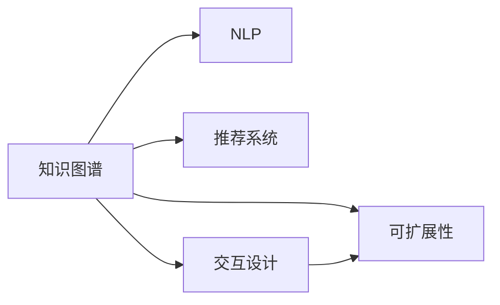

                 

# 程序员如何打造个人知识管理系统

## 1. 背景介绍

随着信息爆炸和知识更新速度的加快，个人知识管理的重要性日益凸显。对于程序员而言，他们面对的是不断变化的技术栈和开发环境，如何快速掌握新知识、高效处理信息、提升个人竞争力，成为一个亟待解决的问题。构建一个个人知识管理系统，可以帮助程序员系统化地管理知识、学习新技能、拓展思维边界，从而在快速变化的技术环境中保持竞争优势。

本文将从背景介绍开始，深入探讨如何基于先进的技术和方法，打造高效、系统、可扩展的个人知识管理系统。我们将从核心概念、算法原理、操作步骤、实际应用场景等多个方面进行阐述，帮助读者构建一个真正符合自身需求的个人知识管理系统。

## 2. 核心概念与联系

### 2.1 核心概念概述

在构建个人知识管理系统时，我们需要关注几个核心概念：

- **知识图谱**：通过节点和边的关系描述知识之间的关联，形成知识网络。知识图谱不仅帮助理解知识结构，还支持查询、推荐等高级功能。
- **自然语言处理(NLP)**：利用文本、语音等自然语言数据，进行语义理解、情感分析、智能推荐等任务。NLP技术可以自动提取、分类和组织知识，提升知识管理系统的智能化水平。
- **推荐系统**：根据用户行为和偏好，推荐相关内容，帮助用户高效发现新知识。推荐系统结合知识图谱，可以进一步提升推荐效果。
- **交互设计**：设计良好的用户界面和交互方式，使系统易于使用，提升用户粘性和满意度。
- **可扩展性**：系统应具备高度的可扩展性，以便根据业务需求和用户反馈，进行功能和性能的持续优化。

这些核心概念通过以下Mermaid流程图展示它们之间的联系：



## 3. 核心算法原理 & 具体操作步骤

### 3.1 算法原理概述

个人知识管理系统的核心算法原理包括以下几个方面：

- **知识抽取与组织**：从文本、网页、代码、文档等来源中自动抽取知识，形成结构化的知识图谱。这通常涉及到文本分类、实体识别、关系抽取等NLP技术。
- **推荐算法**：根据用户行为和兴趣，推荐相关知识。推荐算法包括协同过滤、基于内容的推荐、深度学习等。
- **交互设计**：通过UI/UX设计，提升用户对系统的使用体验。交互设计包括界面布局、交互逻辑、反馈机制等。

### 3.2 算法步骤详解

构建个人知识管理系统大致包括以下几个步骤：

**Step 1: 数据收集与清洗**
- 从各种渠道（如GitHub、Stack Overflow、论文、书籍、博客等）收集知识数据。
- 清洗数据，去除重复、噪声、错误等无用信息。

**Step 2: 知识抽取与组织**
- 使用NLP技术对数据进行文本分类、实体识别、关系抽取，构建知识图谱。
- 将抽取的知识进行分类、组织，构建标签体系和索引，便于检索和推荐。

**Step 3: 推荐系统构建**
- 根据用户行为（如阅读、分享、评论、搜索等），构建用户画像。
- 设计推荐算法，利用用户画像和知识图谱，计算相关度，生成推荐列表。
- 不断迭代优化推荐算法，提升推荐效果。

**Step 4: 系统设计与实现**
- 设计系统架构，选择合适的技术栈（如React、Flask、MongoDB等）。
- 实现UI/UX，提供交互式的知识管理界面。
- 开发后端逻辑，实现知识抽取、推荐、检索等功能。
- 进行系统测试和优化，确保系统稳定、高效、易用。

**Step 5: 系统部署与维护**
- 部署系统到云平台或服务器上，确保系统可扩展性。
- 监控系统性能，收集用户反馈，持续改进系统功能。
- 定期备份数据，确保数据安全。

### 3.3 算法优缺点

**优点**：
- 系统化和结构化管理知识，便于查找、使用和分享。
- 自动化知识抽取和推荐，减轻人工负担，提高效率。
- 持续优化算法，提升推荐效果和用户体验。

**缺点**：
- 需要大量初始数据和计算资源，系统搭建成本较高。
- 推荐系统需要不断迭代优化，维护复杂度较高。
- 界面设计要求高，需要良好的UI/UX设计能力。

### 3.4 算法应用领域

个人知识管理系统可以广泛应用于多个领域，包括但不限于：

- **开发者社区**：帮助开发者快速查找、学习新知识，提升编程能力。
- **学术研究**：帮助研究人员高效管理文献、数据，发现研究热点。
- **教育培训**：为学生提供个性化的学习资源，提升学习效果。
- **企业管理**：帮助企业员工快速获取业务知识，提升工作效率。
- **个人学习**：个人自我提升、兴趣探索、习惯养成等。

## 4. 数学模型和公式 & 详细讲解 & 举例说明

### 4.1 数学模型构建

构建知识管理系统时，我们通常需要构建以下数学模型：

- **知识图谱模型**：使用图数据库（如Neo4j）存储知识节点和关系，使用图算法（如PageRank、图神经网络）计算节点间的相关性。
- **推荐算法模型**：如协同过滤模型、基于内容的推荐模型、深度学习模型（如ALS、TF-IDF、RNN、GAN等）。
- **文本分类模型**：如朴素贝叶斯、支持向量机、深度学习模型（如CNN、LSTM、BERT等）。
- **实体识别模型**：如CRF、条件随机场、深度学习模型（如BERT、GNN等）。
- **关系抽取模型**：如最大熵模型、转移学习、深度学习模型（如LSTM、BERT等）。

### 4.2 公式推导过程

以推荐系统中的协同过滤模型为例，公式推导过程如下：

设用户$u$对物品$i$的评分向量为$\mathbf{r}_u$，物品$i$的评分向量为$\mathbf{r}_i$，用户$u$对物品$i$的评分$x_{ui}$可以表示为：

$$x_{ui} = \mathbf{r}_u^T \mathbf{r}_i$$

为了提升推荐效果，我们加入用户-物品交互矩阵$\mathbf{X}$和物品-物品相似矩阵$\mathbf{S}$，其中$\mathbf{X}$中的元素$x_{ij}$表示用户$u$对物品$i$的评分，$\mathbf{S}$中的元素$s_{ij}$表示物品$i$和物品$j$的相似度。则协同过滤模型可以表示为：

$$x_{ui} = \mathbf{r}_u^T \mathbf{S} \mathbf{r}_j$$

其中$\mathbf{r}_j$为物品$j$的评分向量，$j$为与物品$i$相似的物品。

### 4.3 案例分析与讲解

假设我们有一个包含多个用户和物品的评分矩阵$\mathbf{X}$，每个用户对每个物品的评分从1到5，0表示用户没有评分。为了推荐物品$i$给用户$u$，我们使用协同过滤模型计算物品$i$与用户$u$相似的物品的评分，再将这些评分加权平均，得到物品$i$的预测评分：

$$\hat{x}_{ui} = \sum_{j \in \mathcal{N}(i)} \alpha_j x_{uj}$$

其中$\mathcal{N}(i)$表示与物品$i$相似的物品集合，$\alpha_j$为相似度权重。

通过这个简单的案例，我们可以看到协同过滤模型利用用户-物品交互矩阵和物品-物品相似矩阵，计算物品$i$的预测评分，从而实现物品推荐。

## 5. 项目实践：代码实例和详细解释说明

### 5.1 开发环境搭建

为了快速搭建一个个人知识管理系统，我们需要安装以下工具和库：

- Python 3.x
- Flask 框架
- MongoDB
- PyMongo
- Elasticsearch
- Tesseract OCR
- PyTesseract
- Scrapy 爬虫框架
- BeautifulSoup HTML解析库

首先，我们需要在本地搭建Python环境，并安装上述库。可以使用Anaconda或Miniconda进行安装。

```bash
conda create -n py3env python=3.8
conda activate py3env
pip install Flask pymongo elasticsearch tesseract pytesseract scrapy beautifulsoup4
```

### 5.2 源代码详细实现

以下是一个基于Flask和MongoDB的简单知识管理系统示例代码。

**Flask应用入口：**

```python
from flask import Flask, render_template, request
from pymongo import MongoClient

app = Flask(__name__)

client = MongoClient('mongodb://localhost:27017/')
db = client['knowledge_db']

@app.route('/')
def index():
    return render_template('index.html')

@app.route('/search', methods=['POST'])
def search():
    query = request.form['query']
    results = db.knowledge.find({'name': {'$regex': query}})
    return render_template('search_results.html', results=results)

if __name__ == '__main__':
    app.run(debug=True)
```

**MongoDB数据模型：**

```python
from pymongo import MongoClient

client = MongoClient('mongodb://localhost:27017/')
db = client['knowledge_db']

# 创建知识集合
db.knowledge.create_index('name', unique=True)

# 插入知识数据
db.knowledge.insert_many([
    {'name': 'TensorFlow', 'type': '技术', 'url': 'https://tensorflow.org'},
    {'name': 'GitHub', 'type': '平台', 'url': 'https://github.com'},
    {'name': '深度学习', 'type': '技术', 'url': 'https://www.deeplearning.ai'}
])
```

**Flask模板：**

**index.html：**

```html
<html>
<head>
    <title>知识管理系统</title>
</head>
<body>
    <h1>欢迎使用知识管理系统</h1>
    <form action="/search" method="POST">
        <label for="search">搜索：</label>
        <input type="text" id="search" name="query">
        <button type="submit">搜索</button>
    </form>
</body>
</html>
```

**search_results.html：**

```html
<html>
<head>
    <title>搜索结果</title>
</head>
<body>
    <h1>搜索结果</h1>
    <ul>
        
            <li><a href="{{ result['url'] }}" target="_blank">{{ result['name'] }}</a></li>
        
    </ul>
</body>
</html>
```

### 5.3 代码解读与分析

**Flask应用入口：**

- 首先，我们使用Flask创建应用实例，并连接到MongoDB数据库。
- 定义应用路由，主页显示搜索框，搜索路由根据用户输入的关键词，在知识集合中查找匹配的知识项，并返回搜索结果页面。
- 最后，我们运行应用，并设置debug模式为True，以便调试。

**MongoDB数据模型：**

- 我们创建了一个名为`knowledge`的集合，定义了`name`字段为必填且唯一，表示每个知识项的独特名称。
- 使用`insert_many`方法插入三个知识项，包括名称、类型和URL。

**Flask模板：**

- 我们定义了两个HTML模板，一个为首页，一个为搜索结果页。
- 首页显示搜索框，用户输入关键词后跳转到搜索结果页。
- 搜索结果页显示所有匹配的知识项，并提供链接访问。

### 5.4 运行结果展示

运行上述代码后，我们可以通过浏览器访问应用，查看搜索结果。例如，输入`TensorFlow`，即可显示出所有与TensorFlow相关的知识项。

## 6. 实际应用场景

### 6.1 开发者社区

开发者社区中，个人知识管理系统可以提供丰富的编程资源和工具。开发者可以通过系统搜索新框架、库、工具包，获取技术博客、教程、案例，掌握最新技术动态。同时，系统还可以根据开发者历史行为推荐相关内容，帮助开发者提升编程能力和工作效率。

### 6.2 学术研究

学术研究中，个人知识管理系统可以帮助研究人员管理论文、数据集、代码等资源，快速找到相关研究论文和资料。系统可以根据研究兴趣、领域等标签，推荐相关文献，辅助研究人员发现研究热点和前沿技术。

### 6.3 教育培训

教育培训中，个人知识管理系统可以为学生提供个性化的学习资源。系统可以根据学生学习进度、兴趣、薄弱环节等数据，推荐合适的学习内容、视频、习题，提升学习效果。同时，系统还可以记录学生学习行为，生成学习报告，帮助教师了解学生学习情况。

### 6.4 企业管理

企业管理中，个人知识管理系统可以帮助员工快速获取业务知识，提升工作效率。系统可以根据员工岗位、职责等标签，推荐相关的业务流程、知识库、培训资料，帮助员工更好地完成任务。同时，系统还可以记录员工知识获取行为，生成员工知识图谱，帮助企业识别知识管理痛点，优化知识管理策略。

### 6.5 个人学习

个人学习中，知识管理系统可以帮助个人高效管理知识，提升自我学习能力。系统可以根据用户兴趣、学习习惯、历史行为等数据，推荐相关的书籍、文章、课程，辅助个人获取新知识。同时，系统还可以记录个人学习行为，生成知识图谱，帮助用户发现知识盲点，提升学习效果。

## 7. 工具和资源推荐

### 7.1 学习资源推荐

为了帮助读者构建一个高效的知识管理系统，我们推荐以下学习资源：

- **《Python爬虫开发与实战》**：介绍如何使用Scrapy、BeautifulSoup等库，从网络爬取数据，构建知识库。
- **《深度学习入门：基于TensorFlow 2.0的实践》**：详细讲解如何使用TensorFlow进行模型构建、训练、评估，适用于知识管理系统中的推荐系统和文本分类模型。
- **《Flask Web开发实战》**：介绍如何使用Flask框架，构建高效、灵活的Web应用，适用于知识管理系统的后端逻辑开发。
- **《MongoDB实战》**：讲解MongoDB数据库的使用方法和最佳实践，适用于知识管理系统的数据存储和管理。
- **《Elasticsearch实战》**：介绍Elasticsearch搜索引擎的使用方法和高级功能，适用于知识管理系统的全文检索和推荐系统。
- **《自然语言处理入门与实战》**：讲解NLP技术的基本概念和应用场景，适用于知识管理系统中的知识抽取和推荐功能。

### 7.2 开发工具推荐

为了快速搭建和优化知识管理系统，我们推荐以下开发工具：

- **Flask**：轻量级Web框架，易于上手，适合构建简单的知识管理系统后端逻辑。
- **MongoDB**：高扩展性、高性能的NoSQL数据库，适合存储和管理结构化数据。
- **Elasticsearch**：高性能的搜索引擎，支持全文检索、推荐系统等高级功能，适合构建高效的知识检索和推荐系统。
- **PyTesseract**：Python的OCR库，支持识别图片中的文本，适用于知识管理系统中的文本抽取功能。
- **Scrapy**：高效的爬虫框架，支持异步爬取数据，适用于知识管理系统中的数据收集功能。
- **BeautifulSoup**：HTML解析库，支持解析网页数据，适用于知识管理系统中的数据收集和文本抽取功能。

### 7.3 相关论文推荐

为了深入理解知识管理系统的原理和技术，我们推荐以下相关论文：

- **《Knowledge Graphs: Concepts, Representation, and Applications》**：介绍知识图谱的概念、表示和应用，适用于知识管理系统的核心算法原理。
- **《Evaluation of Recommendation Algorithms in Information Retrieval》**：介绍推荐算法的评估方法，适用于知识管理系统的推荐系统构建。
- **《Deep Learning for Natural Language Processing》**：介绍深度学习在NLP中的应用，适用于知识管理系统的文本分类和实体识别功能。
- **《Towards a Scalable Knowledge Graph: A Survey》**：介绍知识图谱的扩展性设计和应用场景，适用于知识管理系统的系统设计与实现。
- **《Using Human-in-the-Loop for Machine Learning Models》**：介绍人机协同优化机器学习模型的方法，适用于知识管理系统的持续学习与优化。

## 8. 总结：未来发展趋势与挑战

### 8.1 研究成果总结

构建个人知识管理系统是一个综合性技术挑战，需要融合多种技术和方法。我们通过本文介绍的知识抽取、推荐算法、系统设计等关键技术，为构建高效的知识管理系统提供了全面的指导。同时，本文还展示了Flask、MongoDB、Elasticsearch等技术的实际应用案例，为读者提供了可供参考的实践方案。

### 8.2 未来发展趋势

未来，知识管理系统将在多个领域得到广泛应用，进一步拓展其应用边界。

- **多模态知识管理**：将文本、图像、视频等不同类型的数据进行统一管理，构建多模态知识图谱，提升知识管理系统的智能化水平。
- **个性化推荐**：结合用户画像和行为数据，实现更加精准的知识推荐，提升用户体验。
- **知识图谱演进**：通过实时数据更新和知识融合，实现知识图谱的持续演进，保持知识的时效性和准确性。
- **智能搜索**：利用自然语言处理和深度学习技术，提升知识搜索的准确性和智能性。
- **用户协作**：支持用户之间的知识分享和协作，形成社区化的知识管理模式，提升知识管理系统的活跃度和参与度。

### 8.3 面临的挑战

尽管知识管理系统具有广阔的应用前景，但其构建和优化仍面临诸多挑战：

- **数据获取和清洗**：知识管理系统的核心是高质量的数据，但数据的获取和清洗需要大量时间和精力。
- **算法复杂度**：知识管理系统涉及多种算法和技术，算法复杂度和实现难度较高。
- **用户体验**：知识管理系统需要设计良好的用户界面和交互方式，提升用户体验，增加用户粘性。
- **性能优化**：知识管理系统需要高效处理大量数据和实时查询请求，性能优化是关键挑战。
- **数据安全**：知识管理系统中存储大量用户隐私和敏感信息，数据安全和隐私保护是重要问题。

### 8.4 研究展望

未来的研究需要在以下几个方面进行探索：

- **知识图谱的动态更新和演化**：通过实时数据获取和融合，构建动态知识图谱，提升知识的时效性和准确性。
- **多模态数据的融合**：将文本、图像、视频等多模态数据进行统一管理和融合，构建多模态知识图谱，提升知识管理系统的智能化水平。
- **跨领域知识的迁移**：通过跨领域知识的迁移学习，提升知识管理系统的通用性和适用性。
- **基于用户反馈的推荐优化**：通过用户反馈和行为数据，不断优化推荐算法，提升推荐效果和用户满意度。
- **知识图谱的可视化**：通过可视化工具，展示知识图谱的结构和关系，提升知识管理系统的可理解性和可解释性。
- **人机协同的智能优化**：通过人机协同优化算法，提升知识管理系统的性能和智能化水平。

综上所述，个人知识管理系统是一个复杂且具有挑战性的系统，需要融合多种技术和方法，才能构建高效、智能、易用的知识管理平台。未来，随着技术的不断进步和应用场景的拓展，知识管理系统必将在更多领域得到广泛应用，为人类知识管理带来革命性的变革。

---

作者：禅与计算机程序设计艺术 / Zen and the Art of Computer Programming

