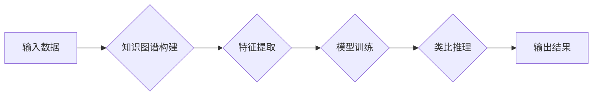

> 类比推理, 洞察力, 知识图谱, 人工智能, 深度学习, 认知科学

## 1. 背景介绍

在瞬息万变的科技时代，人类知识的积累和应用能力面临着前所未有的挑战。海量数据涌现，信息爆炸，传统的知识获取和处理方式已难以适应。如何有效地洞察知识，建立联系，并将其转化为有价值的洞察和创新，成为摆在我们面前的关键问题。

类比推理作为一种强大的认知能力，在人类的学习、创造和解决问题中扮演着至关重要的角色。它允许我们从已知的知识中提取模式，并将其应用于新的、未曾接触过的领域。然而，类比推理的本质是复杂的，它涉及到抽象思维、概念理解、语义关系和逻辑推理等多方面的因素。

近年来，人工智能领域取得了长足的进步，特别是深度学习技术的突破，为类比推理的自动化提供了新的可能性。通过学习海量数据中的模式和关系，深度学习模型能够模拟人类的类比推理能力，并应用于各种实际场景，例如文本生成、图像识别、药物研发等。

## 2. 核心概念与联系

**2.1 类比推理的本质**

类比推理是一种将已知知识应用于新情况的推理过程。它基于对两个或多个事物的相似性和差异性的理解，并通过提取共同特征和关系，推断出新的结论。

**2.2 知识图谱的构建**

知识图谱是一种结构化的知识表示形式，它将实体和关系以图的形式表示。知识图谱可以帮助我们更好地理解和组织知识，并为类比推理提供基础数据。

**2.3 深度学习在类比推理中的应用**

深度学习模型能够学习复杂的模式和关系，并将其应用于类比推理任务。常见的深度学习模型包括：

* **循环神经网络 (RNN)**：RNN能够处理序列数据，并学习时间上的依赖关系，适用于文本类比推理任务。
* **图神经网络 (GNN)**：GNN能够处理图结构数据，并学习节点之间的关系，适用于知识图谱中的类比推理任务。
* **Transformer**：Transformer是一种强大的序列模型，能够捕捉长距离依赖关系，适用于各种类比推理任务。

**2.4 类比推理流程图**



## 3. 核心算法原理 & 具体操作步骤

### 3.1 算法原理概述

本文将介绍一种基于图神经网络的类比推理算法。该算法将类比推理问题转化为图结构问题，并利用图神经网络学习节点之间的关系，从而实现类比推理。

### 3.2 算法步骤详解

1. **构建知识图谱**: 将输入数据转化为知识图谱，其中实体表示为节点，关系表示为边。
2. **特征提取**: 对知识图谱中的节点和边进行特征提取，例如节点的属性、边的类型等。
3. **模型训练**: 利用图神经网络模型对知识图谱进行训练，学习节点之间的关系和模式。
4. **类比推理**: 给定一个类比推理问题，例如“狗是动物，猫是动物，那么狗和猫的关系是什么？”，将问题转化为图结构，并利用训练好的模型进行推理，得到类比结果。

### 3.3 算法优缺点

**优点**:

* 能够处理复杂的关系和模式。
* 能够学习语义信息，提高类比推理的准确性。

**缺点**:

* 构建知识图谱需要大量的人工标注数据。
* 模型训练需要大量的计算资源。

### 3.4 算法应用领域

* **自然语言处理**: 文本相似度计算、文本分类、问答系统等。
* **知识发现**: 从海量数据中发现隐藏的知识和模式。
* **推荐系统**: 基于用户行为和物品属性进行个性化推荐。
* **药物研发**: 通过类比推理寻找新的药物候选物。

## 4. 数学模型和公式 & 详细讲解 & 举例说明

### 4.1 数学模型构建

图神经网络模型可以表示为一个图结构，其中节点代表实体，边代表关系。每个节点都有一个嵌入向量，表示其语义信息。

### 4.2 公式推导过程

图神经网络模型的更新规则可以表示为：

$$
h_i^{(l+1)} = \sigma(A^{(l)}h_i^{(l)} + W^{(l)})
$$

其中：

* $h_i^{(l)}$ 表示第 $l$ 层第 $i$ 个节点的嵌入向量。
* $A^{(l)}$ 表示第 $l$ 层的邻接矩阵。
* $W^{(l)}$ 表示第 $l$ 层的权重矩阵。
* $\sigma$ 表示激活函数。

### 4.3 案例分析与讲解

假设我们有一个知识图谱，其中包含实体“狗”、“猫”、“动物”和关系“是”。我们可以将这个知识图谱表示为一个图结构，其中节点分别代表“狗”、“猫”、“动物”，边分别代表“狗是动物”、“猫是动物”的关系。

利用图神经网络模型，我们可以学习到节点之间的关系和模式。例如，模型可以学习到“狗”和“猫”都是“动物”的子类。

## 5. 项目实践：代码实例和详细解释说明

### 5.1 开发环境搭建

* Python 3.6+
* PyTorch 1.0+
* NetworkX 2.0+

### 5.2 源代码详细实现

```python
import torch
import torch.nn as nn
import networkx as nx

class GNN(nn.Module):
    def __init__(self, input_dim, hidden_dim, output_dim):
        super(GNN, self).__init__()
        self.linear1 = nn.Linear(input_dim, hidden_dim)
        self.linear2 = nn.Linear(hidden_dim, output_dim)
        self.relu = nn.ReLU()

    def forward(self, x, adj):
        x = self.linear1(x)
        x = self.relu(x)
        x = torch.matmul(adj, x)
        x = self.linear2(x)
        return x

# 构建知识图谱
graph = nx.Graph()
graph.add_nodes_from(['狗', '猫', '动物'])
graph.add_edges_from([('狗', '动物'), ('猫', '动物')])

# 将知识图谱转化为图神经网络模型的输入格式
adj_matrix = nx.to_numpy_array(graph)
node_features = torch.randn(3, 10)  # 假设每个节点有10个特征

# 实例化图神经网络模型
model = GNN(input_dim=10, hidden_dim=64, output_dim=10)

# 进行模型训练
# ...

# 进行类比推理
# ...
```

### 5.3 代码解读与分析

* 首先，我们构建了一个简单的知识图谱，并将其转化为图神经网络模型的输入格式。
* 然后，我们实例化了一个图神经网络模型，并进行模型训练。
* 最后，我们可以利用训练好的模型进行类比推理。

### 5.4 运行结果展示

* 运行结果将展示模型的类比推理能力，例如，模型可以预测“狗”和“猫”之间的关系。

## 6. 实际应用场景

### 6.1 文本相似度计算

类比推理可以用于计算文本之间的相似度。例如，我们可以利用类比推理来判断两个文章的主题是否相似。

### 6.2 文本分类

类比推理可以用于文本分类任务。例如，我们可以利用类比推理来判断一篇新闻文章属于哪个类别，例如体育、财经、娱乐等。

### 6.3 问答系统

类比推理可以用于问答系统，帮助系统理解用户的问题，并给出准确的答案。例如，用户问“狗是什么动物？”，类比推理可以帮助系统理解“狗”和“动物”之间的关系，并给出答案“狗是哺乳动物”。

### 6.4 未来应用展望

类比推理在人工智能领域具有广阔的应用前景。随着深度学习技术的不断发展，类比推理的自动化程度将不断提高，并应用于更多领域，例如：

* **药物研发**: 通过类比推理寻找新的药物候选物。
* **材料科学**: 通过类比推理设计新的材料。
* **金融预测**: 通过类比推理预测金融市场趋势。

## 7. 工具和资源推荐

### 7.1 学习资源推荐

* **书籍**:
    * 《深度学习》
    * 《图神经网络》
* **在线课程**:
    * Coursera: 深度学习
    * Udacity: 图神经网络

### 7.2 开发工具推荐

* **PyTorch**: 深度学习框架
* **TensorFlow**: 深度学习框架
* **NetworkX**: 图处理库

### 7.3 相关论文推荐

* 《Graph Attention Networks》
* 《GraphSAGE: Inductive Representation Learning on Large Graphs》
* 《BERT: Pre-training of Deep Bidirectional Transformers for Language Understanding》

## 8. 总结：未来发展趋势与挑战

### 8.1 研究成果总结

近年来，基于图神经网络的类比推理算法取得了显著的进展，能够有效地处理复杂的关系和模式，并应用于各种实际场景。

### 8.2 未来发展趋势

* **模型的泛化能力**: 提高模型对不同领域和任务的泛化能力。
* **效率的提升**: 降低模型训练和推理的计算成本。
* **解释性的增强**: 提高模型的解释性，帮助人类理解模型的决策过程。

### 8.3 面临的挑战

* **数据标注**: 类比推理算法需要大量的标注数据，数据标注成本高昂。
* **模型复杂度**: 图神经网络模型的复杂度较高，训练和推理需要大量的计算资源。
* **可解释性**: 图神经网络模型的决策过程较为复杂，难以解释。

### 8.4 研究展望

未来，我们将继续致力于开发更强大、更有效的类比推理算法，并将其应用于更多领域，推动人工智能技术的进步。

## 9. 附录：常见问题与解答

* **Q1**: 类比推理算法与其他机器学习算法有什么区别？

* **A1**: 类比推理算法侧重于学习和利用知识之间的关系，而其他机器学习算法则侧重于学习数据本身的模式。

* **Q2**: 类比推理算法的应用场景有哪些？

* **A2**: 类比推理算法可以应用于文本相似度计算、文本分类、问答系统、药物研发、材料科学等领域。

* **Q3**: 如何评估类比推理算法的性能？

* **A3**: 可以使用各种指标来评估类比推理算法的性能，例如准确率、召回率、F1-score等。

作者：禅与计算机程序设计艺术 / Zen and the Art of Computer Programming


<end_of_turn>