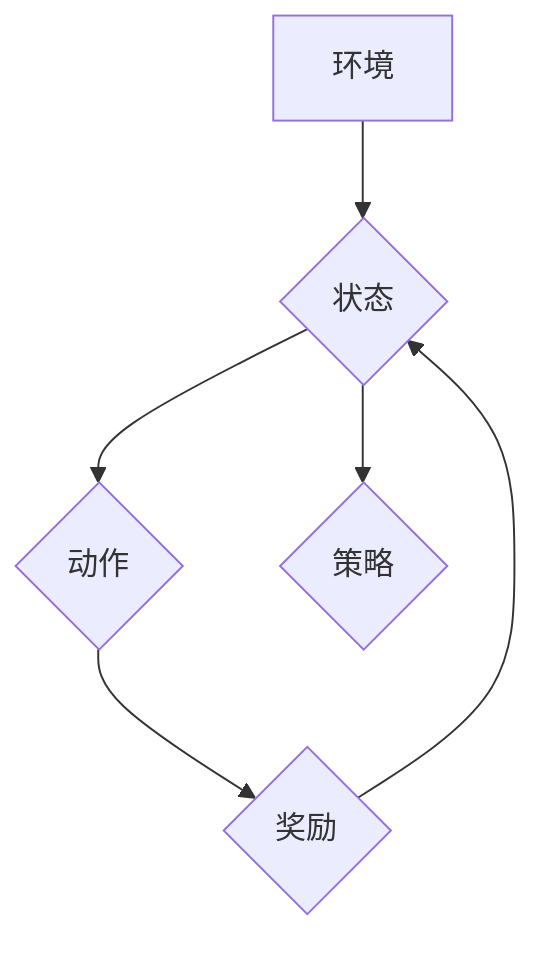

> 深度学习，Q-learning，强化学习，金融风控，欺诈检测，风险管理

## 1. 背景介绍

金融行业正处于数字化转型和智能化升级的关键时期。随着金融科技的快速发展，数据量呈指数级增长，传统的风控模型难以有效应对日益复杂的风险挑战。深度强化学习 (Deep Reinforcement Learning, DRL) 作为一种新兴的机器学习方法，凭借其强大的学习能力和适应性，在金融风控领域展现出巨大的应用潜力。

深度 Q-learning 是一种基于强化学习的算法，它能够学习一个策略，以最大化在特定环境下的累积回报。在金融风控场景中，我们可以将风险识别和控制视为一个强化学习任务。

* **环境:** 金融交易环境，包括客户信息、交易记录、市场数据等。
* **状态:** 当前环境的状态，例如客户的信用评分、交易金额、交易频率等。
* **动作:** 风控策略，例如拒绝交易、限制交易额度、提高风控等级等。
* **奖励:** 风控策略带来的收益，例如减少欺诈损失、降低风险敞口等。

通过深度 Q-learning 算法，我们可以训练一个智能风控模型，能够根据实时环境信息，做出最优的风险控制决策。

## 2. 核心概念与联系

**2.1 强化学习 (Reinforcement Learning)**

强化学习是一种基于交互学习的机器学习方法，其核心思想是通过试错学习，找到最优的策略以最大化累积奖励。强化学习系统由以下几个关键组成部分组成：

* **智能体 (Agent):**  学习和决策的实体。
* **环境 (Environment):** 智能体所处的外部世界。
* **状态 (State):** 环境的当前状态。
* **动作 (Action):** 智能体在特定状态下可以采取的行动。
* **奖励 (Reward):** 环境对智能体动作的反馈，可以是正向奖励或负向惩罚。
* **策略 (Policy):** 智能体根据当前状态选择动作的规则。

**2.2 Q-learning**

Q-learning 是一种经典的强化学习算法，它通过学习一个 Q-表来评估每个状态-动作对的价值。Q-表是一个表格，其中每个单元格存储了在特定状态下采取特定动作的期望累积回报。

**2.3 深度 Q-learning**

深度 Q-learning 将深度神经网络引入 Q-learning 算法，用于学习复杂的 Q-表。深度神经网络能够学习更抽象和高级的特征表示，从而提高算法的学习能力和泛化能力。

**2.4  Mermaid 流程图**



## 3. 核心算法原理 & 具体操作步骤

### 3.1  算法原理概述

深度 Q-learning 算法的核心思想是通过深度神经网络学习一个 Q-函数，该 Q-函数能够估计在特定状态下采取特定动作的期望累积回报。

算法的目标是找到一个最优策略，使得在所有状态下，采取该策略的动作能够获得最大的累积回报。

### 3.2  算法步骤详解

1. **初始化:** 初始化深度神经网络，并设置学习率、折扣因子等超参数。
2. **环境交互:** 智能体与环境交互，观察当前状态并采取动作。
3. **奖励获取:** 环境根据智能体的动作提供奖励。
4. **Q-值更新:** 使用 Bellman 方程更新 Q-网络的参数，使得 Q-网络能够更好地估计每个状态-动作对的价值。
5. **策略选择:** 根据更新后的 Q-网络，选择最优动作。
6. **重复步骤 2-5:** 重复上述步骤，直到算法收敛或达到预设的训练次数。

### 3.3  算法优缺点

**优点:**

* **学习能力强:** 深度神经网络能够学习复杂的特征表示，提高算法的学习能力和泛化能力。
* **适应性强:** 能够适应动态变化的环境。
* **可解释性强:** 通过分析 Q-网络的权重，可以了解算法的决策逻辑。

**缺点:**

* **训练时间长:** 深度神经网络的训练时间通常较长。
* **参数设置复杂:** 需要仔细调整超参数，才能获得最佳的性能。
* **数据需求大:** 需要大量的训练数据才能训练出有效的模型。

### 3.4  算法应用领域

深度 Q-learning 算法在金融风控领域具有广泛的应用前景，例如：

* **欺诈检测:** 识别和预防欺诈交易。
* **风险管理:** 评估和控制金融风险。
* **信用评分:** 为客户分配信用评分。
* **投资决策:** 优化投资组合。

## 4. 数学模型和公式 & 详细讲解 & 举例说明

### 4.1  数学模型构建

在深度 Q-learning 算法中，我们使用一个深度神经网络来近似 Q-函数，即：

$$Q(s, a) \approx \hat{Q}(s, a)$$

其中：

* $Q(s, a)$ 表示在状态 $s$ 下采取动作 $a$ 的期望累积回报。
* $\hat{Q}(s, a)$ 表示深度神经网络估计的 Q-值。

### 4.2  公式推导过程

深度 Q-learning 算法的核心更新公式是 Bellman 方程：

$$Q(s, a) = Q(s, a) + \alpha [r + \gamma \max_{a'} Q(s', a') - Q(s, a)]$$

其中：

* $\alpha$ 是学习率，控制着学习速率。
* $r$ 是从状态 $s$ 到状态 $s'$ 的奖励。
* $\gamma$ 是折扣因子，控制着未来奖励的权重。
* $a'$ 是在状态 $s'$ 下采取的最优动作。

### 4.3  案例分析与讲解

假设我们有一个简单的金融风控场景，智能体需要判断是否拒绝一个交易。

* 状态：客户的信用评分。
* 动作：拒绝交易或批准交易。
* 奖励：如果拒绝了欺诈交易，则获得正向奖励；如果批准了欺诈交易，则获得负向奖励；如果拒绝了合法交易，则获得负向奖励；如果批准了合法交易，则获得正向奖励。

通过训练深度 Q-learning 模型，我们可以学习到一个 Q-表，该 Q-表能够估计在不同信用评分下，拒绝或批准交易的期望累积回报。

## 5. 项目实践：代码实例和详细解释说明

### 5.1  开发环境搭建

* Python 3.x
* TensorFlow 或 PyTorch 深度学习框架
* NumPy 科学计算库
* Pandas 数据处理库

### 5.2  源代码详细实现

```python
import tensorflow as tf

# 定义深度神经网络模型
model = tf.keras.models.Sequential([
    tf.keras.layers.Dense(64, activation='relu', input_shape=(1,)),
    tf.keras.layers.Dense(32, activation='relu'),
    tf.keras.layers.Dense(2, activation='linear')
])

# 定义损失函数和优化器
loss_fn = tf.keras.losses.MeanSquaredError()
optimizer = tf.keras.optimizers.Adam(learning_rate=0.001)

# 训练模型
for epoch in range(100):
    for state, action, reward, next_state in dataset:
        with tf.GradientTape() as tape:
            q_values = model(state)
            loss = loss_fn(reward, q_values)
        gradients = tape.gradient(loss, model.trainable_variables)
        optimizer.apply_gradients(zip(gradients, model.trainable_variables))

# 评估模型
# ...
```

### 5.3  代码解读与分析

* 代码首先定义了一个深度神经网络模型，该模型包含三个全连接层。
* 然后定义了损失函数和优化器，用于训练模型。
* 训练过程循环遍历数据集，计算损失并更新模型参数。
* 最后评估模型的性能。

### 5.4  运行结果展示

* 通过训练模型，我们可以获得一个 Q-表，该 Q-表能够估计在不同状态下，采取不同动作的期望累积回报。
* 可以使用 Q-表来指导智能体做出最优决策。

## 6. 实际应用场景

### 6.1  欺诈检测

深度 Q-learning 算法可以用于识别和预防欺诈交易。例如，可以训练一个模型来判断信用卡交易是否为欺诈行为。

### 6.2  风险管理

深度 Q-learning 算法可以用于评估和控制金融风险。例如，可以训练一个模型来预测股票价格的波动性，从而帮助投资者制定风险管理策略。

### 6.3  信用评分

深度 Q-learning 算法可以用于为客户分配信用评分。例如，可以训练一个模型来评估客户的还款能力，从而帮助银行决定是否授予贷款。

### 6.4  未来应用展望

随着深度学习技术的不断发展，深度 Q-learning 算法在金融风控领域的应用前景更加广阔。未来，我们可以期待看到更多基于深度 Q-learning 的创新应用，例如：

* **个性化风控:** 根据客户的个体特征，制定个性化的风控策略。
* **动态风控:** 根据实时环境变化，动态调整风控策略。
* **协同风控:** 多个智能体协同工作，共同完成风控任务。

## 7. 工具和资源推荐

### 7.1  学习资源推荐

* **书籍:**
    * Reinforcement Learning: An Introduction by Richard S. Sutton and Andrew G. Barto
    * Deep Reinforcement Learning Hands-On by Maxim Lapan
* **在线课程:**
    * Deep Reinforcement Learning Specialization by DeepLearning.AI
    * Reinforcement Learning by David Silver (University of DeepMind)

### 7.2  开发工具推荐

* **TensorFlow:** https://www.tensorflow.org/
* **PyTorch:** https://pytorch.org/
* **Keras:** https://keras.io/

### 7.3  相关论文推荐

* Deep Q-Network (DQN)
* Dueling Network Architectures for Deep Reinforcement Learning
* Proximal Policy Optimization Algorithms

## 8. 总结：未来发展趋势与挑战

### 8.1  研究成果总结

深度 Q-learning 算法在金融风控领域取得了显著的成果，例如在欺诈检测、风险管理和信用评分等方面展现出强大的应用潜力。

### 8.2  未来发展趋势

未来，深度 Q-learning 算法将朝着以下几个方向发展：

* **更强大的模型:** 开发更深、更复杂的深度神经网络模型，提高算法的学习能力和泛化能力。
* **更有效的训练方法:** 研究更有效的训练方法，例如强化学习算法的组合和迁移学习，加速算法的训练速度。
* **更广泛的应用场景:** 将深度 Q-learning 算法应用到更多金融风控场景，例如投资决策、资产配置和风险评估等。

### 8.3  面临的挑战

深度 Q-learning 算法在金融风控领域也面临一些挑战：

* **数据安全:** 金融数据通常是高度敏感的，需要采取有效的措施保护数据安全。
* **模型解释性:** 深度神经网络的决策逻辑通常难以解释，这可能会导致模型的可信度问题。
* **监管合规:** 深度 Q-learning 算法的应用需要符合相关金融监管规定。

### 8.4  研究展望

未来，我们需要继续深入研究深度 Q-learning 算法，克服其面临的挑战，并将其应用于更多金融风控场景，为金融行业提供更智能、更安全的风险管理解决方案。

## 9. 附录：常见问题与解答

**Q1: 深度 Q-learning 与传统风控模型相比有哪些优势？**

**A1:** 深度 Q-learning 算法能够学习复杂的特征表示，并根据实时环境变化动态调整