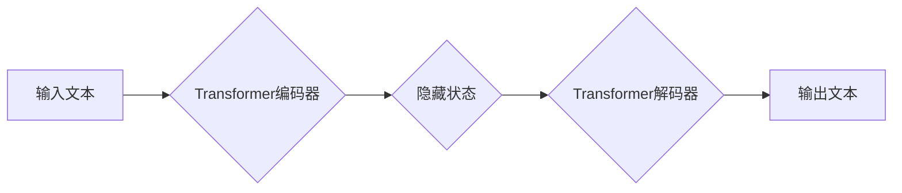

> 生成式人工智能、Transformer、GPT、DALL-E、文本生成、图像生成、自然语言处理、机器学习、深度学习

## 1. 背景介绍

人工智能（AI）技术近年来发展迅速，取得了令人瞩目的成就。从语音识别、图像识别到自然语言处理，AI已经渗透到我们生活的方方面面。其中，生成式人工智能（Generative AI）作为人工智能领域的新兴方向，凭借其强大的文本、图像、音频等多模态内容生成能力，引发了广泛的关注和讨论。

生成式人工智能是指能够根据给定的输入数据，生成新的、类似于训练数据的内容的机器学习模型。与传统的监督学习和无监督学习不同，生成式人工智能更侧重于学习数据的生成规律，并能够根据这些规律生成全新的数据样本。

## 2. 核心概念与联系

### 2.1 生成式模型

生成式模型的核心是学习数据的概率分布。通过学习数据中的模式和结构，模型能够生成新的数据样本，这些样本在统计上与训练数据相似。常见的生成式模型包括：

* **隐马尔可夫模型（HMM）：** 用于处理序列数据，例如语音识别和自然语言处理。
* **生成对抗网络（GAN）：** 由两个网络组成，一个生成器网络负责生成数据，另一个判别器网络负责判断数据是否真实。通过对抗训练，生成器网络能够生成越来越逼真的数据。
* **变分自编码器（VAE）：** 通过编码器将数据压缩成低维表示，然后通过解码器将低维表示解码回原始数据。

### 2.2 Transformer

Transformer是一种基于注意力机制的深度学习模型，在自然语言处理领域取得了突破性的进展。它能够捕捉文本中的长距离依赖关系，并有效地处理序列数据。

Transformer模型的架构包括编码器和解码器。编码器将输入文本序列编码成一个固定长度的向量表示，解码器则根据编码器输出和当前生成的文本，预测下一个词。

### 2.3  生成式模型与Transformer的结合

Transformer模型的强大能力使其成为生成式模型的理想选择。结合Transformer模型，生成式人工智能能够实现更精准、更流畅的文本生成。

**Mermaid 流程图**



## 3. 核心算法原理 & 具体操作步骤

### 3.1  算法原理概述

生成式对抗网络（GAN）是一种生成式模型，由两个神经网络组成：生成器网络和判别器网络。

* **生成器网络（Generator）：** 负责生成新的数据样本，例如图像、文本等。
* **判别器网络（Discriminator）：** 负责判断数据样本是真实数据还是由生成器网络生成的伪造数据。

GAN通过对抗训练的方式进行学习。生成器网络试图生成越来越逼真的数据样本，而判别器网络则试图识别出伪造数据。两者之间的博弈使得生成器网络能够不断提高生成数据的质量。

### 3.2  算法步骤详解

1. **初始化生成器和判别器网络的权重。**
2. **从真实数据集中随机抽取数据样本作为判别器的训练数据。**
3. **生成器网络根据随机噪声生成新的数据样本。**
4. **将真实数据样本和生成器生成的样本输入到判别器网络中，判别器网络输出每个样本的真实性概率。**
5. **根据判别器的输出，更新生成器网络和判别器网络的权重。**
6. **重复步骤2-5，直到生成器网络能够生成逼真的数据样本。**

### 3.3  算法优缺点

**优点：**

* **生成高质量的数据样本：** GAN能够生成逼真的数据样本，在图像、文本、音频等领域都有应用。
* **无监督学习：** GAN不需要大量的标注数据，能够利用未标记的数据进行训练。

**缺点：**

* **训练过程不稳定：** GAN的训练过程比较复杂，容易出现模式崩溃等问题。
* **难以评估模型性能：** GAN的输出数据是连续的，难以用传统的指标来评估模型性能。

### 3.4  算法应用领域

* **图像生成：** 生成逼真的图像、照片、艺术作品等。
* **文本生成：** 生成小说、诗歌、新闻报道等文本内容。
* **音频生成：** 生成音乐、语音、音效等音频内容。
* **视频生成：** 生成视频片段、动画等。

## 4. 数学模型和公式 & 详细讲解 & 举例说明

### 4.1  数学模型构建

GAN的数学模型主要包括生成器网络的损失函数和判别器网络的损失函数。

**生成器网络损失函数：**

$$
L_G(G, D) = E_{x \sim p_{data}(x)}[log(1 - D(G(z)))]
$$

其中：

* $G$ 是生成器网络
* $D$ 是判别器网络
* $z$ 是随机噪声
* $p_{data}(x)$ 是真实数据分布

**判别器网络损失函数：**

$$
L_D(D, G) = E_{x \sim p_{data}(x)}[log(D(x))] + E_{z \sim p_z(z)}[log(1 - D(G(z)))]
$$

其中：

* $p_z(z)$ 是随机噪声分布

### 4.2  公式推导过程

生成器网络的损失函数旨在最小化判别器网络对生成数据样本的识别概率。判别器网络的损失函数旨在最大化对真实数据样本的识别概率，同时最小化对生成数据样本的识别概率。

### 4.3  案例分析与讲解

假设我们使用GAN生成图像。训练过程中，生成器网络会尝试生成逼真的图像，而判别器网络则会尝试区分真实图像和生成图像。通过对抗训练，生成器网络会不断改进其生成图像的质量，直到生成图像与真实图像难以区分。

## 5. 项目实践：代码实例和详细解释说明

### 5.1  开发环境搭建

* Python 3.7+
* TensorFlow/PyTorch
* CUDA/cuDNN

### 5.2  源代码详细实现

```python
# 生成器网络
class Generator(nn.Module):
    def __init__(self):
        super(Generator, self).__init__()
        # ...

    def forward(self, z):
        # ...

# 判别器网络
class Discriminator(nn.Module):
    def __init__(self):
        super(Discriminator, self).__init__()
        # ...

    def forward(self, x):
        # ...

# 训练循环
for epoch in range(num_epochs):
    for batch_idx, (real_images, _) in enumerate(train_loader):
        # ...
```

### 5.3  代码解读与分析

* 生成器网络和判别器网络的结构可以根据具体任务进行调整。
* 训练循环中，会将真实数据样本和生成器生成的样本输入到判别器网络中，并根据判别器的输出更新生成器网络和判别器网络的权重。

### 5.4  运行结果展示

训练完成后，可以将生成器网络输入随机噪声，生成新的图像样本。

## 6. 实际应用场景

### 6.1  文本生成

* **聊天机器人：** 生成自然流畅的对话文本。
* **内容创作：** 生成新闻报道、小说、诗歌等文本内容。
* **代码生成：** 根据自然语言描述生成代码。

### 6.2  图像生成

* **图像合成：** 合成新的图像，例如将人物置换到不同的场景中。
* **图像修复：** 修复损坏的图像，例如填充缺失的部分。
* **艺术创作：** 生成艺术作品，例如绘画、雕塑等。

### 6.3  音频生成

* **语音合成：** 将文本转换为语音。
* **音乐创作：** 生成新的音乐作品。
* **音效制作：** 生成各种音效，例如爆炸声、枪声等。

### 6.4  未来应用展望

* **个性化内容生成：** 根据用户的喜好生成个性化的内容，例如新闻推荐、电影推荐等。
* **虚拟现实和增强现实：** 生成逼真的虚拟场景和增强现实内容。
* **医疗保健：** 生成医学图像、辅助诊断等。

## 7. 工具和资源推荐

### 7.1  学习资源推荐

* **书籍：**
    * 《深度学习》
    * 《生成对抗网络》
* **在线课程：**
    * Coursera: 深度学习
    * Udacity: 生成对抗网络

### 7.2  开发工具推荐

* **TensorFlow:** 开源深度学习框架
* **PyTorch:** 开源深度学习框架
* **Hugging Face:** 提供预训练模型和工具

### 7.3  相关论文推荐

* **Generative Adversarial Networks**
* **Attention Is All You Need**
* **BERT: Pre-training of Deep Bidirectional Transformers for Language Understanding**

## 8. 总结：未来发展趋势与挑战

### 8.1  研究成果总结

生成式人工智能在文本、图像、音频等多模态内容生成方面取得了显著进展，为人工智能的应用带来了新的可能性。

### 8.2  未来发展趋势

* **模型规模和能力的提升：** 未来将会有更大规模、更强大的生成式人工智能模型出现。
* **多模态生成：** 将文本、图像、音频等多种模态内容融合在一起，实现更丰富的生成内容。
* **可解释性和控制性：** 提高生成式人工智能模型的可解释性和控制性，使其能够更好地服务于人类。

### 8.3  面临的挑战

* **数据安全和隐私：** 生成式人工智能模型可能被用于生成虚假信息，威胁数据安全和隐私。
* **伦理问题：** 生成式人工智能的应用可能引发伦理问题，例如版权问题、歧视问题等。
* **模型训练成本：** 训练大型生成式人工智能模型需要大量的计算资源和时间。

### 8.4  研究展望

未来，生成式人工智能的研究将继续朝着更强大、更安全、更可解释的方向发展。

## 9. 附录：常见问题与解答

* **什么是生成式对抗网络（GAN）？**
* **如何训练生成式人工智能模型？**
* **生成式人工智能有哪些应用场景？**
* **生成式人工智能有哪些伦理问题？**

作者：禅与计算机程序设计艺术 / Zen and the Art of Computer Programming


<end_of_turn>