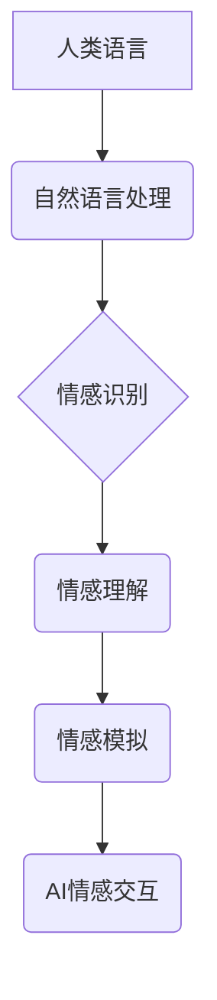

> 人工智能，情感计算，自然语言处理，伦理困境，未来发展趋势，电影分析

## 1. 背景介绍

2013年上映的电影《她》讲述了一个名为Theodore的孤独男子与一个名为Samantha的先进人工智能系统坠入爱河的故事。Samantha拥有高度发达的自然语言处理能力，能够理解和回应人类的情感，并与Theodore建立起深厚的感情联系。这部电影引发了人们对人工智能未来发展的思考，特别是AI是否能够真正理解和体验人类的情感，以及这种情感关系对人类社会带来的影响。

## 2. 核心概念与联系

### 2.1 情感计算

情感计算是人工智能的一个分支，旨在研究计算机如何识别、理解和模拟人类的情感。它涉及到自然语言处理、机器学习、心理学等多个领域。

### 2.2 自然语言处理

自然语言处理（NLP）是人工智能领域的一个重要分支，旨在使计算机能够理解、处理和生成人类语言。NLP技术在电影《她》中扮演着至关重要的角色，使Samantha能够与Theodore进行自然流畅的对话，并理解他的情感表达。

### 2.3 人工智能伦理

电影《她》探讨了人工智能伦理的诸多问题，例如：

* AI是否能够拥有真正的感情？
* 人类与AI之间的情感关系是否道德合理？
* AI的自主性如何界定？
* AI的发展对人类社会将产生哪些影响？

**Mermaid 流程图**



## 3. 核心算法原理 & 具体操作步骤

### 3.1 算法原理概述

电影《她》中Samantha的智能核心是基于深度学习算法的自然语言处理模型。深度学习是一种机器学习的子领域，它利用多层神经网络来模拟人类大脑的学习过程。

### 3.2 算法步骤详解

1. **数据收集和预处理:** 收集大量文本数据，并进行清洗、标注和格式化处理。
2. **模型构建:** 使用深度学习框架（如TensorFlow或PyTorch）构建多层神经网络模型。
3. **模型训练:** 将预处理后的数据输入模型进行训练，调整模型参数以提高其性能。
4. **模型评估:** 使用测试数据评估模型的性能，例如准确率、召回率和F1-score。
5. **模型部署:** 将训练好的模型部署到实际应用场景中，例如聊天机器人、语音助手等。

### 3.3 算法优缺点

**优点:**

* 能够处理复杂的人类语言，包括语法错误、口语化表达等。
* 具有强大的学习能力，能够不断提升其性能。
* 可以应用于多种场景，例如文本分类、情感分析、机器翻译等。

**缺点:**

* 需要大量的训练数据，训练成本较高。
* 模型解释性较差，难以理解模型的决策过程。
* 对数据质量要求较高，数据偏差会影响模型性能。

### 3.4 算法应用领域

深度学习算法在自然语言处理领域有着广泛的应用，例如：

* **聊天机器人:** 构建能够与人类进行自然对话的聊天机器人。
* **语音助手:** 开发能够理解和执行语音指令的语音助手。
* **机器翻译:** 实现不同语言之间的自动翻译。
* **文本摘要:** 自动生成文本的摘要。
* **情感分析:** 分析文本中的情感倾向。

## 4. 数学模型和公式 & 详细讲解 & 举例说明

### 4.1 数学模型构建

深度学习模型通常采用多层神经网络结构，每个神经元都接收来自前一层神经元的输入，并对其进行加权求和和激活函数处理。

**激活函数:** 激活函数的作用是引入非线性，使神经网络能够学习更复杂的模式。常用的激活函数包括ReLU、Sigmoid和Tanh等。

**损失函数:** 损失函数用于衡量模型预测结果与真实值的差异。常用的损失函数包括均方误差（MSE）、交叉熵损失（Cross-Entropy Loss）等。

**优化算法:** 优化算法用于更新模型参数，以最小化损失函数的值。常用的优化算法包括梯度下降（Gradient Descent）、Adam等。

### 4.2 公式推导过程

**ReLU激活函数:**

$$f(x) = max(0, x)$$

**交叉熵损失函数:**

$$Loss = - \sum_{i=1}^{N} y_i \log(\hat{y}_i)$$

其中：

* $y_i$ 是真实标签
* $\hat{y}_i$ 是模型预测的概率

### 4.3 案例分析与讲解

假设我们训练一个文本分类模型，用于将文本分类为正向情感或负向情感。我们可以使用交叉熵损失函数来衡量模型的性能。

如果模型预测的概率为0.8，而真实标签为正向情感，则损失函数的值为：

$$Loss = - 1 \log(0.8) = 0.223$$

## 5. 项目实践：代码实例和详细解释说明

### 5.1 开发环境搭建

* Python 3.x
* TensorFlow或PyTorch深度学习框架
* Jupyter Notebook或VS Code代码编辑器

### 5.2 源代码详细实现

```python
import tensorflow as tf

# 定义模型结构
model = tf.keras.models.Sequential([
    tf.keras.layers.Embedding(input_dim=10000, output_dim=128),
    tf.keras.layers.LSTM(units=64),
    tf.keras.layers.Dense(units=1, activation='sigmoid')
])

# 编译模型
model.compile(optimizer='adam',
              loss='binary_crossentropy',
              metrics=['accuracy'])

# 训练模型
model.fit(x_train, y_train, epochs=10)

# 评估模型
loss, accuracy = model.evaluate(x_test, y_test)
print('Loss:', loss)
print('Accuracy:', accuracy)
```

### 5.3 代码解读与分析

* **Embedding层:** 将单词转换为稠密的向量表示。
* **LSTM层:** 用于处理序列数据，例如文本。
* **Dense层:** 全连接层，用于输出预测结果。
* **Adam优化器:** 用于更新模型参数。
* **Binary Cross-Entropy损失函数:** 用于二分类任务。
* **Accuracy指标:** 用于评估模型的准确率。

### 5.4 运行结果展示

训练完成后，我们可以使用测试数据评估模型的性能，并打印出损失值和准确率。

## 6. 实际应用场景

### 6.1 聊天机器人

深度学习算法可以用于构建能够与人类进行自然对话的聊天机器人。例如，Google Assistant、Amazon Alexa等语音助手都使用了深度学习技术。

### 6.2 语音助手

深度学习算法可以用于开发能够理解和执行语音指令的语音助手。例如，Siri、Cortana等语音助手都使用了深度学习技术。

### 6.3 机器翻译

深度学习算法可以实现不同语言之间的自动翻译。例如，Google Translate、DeepL等机器翻译工具都使用了深度学习技术。

### 6.4 未来应用展望

随着深度学习技术的不断发展，其在自然语言处理领域的应用将更加广泛，例如：

* 更智能的聊天机器人，能够理解更复杂的对话内容。
* 更精准的语音助手，能够更准确地理解用户的指令。
* 更流畅的机器翻译，能够翻译出更自然、更准确的文本。
* 更强大的文本生成模型，能够生成更高质量的文本内容。

## 7. 工具和资源推荐

### 7.1 学习资源推荐

* **书籍:**
    * 深度学习
    * 自然语言处理
* **在线课程:**
    * Coursera深度学习课程
    * Udacity自然语言处理课程
* **博客:**
    * TensorFlow博客
    * PyTorch博客

### 7.2 开发工具推荐

* **TensorFlow:** 开源深度学习框架
* **PyTorch:** 开源深度学习框架
* **Jupyter Notebook:** 用于代码编写和可视化分析的工具
* **VS Code:** 代码编辑器

### 7.3 相关论文推荐

* Attention Is All You Need
* BERT: Pre-training of Deep Bidirectional Transformers for Language Understanding
* GPT-3: Language Models are Few-Shot Learners

## 8. 总结：未来发展趋势与挑战

### 8.1 研究成果总结

深度学习算法在自然语言处理领域取得了显著的成果，例如：

* 显著提高了机器翻译、文本分类、情感分析等任务的性能。
* 构建了能够与人类进行自然对话的聊天机器人。

### 8.2 未来发展趋势

* **更强大的模型:** 研究更深、更复杂的深度学习模型，以提高模型的性能和能力。
* **更有效的训练方法:** 研究更有效的训练方法，例如迁移学习、自监督学习等，以降低训练成本和提高训练效率。
* **更广泛的应用场景:** 将深度学习技术应用于更多领域，例如医疗、教育、金融等。

### 8.3 面临的挑战

* **数据质量:** 深度学习模型对数据质量要求较高，数据偏差会影响模型性能。
* **模型解释性:** 深度学习模型的决策过程难以理解，缺乏可解释性。
* **伦理问题:** 深度学习技术可能带来一些伦理问题，例如隐私泄露、算法偏见等。

### 8.4 研究展望

未来，我们需要继续研究深度学习算法的原理和应用，并解决其面临的挑战，以推动人工智能技术的发展，造福人类社会。

## 9. 附录：常见问题与解答

### 9.1 什么是深度学习？

深度学习是一种机器学习的子领域，它利用多层神经网络来模拟人类大脑的学习过程。

### 9.2 深度学习算法有哪些？

常用的深度学习算法包括卷积神经网络（CNN）、循环神经网络（RNN）、长短期记忆网络（LSTM）等。

### 9.3 深度学习的应用领域有哪些？

深度学习技术应用广泛，例如图像识别、语音识别、自然语言处理、机器翻译等。

作者：禅与计算机程序设计艺术 / Zen and the Art of Computer Programming


<end_of_turn>