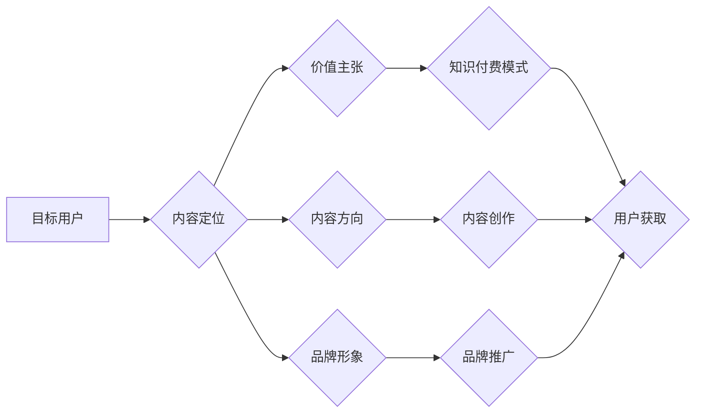

> 内容定位、知识付费、市场分析、目标用户、价值主张、内容规划、内容运营

## 1. 背景介绍

知识付费行业近年来发展迅速，成为互联网经济的新增长点。越来越多的创作者和企业涌入这个领域，寻求通过提供优质知识和服务获取收益。然而，知识付费市场竞争激烈，想要脱颖而出，获得持续发展，内容定位就显得尤为重要。

内容定位是指创作者在知识付费市场中明确自己的目标用户群体、价值主张和内容方向，并以此为基础构建独特的品牌形象和内容体系。良好的内容定位能够帮助创作者精准触达目标用户，提升用户粘性，最终实现商业化目标。

## 2. 核心概念与联系

### 2.1 内容定位的核心要素

* **目标用户:** 
    * 细分目标用户群体，明确他们的需求、痛点、兴趣爱好和消费习惯。
    * 通过用户画像分析，深入了解目标用户的背景、职业、教育水平、生活方式等信息。
* **价值主张:** 
    * 明确自身所提供的知识和服务能够为用户带来哪些价值，例如解决用户问题、提升用户技能、改变用户思维等。
    * 突出自身独特的优势和竞争力，例如丰富的经验、专业的知识、独特的视角等。
* **内容方向:** 
    * 选择一个明确的知识领域或主题，并围绕这个主题进行内容创作和输出。
    * 确定内容的深度、广度和形式，例如课程、文章、视频、音频等。

* **品牌形象:** 
    * 建立独特的品牌形象，例如专业、权威、有趣、亲切等。
    * 通过品牌名称、logo、视觉风格等元素，传达品牌理念和价值观。

### 2.2 内容定位与知识付费的关系

* 内容定位是知识付费创业的基础，它决定了创作者能够触达的用户群体和获得的收益。
* 良好的内容定位能够帮助创作者精准定位目标用户，提供他们真正需要的知识和服务，从而提升用户粘性和转化率。
* 不同的知识付费模式，例如课程、会员、咨询等，也需要不同的内容定位策略。

**Mermaid 流程图**



## 3. 核心算法原理 & 具体操作步骤

### 3.1 算法原理概述

内容定位算法是一种基于数据分析和机器学习的算法，它能够帮助创作者分析目标用户群体、市场趋势和竞争对手情况，从而制定更精准的内容定位策略。

该算法通常包括以下几个步骤：

* **数据收集:** 收集目标用户、市场趋势和竞争对手的相关数据，例如用户画像、搜索词、购买行为、内容表现等。
* **数据清洗:** 对收集到的数据进行清洗和处理，去除无效数据和噪声数据，确保数据质量。
* **数据分析:** 使用统计分析、机器学习等方法对数据进行分析，挖掘用户需求、市场趋势和竞争对手优势等信息。
* **内容定位:** 根据数据分析结果，制定具体的知识付费内容定位策略，包括目标用户、价值主张、内容方向和品牌形象等。

### 3.2 算法步骤详解

1. **用户画像构建:** 
    * 收集用户基本信息、兴趣爱好、行为习惯等数据。
    * 使用聚类算法将用户分组，形成不同的用户画像。
2. **市场趋势分析:** 
    * 收集相关行业数据、搜索趋势、热门话题等信息。
    * 使用时序分析、关联规则挖掘等方法分析市场趋势。
3. **竞争对手分析:** 
    * 收集竞争对手的产品、服务、营销策略等信息。
    * 使用SWOT分析、竞争力评估等方法分析竞争对手优势和劣势。
4. **内容定位模型构建:** 
    * 基于用户画像、市场趋势和竞争对手分析结果，构建内容定位模型。
    * 模型可以采用决策树、神经网络等机器学习算法。
5. **内容定位策略制定:** 
    * 输入模型，根据用户需求、市场趋势和竞争环境，输出具体的知识付费内容定位策略。

### 3.3 算法优缺点

**优点:**

* 数据驱动，能够更精准地定位目标用户。
* 能够分析市场趋势和竞争对手情况，制定更有效的策略。
* 能够不断优化和改进，提高内容定位的准确性。

**缺点:**

* 需要大量的数据支持，数据质量直接影响算法效果。
* 算法模型的构建和训练需要一定的技术门槛。
* 算法结果需要结合创作者的经验和判断进行最终决策。

### 3.4 算法应用领域

* 知识付费平台
* 教育培训机构
* 内容创作平台
* 互联网企业

## 4. 数学模型和公式 & 详细讲解 & 举例说明

### 4.1 数学模型构建

内容定位模型可以采用多种数学模型，例如决策树、支持向量机、神经网络等。

**决策树模型:**

决策树是一种树形结构的模型，它通过一系列的决策节点和分支，将用户数据分类到不同的用户群体。

**公式:**

决策树的构建过程可以使用信息增益、Gini系数等指标来评估节点的划分效果。

**信息增益:**

$$
Gain(S,A) = Entropy(S) - \sum_{v \in V} \frac{|S_v|}{|S|} Entropy(S_v)
$$

其中:

* $S$ 是数据集
* $A$ 是特征
* $V$ 是特征 $A$ 的取值集合
* $S_v$ 是特征 $A$ 取值为 $v$ 的子集
* $Entropy(S)$ 是数据集 $S$ 的熵

**Gini系数:**

$$
Gini(S,A) = 1 - \sum_{v \in V} \left( \frac{|S_v|}{|S|} \right)^2
$$

### 4.2 公式推导过程

决策树的构建过程是一个递归的过程，从根节点开始，不断地划分节点，直到满足停止条件。

**节点划分:**

选择一个特征 $A$，将数据集 $S$ 划分为多个子集 $S_v$，其中 $v$ 是特征 $A$ 的取值。

**节点选择:**

选择一个特征 $A$，使得节点划分后的信息增益或 Gini 系数最小。

**停止条件:**

当满足以下条件时，停止划分节点:

* 数据集 $S$ 中所有样本属于同一类别。
* 数据集 $S$ 中样本数量小于某个阈值。

### 4.3 案例分析与讲解

假设我们有一个知识付费平台，想要定位目标用户群体。我们可以收集用户基本信息、兴趣爱好、学习行为等数据，构建一个决策树模型。

例如，我们可以将用户根据年龄、职业、教育水平等特征进行划分，并根据用户的学习行为，例如学习时长、学习进度、学习评价等信息，进一步细化用户群体。

通过决策树模型，我们可以将用户划分为不同的用户群体，例如学生群体、职场人士群体、创业者群体等，并针对不同的用户群体制定不同的内容定位策略。

## 5. 项目实践：代码实例和详细解释说明

### 5.1 开发环境搭建

* Python 3.x
* scikit-learn
* pandas
* matplotlib

### 5.2 源代码详细实现

```python
import pandas as pd
from sklearn.tree import DecisionTreeClassifier
from sklearn.model_selection import train_test_split
from sklearn.metrics import accuracy_score

# 加载数据
data = pd.read_csv('user_data.csv')

# 选择特征和目标变量
features = ['age', 'occupation', 'education', 'learning_time', 'learning_progress']
target = 'user_group'

# 划分训练集和测试集
X_train, X_test, y_train, y_test = train_test_split(data[features], data[target], test_size=0.2)

# 创建决策树模型
model = DecisionTreeClassifier()

# 训练模型
model.fit(X_train, y_train)

# 预测测试集结果
y_pred = model.predict(X_test)

# 计算模型准确率
accuracy = accuracy_score(y_test, y_pred)
print(f'模型准确率: {accuracy}')

# 使用模型预测新用户的用户群体
new_user_data = pd.DataFrame({'age': [25], 'occupation': ['student'], 'education': ['high school'], 'learning_time': [10], 'learning_progress': [0.8]})
predicted_group = model.predict(new_user_data)
print(f'新用户的用户群体: {predicted_group}')
```

### 5.3 代码解读与分析

* 代码首先加载用户数据，并选择特征和目标变量。
* 然后使用 `train_test_split` 函数将数据划分为训练集和测试集。
* 创建一个决策树模型，并使用 `fit` 函数训练模型。
* 使用 `predict` 函数预测测试集结果，并计算模型准确率。
* 最后使用模型预测新用户的用户群体。

### 5.4 运行结果展示

运行结果会显示模型的准确率以及对新用户的预测结果。

## 6. 实际应用场景

### 6.1 知识付费平台

* 针对不同用户群体，提供个性化的课程推荐和学习路径。
* 根据用户学习进度和反馈，动态调整课程内容和难度。
* 推送用户感兴趣的知识和资讯，提升用户粘性。

### 6.2 教育培训机构

* 分析学生学习情况，制定个性化的学习计划。
* 根据学生需求，开发不同类型的课程和培训服务。
* 提升教学效率，提高学生学习效果。

### 6.3 内容创作平台

* 帮助创作者了解目标用户群体，制定内容创作策略。
* 分析内容表现数据，优化内容质量和形式。
* 推广优质内容，提升创作者影响力。

### 6.4 未来应用展望

随着人工智能技术的不断发展，内容定位算法将会更加智能化、精准化。

* 未来，内容定位算法将能够更加深入地了解用户需求，提供更加个性化的知识和服务。
* 内容定位算法也将能够更加有效地分析市场趋势和竞争环境，帮助创作者制定更有效的策略。
* 内容定位算法也将能够更加智能地进行内容创作和推荐，提升用户体验。

## 7. 工具和资源推荐

### 7.1 学习资源推荐

* **书籍:**
    * 《机器学习》 - 周志华
    * 《Python机器学习实战》 - 塞缪尔·阿布拉姆斯
* **在线课程:**
    * Coursera: 机器学习
    * edX: 数据科学
* **博客和网站:**
    * 机器学习 Mastery
    * Towards Data Science

### 7.2 开发工具推荐

* **Python:** 
    * scikit-learn
    * pandas
    * matplotlib
* **数据可视化工具:**
    * Tableau
    * Power BI

### 7.3 相关论文推荐

* **Decision Trees**
    * Quinlan, J. R. (1986). Induction of decision trees. Machine learning, 1(1), 81-106.
* **Support Vector Machines**
    * Cortes, C., & Vapnik, V. (1995). Support-vector networks. Machine learning, 20(3), 273-297.
* **Neural Networks**
    * LeCun, Y., Bengio, Y., & Hinton, G. (2015). Deep learning. Nature, 521(7553), 436-444.

## 8. 总结：未来发展趋势与挑战

### 8.1 研究成果总结

* 内容定位算法能够帮助创作者精准