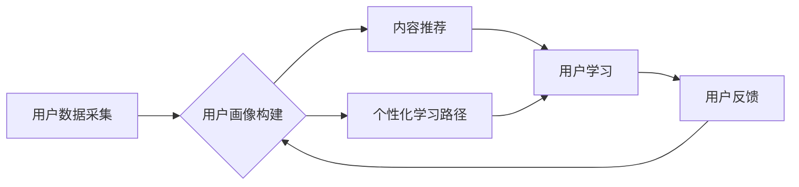

> 知识付费, 精准营销, 个性化服务, 人工智能, 数据分析, 算法模型, 用户画像, 内容推荐

## 1. 背景介绍

知识付费行业近年来发展迅速，从线上课程、付费咨询到会员体系，各种模式层出不穷。然而，随着市场竞争的加剧，如何精准触达目标用户、提供个性化服务成为知识付费平台面临的重大挑战。传统的营销方式难以满足用户日益多元化的需求，精准营销和个性化服务成为知识付费行业发展的新趋势。

## 2. 核心概念与联系

**2.1 精准营销**

精准营销是指通过对目标用户的细分和分析，制定针对性的营销策略，提高营销效率和转化率。它不再是泛泛而谈的“大规模推广”，而是基于数据驱动的精准投放，将营销资源集中在最有潜力的用户群体上。

**2.2 个性化服务**

个性化服务是指根据用户的需求、喜好和行为习惯，提供定制化的产品和服务，提升用户体验和满意度。它强调用户个体差异，提供更贴近用户需求的解决方案，从而增强用户粘性和忠诚度。

**2.3 知识付费与精准营销/个性化服务的结合**

知识付费平台可以通过数据分析和算法模型，构建用户画像，了解用户的学习兴趣、知识需求、消费习惯等信息。基于用户画像，平台可以实现以下功能：

* **精准推荐:** 根据用户的学习历史、兴趣偏好等信息，推荐与用户需求相匹配的课程、内容和服务。
* **个性化学习路径:** 为用户定制个性化的学习路径，根据用户的学习进度和能力水平，提供相应的学习建议和支持。
* **定制化内容:** 根据用户的需求和反馈，开发定制化的课程和内容，满足用户的个性化学习需求。
* **精准广告投放:** 根据用户的兴趣和行为特征，精准投放广告，提高广告转化率。

**2.4  核心架构**



## 3. 核心算法原理 & 具体操作步骤

**3.1 算法原理概述**

知识付费平台的精准营销和个性化服务主要依赖于以下核心算法：

* **协同过滤算法:** 通过分析用户对不同课程或内容的评分和行为数据，预测用户对其他课程或内容的兴趣。
* **内容基于特征的推荐算法:** 通过分析课程或内容的主题、标签、作者等特征，推荐与用户兴趣相匹配的内容。
* **深度学习算法:** 利用深度神经网络，从海量用户数据中学习用户兴趣和行为模式，实现更精准的推荐和个性化服务。

**3.2 算法步骤详解**

以协同过滤算法为例，其具体操作步骤如下：

1. **数据收集:** 收集用户对课程或内容的评分、浏览、购买等行为数据。
2. **数据预处理:** 对数据进行清洗、去噪、标准化等处理，消除数据中的异常值和噪声。
3. **用户相似度计算:** 使用余弦相似度、皮尔逊相关系数等方法，计算用户之间的相似度。
4. **物品相似度计算:** 使用余弦相似度、皮尔逊相关系数等方法，计算课程或内容之间的相似度。
5. **推荐算法:** 根据用户相似度和物品相似度，推荐用户可能感兴趣的课程或内容。

**3.3 算法优缺点**

**协同过滤算法:**

* **优点:** 能够发现用户之间的隐性关联，推荐个性化内容。
* **缺点:** 数据稀疏性问题，当用户对课程或内容的评分较少时，难以准确预测用户兴趣。

**内容基于特征的推荐算法:**

* **优点:** 不依赖于用户行为数据，能够推荐与用户兴趣相匹配的内容。
* **缺点:** 难以捕捉用户细微的兴趣变化，推荐结果可能不够个性化。

**深度学习算法:**

* **优点:** 能够从海量数据中学习用户兴趣和行为模式，实现更精准的推荐和个性化服务。
* **缺点:** 需要大量的训练数据，模型训练成本较高。

**3.4 算法应用领域**

协同过滤算法、内容基于特征的推荐算法和深度学习算法广泛应用于以下领域：

* **电商平台:** 商品推荐、用户画像构建
* **视频网站:** 视频推荐、用户兴趣分析
* **音乐平台:** 音乐推荐、用户个性化播放列表
* **社交媒体:** 内容推荐、用户兴趣发现

## 4. 数学模型和公式 & 详细讲解 & 举例说明

**4.1 数学模型构建**

协同过滤算法的核心是用户-物品评分矩阵，该矩阵表示用户对不同物品的评分。假设有N个用户和M个物品，则用户-物品评分矩阵可以表示为一个N×M的矩阵R，其中R(i,j)表示用户i对物品j的评分。

**4.2 公式推导过程**

用户相似度计算可以使用余弦相似度公式：

$$
Sim(u_i, u_j) = \frac{u_i \cdot u_j}{||u_i|| ||u_j||}
$$

其中：

* $Sim(u_i, u_j)$ 表示用户 $u_i$ 和 $u_j$ 的相似度
* $u_i \cdot u_j$ 表示用户 $u_i$ 和 $u_j$ 的点积
* $||u_i||$ 和 $||u_j||$ 分别表示用户 $u_i$ 和 $u_j$ 的向量的长度

**4.3 案例分析与讲解**

假设有两个用户A和B，他们的评分矩阵如下：

| 用户 | 物品1 | 物品2 | 物品3 |
|---|---|---|---|
| A | 5 | 3 | 4 |
| B | 4 | 5 | 2 |

计算用户A和B的余弦相似度：

1. 计算用户A和B的点积：5*4 + 3*5 + 4*2 = 20 + 15 + 8 = 43
2. 计算用户A和B向量的长度：

||A|| = √(5² + 3² + 4²) = √(25 + 9 + 16) = √50

||B|| = √(4² + 5² + 2²) = √(16 + 25 + 4) = √45

3. 计算余弦相似度：

Sim(A, B) = 43 / (√50 * √45) ≈ 0.87

结果表明，用户A和B的相似度较高，说明他们对某些物品的喜好相似。

## 5. 项目实践：代码实例和详细解释说明

**5.1 开发环境搭建**

* Python 3.x
* Pandas
* Scikit-learn
* TensorFlow/PyTorch

**5.2 源代码详细实现**

```python
import pandas as pd
from sklearn.metrics.pairwise import cosine_similarity

# 加载用户评分数据
ratings_data = pd.read_csv('ratings.csv')

# 计算用户相似度
user_similarity = cosine_similarity(ratings_data)

# 获取用户A的相似用户
user_A_id = 1
similar_users = user_similarity[user_A_id].argsort()[:-6:-1]  # 获取前5个相似用户

# 推荐物品给用户A
recommended_items = []
for user_id in similar_users:
    # 获取相似用户对物品的评分
    user_ratings = ratings_data.loc[user_id]
    # 获取用户A未评分的物品
    unrated_items = user_ratings[user_ratings.isnull()].index
    # 推荐用户A未评分的物品
    recommended_items.extend(unrated_items)

# 去重推荐物品
recommended_items = list(set(recommended_items))

# 打印推荐结果
print(f'推荐给用户A的物品: {recommended_items}')
```

**5.3 代码解读与分析**

1. 加载用户评分数据，并使用Scikit-learn库中的cosine_similarity函数计算用户之间的相似度。
2. 获取用户A的相似用户，并遍历相似用户的评分数据。
3. 找到用户A未评分的物品，并将其添加到推荐列表中。
4. 去重推荐列表，并打印推荐结果。

**5.4 运行结果展示**

运行代码后，将输出用户A可能感兴趣的物品列表。

## 6. 实际应用场景

**6.1 在线教育平台**

* **精准推荐:** 根据用户的学习历史、兴趣偏好等信息，推荐与用户需求相匹配的课程和学习资源。
* **个性化学习路径:** 为用户定制个性化的学习路径，根据用户的学习进度和能力水平，提供相应的学习建议和支持。

**6.2 知识付费社区**

* **内容推荐:** 根据用户的兴趣和行为数据，推荐与用户相关的内容，例如文章、视频、音频等。
* **用户匹配:** 根据用户的兴趣和专业领域，匹配用户与潜在的合作对象或导师。

**6.3  电商平台**

* **商品推荐:** 根据用户的购买历史、浏览记录等信息，推荐与用户需求相匹配的商品。
* **个性化营销:** 根据用户的兴趣和行为数据，推送个性化的促销信息和优惠券。

**6.4 未来应用展望**

随着人工智能技术的不断发展，知识付费平台将更加注重个性化服务和用户体验。未来，知识付费平台可能会采用以下技术实现更精准的营销和个性化服务：

* **深度学习算法:** 利用深度神经网络，从海量用户数据中学习用户兴趣和行为模式，实现更精准的推荐和个性化服务。
* **自然语言处理:** 利用自然语言处理技术，分析用户的文本数据，例如评论、反馈等，更深入地了解用户的需求和喜好。
* **虚拟现实/增强现实:** 利用虚拟现实和增强现实技术，为用户提供更沉浸式的学习体验。

## 7. 工具和资源推荐

**7.1 学习资源推荐**

* **书籍:**
    * 《推荐系统实践》
    * 《深度学习》
    * 《自然语言处理》
* **在线课程:**
    * Coursera: 推荐系统课程
    * edX: 深度学习课程
    * Udacity: 自然语言处理课程

**7.2 开发工具推荐**

* **Python:** 广泛应用于数据分析、机器学习和人工智能领域。
* **Scikit-learn:** Python机器学习库，提供各种算法模型和工具。
* **TensorFlow/PyTorch:** 深度学习框架，用于构建和训练深度神经网络。

**7.3 相关论文推荐**

* 《Collaborative Filtering for Implicit Feedback Datasets》
* 《Deep Learning for Recommender Systems》
* 《Natural Language Processing for Recommender Systems》

## 8. 总结：未来发展趋势与挑战

**8.1 研究成果总结**

知识付费平台的精准营销和个性化服务已经取得了显著成果，通过数据分析和算法模型，平台能够更精准地推荐内容，为用户提供更个性化的学习体验。

**8.2 未来发展趋势**

未来，知识付费平台将更加注重用户体验和个性化服务，将人工智能技术应用于更广泛的领域，例如内容创作、学习评估、用户支持等。

**8.3 面临的挑战**

* **数据隐私保护:** 知识付费平台需要收集大量用户数据，如何保护用户隐私安全是一个重要的挑战。
* **算法公平性:** 算法模型可能会存在偏见，导致推荐结果不公平，需要不断改进算法模型，确保推荐结果公平公正。
* **用户信任:** 用户需要信任平台的推荐结果，平台需要建立良好的用户信任关系，才能实现精准营销和个性化服务的成功。

**8.4 研究展望**

未来，知识付费平台的精准营销和个性化服务将朝着以下方向发展：

* **更精准的推荐:** 利用更先进的算法模型