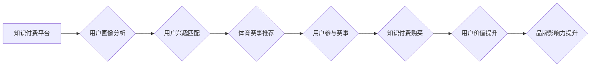

> 知识付费、跨界营销、体育赛事、数据分析、人工智能、用户画像、个性化推荐

## 1. 背景介绍

知识付费作为一种新型的商业模式，近年来发展迅速，其核心在于将知识和技能转化为有价值的商品，通过线上平台进行销售。而体育赛事作为一种大众娱乐活动，拥有庞大的受众群体和巨大的商业价值。两者看似独立，但实际上存在着巨大的协同效应。

随着互联网技术的不断发展，数据分析、人工智能等技术的应用日益广泛，为知识付费与体育赛事跨界营销提供了新的机遇。通过数据分析，我们可以精准地了解用户的兴趣爱好、消费习惯等信息，并利用人工智能技术进行个性化推荐，从而实现知识付费与体育赛事的有效结合。

## 2. 核心概念与联系

### 2.1 知识付费

知识付费是指将知识、技能、经验等转化为有价值的商品，通过线上平台进行销售的商业模式。其核心价值在于为用户提供有价值的知识和技能，帮助用户提升自身能力和价值。

### 2.2 跨界营销

跨界营销是指企业将自身产品或服务与其他行业或领域的品牌进行合作，共同进行推广和营销活动。其目的是通过资源整合、品牌联动等方式，扩大品牌影响力、提升品牌知名度和市场份额。

### 2.3 体育赛事

体育赛事是指以竞技为目的，由多个运动员或团队进行比赛的活动。其具有娱乐性、观赏性、竞技性等特点，拥有庞大的受众群体和巨大的商业价值。

**跨界营销与体育赛事结合的流程图:**



## 3. 核心算法原理 & 具体操作步骤

### 3.1 算法原理概述

知识付费与体育赛事跨界营销的核心算法原理在于用户画像分析、兴趣匹配和个性化推荐。通过数据分析，我们可以构建用户画像，了解用户的兴趣爱好、消费习惯等信息。然后，根据用户的画像信息，进行兴趣匹配，推荐与用户兴趣相关的体育赛事和知识付费内容。

### 3.2 算法步骤详解

1. **数据收集:** 收集用户行为数据、兴趣偏好数据、消费习惯数据等。
2. **数据清洗:** 对收集到的数据进行清洗，去除无效数据、重复数据等。
3. **用户画像构建:** 利用机器学习算法，对用户数据进行分析，构建用户画像。
4. **兴趣匹配:** 根据用户的画像信息，匹配与用户兴趣相关的体育赛事和知识付费内容。
5. **个性化推荐:** 利用推荐算法，对匹配到的内容进行排序，并向用户进行个性化推荐。

### 3.3 算法优缺点

**优点:**

* 精准推荐: 能够根据用户的兴趣爱好和消费习惯，精准推荐相关内容。
* 个性化体验: 为用户提供个性化的体验，提升用户粘性。
* 提升转化率: 通过精准推荐，提升用户购买转化率。

**缺点:**

* 数据依赖: 算法的准确性依赖于数据的质量和数量。
* 算法复杂: 建立和维护用户画像和推荐算法需要一定的技术难度。
* 隐私安全: 用户数据安全需要得到保障。

### 3.4 算法应用领域

* 知识付费平台
* 体育赛事平台
* 电商平台
* 社交媒体平台

## 4. 数学模型和公式 & 详细讲解 & 举例说明

### 4.1 数学模型构建

用户画像构建可以利用机器学习中的聚类算法，例如K-Means算法，将用户根据其特征进行分组，构建用户画像。

**K-Means算法原理:**

1. 随机选择K个点作为初始聚类中心。
2. 将每个用户分配到距离其最近的聚类中心所属的类别。
3. 计算每个聚类中心的质心，并将其作为新的聚类中心。
4. 重复步骤2和步骤3，直到聚类中心不再移动或达到最大迭代次数。

### 4.2 公式推导过程

K-Means算法的目标函数是：

$$
J = \sum_{i=1}^{K} \sum_{x \in C_i} ||x - \mu_i||^2
$$

其中：

* $J$ 是目标函数值
* $K$ 是聚类数
* $C_i$ 是第i个聚类
* $x$ 是第i个聚类中的用户
* $\mu_i$ 是第i个聚类中心的质心

### 4.3 案例分析与讲解

假设我们有一个包含100个用户的数据库，每个用户都有年龄、性别、收入等特征。我们可以使用K-Means算法将用户进行聚类，例如将用户分为3个类别：高收入用户、中收入用户和低收入用户。

通过分析每个聚类用户的特征，我们可以构建用户画像，例如高收入用户通常年龄较大、性别比例接近，兴趣爱好偏向于高端消费等。

## 5. 项目实践：代码实例和详细解释说明

### 5.1 开发环境搭建

* Python 3.x
* scikit-learn 库

### 5.2 源代码详细实现

```python
from sklearn.cluster import KMeans
import pandas as pd

# 加载用户数据
data = pd.read_csv('user_data.csv')

# 选择特征变量
features = ['age', 'gender', 'income']

# 实例化KMeans模型
kmeans = KMeans(n_clusters=3, random_state=42)

# 训练模型
kmeans.fit(data[features])

# 获取聚类标签
labels = kmeans.labels_

# 将聚类标签添加到数据中
data['cluster'] = labels

# 查看聚类结果
print(data.groupby('cluster').mean())
```

### 5.3 代码解读与分析

* 首先，我们加载用户数据，并选择需要进行聚类的特征变量。
* 然后，我们实例化KMeans模型，设置聚类数为3，并使用随机种子来保证结果的可重复性。
* 接着，我们训练模型，并将聚类标签添加到数据中。
* 最后，我们查看聚类结果，可以观察到每个聚类用户的特征分布情况。

### 5.4 运行结果展示

运行代码后，我们可以得到每个聚类用户的平均特征值，例如年龄、性别、收入等。通过分析这些特征值，我们可以构建用户画像，了解不同聚类用户的特点。

## 6. 实际应用场景

### 6.1 知识付费平台

知识付费平台可以利用用户画像分析，推荐与用户兴趣相关的课程和内容，提升用户转化率。例如，对于喜欢体育运动的用户，可以推荐相关的体育训练课程、运动营养课程等。

### 6.2 体育赛事平台

体育赛事平台可以利用用户画像分析，精准地推送赛事信息和广告，提升用户参与度和商业价值。例如，对于喜欢篮球的用户，可以推送最新的NBA赛事信息、篮球相关的商品和服务等。

### 6.3 电商平台

电商平台可以利用用户画像分析，推荐与用户兴趣相关的商品，提升用户购买转化率。例如，对于喜欢运动的用户，可以推荐运动服饰、运动鞋、运动器材等。

### 6.4 未来应用展望

随着人工智能技术的不断发展，知识付费与体育赛事跨界营销将更加深入，应用场景也将更加广泛。例如，我们可以利用虚拟现实技术，为用户提供沉浸式的体育赛事体验，并结合知识付费，提供更深入的赛事解析和互动体验。

## 7. 工具和资源推荐

### 7.1 学习资源推荐

* **机器学习课程:** Coursera、edX、Udacity等平台提供丰富的机器学习课程。
* **数据分析工具:** Python、R、Tableau等工具可以用于数据分析和可视化。
* **人工智能技术文档:** TensorFlow、PyTorch等人工智能框架的官方文档可以帮助你了解相关技术。

### 7.2 开发工具推荐

* **Python:** Python是一种开源的编程语言，广泛应用于数据分析、机器学习和人工智能领域。
* **scikit-learn:** scikit-learn是一个用于机器学习的Python库，提供了丰富的算法和工具。
* **pandas:** pandas是一个用于数据分析和处理的Python库，可以方便地读取、处理和分析数据。

### 7.3 相关论文推荐

* **K-Means Clustering Algorithm:** https://en.wikipedia.org/wiki/K-means_clustering
* **Recommendation Systems:** https://en.wikipedia.org/wiki/Recommendation_system

## 8. 总结：未来发展趋势与挑战

### 8.1 研究成果总结

知识付费与体育赛事跨界营销的研究成果表明，通过数据分析和人工智能技术，我们可以精准地了解用户需求，并提供个性化的服务，提升用户体验和商业价值。

### 8.2 未来发展趋势

未来，知识付费与体育赛事跨界营销将朝着以下方向发展:

* **更精准的用户画像:** 利用更丰富的用户数据和更先进的算法，构建更精准的用户画像。
* **更个性化的推荐:** 利用人工智能技术，提供更个性化的推荐，满足用户的个性化需求。
* **更沉浸式的体验:** 利用虚拟现实、增强现实等技术，为用户提供更沉浸式的体育赛事体验。

### 8.3 面临的挑战

知识付费与体育赛事跨界营销也面临着一些挑战:

* **数据安全:** 用户数据的安全和隐私保护是需要高度重视的问题。
* **算法可解释性:** 一些人工智能算法的决策过程难以解释，这可能会导致用户信任问题。
* **商业模式创新:** 需要不断探索新的商业模式，以实现知识付费与体育赛事跨界营销的长期可持续发展。

### 8.4 研究展望

未来，我们需要继续深入研究知识付费与体育赛事跨界营销的理论和实践，探索更有效的算法和技术，并解决相关伦理和社会问题，推动该领域的发展。

## 9. 附录：常见问题与解答

**Q1: 如何构建用户画像？**

**A1:** 用户画像构建可以通过数据分析和机器学习算法实现，例如K-Means聚类算法。

**Q2: 如何进行个性化推荐？**

**A2:** 可以利用人工智能技术，例如协同过滤算法、内容基于的推荐算法等，根据用户的兴趣爱好和消费习惯进行个性化推荐。

**Q3: 如何保障用户数据安全？**

**A3:** 需要采取相应的技术措施和安全策略，例如数据加密、匿名化处理等，保障用户数据的安全和隐私。


作者：禅与计算机程序设计艺术 / Zen and the Art of Computer Programming 
<end_of_turn>