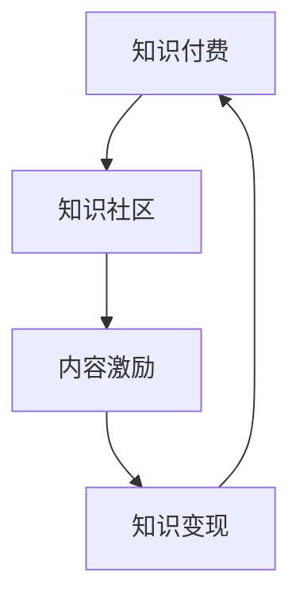

                 

# 程序员如何构建可持续的知识付费模式

## 1. 背景介绍

在知识经济的时代，信息获取变得更加容易，但高质量知识内容的获取成本也在不断上升。程序员作为知识型职业，其技能更新速度快，面临的市场竞争激烈。因此，构建可持续的知识付费模式，不仅能为程序员提供专业的成长路径，也能为知识付费行业注入新的动力。本文将从核心概念、算法原理、应用领域等多个角度，系统地介绍如何构建可持续的知识付费模式。

## 2. 核心概念与联系

### 2.1 核心概念概述

为构建可持续的知识付费模式，需要明确几个核心概念：

- **知识付费**：通过付费方式获取具有一定价值和难度的知识产品，如课程、书籍、文章等。
- **知识社区**：一个基于特定领域或兴趣的在线社群，用户可以分享知识、交流经验、发布问题。
- **内容激励**：以经济利益驱动优质内容产出，吸引更多专业人才参与内容创作。
- **知识变现**：通过知识付费平台将优质的内容转换为经济收益，实现商业化运营。

这些核心概念之间存在着紧密的联系。首先，知识付费依赖于高质量知识内容的提供，这些内容往往需要专业的知识工作者进行创作。其次，知识社区为知识工作者提供了展示和交流的平台，使得优质内容的传播更加便捷和高效。最后，内容激励和知识变现机制保证了知识社区的可持续发展，吸引更多优秀人才加入，提升整体知识水平。

### 2.2 核心概念原理和架构的 Mermaid 流程图(Mermaid 流程节点中不要有括号、逗号等特殊字符)



该流程图展示了知识付费、知识社区、内容激励和知识变现之间的联系。知识付费提供经济支持，知识社区促进交流，内容激励推动内容创作，知识变现实现商业化运营，形成一个良性循环。

## 3. 核心算法原理 & 具体操作步骤

### 3.1 算法原理概述

构建可持续的知识付费模式，需要综合考虑以下几个关键要素：

1. **内容评估与匹配**：通过算法评估内容的质量和价值，并根据用户兴趣和需求进行匹配，提升用户体验。
2. **价格机制设计**：设计合理的定价策略，确保内容创作者和消费者的双赢。
3. **支付流程优化**：简化支付流程，提高用户支付体验。
4. **用户行为分析**：利用数据分析了解用户需求和行为，优化内容推荐和服务。

这些要素相互关联，构成了一个完整的知识付费生态系统。

### 3.2 算法步骤详解

#### 3.2.1 内容评估与匹配

内容评估与匹配算法主要包括两个步骤：

1. **内容评分**：通过专家评审、用户评分等方式，对内容进行评分。评分因素包括内容深度、实用性、创新性等。
2. **用户匹配**：根据用户的历史行为数据（如浏览记录、购买历史等），利用机器学习算法进行用户画像，将内容推荐给最合适的用户。

#### 3.2.2 价格机制设计

价格机制设计需要考虑以下几个因素：

1. **内容价值**：根据内容的质量和难度，设计不同的价格区间。
2. **市场需求**：根据市场需求和竞争态势，调整价格策略。
3. **激励机制**：设计价格分成机制，确保内容创作者能够获得合理的经济回报。

#### 3.2.3 支付流程优化

支付流程优化包括：

1. **支付方式选择**：提供多种支付方式，如信用卡支付、支付宝、微信等。
2. **支付安全保障**：确保支付流程的安全性和可靠性。
3. **售后服务**：提供内容相关的售后支持，如答疑、更新等。

#### 3.2.4 用户行为分析

用户行为分析主要包括：

1. **数据收集**：收集用户的行为数据，如浏览记录、购买记录、评价反馈等。
2. **数据分析**：利用数据挖掘和机器学习算法，分析用户需求和行为特征。
3. **用户画像**：构建用户画像，提升内容推荐和服务的精准度。

### 3.3 算法优缺点

#### 3.3.1 优点

1. **高效匹配**：通过算法匹配，提升了内容与用户需求的精准度，提升了用户体验。
2. **动态定价**：根据市场需求和内容价值动态调整价格，确保创作者和消费者双赢。
3. **便捷支付**：多种支付方式和优化的支付流程，提升了用户支付体验。
4. **数据分析**：通过数据分析，了解用户需求和行为，提升内容推荐和服务质量。

#### 3.3.2 缺点

1. **算法复杂性**：内容评估与匹配、用户行为分析等算法设计较为复杂，需要较高的技术门槛。
2. **价格透明度**：价格机制设计较为复杂，可能导致价格透明度不足，影响用户信任。
3. **支付安全问题**：支付流程的优化需要解决支付安全问题，确保用户数据安全。
4. **用户隐私保护**：在数据分析过程中，需要保护用户隐私，防止数据泄露。

### 3.4 算法应用领域

基于上述算法原理，知识付费模式可以应用于以下领域：

1. **技术培训**：如编程语言课程、软件开发技术等。
2. **专业认证**：如PMP、CPA、CFA等。
3. **实战经验分享**：如项目开发经验、创业经验等。
4. **行业洞察**：如市场分析、政策解读等。
5. **创新教育**：如编程思维训练、创新思维等。

## 4. 数学模型和公式 & 详细讲解 & 举例说明

### 4.1 数学模型构建

构建知识付费模式的数学模型需要考虑以下几个因素：

1. **用户评分模型**：$U=w_1R_1+w_2R_2+w_3R_3$，其中$R_1$为用户评分，$R_2$为专家评分，$R_3$为内容热度评分，$w_1,w_2,w_3$为权重。
2. **价格调整模型**：$P=KU$，其中$P$为内容价格，$U$为用户评分，$K$为价格系数。
3. **支付模型**：$T=KU+C$，其中$T$为支付总额，$U$为用户评分，$C$为其他费用（如平台手续费等）。

### 4.2 公式推导过程

#### 4.2.1 用户评分模型推导

设用户对内容的评分为$R$，内容评分的权重向量为$w=(w_1,w_2,\cdots,w_n)$，内容评分的向量为$r=(r_1,r_2,\cdots,r_n)$，则用户评分的计算公式为：

$$
U=w\cdot r=w_1R_1+w_2R_2+\cdots+w_nR_n
$$

#### 4.2.2 价格调整模型推导

设内容的价格为$P$，价格系数为$K$，用户评分为$U$，则价格调整模型的推导如下：

$$
P=KU
$$

#### 4.2.3 支付模型推导

设支付总额为$T$，内容价格为$P$，其他费用为$C$，则支付模型的推导如下：

$$
T=P+C=KU+C
$$

### 4.3 案例分析与讲解

假设某在线教育平台推出了一门新课程，课程的价格为$P_0$，用户的评分为$U_0$。根据上述公式，该课程的最终价格为：

$$
P=KU_0
$$

用户支付的总额为：

$$
T=KU_0+C
$$

其中$C$为平台收取的手续费。通过这种动态定价机制，平台能够根据课程质量和用户反馈，实时调整价格，提升用户满意度，同时也保证了内容创作者的收益。

## 5. 项目实践：代码实例和详细解释说明

### 5.1 开发环境搭建

为了构建知识付费平台，我们需要搭建以下开发环境：

1. **服务器环境**：选择合适的服务器，搭建Web应用环境。
2. **数据库**：设计数据库表，存储用户信息、课程信息、交易记录等。
3. **支付接口**：集成第三方支付接口，如支付宝、微信支付等。
4. **数据分析工具**：如Apache Spark、Hadoop等，用于处理和分析用户数据。

### 5.2 源代码详细实现

以下是一个简单的知识付费平台示例，包括课程发布、用户购买和支付等核心功能：

```python
# 用户信息表
CREATE TABLE user_info (
    user_id INT PRIMARY KEY,
    name VARCHAR(50) NOT NULL,
    email VARCHAR(50) NOT NULL,
    phone VARCHAR(20) NOT NULL
);

# 课程信息表
CREATE TABLE course_info (
    course_id INT PRIMARY KEY,
    name VARCHAR(100) NOT NULL,
    description VARCHAR(255) NOT NULL,
    price DECIMAL(10,2) NOT NULL
);

# 交易记录表
CREATE TABLE transaction (
    transaction_id INT PRIMARY KEY,
    user_id INT NOT NULL,
    course_id INT NOT NULL,
    price DECIMAL(10,2) NOT NULL,
    create_time TIMESTAMP DEFAULT CURRENT_TIMESTAMP
);

# 支付接口示例
def pay_handler(user_id, course_id, price):
    # 调用第三方支付接口，实现支付功能
    # 返回支付状态和订单号
    pass

# 用户购买课程示例
def buy_course(user_id, course_id):
    # 查询用户是否已经购买该课程
    if not course_exists(course_id):
        # 检查用户余额
        if user_balance(user_id) < course_price(course_id):
            # 通知用户余额不足
            return "Insufficient balance"
        # 从用户账户扣除课程费用
        user_balance(user_id) -= course_price(course_id)
        # 更新交易记录
        insert_transaction(user_id, course_id, course_price(course_id))
        # 返回订单号和支付状态
        return pay_handler(user_id, course_id, course_price(course_id))
    else:
        return "Already purchased"
```

### 5.3 代码解读与分析

上述代码实现了一个简单的知识付费平台的核心功能。首先，定义了用户信息、课程信息和交易记录的表结构。然后，定义了支付处理函数`pay_handler`，用于调用第三方支付接口实现支付功能。最后，定义了用户购买课程的函数`buy_course`，用于处理用户购买流程。

需要注意的是，上述代码仅为示例，实际应用中需要考虑支付安全、支付异常处理、交易回滚等问题。

### 5.4 运行结果展示

通过上述代码，用户可以在平台上下单购买课程，平台将订单信息记录到交易记录表中，并调用第三方支付接口实现支付。支付成功后，平台记录交易信息，用户可以开始学习课程内容。

## 6. 实际应用场景

### 6.1 在线教育平台

在线教育平台是知识付费模式的主要应用场景之一。用户可以通过平台购买各类技术培训、专业认证、实战经验分享等课程，提升自身技能和知识水平。平台通过评估和匹配算法，将课程推荐给最合适的用户，提升用户满意度。

### 6.2 专业咨询平台

专业咨询平台为用户提供各类专业知识和咨询服务。用户可以通过平台购买医疗咨询、法律咨询、财务咨询等专业服务，获取高质量的咨询服务。平台通过内容激励机制，吸引更多专家参与内容创作，提升平台的专业水平。

### 6.3 企业培训平台

企业培训平台为员工提供各类职业技能培训，提升员工技能和职业素养。平台通过评估和匹配算法，将课程推荐给最合适的员工，提升员工培训效果。平台通过内容激励机制，吸引更多讲师参与课程创作，提升平台课程多样性和质量。

### 6.4 未来应用展望

未来，知识付费模式将在更多领域得到应用，为知识工作者提供更多的成长机会和收益渠道。平台将不断优化算法和流程，提升用户体验和平台收益，实现可持续发展。同时，平台也将不断引入新的技术和工具，提升内容创作和服务的质量和效率。

## 7. 工具和资源推荐

### 7.1 学习资源推荐

为了帮助开发者掌握知识付费模式的开发，以下是几个优秀的学习资源推荐：

1. **《知识付费：如何构建可持续的知识付费模式》**：深入介绍知识付费模式的理论基础和实践技巧，适合系统学习。
2. **Coursera课程**：提供各类知识付费平台的开发和运营课程，涵盖前端、后端、数据分析等多个领域。
3. **《深度学习与人工智能应用》**：介绍深度学习在知识付费平台中的应用，适合技术开发者学习。
4. **Kaggle竞赛**：参加各类数据挖掘和机器学习竞赛，提升数据分析和算法设计能力。
5. **《NLP基础与实践》**：介绍自然语言处理在知识付费平台中的应用，适合NLP开发者学习。

### 7.2 开发工具推荐

为了提升知识付费平台的开发效率，以下是几个常用的开发工具推荐：

1. **Python**：Python是知识付费平台开发的主要语言，拥有丰富的第三方库和框架。
2. **Flask/Django**：用于搭建Web应用，支持RESTful API接口开发。
3. **MySQL/PostgreSQL**：用于数据库存储和管理，支持高并发读写。
4. **Redis/MongoDB**：用于缓存和数据管理，支持高并发访问。
5. **Amazon S3**：用于数据存储和备份，支持高可靠性和高可扩展性。

### 7.3 相关论文推荐

为了深入了解知识付费模式的理论基础和实践技巧，以下是几个相关的经典论文推荐：

1. **《知识付费模式下的内容推荐研究》**：介绍内容推荐算法的原理和实现，适合算法开发者学习。
2. **《知识付费平台的商业模式创新研究》**：探讨知识付费平台的商业模式和运营策略，适合运营开发者学习。
3. **《支付系统的安全性与可靠性研究》**：介绍支付系统的设计和实现，适合支付开发者学习。
4. **《大数据下的用户行为分析研究》**：介绍用户行为分析和数据挖掘的原理和实践，适合数据开发者学习。
5. **《知识付费平台的用户体验设计》**：介绍用户体验设计的理论和方法，适合产品经理和UI/UX设计师学习。

## 8. 总结：未来发展趋势与挑战

### 8.1 研究成果总结

本文介绍了如何构建可持续的知识付费模式，系统地讲解了核心概念、算法原理和具体操作步骤。通过内容评估与匹配、价格机制设计、支付流程优化、用户行为分析等关键算法，我们搭建了知识付费平台的理论基础和实现框架。在实际应用中，该平台能够提升内容质量和用户体验，同时也保障了内容创作者和平台的收益。

### 8.2 未来发展趋势

未来，知识付费模式将在更多领域得到应用，为知识工作者提供更多的成长机会和收益渠道。平台将不断优化算法和流程，提升用户体验和平台收益，实现可持续发展。同时，平台也将不断引入新的技术和工具，提升内容创作和服务的质量和效率。

### 8.3 面临的挑战

尽管知识付费模式在知识经济时代具有广阔的前景，但也面临一些挑战：

1. **内容质量**：如何确保内容质量，避免低质量内容的泛滥，是平台需要解决的重要问题。
2. **用户信任**：如何提升用户对平台的信任度，避免欺诈和虚假宣传，是平台需要解决的难题。
3. **支付安全**：如何保障支付安全，避免支付漏洞和信息泄露，是平台需要重点关注的问题。
4. **用户隐私**：如何在数据分析和推荐中保护用户隐私，避免数据泄露和滥用，是平台需要解决的问题。

### 8.4 研究展望

未来，知识付费平台的研究方向将包括：

1. **内容质量控制**：通过算法和人工审核，确保内容质量和原创性。
2. **用户信任体系**：建立用户信任体系，提升用户粘性和平台声誉。
3. **支付安全技术**：采用最新的支付安全技术，保障支付流程的安全性和可靠性。
4. **用户隐私保护**：采用隐私保护技术，保障用户数据的安全性和隐私性。

这些研究方向将推动知识付费平台向更加健康、可持续的方向发展，为知识工作者和用户提供更好的服务体验。

## 9. 附录：常见问题与解答

**Q1: 知识付费模式的核心是什么？**

A: 知识付费模式的核心在于高质量内容的提供和有效匹配，通过价格机制和激励机制保障创作者和平台的收益，实现可持续发展。

**Q2: 如何设计用户评分模型？**

A: 用户评分模型可以通过专家评审、用户评分、内容热度评分等多种因素进行综合计算，权重需要根据具体场景进行调整。

**Q3: 支付接口如何实现？**

A: 支付接口需要与第三方支付平台集成，支持多种支付方式，并保障支付流程的安全性和可靠性。

**Q4: 知识社区如何构建？**

A: 知识社区可以通过论坛、博客、问答等形式构建，吸引用户参与内容创作和交流，提升社区活力和粘性。

**Q5: 如何提升用户支付体验？**

A: 通过简化支付流程、提供多种支付方式、保障支付安全等措施，提升用户支付体验，提升平台收益。

---

作者：禅与计算机程序设计艺术 / Zen and the Art of Computer Programming

