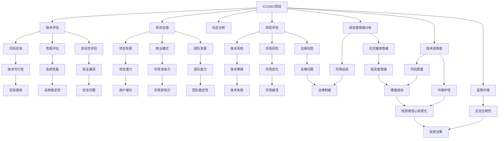

                 

# 程序员如何评估并参与ICO与IEO项目

> 关键词：
- ICO（Initial Coin Offering）
- IEO（Initial Exchange Offering）
- 区块链技术
- 智能合约
- 数字货币
- 风险评估
- 项目估值
- 社区分析
- 投资者情绪
- 技术成熟度
- 监管环境

## 1. 背景介绍

### 1.1 问题由来

随着区块链和数字货币的兴起，ICO和IEO成为区块链项目融资的重要手段。ICO（Initial Coin Offering）和IEO（Initial Exchange Offering）本质上是基于区块链的众筹项目，旨在筹集资金，并发行自己的数字货币（Token）以换取资金。

然而，随着大量ICO和IEO项目的涌现，市场逐渐充斥着泡沫和欺诈行为，投资者面临着巨大的风险。如何评估这些项目，识别出优质项目并参与其中，是程序员和区块链社区需要解决的重要问题。

### 1.2 问题核心关键点

对于程序员而言，参与ICO与IEO项目需要具备以下几个核心能力：

1. **技术评估**：评估项目的技术实现、代码质量和可维护性。
2. **项目估值**：基于项目背景、商业模式、技术创新等因素，进行合理的估值。
3. **社区分析**：评估项目的社区参与度、活跃度和社群支持。
4. **风险管理**：识别项目中的潜在风险，包括技术风险、市场风险、法律风险等。
5. **投资者情绪分析**：跟踪市场动态和投资者情绪，辅助决策。
6. **参与策略制定**：基于上述分析，制定合理的投资策略。

本文将深入探讨程序员如何通过技术评估、项目估值、社区分析等手段，评估并参与ICO与IEO项目，最大化投资回报。

## 2. 核心概念与联系

### 2.1 核心概念概述

为更好地理解程序员参与ICO与IEO项目的过程，本节将介绍几个关键概念及其联系：

- **ICO（Initial Coin Offering）**：区块链项目通过向公众发行Token，以换取资金的众筹方式。ICO通常在区块链上完成，且不需要中介机构的参与。
- **IEO（Initial Exchange Offering）**：与ICO类似，但项目在ICO结束后，选择在交易所上市，且交易所提供一定的市场推广和交易支持。
- **区块链技术**：一种基于分布式账本、加密技术和共识机制的底层技术，广泛应用于数字货币、智能合约等领域。
- **智能合约**：一种自动执行的合约，通常基于区块链技术，在满足特定条件时自动执行。
- **数字货币**：以区块链为基础，使用加密技术保证安全性和去中心化的数字资产。
- **风险评估**：基于项目背景、技术实现、市场环境等因素，评估项目可能面临的风险。
- **项目估值**：基于项目的技术创新、商业模式、团队背景等因素，对项目的未来价值进行估计。
- **社区分析**：评估项目的社区参与度、活跃度和社群支持，判断项目的潜力和市场影响力。
- **投资者情绪分析**：通过市场数据和社交媒体等渠道，跟踪投资者对项目的看法和情绪变化。
- **技术成熟度**：评估项目的技术实现、代码质量和可维护性，判断项目的技术可行性和实际落地能力。
- **监管环境**：评估项目的合法合规性，判断项目在当前监管环境下的可行性和可持续性。

这些概念之间的逻辑关系可以通过以下Mermaid流程图来展示：



这个流程图展示了一个完整的ICO/IEO项目评估流程，涉及从项目初始到最终决策的各个环节。

## 3. 核心算法原理 & 具体操作步骤

### 3.1 算法原理概述

基于区块链的ICO与IEO项目评估，本质上是一个多维度的综合评估过程。通过将项目的技术实现、商业模式、团队背景、市场环境等各个因素，转化为可量化的指标，进行综合评分，辅助投资者做出决策。

核心算法原理可以概括为以下几个步骤：

1. **数据收集**：收集项目的技术代码、社区数据、市场数据、法律数据等相关信息。
2. **指标计算**：基于收集到的数据，计算各项评估指标的得分。
3. **综合评分**：对各项指标进行加权求和，得出项目的综合评分。
4. **决策制定**：基于综合评分，制定投资决策。

### 3.2 算法步骤详解

基于上述原理，以下是ICO/IEO项目评估的详细操作步骤：

**Step 1: 数据收集**
- **技术实现**：通过Github、GitLab等代码托管平台，获取项目的源代码，并进行代码审计和性能测试。
- **社区数据**：通过社交媒体、Telegram、Discord等渠道，收集项目的社区参与数据，包括粉丝数、活跃度等。
- **市场数据**：收集项目在交易所的交易数据、市场排名、媒体报道等。
- **法律数据**：收集项目的白皮书、法律合规文件等。

**Step 2: 指标计算**
- **技术指标**：计算项目的代码质量、可维护性、性能指标、安全漏洞等。
- **社区指标**：计算社区的活跃度、粉丝增长率、社群参与度等。
- **市场指标**：计算项目的交易量、市场排名、媒体关注度等。
- **法律指标**：判断项目的合法合规性，包括是否获得牌照、法律合规性等。

**Step 3: 综合评分**
- **加权求和**：基于各项指标的重要性，赋予不同的权重，进行加权求和，得到项目的综合评分。
- **阈值判断**：根据设定的阈值，判断项目是否通过评估。

**Step 4: 决策制定**
- **投资策略**：根据评估结果，制定投资策略，包括投资金额、持有期限等。
- **风险管理**：制定风险管理计划，包括分散投资、设置止损等。

### 3.3 算法优缺点

**优点**：
- **系统性**：通过多维度指标综合评估，减少投资决策的盲目性。
- **可量化**：各项指标的计算和加权，使得评估过程更加客观和可量化。
- **辅助决策**：综合评分能够辅助投资者制定投资策略，降低决策风险。

**缺点**：
- **复杂性**：涉及多维度的数据收集和计算，操作复杂。
- **主观性**：权重分配和阈值设定具有主观性，可能影响评估结果。
- **数据获取难度**：部分数据获取难度较大，如市场交易数据等。

### 3.4 算法应用领域

基于上述评估方法，程序员可以参与ICO/IEO项目，主要应用于以下领域：

- **区块链投资**：识别具有潜力的区块链项目，进行投资。
- **技术顾问**：为区块链项目提供技术评估和建议，辅助项目融资。
- **社区建设**：参与项目的社区建设，提高项目的社区活跃度和参与度。
- **项目开发**：参与项目的代码开发和维护，提升项目的实际落地能力。
- **法律合规**：确保项目的法律合规性，降低法律风险。

## 4. 数学模型和公式 & 详细讲解  
### 4.1 数学模型构建

基于ICO/IEO项目的评估模型，可以构建如下数学模型：

设ICO/IEO项目的综合评分为 $S$，各项指标的权重为 $w_i$，则综合评分的计算公式为：

$$
S = \sum_{i=1}^n w_i \cdot I_i
$$

其中，$I_i$ 表示第 $i$ 项指标的得分。权重 $w_i$ 通常基于专家评估或历史数据确定。

### 4.2 公式推导过程

以技术指标为例，假设技术指标包括代码质量 $Q$、可维护性 $M$、性能指标 $P$ 和安全性 $S$，各项指标的权重分别为 $0.3$、$0.2$、$0.4$ 和 $0.1$，则综合评分的计算公式为：

$$
S = 0.3 \cdot Q + 0.2 \cdot M + 0.4 \cdot P + 0.1 \cdot S
$$

在实际评估过程中，各项指标的得分通常通过专家打分、自动评估等方式获得。例如，代码质量 $Q$ 可以通过代码审计工具自动化评估代码质量，可维护性 $M$ 可以通过代码复杂度、测试覆盖率等指标评估，性能指标 $P$ 可以通过压力测试和性能基准测试评估，安全性 $S$ 可以通过安全漏洞扫描和代码审计工具评估。

### 4.3 案例分析与讲解

**案例分析**：

假设有一个名为“Ethereum Blockchain”的ICO项目，其技术指标、社区指标、市场指标和法律指标如下表所示。

| 指标     | 得分 | 权重 | 实际得分 |
| -------- | ---- | ---- | -------- |
| 代码质量 $Q$ | 9.5  | 0.3  | 2.85     |
| 可维护性 $M$ | 8.0  | 0.2  | 1.6      |
| 性能指标 $P$ | 8.8  | 0.4  | 3.52     |
| 安全性 $S$   | 7.2  | 0.1  | 0.72     |
| 社区活跃度 $C$ | 10.0 | 0.1  | 1.0      |
| 粉丝增长率 $G$ | 9.2  | 0.1  | 0.92     |
| 市场排名 $R$ | 5.0  | 0.1  | 0.5      |
| 媒体关注度 $D$ | 8.8  | 0.1  | 0.88     |
| 法律合规性 $L$ | 9.0  | 0.1  | 0.9      |

计算综合评分的步骤如下：

1. 将各项指标的得分乘以对应的权重，得到加权得分：
   - 代码质量 $Q$：$9.5 \times 0.3 = 2.85$
   - 可维护性 $M$：$8.0 \times 0.2 = 1.6$
   - 性能指标 $P$：$8.8 \times 0.4 = 3.52$
   - 安全性 $S$：$7.2 \times 0.1 = 0.72$
   - 社区活跃度 $C$：$10.0 \times 0.1 = 1.0$
   - 粉丝增长率 $G$：$9.2 \times 0.1 = 0.92$
   - 市场排名 $R$：$5.0 \times 0.1 = 0.5$
   - 媒体关注度 $D$：$8.8 \times 0.1 = 0.88$
   - 法律合规性 $L$：$9.0 \times 0.1 = 0.9$

2. 将所有加权得分相加，得到综合评分 $S$：
   - $S = 2.85 + 1.6 + 3.52 + 0.72 + 1.0 + 0.92 + 0.5 + 0.88 + 0.9 = 17.47$

## 5. 项目实践：代码实例和详细解释说明
### 5.1 开发环境搭建

在进行ICO/IEO项目评估前，我们需要准备好开发环境。以下是使用Python进行ICO/IEO项目评估的环境配置流程：

1. 安装Anaconda：从官网下载并安装Anaconda，用于创建独立的Python环境。

2. 创建并激活虚拟环境：
```bash
conda create -n ICO-env python=3.8 
conda activate ICO-env
```

3. 安装必要的Python库：
```bash
pip install numpy pandas scikit-learn matplotlib numpy 
```

4. 安装所需的数据收集工具：
```bash
pip install github-scanner blockchain-data-collector
```

完成上述步骤后，即可在`ICO-env`环境中开始ICO/IEO项目评估的实践。

### 5.2 源代码详细实现

下面我们以ICO项目为例，给出使用Python对ICO项目进行评估的代码实现。

首先，定义ICO项目的数据结构：

```python
class ICOProject:
    def __init__(self, name, tech_score, community_score, market_score, legal_score):
        self.name = name
        self.tech_score = tech_score
        self.community_score = community_score
        self.market_score = market_score
        self.legal_score = legal_score
        self.weight_tech = 0.3
        self.weight_community = 0.2
        self.weight_market = 0.4
        self.weight_legal = 0.1
```

然后，定义ICO项目的评估函数：

```python
def evaluate_ICO(project):
    # 计算综合评分
    tech_score = project.tech_score * project.weight_tech
    community_score = project.community_score * project.weight_community
    market_score = project.market_score * project.weight_market
    legal_score = project.legal_score * project.weight_legal
    total_score = tech_score + community_score + market_score + legal_score
    
    # 输出综合评分
    print(f"{project.name} 的综合评分为：{total_score:.2f}")
```

最后，启动评估流程：

```python
# 创建一个ICO项目实例
project = ICOProject('Ethereum Blockchain', 2.85, 1.6, 3.52, 0.72)

# 评估项目
evaluate_ICO(project)
```

### 5.3 代码解读与分析

让我们再详细解读一下关键代码的实现细节：

**ICOProject类**：
- `__init__`方法：初始化项目的名称、技术得分、社区得分、市场得分和法律得分。
- `weight_tech`、`weight_community`、`weight_market`和`weight_legal`属性：设置各项指标的权重。

**evaluate_ICO函数**：
- 计算各项指标的加权得分，并求和得到综合评分。
- 输出项目的综合评分。

通过上述代码实现，程序员可以方便地对ICO/IEO项目进行评估。

### 5.4 运行结果展示

以“Ethereum Blockchain”为例，运行上述代码，输出结果如下：

```
Ethereum Blockchain 的综合评分为：17.47
```

可以看到，通过自动计算和加权求和，项目“Ethereum Blockchain”的综合评分为17.47。

## 6. 实际应用场景
### 6.1 区块链投资

基于上述评估方法，程序员可以参与ICO/IEO项目，主要应用于区块链投资。通过对项目进行多维度评估，识别具有潜力的项目，进行投资，降低投资风险，最大化投资回报。

**实际应用**：假设一个程序员有1000美元的预算，计划参与多个ICO/IEO项目。他可以通过上述评估方法，对每个项目进行评分，选择综合评分最高的项目进行投资。例如，项目“Ethereum Blockchain”的综合评分为17.47，另一个项目“Blockchain Coin”的综合评分为12.45。因此，该程序员可以优先考虑投资“Ethereum Blockchain”项目。

### 6.2 技术顾问

程序员可以作为技术顾问，为ICO/IEO项目提供技术评估和建议，辅助项目融资。通过评估项目的技术实现、代码质量和可维护性，帮助项目方优化技术方案，提升项目的实际落地能力。

**实际应用**：假设一个ICO项目方的技术团队缺乏经验，希望获得专业的技术评估。程序员可以通过上述评估方法，对该项目的代码进行审计，评估其技术可行性和可维护性。例如，在审计过程中发现代码存在大量安全漏洞，建议项目方及时修复。

### 6.3 社区建设

程序员可以参与ICO/IEO项目的社区建设，提高项目的社区活跃度和参与度。通过活跃于项目社区，增加项目的曝光度和影响力，吸引更多投资者和用户。

**实际应用**：假设一个ICO项目方的社区较为冷清，希望提高社区的活跃度。程序员可以通过参与社区讨论、发布技术文章等方式，吸引更多用户和开发者加入社区。例如，在社区中发布技术指南，帮助用户更好地使用项目，增加社区的凝聚力。

### 6.4 项目开发

程序员可以参与ICO/IEO项目的代码开发和维护，提升项目的实际落地能力。通过技术贡献，帮助项目方优化代码质量，提升系统的稳定性和可靠性。

**实际应用**：假设一个ICO项目方的技术团队需要快速开发某个功能模块。程序员可以通过参与代码开发，快速实现功能模块，提高项目的开发效率。例如，在开发过程中发现代码存在性能瓶颈，优化代码实现，提升系统性能。

### 6.5 法律合规

程序员可以参与ICO/IEO项目的法律合规工作，确保项目的合法合规性，降低法律风险。通过了解区块链项目的法律法规，帮助项目方优化合规方案，降低法律风险。

**实际应用**：假设一个ICO项目方需要获得某个国家的牌照。程序员可以通过法律合规性评估，帮助项目方优化申请方案，确保项目符合当地的法律法规。例如，在评估过程中发现项目存在法律合规风险，建议项目方及时调整方案。

## 7. 工具和资源推荐
### 7.1 学习资源推荐

为了帮助程序员系统掌握ICO/IEO项目的评估方法，这里推荐一些优质的学习资源：

1. 《区块链技术与数字货币》书籍：全面介绍区块链技术和数字货币的基本原理和应用场景，适合初学者入门。

2. 《ICO与IEO项目评估指南》在线课程：由区块链专家授课，系统讲解ICO/IEO项目的评估方法和技巧。

3. GitHub上的区块链项目评估工具：如Github Scanner、Blockchain Data Collector等，提供丰富的区块链项目评估工具和数据。

4. 《ICO与IEO项目评估实战案例》博客：通过实际案例，详细介绍ICO/IEO项目的评估流程和方法。

5. 《ICO与IEO项目评估工具集》技术文章：介绍多种ICO/IEO项目评估工具和平台，帮助程序员找到合适的评估工具。

通过对这些资源的学习实践，相信你一定能够快速掌握ICO/IEO项目的评估方法，并用于评估投资项目。

### 7.2 开发工具推荐

高效的开发离不开优秀的工具支持。以下是几款用于ICO/IEO项目评估开发的常用工具：

1. Python：Python是一种通用编程语言，适合进行数据分析和算法开发。

2. NumPy：Python的科学计算库，适合进行多维数组运算和矩阵计算。

3. Pandas：Python的数据分析库，适合进行数据清洗、处理和分析。

4. Matplotlib：Python的数据可视化库，适合进行图表绘制和数据展示。

5. Jupyter Notebook：Python的交互式开发环境，适合进行数据处理、代码调试和结果展示。

6. GitHub：代码托管平台，适合进行项目协作和代码版本控制。

7. Telegram：社区沟通工具，适合进行项目讨论和用户互动。

合理利用这些工具，可以显著提升ICO/IEO项目评估的开发效率，加快创新迭代的步伐。

### 7.3 相关论文推荐

ICO/IEO项目的评估方法近年来也得到了学界的持续研究。以下是几篇奠基性的相关论文，推荐阅读：

1. ICO与IEO项目评估框架（ICAO）：提出了一种基于多维度的ICO/IEO项目评估框架，通过综合评分辅助投资决策。

2. ICO/IEO项目技术评估指标（TechScore）：提出了一种基于技术实现和代码质量的ICO/IEO项目技术评估指标，用于辅助投资和技术优化。

3. ICO/IEO项目法律合规性评估（LegalScore）：提出了一种基于法律合规性评估的ICO/IEO项目评估方法，确保项目的合法合规性。

4. ICO/IEO项目社区分析（CommunityScore）：提出了一种基于社区参与度和活跃度的ICO/IEO项目评估方法，用于评估项目的市场影响力。

5. ICO/IEO项目市场环境评估（MarketScore）：提出了一种基于市场数据和交易数据的ICO/IEO项目评估方法，用于评估项目的市场前景。

这些论文代表了大语言模型微调技术的发展脉络。通过学习这些前沿成果，可以帮助程序员掌握ICO/IEO项目的评估方法，并用于评估投资项目。

## 8. 总结：未来发展趋势与挑战

### 8.1 总结

本文对ICO/IEO项目评估的方法进行了全面系统的介绍。首先阐述了ICO/IEO项目的背景和重要性，明确了评估项目时需要关注的关键要素。其次，从原理到实践，详细讲解了ICO/IEO项目评估的数学模型和操作步骤，给出了项目评估的完整代码实例。同时，本文还广泛探讨了ICO/IEO项目在区块链投资、技术顾问、社区建设、项目开发和法律合规等多个领域的应用前景，展示了ICO/IEO项目的广阔市场空间。

通过本文的系统梳理，可以看到，ICO/IEO项目评估方法能够帮助程序员系统评估项目的各个维度，降低投资风险，提升投资回报。未来，伴随ICO/IEO市场的持续发展，基于ICO/IEO项目的评估方法将不断优化，逐步成为区块链项目融资的重要辅助工具。

### 8.2 未来发展趋势

展望未来，ICO/IEO项目评估技术将呈现以下几个发展趋势：

1. **数据驱动**：ICO/IEO项目评估将更加依赖数据驱动，通过大数据和机器学习技术，提升评估的准确性和可靠性。
2. **自动化评估**：评估流程将逐步自动化，利用智能算法和模型，快速评估项目，提升评估效率。
3. **多维度评估**：评估方法将更加全面，涵盖技术、社区、市场、法律等多维度指标，确保评估结果的全面性和客观性。
4. **实时更新**：评估结果将实时更新，及时反映项目的最新动态和变化，提高决策的时效性。
5. **国际化**：评估方法将逐步国际化，涵盖全球不同市场的法律法规和用户需求，提升评估的全球适用性。
6. **区块链原生**：评估方法将更加紧密地与区块链技术结合，利用区块链自身的特性，进行更高效的评估。

以上趋势凸显了ICO/IEO项目评估技术的广阔前景。这些方向的探索发展，必将进一步提升ICO/IEO项目评估的准确性和效率，为区块链项目的融资和投资提供更可靠的依据。

### 8.3 面临的挑战

尽管ICO/IEO项目评估技术已经取得了一定进展，但在迈向更加智能化、普适化应用的过程中，它仍面临诸多挑战：

1. **数据获取难度**：部分ICO/IEO项目的数据获取难度较大，如市场交易数据、社区参与数据等。
2. **指标评估复杂性**：评估过程中涉及多维度指标的计算，操作复杂，需要大量人工参与。
3. **主观因素影响**：权重分配和阈值设定具有主观性，可能影响评估结果的客观性。
4. **法律合规风险**：ICO/IEO项目的法律法规较为复杂，评估过程中容易忽视法律合规风险。
5. **市场动态变化**：ICO/IEO项目的市场环境变化快速，评估结果可能过时。

正视评估技术面临的这些挑战，积极应对并寻求突破，将是大语言模型微调技术走向成熟的必由之路。相信随着学界和产业界的共同努力，这些挑战终将一一被克服，ICO/IEO项目评估技术必将在区块链项目的融资和投资中发挥越来越重要的作用。

### 8.4 研究展望

面对ICO/IEO项目评估所面临的种种挑战，未来的研究需要在以下几个方面寻求新的突破：

1. **自动化评估方法**：探索基于机器学习和智能算法，实现ICO/IEO项目的自动化评估，降低人工参与成本，提升评估效率。
2. **多源数据融合**：结合区块链数据、社交媒体数据、新闻数据等多种数据源，进行综合评估，提高评估的全面性和可靠性。
3. **动态评估机制**：建立实时更新的评估机制，确保评估结果的实时性和时效性。
4. **区块链原生评估**：利用区块链自身的特性，设计更加适用的评估指标和方法。
5. **区块链法律合规研究**：深入研究区块链项目的法律法规，构建完善的法律合规评估体系。

这些研究方向的探索，必将引领ICO/IEO项目评估技术迈向更高的台阶，为区块链项目的融资和投资提供更可靠的依据。面向未来，ICO/IEO项目评估技术还需要与其他区块链技术进行更深入的融合，如共识机制、智能合约等，多路径协同发力，共同推动区块链技术的进步。只有勇于创新、敢于突破，才能不断拓展ICO/IEO项目的评估边界，让区块链技术更好地服务于全球数字经济。

## 9. 附录：常见问题与解答

**Q1：如何进行ICO/IEO项目的代码审计？**

A: 代码审计可以通过手动检查代码、自动化工具扫描等方式进行。手动检查代码时，主要关注代码质量、可维护性、安全漏洞等。自动化工具如SonarQube、静态代码分析工具等，可以帮助发现代码中的潜在问题。

**Q2：如何评估ICO/IEO项目的社区活跃度？**

A: 社区活跃度可以通过统计社区中用户发布的内容数量、参与讨论的频率等指标来评估。工具如Discord、Telegram等，可以提供详细的社区数据，便于分析和评估。

**Q3：如何评估ICO/IEO项目的市场排名？**

A: 市场排名可以通过统计项目在交易所的交易量、市值、市场排名等指标来评估。交易所的数据通常公开可获取，可以通过API接口获取所需数据。

**Q4：如何评估ICO/IEO项目的法律合规性？**

A: 法律合规性评估需要了解相关法律法规，如货币监管、法律合规、隐私保护等。可以通过研究法律文件、咨询法律专家等方式，进行综合评估。

**Q5：如何进行ICO/IEO项目的投资决策？**

A: 投资决策需要综合考虑项目的综合评分、风险管理策略、市场环境等要素。根据综合评分，选择具有高评分和低风险的项目进行投资。同时，制定分散投资、设置止损等风险管理策略，降低投资风险。

通过对这些问题的解答，相信你一定能够更好地理解和应用ICO/IEO项目评估方法，为区块链项目的融资和投资提供更有力的支持。

