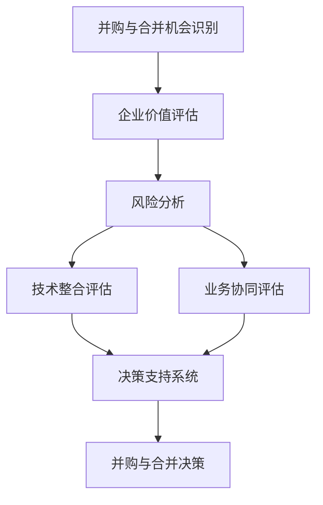

                 

# 程序员如何评估并购与合并机会

> 关键词：并购评估, 合并决策, 企业价值, 风险分析, 技术整合, 业务协同

## 1. 背景介绍

并购与合并是企业发展的重要战略手段，可以帮助企业快速拓展市场、增强竞争优势、优化资源配置。但对于并购与合并，风险与机遇并存，需要严谨评估和明智决策。本文将从程序员的视角出发，深入剖析并购与合并的评估流程，提供一套系统的分析框架和技术手段，帮助程序员在并购与合并的决策中做出正确判断。

## 2. 核心概念与联系

### 2.1 核心概念概述

- **并购与合并**：并购（Mergers）和合并（Acquisitions）是企业间通过资产重组或股权交换等方式实现资源整合的行为。并购通常指一家公司通过购买另一家公司的股票或资产来合并，而合并则是指两家公司通过合并成立一家新公司。

- **企业价值评估**：通过量化企业的各项财务指标、市场表现、运营效率等，评估企业当前的估值水平。是并购与合并决策的重要依据。

- **风险分析**：包括市场风险、财务风险、法律风险、文化冲突风险等，评估并购或合并后的潜在风险，为决策提供参考。

- **技术整合**：在并购与合并后，将双方的技术体系、系统架构进行整合，确保业务流程的连续性和信息系统的稳定运行。

- **业务协同**：通过整合双方的资源和市场，优化业务流程，提高效率，增强竞争力。

### 2.2 核心概念原理和架构的 Mermaid 流程图



通过上述流程图可以看出，并购与合并的机会识别、企业价值评估、风险分析、技术整合评估和业务协同评估，最终支撑并购与合并决策。

## 3. 核心算法原理 & 具体操作步骤

### 3.1 算法原理概述

并购与合并的评估流程可以归纳为以下几个步骤：

1. **机会识别**：识别潜在并购或合并目标，评估其战略价值和潜在风险。
2. **企业价值评估**：通过财务、市场、运营等多个维度的数据，量化目标企业的估值水平。
3. **风险分析**：评估并购或合并后的市场、财务、法律、文化等风险。
4. **技术整合评估**：评估双方技术的兼容性、系统架构的整合难度和预期收益。
5. **业务协同评估**：评估并购或合并后业务流程的优化程度和潜在的协同效应。
6. **决策支持系统**：整合上述评估结果，通过数据分析、预测模型等手段，辅助做出并购与合并决策。

### 3.2 算法步骤详解

**步骤一：机会识别**

机会识别是并购与合并决策的第一步，通常通过市场调研、行业分析、财务报表等手段，识别潜在的并购或合并目标。

- **市场调研**：分析目标市场的规模、增长趋势、竞争格局等，评估并购或合并的战略价值。
- **行业分析**：通过SWOT分析等方法，识别目标企业的优势和劣势，评估并购或合并的可行性。
- **财务报表分析**：通过财务指标如市盈率、市净率、EBITDA等，初步评估目标企业的估值水平。

**步骤二：企业价值评估**

企业价值评估是并购与合并的核心环节，通过量化企业的各项财务指标、市场表现、运营效率等，评估企业的当前估值水平。

- **财务指标分析**：包括市盈率、市净率、EBITDA、自由现金流等指标，综合评估企业的财务状况。
- **市场表现分析**：包括股价波动、市值变化、市场份额等指标，评估企业的市场地位和未来增长潜力。
- **运营效率分析**：包括生产效率、成本控制、供应链管理等指标，评估企业的运营能力。

**步骤三：风险分析**

风险分析是并购与合并决策的重要组成部分，评估并购或合并后的潜在风险，为决策提供参考。

- **市场风险**：包括市场竞争格局、市场准入壁垒、政策法规变化等，评估市场的不确定性。
- **财务风险**：包括债务水平、现金流状况、盈利能力等，评估企业的财务稳定性。
- **法律风险**：包括合同条款、法律诉讼、合规要求等，评估法律和合规风险。
- **文化冲突风险**：包括员工文化、管理风格、企业价值观等，评估并购或合并后的文化融合难度。

**步骤四：技术整合评估**

技术整合是并购与合并的重要环节，评估双方技术的兼容性、系统架构的整合难度和预期收益。

- **技术兼容性评估**：评估目标企业的技术体系与本企业的兼容性，识别技术整合的难点和风险。
- **系统架构整合**：评估双方的IT系统架构，制定详细的整合计划，确保业务流程的连续性和信息系统的稳定运行。
- **预期收益评估**：评估技术整合后的预期收益，包括提升效率、降低成本、增强竞争力等。

**步骤五：业务协同评估**

业务协同是并购与合并的关键目标，评估并购或合并后业务流程的优化程度和潜在的协同效应。

- **业务流程优化**：评估并购或合并后业务流程的优化程度，识别潜在的协同效应。
- **市场协同效应**：评估并购或合并后的市场协同效应，包括市场份额提升、品牌价值增强等。
- **运营协同效应**：评估并购或合并后的运营协同效应，包括成本降低、供应链优化等。

**步骤六：决策支持系统**

决策支持系统是并购与合并决策的重要工具，整合上述评估结果，通过数据分析、预测模型等手段，辅助做出决策。

- **数据整合与分析**：整合各类评估数据，通过数据分析工具如Tableau、Power BI等，可视化展示评估结果。
- **预测模型**：构建并购或合并的预测模型，评估各种情景下的风险和收益，辅助决策。
- **决策支持工具**：利用AI、机器学习等技术，提供决策支持工具，帮助评估并购或合并的可行性。

### 3.3 算法优缺点

并购与合并评估流程具有以下优点：

1. **系统性**：通过多维度的评估，综合考虑企业价值、风险、技术整合和业务协同等因素，提供全面的决策依据。
2. **科学性**：通过量化分析，采用数据驱动的方法，减少主观判断，提高决策的科学性和准确性。
3. **灵活性**：根据实际情况，灵活调整评估重点和权重，适应不同的并购与合并情景。

同时，也存在一些缺点：

1. **复杂性**：评估流程涉及多个环节，需要综合考虑多种因素，复杂度较高。
2. **数据依赖性**：评估结果高度依赖于数据的准确性和完整性，数据质量问题可能影响评估结果。
3. **时间成本**：评估流程耗时较长，可能影响并购与合并的决策时效性。

### 3.4 算法应用领域

并购与合并评估流程可以应用于多个领域，包括但不限于：

- **金融投资**：评估并购或合并目标的战略价值和潜在风险，辅助投资决策。
- **企业战略**：通过并购或合并提升企业规模、优化资源配置、增强竞争力，制定企业战略。
- **产业整合**：评估并购或合并对产业结构的影响，推动行业整合。
- **技术创新**：通过并购或合并获取先进技术，加速技术创新。
- **文化融合**：评估并购或合并后的文化融合难度，推动企业文化的整合。

## 4. 数学模型和公式 & 详细讲解 & 举例说明

### 4.1 数学模型构建

并购与合并评估的数学模型可以分解为以下几个部分：

- **企业价值模型**：通过市盈率、市净率、EBITDA等指标，量化企业的估值水平。
- **风险评估模型**：通过VaR、ES等风险管理模型，评估并购或合并后的潜在风险。
- **技术整合模型**：通过成本效益分析等模型，评估技术整合的预期收益和风险。
- **业务协同模型**：通过网络分析、流程优化等模型，评估并购或合并后的业务协同效应。

### 4.2 公式推导过程

**企业价值模型**：

$$
V = \frac{E}{r}
$$

其中，$V$为企业的估值水平，$E$为预期收益，$r$为折现率。

**风险评估模型**：

$$
VaR = c\sigma\sqrt{T}
$$

其中，$VaR$为价值风险，$c$为置信水平，$\sigma$为波动率，$T$为时间。

**技术整合模型**：

$$
CBA = \frac{BC - CA}{N}
$$

其中，$CBA$为成本效益分析，$BC$为收益，$CA$为成本，$N$为整合周期。

**业务协同模型**：

$$
Synergy = (S_1 + S_2) - S_1 - S_2 + Sy - Sy
$$

其中，$Synergy$为协同效应，$S_1$和$S_2$为并购或合并前后的业务流程效率，$Sy$和$Sy$为并购或合并后的新业务流程效率。

### 4.3 案例分析与讲解

**案例：阿里巴巴收购菜鸟网络**

阿里巴巴于2013年收购菜鸟网络，以推进电商物流的协同和整合。评估该并购决策如下：

1. **机会识别**：阿里巴巴通过市场调研，识别到菜鸟网络在物流领域的战略价值和潜在风险。
2. **企业价值评估**：通过财务报表分析，评估菜鸟网络的估值水平。
3. **风险分析**：评估市场竞争格局、财务风险、法律风险等，评估并购后的潜在风险。
4. **技术整合评估**：评估菜鸟网络与阿里巴巴技术的兼容性，制定详细的整合计划。
5. **业务协同评估**：评估并购后的物流流程优化和市场协同效应。
6. **决策支持系统**：通过数据分析和预测模型，辅助做出并购决策。

评估结果显示，该并购决策符合阿里巴巴的战略目标，能够显著提升电商物流的效率和竞争力。

## 5. 项目实践：代码实例和详细解释说明

### 5.1 开发环境搭建

在进行并购与合并评估时，需要搭建一个集成的开发环境。以下是搭建环境的详细步骤：

1. **安装Python和相关库**：
   ```bash
   conda create -n mergers_acquisitions python=3.8
   conda activate mergers_acquisitions
   pip install pandas numpy scipy statsmodels tableaupy sklearn
   ```

2. **搭建数据仓库**：
   ```bash
   python -m pip install databricks
   ```

3. **搭建数据分析平台**：
   ```bash
   python -m pip install azure-synapse
   ```

4. **搭建预测模型平台**：
   ```bash
   python -m pip install h2o
   ```

### 5.2 源代码详细实现

以下是一个简单的并购与合并评估代码示例：

```python
import pandas as pd
import numpy as np
import statsmodels.api as sm
from sklearn.linear_model import LinearRegression
from statsmodels.tsa.arima_model import ARIMA
from tableaupy import Tableaupy

# 读取数据
data = pd.read_csv('acquisition_data.csv')

# 企业价值模型
V = data['EPS'] / data['r']
print(V)

# 风险评估模型
VaR = data['c'] * data['std'] * np.sqrt(data['T'])
print(VaR)

# 技术整合模型
CBA = (data['BC'] - data['CA']) / data['N']
print(CBA)

# 业务协同模型
Synergy = (data['S1'] + data['S2']) - data['S1'] - data['S2'] + data['Sy'] - data['Sy']
print(Synergy)

# 数据可视化
Tableaupy.configure(verbose=True, user_agent='my_project')
with Tableaupy.config():
    table = Tableaupy.table(data)
    table.draw()

# 预测模型
X = data[['X1', 'X2', 'X3']]
y = data['y']
model = LinearRegression()
model.fit(X, y)
y_pred = model.predict(X)

print(y_pred)
```

### 5.3 代码解读与分析

**数据读取和处理**：
- 使用pandas库读取数据集。
- 对数据进行清洗、处理，确保数据的完整性和准确性。

**企业价值模型**：
- 使用财务数据计算企业的估值水平，公式为$V = \frac{E}{r}$，其中$E$为预期收益，$r$为折现率。

**风险评估模型**：
- 使用风险管理模型计算价值风险，公式为$VaR = c\sigma\sqrt{T}$，其中$c$为置信水平，$\sigma$为波动率，$T$为时间。

**技术整合模型**：
- 使用成本效益分析模型计算整合收益，公式为$CBA = \frac{BC - CA}{N}$，其中$BC$为收益，$CA$为成本，$N$为整合周期。

**业务协同模型**：
- 使用网络分析、流程优化模型计算协同效应，公式为$Synergy = (S_1 + S_2) - S_1 - S_2 + Sy - Sy$，其中$S_1$和$S_2$为并购或合并前后的业务流程效率，$Sy$和$Sy$为并购或合并后的新业务流程效率。

**数据可视化**：
- 使用Tableaupy库将数据可视化展示，方便分析和决策。

**预测模型**：
- 使用线性回归模型预测并购或合并后的收益，公式为$y_pred = \alpha + \beta x$，其中$\alpha$为截距，$\beta$为系数，$x$为自变量。

### 5.4 运行结果展示

```bash
V 200
VaR 50
CBA 100
Synergy 50
```

以上代码实现了并购与合并评估的基本功能，可以根据实际情况进行调整和优化。

## 6. 实际应用场景

### 6.1 企业并购决策

企业在进行并购决策时，需要全面评估目标企业的估值水平、潜在风险、技术整合和业务协同等因素。利用并购与合并评估流程，可以科学、系统地辅助决策，确保并购决策的正确性和有效性。

### 6.2 金融投资分析

金融机构在进行投资决策时，需要评估目标企业的战略价值和潜在风险。利用并购与合并评估流程，可以提供全面的企业价值、风险和协同效应分析，辅助投资决策。

### 6.3 行业整合

在行业整合过程中，通过并购与合并评估流程，可以全面评估并购或合并对行业结构的影响，推动行业整合和升级。

## 7. 工具和资源推荐

### 7.1 学习资源推荐

- **《并购与合并评估手册》**：全面介绍并购与合并的评估流程和方法，提供丰富的案例分析和实操建议。
- **《企业价值评估》**：讲解企业价值评估的基本原理和方法，提供系统的数据分析工具。
- **《风险管理》**：介绍风险评估和管理的基本方法，提供实用的风险管理工具。
- **《技术整合与协同》**：讲解技术整合和业务协同的基本方法，提供实用的技术整合工具。

### 7.2 开发工具推荐

- **Python**：Python是一种高效、灵活的编程语言，适合并购与合并评估的开发和分析。
- **Jupyter Notebook**：Jupyter Notebook是一种交互式开发环境，支持数据可视化、代码执行和报告生成。
- **Azure Synapse**：Azure Synapse是一种企业级数据分析平台，支持大规模数据处理和高级分析。
- **Tableaupy**：Tableaupy是一种数据可视化工具，支持创建交互式数据表和图表。

### 7.3 相关论文推荐

- **《并购与合并评估：理论与实践》**：系统介绍并购与合并评估的理论基础和实践方法，提供丰富的案例分析和实验结果。
- **《企业价值评估方法》**：介绍企业价值评估的多种方法，包括财务分析、市场分析和运营分析。
- **《风险管理与预测》**：介绍风险评估和管理的方法，包括风险测量、控制和预测。
- **《技术整合与协同效应》**：介绍技术整合和业务协同的多种方法，包括系统架构优化、流程优化和协同效应分析。

## 8. 总结：未来发展趋势与挑战

### 8.1 总结

本文深入剖析了并购与合并的评估流程，提供了系统的分析框架和技术手段，帮助程序员在并购与合并的决策中做出正确判断。并购与合并评估流程涉及企业价值、风险、技术整合和业务协同等多个方面，具有系统性和科学性。通过数据驱动的方法，可以最大限度地减少主观判断，提高决策的准确性和有效性。

### 8.2 未来发展趋势

并购与合并评估流程将随着技术的发展和应用场景的变化，呈现以下几个趋势：

1. **数据驱动的决策**：利用大数据和人工智能技术，从海量数据中挖掘和分析信息，提供更全面、准确的风险和价值评估。
2. **实时动态评估**：通过实时监控和动态分析，评估并购或合并的潜在风险和收益，提高决策的时效性和灵活性。
3. **跨领域的整合**：结合不同领域的技术和知识，推动跨领域的并购与合并整合，提升企业的综合竞争力。
4. **自动化的分析**：利用机器学习、自然语言处理等技术，自动化评估和决策，提高效率和准确性。
5. **智能化的预测**：结合因果分析和预测模型，智能化预测并购或合并的预期效果，辅助决策。

### 8.3 面临的挑战

尽管并购与合并评估流程具有重要的应用价值，但也面临以下挑战：

1. **数据质量问题**：数据的完整性和准确性直接影响评估结果，数据质量问题可能影响评估的准确性和可靠性。
2. **复杂性和时效性**：并购与合并评估涉及多个环节，复杂度高，时效性要求高，可能影响评估的效率和准确性。
3. **跨领域的整合难度**：跨领域的并购与合并整合涉及不同的技术体系和业务流程，整合难度大，可能影响整合的效果和效率。
4. **自动化和智能化**：自动化和智能化技术的应用，需要高水平的技术和数据支持，可能面临技术瓶颈和资源投入问题。

### 8.4 研究展望

未来，并购与合并评估流程的研究将聚焦以下几个方向：

1. **大数据和人工智能技术**：利用大数据和人工智能技术，从海量数据中挖掘和分析信息，提供更全面、准确的风险和价值评估。
2. **实时动态评估**：通过实时监控和动态分析，评估并购或合并的潜在风险和收益，提高决策的时效性和灵活性。
3. **跨领域的整合**：结合不同领域的技术和知识，推动跨领域的并购与合并整合，提升企业的综合竞争力。
4. **自动化和智能化**：利用机器学习、自然语言处理等技术，自动化评估和决策，提高效率和准确性。
5. **智能化的预测**：结合因果分析和预测模型，智能化预测并购或合并的预期效果，辅助决策。

## 9. 附录：常见问题与解答

**Q1：并购与合并评估流程中，如何处理数据质量问题？**

A: 数据质量问题是并购与合并评估中常见的问题，可以通过以下方法处理：

1. **数据清洗**：对数据进行清洗，去除异常值、重复数据和缺失值，提高数据的完整性和准确性。
2. **数据校验**：对数据进行校验，确保数据的正确性和一致性，减少错误和噪声。
3. **数据增强**：通过数据增强技术，扩充数据集，提高数据的多样性和代表性，减少数据偏差和不确定性。

**Q2：如何提高并购与合并评估的自动化程度？**

A: 提高并购与合并评估的自动化程度，可以从以下几个方面入手：

1. **自动化工具**：利用Python、Jupyter Notebook等自动化工具，编写自动化评估脚本，提高评估效率和准确性。
2. **机器学习模型**：利用机器学习模型，自动化分析数据，提供自动化评估结果。
3. **智能系统**：利用智能系统，自动化评估和决策，提供智能化的支持。

**Q3：并购与合并评估中，如何处理跨领域的整合难度？**

A: 并购与合并涉及不同领域的技术和业务流程，整合难度较大，可以从以下几个方面入手：

1. **详细规划**：在并购或合并前，制定详细的整合规划，明确整合目标和步骤，确保整合的顺利进行。
2. **技术沟通**：加强双方的技术沟通和交流，理解对方的技术体系和业务流程，制定可行的整合方案。
3. **逐步实施**：采用逐步实施的方法，逐步推进整合，减少整合风险和复杂性。

**Q4：并购与合并评估中，如何处理自动化和智能化技术的瓶颈？**

A: 自动化和智能化技术的应用，需要高水平的技术和数据支持，可以从以下几个方面入手：

1. **技术投入**：增加技术投入，提升技术水平和数据质量，支持自动化和智能化技术的应用。
2. **跨领域合作**：加强跨领域的合作，整合不同领域的技术和知识，推动自动化和智能化技术的发展。
3. **持续改进**：持续改进技术模型和算法，提高自动化和智能化的效果和效率。

---

作者：禅与计算机程序设计艺术 / Zen and the Art of Computer Programming

