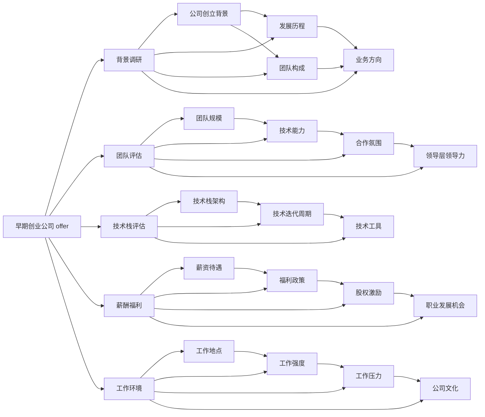

                 

## 1. 背景介绍

在当前的互联网与科技浪潮中，早期创业公司成为了一个充满机遇与挑战的舞台。无数的程序员正面临着选择一份什么样的工作机会的问题，而早期创业公司 offer 往往包含了很多未知因素。这使得评估一家早期创业公司 offer 变得更加困难，需要更为深入、全面的理解与分析。本文将详细介绍程序员如何评估早期创业公司 offer，包括公司背景、团队构成、技术栈、薪酬福利、工作环境等方面。

## 2. 核心概念与联系

### 2.1 核心概念概述

为了更好地评估早期创业公司 offer，我们需要先明确几个核心概念：

- **早期创业公司**：指成立时间较短、规模较小、通常处于产品研发初期或市场拓展阶段的公司。
- **offer 评估**：指对早期创业公司 offer 进行系统、全面的分析，以确定该 offer 是否符合自身职业规划和需求的过程。
- **背景调研**：通过调查、咨询等方式，了解公司的创立背景、发展历程、团队构成、业务方向等。
- **团队评估**：关注团队的规模、技术能力、合作氛围、领导层领导力等方面。
- **技术栈评估**：了解公司使用的技术栈是否符合自身技能和职业发展方向。
- **薪酬福利**：关注薪资待遇、福利政策、股权激励、职业发展机会等。
- **工作环境**：包括工作地点、工作强度、工作压力、公司文化等方面。

### 2.2 核心概念原理和架构的 Mermaid 流程图



## 3. 核心算法原理 & 具体操作步骤

### 3.1 算法原理概述

评估早期创业公司 offer 的过程可以视为一个决策问题，即在给定 offer 的情况下，选择接受或不接受。这其中涉及到了多个因素，包括背景调研、团队评估、技术栈评估、薪酬福利评估和工作环境评估。每个因素都对最终决策产生影响，因此需要对这些因素进行系统分析。

### 3.2 算法步骤详解

#### 3.2.1 背景调研

背景调研是评估早期创业公司 offer 的第一步。需要对公司的创立背景、发展历程、团队构成、业务方向进行深入了解。可以通过以下步骤进行：

- **公司官网与社交媒体**：了解公司的历史、愿景、使命、主要产品或服务。
- **新闻报道与媒体采访**：阅读公司的新闻发布、产品发布及业内采访，了解公司的动态及行业地位。
- **第三方评估**：查看招聘网站、求职平台上的用户评价及公司排名。

#### 3.2.2 团队评估

团队评估旨在了解公司内部团队的整体素质与氛围。可以从以下几个方面入手：

- **团队规模**：了解公司团队大小，判断是否适合自身职业发展规划。
- **技术能力**：评估团队成员的专业技能、技术栈与自身技能匹配度。
- **合作氛围**：通过网络平台或内部访谈，了解团队的合作文化与沟通方式。
- **领导层领导力**：关注公司领导层的背景、决策风格、管理能力及公司的整体领导力。

#### 3.2.3 技术栈评估

技术栈评估旨在了解公司使用的技术栈是否符合自身技能和职业发展方向。可以通过以下步骤进行：

- **技术栈架构**：了解公司主要使用的技术栈，包括前后端技术、数据库、中间件、框架等。
- **技术迭代周期**：判断公司技术迭代速度，了解公司对新技术的接受程度。
- **技术工具**：了解公司使用的开发、测试、部署工具，判断这些工具是否符合自身的使用习惯。

#### 3.2.4 薪酬福利评估

薪酬福利评估旨在了解薪资待遇、福利政策、股权激励、职业发展机会等方面的情况。可以从以下几个方面入手：

- **薪资待遇**：了解公司的薪资结构、福利政策、奖金制度等。
- **股权激励**：了解公司的股权激励政策及实际股权价值。
- **职业发展机会**：关注公司的培训计划、晋升机制及职业发展路径。

#### 3.2.5 工作环境评估

工作环境评估旨在了解工作地点、工作强度、工作压力、公司文化等方面。可以从以下几个方面入手：

- **工作地点**：了解公司办公地点，判断是否符合自身的生活习惯及家庭情况。
- **工作强度**：了解公司的工作节奏、加班情况及工作压力。
- **工作压力**：通过内部访谈或网络评价，了解公司的工作压力及应对措施。
- **公司文化**：了解公司的价值观、管理风格及团队文化，判断是否与自身价值观相符。

### 3.3 算法优缺点

#### 3.3.1 优点

- **系统全面**：评估过程涉及多个方面，能够全面了解 offer 的优劣。
- **量化与定性结合**：将定性因素如公司文化、团队氛围等进行量化，使评估更加科学。
- **个性化考虑**：考虑到个人职业规划、生活需求等因素，提供个性化建议。

#### 3.3.2 缺点

- **时间成本**：背景调研、团队评估、技术栈评估等步骤耗时较长。
- **信息不对称**：部分信息可能不易获取，评估过程中可能存在信息不对称。
- **主观因素**：评估过程中可能受到个人主观偏好影响，导致评估结果偏差。

### 3.4 算法应用领域

以上评估方法不仅适用于程序员评估早期创业公司 offer，也适用于其他求职者或投资者评估创业公司。在任何需要综合考量多个因素进行决策的场景中，上述评估框架均具有普适性。

## 4. 数学模型和公式 & 详细讲解 & 举例说明

### 4.1 数学模型构建

我们可以构建一个基于加权平均的决策模型，用于量化评估早期创业公司 offer。设评估因素有 n 个，每个因素的权重为 $w_i$，每个因素的评分范围为 $[0,1]$，最终得分为 $D$。则决策模型的数学模型为：

$$ D = \sum_{i=1}^{n} w_i \times S_i $$

其中 $S_i$ 表示第 $i$ 个因素的评分，$w_i$ 表示第 $i$ 个因素的权重。

### 4.2 公式推导过程

设每个因素的评分范围为 $[0,1]$，假设第 $i$ 个因素的评分 $S_i$ 为 $s_{i,low}$ 到 $s_{i,high}$ 之间的均匀分布，则第 $i$ 个因素的权重 $w_i$ 的权重应满足以下条件：

$$ \sum_{i=1}^{n} w_i = 1 $$
$$ w_i \geq 0, \forall i $$

为了保证 $w_i$ 的权重分配合理，我们可以采用熵最大化的方式，即在约束条件下使权重向量 $(w_1, w_2, ..., w_n)$ 的熵最大。根据熵的定义，我们有：

$$ H = -\sum_{i=1}^{n} w_i \times \log w_i $$

根据熵最大化的原则，我们优化目标函数为：

$$ \max H = \sum_{i=1}^{n} w_i \times \log w_i $$

约束条件为：

$$ \sum_{i=1}^{n} w_i = 1 $$

这是一个典型的线性规划问题，我们可以使用单纯形法或拉格朗日乘子法求解。求解后，可以得到每个因素的权重 $w_i$。

### 4.3 案例分析与讲解

假设我们评估一家早期创业公司 offer，涉及以下因素：

- **背景调研**：权重 $w_1=0.3$，评分 $S_1 \sim U(0,1)$
- **团队评估**：权重 $w_2=0.25$，评分 $S_2 \sim U(0,1)$
- **技术栈评估**：权重 $w_3=0.2$，评分 $S_3 \sim U(0,1)$
- **薪酬福利**：权重 $w_4=0.15$，评分 $S_4 \sim U(0,1)$
- **工作环境**：权重 $w_5=0.1$，评分 $S_5 \sim U(0,1)$

根据公式推导过程，假设经过求解，我们得到权重向量 $(0.3, 0.25, 0.2, 0.15, 0.1)$。然后我们可以将每个因素的评分带入公式计算最终得分 $D$：

$$ D = 0.3 \times S_1 + 0.25 \times S_2 + 0.2 \times S_3 + 0.15 \times S_4 + 0.1 \times S_5 $$

### 4.4 代码实现与分析

以下是一个简单的 Python 代码示例，用于计算最终得分：

```python
import numpy as np
from scipy.optimize import linprog

# 假设评分和权重已经确定
scores = [0.5, 0.7, 0.6, 0.4, 0.3]
weights = [0.3, 0.25, 0.2, 0.15, 0.1]

# 构建线性规划模型
c = [-wi for wi in weights]
A = np.eye(len(scores))
b = np.ones(len(scores))
A_eq = np.array([[1] * len(scores)])

# 求解线性规划问题
res = linprog(c, A_ub=A, b_ub=b, A_eq=A_eq, bounds=(0, None))

# 计算最终得分
final_score = np.dot(res.x, scores)

print("Final Score:", final_score)
```

## 5. 项目实践：代码实例和详细解释说明

### 5.1 开发环境搭建

为了便于实现以上决策模型，需要使用 Python 及相关的数学库（如 NumPy、SciPy）。可以使用 Anaconda 搭建 Python 开发环境，安装必要的库。

```bash
conda create -n myenv python=3.8
conda activate myenv
pip install numpy scipy
```

### 5.2 源代码详细实现

在上述代码示例中，我们使用了 `scipy.optimize.linprog` 函数求解线性规划问题，计算每个因素的权重，并计算最终得分。具体实现如下：

```python
import numpy as np
from scipy.optimize import linprog

# 假设评分和权重已经确定
scores = [0.5, 0.7, 0.6, 0.4, 0.3]
weights = [0.3, 0.25, 0.2, 0.15, 0.1]

# 构建线性规划模型
c = [-wi for wi in weights]
A = np.eye(len(scores))
b = np.ones(len(scores))
A_eq = np.array([[1] * len(scores)])

# 求解线性规划问题
res = linprog(c, A_ub=A, b_ub=b, A_eq=A_eq, bounds=(0, None))

# 计算最终得分
final_score = np.dot(res.x, scores)

print("Final Score:", final_score)
```

### 5.3 代码解读与分析

上述代码中，我们使用了 `linprog` 函数求解线性规划问题，其输入参数包括：

- `c`：目标函数系数
- `A_ub`：上界约束矩阵
- `b_ub`：上界约束向量
- `A_eq`：等式约束矩阵
- `b_eq`：等式约束向量

我们使用了等式约束来限制权重和为 1，并使用上界约束来限制权重非负。最终解 `res.x` 即为每个因素的权重。

## 6. 实际应用场景

### 6.1 早期创业公司评估

上述决策模型可以广泛应用于程序员在评估早期创业公司 offer 的场景。通过系统全面地评估多个因素，程序员可以更科学地做出选择。

### 6.2 投资者评估创业公司

投资者在进行早期创业公司评估时，可以使用类似的方法，对公司的背景、团队、技术栈、财务、市场等因素进行系统评估，以便做出投资决策。

## 7. 工具和资源推荐

### 7.1 学习资源推荐

1. **线性规划基础**：
    - 《线性规划》（Luenberger, David G.）：经典的线性规划教材，系统介绍了线性规划的理论与算法。
    - Coursera 的《Linear Optimization》课程：由斯坦福大学教授讲解，适合在线学习。

2. **Python 数学库**：
    - NumPy：用于数值计算和数组操作。
    - SciPy：用于科学计算和优化算法。

### 7.2 开发工具推荐

1. **IDE**：
    - PyCharm：功能强大的 Python 开发环境。
    - Visual Studio Code：轻量级且支持多种语言的代码编辑器。

2. **版本控制**：
    - Git：主流的版本控制系统，方便协作和代码管理。
    - GitHub：Git 的云平台，方便代码托管和分享。

### 7.3 相关论文推荐

1. **决策模型**：
    - Decision Analysis: Foundations and New Directions (by Golan, Amos, & Strebel, Robert J.)：系统介绍了决策分析的理论与应用。
    - Multi-Attribute Decision-Making (by Fishburn, Peter C.)：介绍了多属性决策的原理与方法。

## 8. 总结：未来发展趋势与挑战

### 8.1 研究成果总结

本文详细介绍了程序员如何评估早期创业公司 offer，涵盖背景调研、团队评估、技术栈评估、薪酬福利评估和工作环境评估等方面。通过系统全面的评估，程序员可以更好地做出职业选择。

### 8.2 未来发展趋势

未来，决策模型将更智能化、自动化，结合机器学习和大数据分析，实时评估 early startup 的机会和风险。同时，随着人工智能技术的不断进步，决策模型将更具有预测性和适应性，为程序员提供更精准的决策支持。

### 8.3 面临的挑战

尽管决策模型在评估 early startup offer 中具有显著优势，但仍面临以下挑战：

1. **信息不对称**：部分信息可能难以获取，评估过程中可能存在信息不对称。
2. **主观因素**：评估过程中可能受到个人主观偏好影响，导致评估结果偏差。
3. **模型复杂度**：模型过于复杂可能导致计算量大，实际应用中可能难以处理。

### 8.4 研究展望

未来，决策模型需要进一步结合人工智能和大数据分析技术，提升评估的准确性和实时性。同时，开发更加灵活、可扩展的决策模型，以适应不同的评估场景。

## 9. 附录：常见问题与解答

### 9.1 Q1：如何处理评分和权重的选择？

A：评分和权重的选择应基于实际评估因素的相对重要性和自身职业规划。可以通过专家咨询、问卷调查等方式确定评分和权重。

### 9.2 Q2：如何使用线性规划求解决策模型？

A：可以使用 Python 的 `scipy.optimize.linprog` 函数求解线性规划问题，并计算最终得分。

### 9.3 Q3：如何确保评估过程的客观性？

A：可以采用多人评估的方式，将多个评估结果进行平均或加权平均，以减少主观因素的影响。

### 9.4 Q4：如何处理评分和权重的变化？

A：在评估过程中，可以根据实际情况调整评分和权重，以适应新的评估需求。

作者：禅与计算机程序设计艺术 / Zen and the Art of Computer Programming

