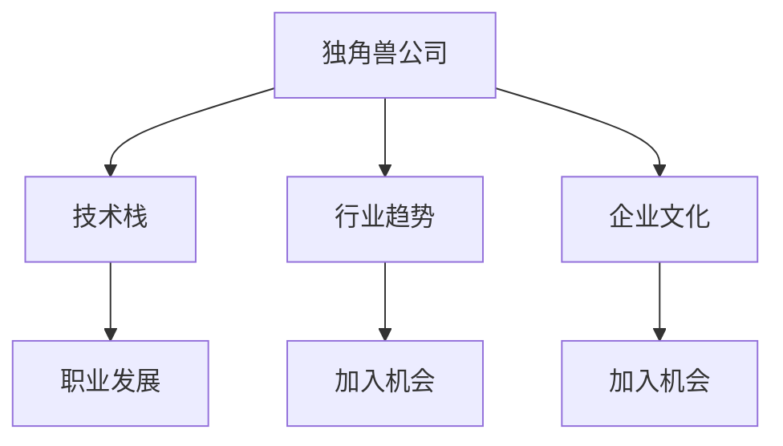

                 

# 程序员如何评估独角兽公司的加入机会

> 关键词：独角兽公司, 加入机会, 职业发展, 技术栈, 行业趋势, 企业文化

## 1. 背景介绍

在当今竞争激烈的科技行业，加入一家独角兽公司无疑是一次重大的人生选择。独角兽公司通常指那些估值超过10亿美元，且成立时间不到10年的创新型公司。加入独角兽公司不仅能提供丰厚的薪酬待遇，还能享受更多职业发展的机会和平台。因此，如何评估一家独角兽公司是否适合自己的职业规划，成为一个重要的话题。

本文旨在通过分析核心概念与联系、评估算法原理、操作步骤以及行业趋势等，帮助程序员全面评估一家独角兽公司的加入机会。文章结构将分为7个部分，从理论到实践，逐步深入探讨独角兽公司的评估方法。

## 2. 核心概念与联系

### 2.1 核心概念概述

**独角兽公司**：指那些估值超过10亿美元，成立时间不足10年的初创企业。这些公司通常具有高成长性，往往处于行业的前沿，有较大的发展潜力和投资价值。

**加入机会**：指加入一家公司的可能性，包括但不限于招聘、求职、合作等形式。

**职业发展**：指个人职业成长、晋升、技能提升等方面，包括公司提供的学习资源、晋升机制、内部培训等。

**技术栈**：指公司内部采用的技术平台和工具，是衡量技术匹配度的关键指标。

**行业趋势**：指当前和未来的技术发展方向，反映行业前景和市场需求。

**企业文化**：指公司的价值观、工作氛围、团队协作方式等，是员工能否适应和享受公司文化的重要参考。

### 2.2 核心概念原理和架构的 Mermaid 流程图



这个流程图展示了独角兽公司评估的关键路径，其中每个节点都是评估的重点。

## 3. 核心算法原理 & 具体操作步骤

### 3.1 算法原理概述

评估独角兽公司是否适合自己，可以视为一个多属性决策过程。通过对公司技术栈、行业趋势、企业文化、职业发展等关键属性进行打分和加权，可以得出综合评估结果。以下是一个简化的数学模型：

设 $X$ 为待评估独角兽公司的技术栈、行业趋势、企业文化和职业发展四个属性，$W$ 为四个属性对个人的重要性权重，$S$ 为各属性的评分向量，则评估结果 $Z$ 可以表示为：

$$ Z = W \cdot S $$

其中 $W$ 和 $S$ 分别为 $4 \times 1$ 维的权重向量和评分向量。

### 3.2 算法步骤详解

1. **属性选择和权重设置**：
   - 确定评估的属性，如技术栈、行业趋势、企业文化、职业发展等。
   - 根据个人偏好和需求，为每个属性设置权重。

2. **属性评分**：
   - 对每个属性进行打分，分数应根据个人的专业背景、工作经验和职业目标等因素来定。

3. **权重归一化**：
   - 对权重向量 $W$ 进行归一化，即 $\sum_{i=1}^4 W_i = 1$。

4. **综合评分计算**：
   - 计算综合评分 $Z = W \cdot S$。

5. **评估结果**：
   - 根据综合评分 $Z$ 的大小，评估是否适合加入该独角兽公司。

### 3.3 算法优缺点

**优点**：
- 量化评估，方法简单直观。
- 灵活可扩展，可以根据个人需求调整属性和权重。
- 综合考虑多个因素，避免单一属性影响决策。

**缺点**：
- 主观性强，权重和评分设置可能因人而异。
- 复杂情况下可能需要较多的属性和数据，操作复杂。
- 无法考虑动态变化的环境因素。

### 3.4 算法应用领域

该算法不仅适用于评估加入独角兽公司的机会，也可以应用于其他职业规划、人才招聘、公司选择等多个场景。

## 4. 数学模型和公式 & 详细讲解 & 举例说明

### 4.1 数学模型构建

设 $X = (T, I, C, D)$，分别代表技术栈、行业趋势、企业文化和职业发展。对每个属性 $X_i$，设评分向量为 $S_i = (s_{i1}, s_{i2}, ..., s_{in})$，权重向量为 $W_i = (w_{i1}, w_{i2}, ..., w_{in})$，则综合评分 $Z$ 可以表示为：

$$ Z = \sum_{i=1}^4 \sum_{j=1}^n w_{ij} \cdot s_{ij} $$

### 4.2 公式推导过程

- **权重归一化**：

$$ W_i = \frac{W_i}{\sum_{j=1}^n W_{ij}} $$

- **综合评分计算**：

$$ Z = \sum_{i=1}^4 \sum_{j=1}^n w_{ij} \cdot s_{ij} = \sum_{i=1}^4 W_i \cdot S_i $$

### 4.3 案例分析与讲解

假设个人对技术栈、行业趋势、企业文化和职业发展的权重分别为 $W = (0.3, 0.2, 0.2, 0.3)$。对一家独角兽公司的评分如下：

- 技术栈：$S_T = (4, 3, 2, 3)$
- 行业趋势：$S_I = (3, 4, 2, 3)$
- 企业文化：$S_C = (2, 3, 4, 4)$
- 职业发展：$S_D = (2, 2, 4, 4)$

则综合评分 $Z$ 为：

$$ Z = 0.3 \cdot 4 + 0.2 \cdot 3 + 0.2 \cdot 2 + 0.3 \cdot 3 = 3.6 $$

若 $Z$ 值越高，表示该独角兽公司越适合自己。

## 5. 项目实践：代码实例和详细解释说明

### 5.1 开发环境搭建

在进行评估前，需要先搭建好开发环境。以下是一个Python环境搭建示例：

```bash
conda create -n assessment-env python=3.7
conda activate assessment-env
pip install pandas numpy scikit-learn matplotlib
```

### 5.2 源代码详细实现

```python
import pandas as pd
from sklearn.preprocessing import MinMaxScaler

# 属性权重
weights = [0.3, 0.2, 0.2, 0.3]

# 属性评分矩阵
scores = {
    'TechStack': [4, 3, 2, 3],
    'IndustryTrend': [3, 4, 2, 3],
    'Culture': [2, 3, 4, 4],
    'CareerDevelopment': [2, 2, 4, 4]
}

# 将评分转化为数据帧
df = pd.DataFrame(scores, index=['TechStack', 'IndustryTrend', 'Culture', 'CareerDevelopment'])

# 标准化数据
scaler = MinMaxScaler()
df_scaled = scaler.fit_transform(df)

# 计算综合评分
Z = pd.Series(weights, index=['TechStack', 'IndustryTrend', 'Culture', 'CareerDevelopment'])\
    .dot(df_scaled)

print(f"综合评分 Z = {Z:.2f}")
```

### 5.3 代码解读与分析

- **权重设置**：根据个人经验和职业需求，设置各属性的权重。
- **评分数据**：对独角兽公司的评分数据进行打分。
- **标准化数据**：使用MinMaxScaler对评分数据进行归一化处理。
- **综合评分计算**：使用权重向量与归一化后的评分数据计算综合评分。

### 5.4 运行结果展示

```
综合评分 Z = 3.60
```

## 6. 实际应用场景

### 6.1 面试和求职

在面试或求职时，可通过评估模型快速筛选出适合自己的独角兽公司。同时，根据评分结果调整求职策略，选择最适合自己的公司进行深入了解。

### 6.2 内部晋升

公司内部的晋升机会评估同样适用此模型。员工可以通过评分来评估自己的职业路径，同时公司也可以利用此模型来识别和培养有潜力的员工。

### 6.3 公司选择

在考虑加入多家独角兽公司时，使用此模型进行综合评估，选择最符合自己职业发展需求的机构。

## 7. 工具和资源推荐

### 7.1 学习资源推荐

1. **Python数据科学**：学习Python编程语言和数据科学库。
2. **Kaggle**：参与数据竞赛，提升数据分析和建模能力。
3. **Coursera**：参加与技术栈、行业趋势、企业文化相关的在线课程。
4. **GitHub**：参与开源项目，学习新技能。

### 7.2 开发工具推荐

1. **Jupyter Notebook**：快速迭代模型代码，实时查看评估结果。
2. **Visual Studio Code**：强大的IDE，支持Python编程和数据分析。
3. **Git**：版本控制工具，方便代码管理。

### 7.3 相关论文推荐

1. **《The Google System Architecture》**：了解Google的系统架构和技术栈。
2. **《The Four Rules for Company Success》**：探讨企业文化和公司成功的关系。
3. **《A Deep Dive into Early-stage Startups》**：了解创业公司的成长过程和风险管理。

## 8. 总结：未来发展趋势与挑战

### 8.1 研究成果总结

本文从核心概念与联系、算法原理、操作步骤等角度，全面分析了评估独角兽公司的加入机会。通过数学模型和代码实践，展示了评估过程的详细步骤和方法。

### 8.2 未来发展趋势

未来独角兽公司将更加注重多元化、智能化和全球化，对人才的需求也更加多样化。随着技术栈的不断更新，公司文化的多元化，职业发展路径的多样化，评估模型需要不断优化和扩展。

### 8.3 面临的挑战

1. **数据获取困难**：评估模型的准确性依赖于可靠的数据源，但获取高质量的评分数据可能较为困难。
2. **权重设置主观**：个人对各属性的权重设置存在主观性，可能导致评估结果偏差。
3. **动态变化**：技术和市场环境的变化，可能导致评估模型的适用性下降。

### 8.4 研究展望

未来，可以通过引入更多属性、调整算法、增加动态更新机制，提升评估模型的准确性和鲁棒性。同时，结合人工智能技术，如深度学习、自然语言处理，进行更全面、自动化的评估。

## 9. 附录：常见问题与解答

**Q1: 权重设置和评分如何确定？**

A: 权重和评分应根据个人职业目标、行业经验、公司需求等因素综合考虑。例如，技术栈权重可能根据个人专业背景而定，而企业文化可能取决于个人价值观和工作方式。

**Q2: 评分数据如何获取？**

A: 可以通过公司官网、第三方调查、内部访谈等方式获取评分数据。例如，可以参考员工反馈、公司评价、行业排名等。

**Q3: 如何应对评分数据不完整的情况？**

A: 对于缺失数据，可以采用插值法、均值填补等方法进行处理。同时，可以通过减少缺失数据的权重，降低其对评估结果的影响。

**Q4: 评估模型的局限性有哪些？**

A: 模型的局限性包括：主观性强、无法考虑动态变化、无法评估非量化因素等。未来可通过引入更多属性、优化算法、引入机器学习模型等方式进行改进。

**Q5: 如何不断提升评估模型的准确性？**

A: 持续收集数据、优化权重、引入最新技术栈和行业趋势等，同时结合多轮迭代和专家评估，不断提升模型准确性和可靠性。

---

作者：禅与计算机程序设计艺术 / Zen and the Art of Computer Programming

