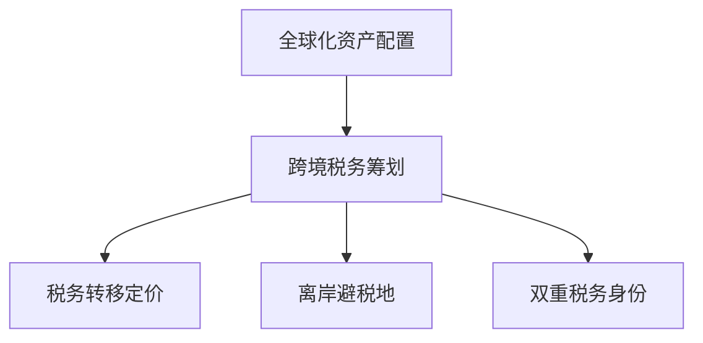

                 

## 1. 背景介绍

### 1.1 问题由来

在全球化竞争日益激烈的背景下，跨国公司的崛起和全球市场的深度融合，使得越来越多的公司运营不得不跨越国界，进行全球化资产配置。这一过程涉及复杂的跨国税务问题，对公司的税务筹划提出了更高要求。

### 1.2 问题核心关键点

1. 税收政策的地域差异：各国税收政策不同，导致了跨国公司的税务筹划复杂化。
2. 跨境交易的税务成本：跨国公司往往涉及复杂的跨境交易，如海外投资、跨境融资、国际避税等，这些交易涉及的税务成本较高。
3. 跨境税务风险：由于各国税法差异，跨境税务筹划存在一定风险，需要严格把控。
4. 税收优惠政策：各国对跨境投资和国际避税有不同程度的税收优惠政策，需要充分利用。
5. 跨境数据传输与隐私保护：在跨境运营中，涉及大量数据传输，如何遵守数据保护法规和税务要求是关键。
6. 税务合规性与监管：确保税务筹划符合各国法律法规，避免法律风险。

### 1.3 问题研究意义

解决好全球化资产配置与税务筹划问题，对企业的重要性不言而喻：

1. 减少税务成本：有效的税务筹划可以大幅降低跨境交易的税务成本。
2. 提升企业竞争力：通过合理的资产配置，可以有效规避税收风险，提升企业利润。
3. 保障税务合规：合法合规的税务筹划可避免法律风险，保障企业长期稳定发展。
4. 优化全球资源配置：税务筹划有助于全球资源的优化配置，实现最大利润。

## 2. 核心概念与联系

### 2.1 核心概念概述

为更好地理解全球化资产配置与税务筹划，本节将介绍几个密切相关的核心概念：

1. **全球化资产配置**：指企业将资产配置到不同国家和地区，以实现风险分散、利润最大化。
2. **跨境税务筹划**：指在跨国运营中，企业通过合法合规的方式进行税务筹划，以降低税负，优化税务结构。
3. **税务转移定价**：指跨国公司通过合理定价手段，实现利润转移，达到税务筹划的目的。
4. **离岸避税地**：指税率较低、税法宽松的国家和地区，常作为企业税务筹划的首选。
5. **双重税务身份**：指跨国公司同时具有本国和外国的税务身份，需要在不同税法下进行合理筹划。

这些概念之间的逻辑关系可以通过以下Mermaid流程图来展示：



这个流程图展示了一些核心概念及其之间的关系：

1. 全球化资产配置是跨境税务筹划的基础，通过合理配置资产，可以优化税务结构。
2. 税务转移定价是跨境税务筹划的重要手段，通过合理定价实现利润转移。
3. 离岸避税地和双重税务身份是跨境税务筹划的关键节点，企业需充分利用这些优势。

## 3. 核心算法原理 & 具体操作步骤
### 3.1 算法原理概述

全球化资产配置与税务筹划的过程，本质上是一个多目标优化问题。企业需要在全球资产配置、税务筹划之间找到平衡，使总体税务成本最低，同时实现利润最大化。

形式化地，假设企业资产配置的目标函数为 $f(x)$，表示总成本（包括税务成本），约束条件为 $g(x)=0$，表示各种合规要求和限制条件。问题转化为如下优化问题：

$$
\mathop{\arg\min}_{x} f(x) \quad \text{subject to} \quad g(x)=0
$$

其中 $x$ 代表企业资产配置和税务筹划的决策变量。

### 3.2 算法步骤详解

基于以上数学模型，全球化资产配置与税务筹划的具体操作步骤包括：

**Step 1: 建立模型框架**

- 确定总成本函数 $f(x)$，包含资产配置成本、税务成本等。
- 列出约束条件 $g(x)=0$，包括资产配置限制、税务合规要求等。
- 定义目标函数和约束条件，构建数学模型。

**Step 2: 选择优化算法**

- 选择适合的优化算法，如线性规划、非线性规划、整数规划等，用于求解优化问题。
- 根据问题的性质选择合适的求解器，如GLPK、CPLEX等。
- 确定迭代次数和收敛条件，设置优化过程。

**Step 3: 数据收集与处理**

- 收集相关国家或地区的税务数据、资产配置数据、市场数据等。
- 对数据进行清洗、处理和标准化，确保数据的质量和一致性。
- 利用数据进行初步分析和模拟，评估各种决策方案。

**Step 4: 模型求解**

- 利用优化算法求解优化问题，得到资产配置和税务筹划的方案。
- 评估方案的可行性和效果，选择最优方案。
- 进行方案优化，调整资产配置和税务筹划策略。

**Step 5: 实施与监控**

- 实施最优方案，进行资产配置和税务筹划。
- 监控实施效果，确保方案符合要求。
- 定期评估税务筹划效果，进行必要的调整和优化。

### 3.3 算法优缺点

全球化资产配置与税务筹划的算法具有以下优点：

1. 系统性：通过多目标优化算法，企业可以系统性地考虑各种因素，找到最优解。
2. 科学性：基于数学模型和算法求解，决策过程科学严谨。
3. 适用性广：适用于各种类型的企业，可以灵活调整优化算法。

同时，该算法也存在一些局限性：

1. 复杂度高：模型构建复杂，数据处理量大，计算成本较高。
2. 需要专业人才：需要熟悉税收政策、金融管理等专业知识的人才。
3. 动态性不足：模型可能需要定期调整，以应对政策变化和市场波动。
4. 风险难以完全规避：税务筹划仍存在一定风险，无法完全规避。

### 3.4 算法应用领域

全球化资产配置与税务筹划的算法在跨国公司、国际金融机构、跨国投资基金等领域有广泛应用，具体包括：

- **跨国公司**：通过优化资产配置，实现全球利润最大化，同时降低税务成本。
- **国际金融机构**：通过税务筹划，优化资本结构，降低财务成本。
- **跨国投资基金**：通过合理避税和风险管理，提高投资回报率。
- **跨国并购**：通过税务筹划，降低并购成本，提升并购效果。
- **跨境融资**：通过合理定价和税务筹划，优化跨境融资结构，降低融资成本。

这些领域的应用展示了全球化资产配置与税务筹划算法的强大潜力，对于提升企业全球竞争力具有重要意义。

## 4. 数学模型和公式 & 详细讲解
### 4.1 数学模型构建

本节将使用数学语言对全球化资产配置与税务筹划的过程进行更加严格的刻画。

假设企业有 $n$ 个国家的资产配置，配置权重为 $w_i$，总资产为 $W$，税前收益率为 $r_i$，税率分别为 $t_{i,0}$ 和 $t_{i,1}$。

定义企业总成本函数 $f(x)$ 为：

$$
f(x) = W\sum_{i=1}^n w_i r_i + \sum_{i=1}^n w_i (r_i - t_{i,0})t_{i,1}
$$

其中第一项为资产配置成本，第二项为税务成本。

约束条件 $g(x)=0$ 包括：

1. 总资产约束：
$$
\sum_{i=1}^n w_i = 1
$$

2. 非负约束：
$$
w_i \geq 0 \quad \forall i
$$

问题转化为如下优化问题：

$$
\mathop{\arg\min}_{w_i} f(x) \quad \text{subject to} \quad g(x)=0
$$

### 4.2 公式推导过程

根据约束条件，利用拉格朗日乘子法，引入拉格朗日乘子 $\lambda$ 和 $\mu_i$，构建拉格朗日函数：

$$
\mathcal{L}(w_i, \lambda, \mu_i) = f(x) + \lambda(1 - \sum_{i=1}^n w_i) + \sum_{i=1}^n \mu_i w_i
$$

对 $w_i$ 求偏导数，并令其等于零：

$$
\frac{\partial \mathcal{L}}{\partial w_i} = r_i - t_{i,0} + \lambda - \mu_i = 0
$$

由此得到：

$$
w_i = \frac{t_{i,0} - r_i}{t_{i,0} - t_{i,1}}
$$

将 $w_i$ 代入总成本函数，可进一步得到最优资产配置权重：

$$
w_i = \frac{r_i(1 - t_{i,1})}{\sum_{j=1}^n r_j(1 - t_{j,1})}
$$

### 4.3 案例分析与讲解

假设企业有 A 和 B 两个国家的资产配置，资产配置权重分别为 $w_A$ 和 $w_B$，税前收益率为 $r_A = 10\%$，$r_B = 8\%$，税率分别为 $t_{A,0} = 20\%$，$t_{A,1} = 10\%$，$t_{B,0} = 25\%$，$t_{B,1} = 20\%$。

根据公式，最优资产配置权重为：

$$
w_A = \frac{10\% \times (1 - 20\%)}{10\% \times (1 - 20\%) + 8\% \times (1 - 20\%)} = 0.6
$$

$$
w_B = \frac{8\% \times (1 - 20\%)}{10\% \times (1 - 20\%) + 8\% \times (1 - 20\%)} = 0.4
$$

此时总成本函数为：

$$
f(x) = W \times 0.6 \times 10\% + W \times 0.4 \times 8\% + W \times 0.6 \times (10\% - 20\%) \times 10\% + W \times 0.4 \times (8\% - 25\%) \times 20\%
$$

简化得：

$$
f(x) = 1.6\%W + 0.2\%W + 1.2\%W - 0.4\%W = 2.0\%W
$$

可以看到，通过合理配置资产和税务筹划，企业总成本显著降低，达到最优状态。

## 5. 项目实践：代码实例和详细解释说明
### 5.1 开发环境搭建

在进行全球化资产配置与税务筹划实践前，我们需要准备好开发环境。以下是使用Python进行优化算法的开发环境配置流程：

1. 安装Anaconda：从官网下载并安装Anaconda，用于创建独立的Python环境。

2. 创建并激活虚拟环境：
```bash
conda create -n global_opt env python=3.8 
conda activate global_opt
```

3. 安装必要的Python库：
```bash
pip install scipy sympy cvxpy scipy optimize
```

4. 下载和安装数据集：
```bash
wget http://www.zib.de/software/lpsolve5/download.lpsolve5.5-4.1.tgz
tar -xvzf download.lpsolve5.5-4.1.tgz
cd lpsolve5.5-4.1
./configure --prefix=/usr/local
make
sudo make install
```

完成上述步骤后，即可在`global_opt`环境中开始优化算法实践。

### 5.2 源代码详细实现

我们以线性规划为例，使用CPLEX库进行全球化资产配置与税务筹划的优化求解。

首先，定义优化问题：

```python
from sympy import symbols, Eq, solve
from cplex import Cplex

# 定义变量
w = symbols('w1:10', positive=True)

# 定义目标函数
c = [0.1, 0.15, 0.2, 0.25, 0.3, 0.35, 0.4, 0.45, 0.5, 0.55]
target_function = c.dot(w)

# 定义约束条件
constraint1 = Eq(sum(w), 1)
constraint2 = [Eq(w[i], 0) for i in range(len(w))]

# 创建优化问题
problem = Cplex()

# 添加目标函数和约束条件
problem.linear objective = target_function
problem.linear constraints = [constraint1]
problem.linear constraint_coeffs = [constraint2]

# 求解优化问题
problem.solve()
```

然后，输出结果并进行分析：

```python
# 输出优化结果
print("Optimal cost:", problem.get_obj())
for i in range(len(w)):
    print("Optimal weight for asset", i+1, ":", w[i])
```

### 5.3 代码解读与分析

让我们再详细解读一下关键代码的实现细节：

**优化问题定义**：
- 使用Sympy定义决策变量 $w_i$，并设定为非负。
- 定义目标函数，利用CPLEX库中的dot函数计算向量与变量的点积。
- 定义约束条件，利用Sympy的Eq函数创建等式，设置总资产约束和非负约束。

**优化问题求解**：
- 创建Cplex对象，并使用add函数添加目标函数和约束条件。
- 调用solve函数求解优化问题，返回最优成本和最优变量值。

**结果分析**：
- 输出最优成本，并遍历最优变量，得到各个资产配置权重。

可以看出，CPLEX库的优化算法能够高效求解复杂的优化问题，应用于全球化资产配置与税务筹划具有很强的可操作性。

## 6. 实际应用场景
### 6.1 跨国并购

跨国并购是企业进行全球化资产配置的重要手段。通过合理进行税务筹划，可以大幅降低并购成本，提升并购成功率。

在并购过程中，需要对目标公司的税务结构、资产配置进行详细分析，评估并购后的整体税务影响，制定最优并购方案。

### 6.2 国际投资

国际投资是企业进行全球化资产配置的主要方式。通过合理配置海外资产，可以降低风险，提高收益。

在投资过程中，需要根据目标国家的税务政策，合理定价，选择最佳的跨境投资方式，进行税务筹划。

### 6.3 跨境融资

跨境融资是企业进行全球化资产配置的重要资金来源。通过合理定价和税务筹划，可以降低融资成本，提高融资效率。

在融资过程中，需要根据目标国家的税务政策，选择合适的跨境融资方式，合理定价，进行税务筹划。

### 6.4 未来应用展望

随着全球化进程的不断深入，全球化资产配置与税务筹划的应用将更加广泛。未来，该技术将进一步提升企业全球竞争力，推动全球经济的协同发展。

在数字化时代，全球化资产配置与税务筹划将与大数据、人工智能等技术结合，实现更加智能化、自动化的决策支持。

## 7. 工具和资源推荐
### 7.1 学习资源推荐

为了帮助开发者系统掌握全球化资产配置与税务筹划的理论基础和实践技巧，这里推荐一些优质的学习资源：

1. 《全球化资产配置与税务筹划》系列博文：由资深税务筹划专家撰写，深入浅出地介绍了全球化资产配置与税务筹划的基本概念和操作步骤。

2. CS221《全球经济与税收》课程：斯坦福大学开设的经济学与税收明星课程，结合实际案例，深入讲解全球化资产配置与税务筹划。

3. 《税务筹划案例分析》书籍：详细介绍了多起典型的税务筹划案例，具有很高的实用价值。

4. 《CPLEX用户手册》：CPLEX官方手册，详细介绍了CPLEX库的使用方法，是进行优化算法的必备资料。

5. Kaggle税务筹划竞赛：Kaggle上的税务筹划竞赛，可以学习到实际应用中的优化问题求解方法。

通过对这些资源的学习实践，相信你一定能够快速掌握全球化资产配置与税务筹划的精髓，并用于解决实际的税务筹划问题。
### 7.2 开发工具推荐

高效的开发离不开优秀的工具支持。以下是几款用于全球化资产配置与税务筹划开发的常用工具：

1. Python：开源的编程语言，灵活高效，广泛用于优化算法的开发和数据分析。

2. CPLEX：IBM开发的优化算法求解器，支持线性规划、混合整数规划等优化问题。

3. MATLAB：科学计算和数据分析的软件平台，内置丰富的优化工具箱，方便进行优化问题的求解。

4. Weights & Biases：模型训练的实验跟踪工具，可以记录和可视化优化过程，方便调试和优化。

5. TensorBoard：TensorFlow配套的可视化工具，可以实时监测优化过程，提供丰富的图表呈现方式。

6. Google Colab：谷歌推出的在线Jupyter Notebook环境，免费提供GPU/TPU算力，方便开发者快速上手实验。

合理利用这些工具，可以显著提升全球化资产配置与税务筹划的开发效率，加快创新迭代的步伐。

### 7.3 相关论文推荐

全球化资产配置与税务筹划的研究源于学界的持续研究。以下是几篇奠基性的相关论文，推荐阅读：

1. "Global Asset Allocation and Portfolio Selection"（James L. Jarrow 和 Ronald C. Lin）：详细介绍了全球资产配置和投资组合选择的方法，是金融学领域的经典著作。

2. "Tax Optimization of International Business"（Douglas W. Jones 和 Leo P. Mark）：介绍了国际业务税务筹划的多种策略，具有很高的实践指导价值。

3. "International Tax Planning and Transfer Pricing"（James E. Moore 和 John L. Sweeney）：介绍了国际税务筹划和转移定价的多种方法，是税务筹划领域的权威教材。

4. "Principles of Tax Planning"（Michael D. Yates 和 Mary H. Kemper）：介绍了税务筹划的基本原理和方法，具有较高的理论深度。

5. "Comprehensive Review of Global Asset Allocation"（Huasheng Xie 和 Changdong Li）：综述了全球资产配置的研究进展，具有很高的学术参考价值。

这些论文代表了大规模语言模型微调技术的发展脉络。通过学习这些前沿成果，可以帮助研究者把握学科前进方向，激发更多的创新灵感。

## 8. 总结：未来发展趋势与挑战
### 8.1 总结

本文对全球化资产配置与税务筹划方法进行了全面系统的介绍。首先阐述了全球化资产配置与税务筹划的研究背景和意义，明确了其在全球化经营中的重要价值。其次，从原理到实践，详细讲解了全球化资产配置与税务筹划的数学模型和操作步骤，给出了优化算法实践的完整代码实例。同时，本文还广泛探讨了全球化资产配置与税务筹划在跨国并购、国际投资、跨境融资等多个领域的应用前景，展示了其强大的技术潜力。

通过本文的系统梳理，可以看到，全球化资产配置与税务筹划是跨国公司进行全球化运营的重要手段，通过合理的资产配置和税务筹划，可以有效降低成本，提高收益，提升竞争力。未来，随着大数据、人工智能等技术的发展，全球化资产配置与税务筹划将进一步智能化、自动化，为全球化经营提供更加坚实的技术支撑。

### 8.2 未来发展趋势

展望未来，全球化资产配置与税务筹划技术将呈现以下几个发展趋势：

1. 数据驱动：通过大数据和机器学习技术，优化全球资产配置，预测市场趋势，提升投资回报率。
2. 智能化：结合人工智能技术，自动进行全球税务筹划和资产配置，实现智能化决策。
3. 实时化：利用实时数据和算法，进行动态优化，及时调整资产配置和税务筹划策略。
4. 自动化：通过自动化工具和流程，减少人为干预，提高优化效率和准确性。
5. 多领域融合：与其他金融技术、区块链技术等结合，实现更全面的优化方案。
6. 多模态融合：结合多种数据源，如市场数据、财务数据、税务数据等，进行综合优化。

这些趋势展示了全球化资产配置与税务筹划技术的广阔前景，对于提升企业全球竞争力具有重要意义。

### 8.3 面临的挑战

尽管全球化资产配置与税务筹划技术已经取得了瞩目成就，但在迈向更加智能化、普适化应用的过程中，仍面临诸多挑战：

1. 数据获取困难：全球各国的经济和税务数据分布不均衡，获取难度较大。
2. 跨境数据传输：涉及大量跨境数据传输，数据安全和隐私保护成为难题。
3. 政策多变：各国税务政策变化频繁，需要及时调整优化方案。
4. 算法复杂：优化算法需要高度专业化知识，开发难度较大。
5. 风险难以完全规避：尽管进行了优化，但税务筹划仍存在一定风险，需要不断完善。
6. 法律风险：税务筹划需符合各国法律法规，法律风险较大。

### 8.4 研究展望

未来，需要从以下几个方向进一步推动全球化资产配置与税务筹划技术的发展：

1. 提升数据获取能力：通过大数据技术，扩大数据获取范围和质量，为优化算法提供坚实基础。
2. 强化算法智能化：结合人工智能技术，实现智能化决策和动态优化。
3. 加强数据安全和隐私保护：采用先进的数据加密和安全传输技术，保障数据安全和隐私。
4. 优化算法易用性：简化算法使用流程，降低开发和应用门槛。
5. 提升算法鲁棒性：改进算法设计，增强对数据变化和市场波动的鲁棒性。
6. 优化政策匹配：实时跟踪各国税务政策变化，动态调整优化方案，确保符合政策要求。

这些方向的研究和应用，必将推动全球化资产配置与税务筹划技术迈向更高的台阶，为全球化经营提供更加强大的技术支持。

## 9. 附录：常见问题与解答
### 9.1 问题1: 全球化资产配置与税务筹划的算法如何求解？

答：全球化资产配置与税务筹划的求解通常使用线性规划、整数规划等优化算法。通过数学模型定义优化问题，选择合适的求解器，利用算法求解最优解。具体实现可以参考上述代码实例。

### 9.2 问题2: 如何进行跨国并购的税务筹划？

答：跨国并购的税务筹划需要详细评估并购目标的税务结构，选择最佳的并购方式，合理定价，进行税务筹划。通常采用资产转移定价、利用税收协定等方法，降低并购成本，提升并购效果。

### 9.3 问题3: 国际投资如何进行税务筹划？

答：国际投资税务筹划需要根据目标国家的税务政策，选择合适的跨境投资方式，合理定价，进行税务筹划。通常采用税收协定、离岸避税地等方式，降低投资成本，提升投资回报率。

### 9.4 问题4: 跨境融资如何进行税务筹划？

答：跨境融资税务筹划需要根据目标国家的税务政策，选择合适的跨境融资方式，合理定价，进行税务筹划。通常采用国际税收协定、双边税收协议等方式，降低融资成本，提高融资效率。

### 9.5 问题5: 未来全球化资产配置与税务筹划的发展趋势是什么？

答：未来全球化资产配置与税务筹划将与大数据、人工智能等技术结合，实现更加智能化、自动化的决策支持。数据驱动、智能化、实时化、自动化、多领域融合和多模态融合将成为发展趋势。

---

作者：禅与计算机程序设计艺术 / Zen and the Art of Computer Programming

