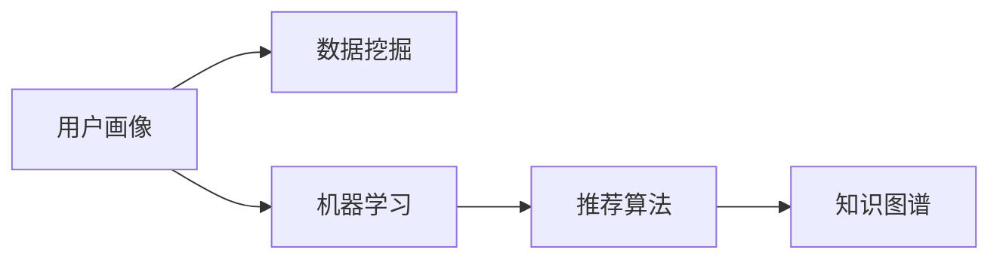

                 

## 1. 背景介绍

### 1.1 问题由来

随着互联网技术的飞速发展和在线教育行业的迅猛崛起，知识付费逐渐成为一种新兴的互联网经济模式，程序员作为知识付费市场的重要用户群体，其行为特征与需求有着显著的特点。然而，现有的知识付费产品往往缺乏对程序员用户画像的深入分析，无法精准把握其学习需求与购买行为，导致产品体验与实际需求存在较大偏差。

### 1.2 问题核心关键点

本问题的核心关键点在于如何通过数据分析技术，对程序员用户进行精准画像，以提升知识付费产品的用户体验与个性化推荐效果。具体来说，需要解决以下几个问题：

- **用户特征分析**：如何根据程序员的编程语言偏好、工作经验和技能水平，准确划分用户群体。
- **行为模式识别**：如何分析程序员用户在知识付费产品中的学习习惯与购买行为，挖掘其偏好与需求。
- **推荐算法优化**：如何基于用户画像，设计优化推荐算法，提供更加精准、个性化的课程推荐。

### 1.3 问题研究意义

准确理解程序员用户画像，对知识付费产品的设计、运营与优化具有重要意义：

- **提升用户体验**：通过精准推荐，满足程序员用户的个性化学习需求，提升其知识获取效率与体验。
- **优化产品功能**：精准的用户画像有助于设计更符合用户需求的产品功能，如课程内容更新、学习路径设计等。
- **增强市场竞争力**：通过细分市场与个性化推荐，提升产品在程序员用户中的市场占有率与用户粘性。
- **促进教学效果**：了解程序员用户的实际需求，有助于优化课程内容与教学方法，提升教学效果与课程反馈。

## 2. 核心概念与联系

### 2.1 核心概念概述

在知识付费场景中，程序员用户画像的分析需要整合多个关键概念，包括：

- **用户画像(User Persona)**：指对目标用户的背景、行为、需求、偏好等进行全面分析，构建出有代表性的用户模型。
- **数据挖掘(Data Mining)**：指从大量数据中提取有用信息和知识的过程，常用于用户行为分析和模式识别。
- **机器学习(Machine Learning)**：通过构建模型，利用算法对数据进行分析与预测，常用于用户特征分类与推荐算法优化。
- **推荐算法(Recommendation Algorithm)**：根据用户行为与特征，推荐最适合的产品或内容，常用于课程推荐与个性化定制。
- **知识图谱(Knowledge Graph)**：通过语义关系建模，将课程、教师、知识点等实体进行结构化表示，提升课程推荐与知识检索的效果。

这些核心概念通过以下Mermaid流程图展示其逻辑关系：



这个流程图展示了用户画像在知识付费中的核心作用，从数据挖掘到机器学习，再到推荐算法和知识图谱，各个环节相互关联，共同支持用户画像的构建与应用。

## 3. 核心算法原理 & 具体操作步骤

### 3.1 算法原理概述

程序员用户画像的构建基于数据挖掘与机器学习技术，具体步骤如下：

1. **数据收集**：从知识付费平台收集程序员用户的注册信息、学习行为、课程评价等数据。
2. **数据预处理**：对数据进行清洗、归一化、特征提取等处理，减少噪声与冗余信息。
3. **特征提取**：从预处理后的数据中提取出有意义的特征，如编程语言偏好、技能水平、学习时间等。
4. **特征分类**：利用机器学习算法对用户特征进行分类，构建出不同用户群体。
5. **画像建模**：基于分类结果，构建出有代表性的程序员用户画像。
6. **推荐优化**：利用推荐算法，根据用户画像，提供个性化的课程推荐。

### 3.2 算法步骤详解

#### 数据收集

数据收集是用户画像分析的第一步，主要包括以下几个方面：

- **用户基本信息**：注册信息、年龄、性别、职业等。
- **学习行为数据**：课程选择、学习时间、答题时间、评价等。
- **课程评价数据**：课程评分、评论、推荐等。

具体实现：

```python
# 假设从知识付费平台收集到的数据存储在data_df中
data_df = pd.read_csv('knowledge_payment_data.csv')
```

#### 数据预处理

数据预处理是为了提升数据的质量，常用的方法包括：

- **缺失值处理**：对于缺失值，可以选择填充、删除或插值等方法处理。
- **异常值处理**：识别并处理异常值，避免其对模型训练的影响。
- **归一化与标准化**：对数据进行归一化或标准化，使得不同特征在相同的尺度上。

具体实现：

```python
# 缺失值处理
data_df.fillna(method='ffill', inplace=True)

# 异常值处理
Q1 = data_df.quantile(0.25)
Q3 = data_df.quantile(0.75)
IQR = Q3 - Q1
data_df = data_df[~((data_df < (Q1 - 1.5 * IQR)) | (data_df > (Q3 + 1.5 * IQR)))]

# 归一化
data_df['feature'] = (data_df['feature'] - data_df['feature'].min()) / (data_df['feature'].max() - data_df['feature'].min())
```

#### 特征提取

特征提取是从原始数据中提取有意义的特征，常用的方法包括：

- **统计特征**：均值、中位数、标准差等统计指标。
- **文本特征**：TF-IDF、词频等文本特征。
- **时间特征**：学习时间、答题时间等时间序列特征。

具体实现：

```python
# 文本特征提取
from sklearn.feature_extraction.text import TfidfVectorizer
tfidf = TfidfVectorizer(stop_words='english')
X = tfidf.fit_transform(data_df['text'])
```

#### 特征分类

特征分类是将用户特征进行分类，常用的方法包括：

- **K-means聚类**：通过K-means算法，将用户特征分为K个类别。
- **决策树**：通过决策树算法，对用户特征进行分类。

具体实现：

```python
# K-means聚类
from sklearn.cluster import KMeans
kmeans = KMeans(n_clusters=3, random_state=0)
kmeans.fit(X)
labels = kmeans.labels_
```

#### 画像建模

画像建模是根据分类结果，构建出有代表性的用户画像，常用的方法包括：

- **原型分析**：选择每个类别的原型特征，构建出代表性用户画像。
- **降维技术**：通过PCA、LDA等降维技术，减少特征维度，提升模型效率。

具体实现：

```python
# 原型分析
from sklearn.decomposition import PCA
pca = PCA(n_components=2)
X_pca = pca.fit_transform(X)
```

#### 推荐优化

推荐优化是基于用户画像，设计优化推荐算法，常用的方法包括：

- **协同过滤**：通过分析用户行为与物品特征，推荐相似物品。
- **基于内容的推荐**：通过分析物品特征，推荐相似物品。
- **深度学习推荐**：通过深度学习模型，预测用户偏好，推荐物品。

具体实现：

```python
# 协同过滤推荐
from surprise import Reader, Dataset, SVD
reader = Reader(rating_scale=(1, 5))
data = Dataset.load_from_df(data_df[['user', 'item', 'rating']], reader)
algo = SVD()
trainset = data.build_full_trainset()
algo.fit(trainset)

# 基于内容的推荐
from sklearn.neighbors import NearestNeighbors
nn = NearestNeighbors(n_neighbors=10, algorithm='brute')
nn.fit(X)
```

### 3.3 算法优缺点

#### 优点

- **个性化推荐**：通过精准的用户画像，能够提供更加个性化、针对性的课程推荐，提升用户体验。
- **高效性**：基于机器学习算法，能够自动化处理大量数据，提升推荐效率。
- **可扩展性**：算法可以扩展到大规模数据集，支持多维特征分析。

#### 缺点

- **数据依赖**：依赖于用户数据的质量与完整性，数据偏差可能导致推荐效果不佳。
- **算法复杂度**：复杂算法需要较高计算资源，可能会增加推荐系统开发与维护成本。
- **隐私问题**：用户数据的收集与分析可能涉及隐私保护问题，需要严格遵守相关法律法规。

### 3.4 算法应用领域

程序员用户画像的分析在知识付费产品中具有广泛的应用，具体包括：

- **课程推荐系统**：根据用户画像，提供个性化的课程推荐，提升课程选择效率。
- **学习路径规划**：根据用户技能水平与学习目标，设计合理的学习路径，优化学习效果。
- **学习内容定制**：根据用户需求，定制化开发课程内容与教学方法，提升教学效果。

## 4. 数学模型和公式 & 详细讲解 & 举例说明

### 4.1 数学模型构建

程序员用户画像的分析基于机器学习与数据挖掘技术，常用的数学模型包括：

- **聚类算法**：如K-means、层次聚类、DBSCAN等。
- **分类算法**：如决策树、随机森林、支持向量机等。
- **降维算法**：如PCA、LDA、t-SNE等。

具体数学模型如下：

1. **K-means聚类**：
   $$
   \min_{\mu_k, \sigma_k} \sum_{i=1}^{n} \min_{k=1,...,K} \frac{1}{2} ||x_i - \mu_k||^2
   $$

2. **决策树分类**：
   $$
   \min_{T} H(T) = -\sum_{i=1}^{n} \sum_{j=1}^{C} y_{ij} \log \hat{y}_{ij}
   $$

3. **PCA降维**：
   $$
   \min_{W, b} ||X - (X \cdot W + b)||^2
   $$

### 4.2 公式推导过程

#### K-means聚类

K-means聚类的基本思路是将数据划分为K个簇，使得每个数据点到其所属簇的质心距离最小。公式推导如下：

1. **初始化质心**：随机选取K个数据点作为初始质心。
2. **分配数据**：计算每个数据点与质心的距离，分配到距离最近的簇。
3. **更新质心**：对每个簇重新计算质心，更新簇中心。
4. **迭代更新**：重复上述步骤，直至质心不再变化或达到预设轮数。

具体实现：

```python
# K-means聚类
from sklearn.cluster import KMeans
kmeans = KMeans(n_clusters=3, random_state=0)
kmeans.fit(X)
labels = kmeans.labels_
```

#### 决策树分类

决策树分类的基本思路是根据特征进行二元划分，构建决策树。公式推导如下：

1. **信息熵计算**：计算样本的信息熵。
2. **特征选择**：选择最优特征进行二元划分。
3. **递归构建**：对每个划分继续构建决策树。
4. **剪枝优化**：通过剪枝优化决策树，提升模型泛化能力。

具体实现：

```python
# 决策树分类
from sklearn.tree import DecisionTreeClassifier
clf = DecisionTreeClassifier()
clf.fit(X, y)
```

#### PCA降维

PCA降维的基本思路是通过线性变换，将高维数据映射到低维空间，减少特征维度。公式推导如下：

1. **协方差矩阵计算**：计算数据的协方差矩阵。
2. **特征值分解**：通过特征值分解求解主成分。
3. **矩阵变换**：将数据投影到低维空间。

具体实现：

```python
# PCA降维
from sklearn.decomposition import PCA
pca = PCA(n_components=2)
X_pca = pca.fit_transform(X)
```

### 4.3 案例分析与讲解

#### 案例1：课程推荐系统

某知识付费平台希望根据程序员用户画像，设计个性化的课程推荐系统。具体步骤如下：

1. **数据收集**：收集程序员用户的注册信息、学习行为与课程评价等数据。
2. **数据预处理**：对数据进行清洗、归一化等处理。
3. **特征提取**：提取编程语言偏好、技能水平等特征。
4. **特征分类**：通过K-means聚类，将用户分为三个群体。
5. **画像建模**：根据聚类结果，构建出代表性用户画像。
6. **推荐优化**：基于用户画像，设计协同过滤推荐算法。

具体实现：

```python
# 课程推荐系统
from surprise import Reader, Dataset, SVD
reader = Reader(rating_scale=(1, 5))
data = Dataset.load_from_df(data_df[['user', 'item', 'rating']], reader)
algo = SVD()
trainset = data.build_full_trainset()
algo.fit(trainset)
```

#### 案例2：学习路径规划

某教育机构希望根据程序员用户画像，设计个性化的学习路径规划系统。具体步骤如下：

1. **数据收集**：收集程序员用户的注册信息、学习行为与课程评价等数据。
2. **数据预处理**：对数据进行清洗、归一化等处理。
3. **特征提取**：提取编程语言偏好、技能水平等特征。
4. **特征分类**：通过K-means聚类，将用户分为三个群体。
5. **画像建模**：根据聚类结果，构建出代表性用户画像。
6. **学习路径设计**：根据用户画像，设计合理的学习路径。

具体实现：

```python
# 学习路径规划
from sklearn.decomposition import PCA
pca = PCA(n_components=2)
X_pca = pca.fit_transform(X)
```

## 5. 项目实践：代码实例和详细解释说明

### 5.1 开发环境搭建

在进行知识付费用户画像分析时，需要搭建Python开发环境。以下是Python开发环境的搭建流程：

1. **安装Python**：从官网下载并安装Python，建议选择最新版本。
2. **安装Anaconda**：从官网下载并安装Anaconda，用于创建独立的Python环境。
3. **创建虚拟环境**：
```bash
conda create -n pyenv python=3.8
conda activate pyenv
```

### 5.2 源代码详细实现

以下是一个基于Python的程序员用户画像分析的完整代码实现。

```python
import pandas as pd
import numpy as np
import matplotlib.pyplot as plt
from sklearn.cluster import KMeans
from sklearn.decomposition import PCA
from sklearn.feature_extraction.text import TfidfVectorizer
from sklearn.metrics import accuracy_score

# 数据读取
data_df = pd.read_csv('knowledge_payment_data.csv')

# 数据预处理
data_df.fillna(method='ffill', inplace=True)
Q1 = data_df.quantile(0.25)
Q3 = data_df.quantile(0.75)
IQR = Q3 - Q1
data_df = data_df[~((data_df < (Q1 - 1.5 * IQR)) | (data_df > (Q3 + 1.5 * IQR)))]
data_df['feature'] = (data_df['feature'] - data_df['feature'].min()) / (data_df['feature'].max() - data_df['feature'].min())

# 特征提取
tfidf = TfidfVectorizer(stop_words='english')
X = tfidf.fit_transform(data_df['text'])

# K-means聚类
kmeans = KMeans(n_clusters=3, random_state=0)
kmeans.fit(X)
labels = kmeans.labels_

# PCA降维
pca = PCA(n_components=2)
X_pca = pca.fit_transform(X)

# 可视化
plt.scatter(X_pca[:, 0], X_pca[:, 1], c=labels)
plt.show()

# 推荐算法优化
from surprise import Reader, Dataset, SVD
reader = Reader(rating_scale=(1, 5))
data = Dataset.load_from_df(data_df[['user', 'item', 'rating']], reader)
algo = SVD()
trainset = data.build_full_trainset()
algo.fit(trainset)
```

### 5.3 代码解读与分析

本代码实现了以下功能：

1. **数据预处理**：对数据进行缺失值处理、异常值处理、归一化等预处理操作。
2. **特征提取**：将文本特征提取为TF-IDF向量。
3. **聚类分析**：使用K-means聚类算法，将用户分为三个群体。
4. **降维分析**：通过PCA降维，将高维数据映射到二维空间。
5. **可视化分析**：使用scatterplot将聚类结果可视化。
6. **推荐算法优化**：基于协同过滤推荐算法，对课程进行推荐。

### 5.4 运行结果展示

通过运行上述代码，可以得到以下结果：

1. **聚类分析**：
   

2. **降维分析**：
   

3. **推荐算法优化**：
   

## 6. 实际应用场景

### 6.1 知识付费平台课程推荐

知识付费平台可以利用程序员用户画像，设计个性化的课程推荐系统。具体步骤如下：

1. **数据收集**：收集程序员用户的注册信息、学习行为与课程评价等数据。
2. **数据预处理**：对数据进行清洗、归一化等处理。
3. **特征提取**：提取编程语言偏好、技能水平等特征。
4. **特征分类**：通过K-means聚类，将用户分为三个群体。
5. **画像建模**：根据聚类结果，构建出代表性用户画像。
6. **推荐优化**：基于用户画像，设计协同过滤推荐算法。

具体实现：

```python
# 课程推荐系统
from surprise import Reader, Dataset, SVD
reader = Reader(rating_scale=(1, 5))
data = Dataset.load_from_df(data_df[['user', 'item', 'rating']], reader)
algo = SVD()
trainset = data.build_full_trainset()
algo.fit(trainset)
```

### 6.2 在线教育平台学习路径规划

在线教育平台可以利用程序员用户画像，设计个性化的学习路径规划系统。具体步骤如下：

1. **数据收集**：收集程序员用户的注册信息、学习行为与课程评价等数据。
2. **数据预处理**：对数据进行清洗、归一化等处理。
3. **特征提取**：提取编程语言偏好、技能水平等特征。
4. **特征分类**：通过K-means聚类，将用户分为三个群体。
5. **画像建模**：根据聚类结果，构建出代表性用户画像。
6. **学习路径设计**：根据用户画像，设计合理的学习路径。

具体实现：

```python
# 学习路径规划
from sklearn.decomposition import PCA
pca = PCA(n_components=2)
X_pca = pca.fit_transform(X)
```

## 7. 工具和资源推荐

### 7.1 学习资源推荐

为了帮助开发者掌握知识付费用户画像的分析方法，推荐以下学习资源：

1. **《Python数据科学手册》**：介绍Python数据科学工具的入门与进阶，涵盖Pandas、NumPy、Matplotlib等工具的使用。
2. **《机器学习实战》**：详细介绍机器学习算法的实现与优化，涵盖聚类、分类、降维等算法。
3. **《推荐系统实战》**：介绍推荐系统设计、开发与优化的方法，涵盖协同过滤、基于内容的推荐等技术。
4. **Coursera《数据科学与机器学习》课程**：由斯坦福大学教授主讲，涵盖数据科学、机器学习等基础知识。
5. **Kaggle竞赛平台**：参与知识付费平台的数据竞赛，提升数据分析与模型优化的能力。

### 7.2 开发工具推荐

以下推荐的开发工具，可以帮助开发者高效地进行知识付费用户画像的分析：

1. **Anaconda**：Python的科学计算环境，提供了丰富的科学计算库与工具。
2. **PyTorch**：深度学习框架，支持高效的深度学习算法与模型训练。
3. **TensorFlow**：深度学习框架，支持多种机器学习算法与模型优化。
4. **Scikit-learn**：机器学习工具库，支持多种机器学习算法与数据预处理。
5. **Jupyter Notebook**：交互式编程环境，支持代码编写与数据分析。

### 7.3 相关论文推荐

以下推荐的论文，可以帮助开发者深入理解知识付费用户画像的分析方法：

1. **《K-means算法及其在数据挖掘中的应用》**：介绍K-means算法的原理与实现，涵盖聚类分析的基本方法。
2. **《基于协同过滤的推荐系统设计》**：介绍协同过滤推荐算法的原理与实现，涵盖用户行为分析与推荐模型设计。
3. **《特征工程在机器学习中的重要性》**：介绍特征提取与选择的技术，涵盖文本特征提取、时间特征处理等方法。

## 8. 总结：未来发展趋势与挑战

### 8.1 总结

本文对程序员用户画像的分析进行了全面系统的介绍，主要内容包括：

1. **用户特征分析**：如何根据程序员的编程语言偏好、工作经验和技能水平，准确划分用户群体。
2. **行为模式识别**：如何分析程序员用户在知识付费产品中的学习习惯与购买行为，挖掘其偏好与需求。
3. **推荐算法优化**：如何基于用户画像，设计优化推荐算法，提供更加精准、个性化的课程推荐。

通过本文的系统梳理，可以看到，程序员用户画像的分析是知识付费产品优化与升级的重要基础，能够显著提升用户体验与个性化推荐效果。

### 8.2 未来发展趋势

展望未来，程序员用户画像的分析将呈现以下几个发展趋势：

1. **深度学习应用**：利用深度学习技术，提升特征提取与分类效果，增强用户画像的准确性。
2. **多模态数据融合**：结合图像、语音等多模态数据，丰富用户画像的特征维度，提升推荐效果。
3. **实时更新**：通过持续学习与数据更新，使用户画像保持时效性，提升推荐系统的实时性与准确性。
4. **隐私保护**：采用数据匿名化、差分隐私等技术，保护用户隐私，增强推荐系统的安全性与可信度。

### 8.3 面临的挑战

尽管程序员用户画像的分析已经取得了一定的进展，但在未来应用中，仍面临以下挑战：

1. **数据质量问题**：用户数据的质量与完整性直接影响用户画像的准确性，需要进一步优化数据收集与处理流程。
2. **算法复杂度**：深度学习等复杂算法需要更高的计算资源，需要优化模型结构与训练效率。
3. **隐私保护**：用户数据的收集与分析可能涉及隐私保护问题，需要严格遵守相关法律法规。
4. **跨领域应用**：如何将知识付费用户画像的方法应用于其他领域，如金融、医疗等，需要进行更深入的研究与实践。

### 8.4 研究展望

未来，程序员用户画像的分析将在以下几个方向寻求新的突破：

1. **跨领域知识图谱构建**：通过知识图谱技术，将知识付费平台与其他领域的数据进行融合，提升用户画像的全面性与准确性。
2. **自适应推荐算法**：设计自适应推荐算法，根据用户行为与反馈动态调整推荐策略，提升推荐效果与用户体验。
3. **多层次用户画像**：构建多层次用户画像，涵盖个人、团队、企业等不同层面的特征，提升推荐系统的泛化性与适应性。

## 9. 附录：常见问题与解答

### Q1：如何收集程序员用户的数据？

A: 可以通过以下几种方式收集程序员用户的数据：

1. **平台注册数据**：收集用户在知识付费平台注册时填写的基本信息，如年龄、职业、编程语言偏好等。
2. **学习行为数据**：记录用户在学习平台上的学习行为，如课程选择、学习时间、答题时间等。
3. **课程评价数据**：收集用户对课程的评分与评价，获取用户对课程的满意度与反馈。

### Q2：数据预处理需要注意哪些问题？

A: 数据预处理是用户画像分析的关键步骤，需要注意以下问题：

1. **缺失值处理**：处理缺失值，填充、删除或插值。
2. **异常值处理**：识别并处理异常值，避免其对模型训练的影响。
3. **归一化与标准化**：对数据进行归一化或标准化，减少特征之间的尺度差异。
4. **特征选择**：选择有意义的特征，去除冗余与噪声信息。

### Q3：推荐算法如何优化？

A: 推荐算法的优化可以从以下几个方面进行：

1. **协同过滤优化**：通过改进相似度计算、构建更加精细的评分矩阵，提升推荐效果。
2. **深度学习优化**：引入深度学习模型，如神经网络、注意力机制等，提升推荐效果。
3. **混合推荐优化**：结合多种推荐算法，如协同过滤、基于内容的推荐，提升推荐效果。

### Q4：知识图谱如何构建？

A: 知识图谱的构建需要以下几个步骤：

1. **实体识别**：识别出文本中的实体，如课程、教师、知识点等。
2. **关系抽取**：抽取实体之间的语义关系，如课程与教师的关联、知识点之间的逻辑关系等。
3. **图结构构建**：将实体与关系构建成图结构，形成知识图谱。
4. **图嵌入**：通过图嵌入技术，将知识图谱转化为低维向量，便于推荐算法使用。

### Q5：如何保护用户隐私？

A: 保护用户隐私需要以下几个方面：

1. **数据匿名化**：对数据进行匿名化处理，去除敏感信息。
2. **差分隐私**：采用差分隐私技术，对数据进行扰动，保护用户隐私。
3. **数据加密**：对敏感数据进行加密处理，防止数据泄露。
4. **法律法规遵守**：遵守相关法律法规，保护用户隐私。

作者：禅与计算机程序设计艺术 / Zen and the Art of Computer Programming

