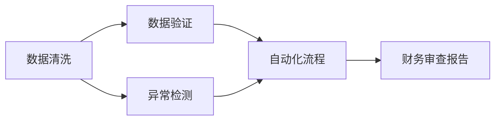

                 

# 程序员如何进行财务审查

程序员作为技术与财务的交叉职业，面临着将技术技能应用于财务审查的需求。本文将深入探讨如何利用编程技能在财务审查中发挥作用，从核心概念、算法原理、操作步骤，到实际应用场景和未来发展趋势，全面解析程序员进行财务审查的方法和技巧。

## 1. 背景介绍

### 1.1 问题由来

在信息化快速发展的今天，企业在财务管理中越来越依赖于信息化系统。然而，尽管系统可以自动化生成大量数据，但数据的准确性和可靠性仍然需要人工审核和审查。特别是在一些关键的财务数据上，任何细微的错误都可能导致重大的财务决策偏差。因此，程序员利用自身的技术优势，参与财务审查，成为提高财务数据质量的重要手段。

### 1.2 问题核心关键点

程序员进行财务审查的核心在于将编程技能应用于数据分析、自动化流程和数据验证等方面。具体而言，主要包括：
- 自动化数据清洗和整理
- 利用编程进行数据验证和异常检测
- 开发自动化审查工具和系统

### 1.3 问题研究意义

程序员参与财务审查，有助于提高财务数据的质量和可靠性，减少人为错误，提升企业决策的准确性。同时，自动化流程的引入，可以显著提高财务审查的效率，减轻人工审核的负担，优化企业运营。

## 2. 核心概念与联系

### 2.1 核心概念概述

为更好地理解程序员如何进行财务审查，我们需要了解几个关键概念：

- **数据清洗(Data Cleaning)**：指去除或修正数据中的错误、重复、异常值等，确保数据的质量和一致性。
- **数据验证(Data Verification)**：通过编程实现的数据校验过程，验证数据的准确性和完整性。
- **异常检测(Anomaly Detection)**：利用编程技术对数据进行深入分析，识别出与正常模式不符的异常数据，辅助进行财务审查。
- **自动化流程(Automation Process)**：将复杂的财务审查任务自动化，利用脚本和程序实现，提高效率和准确性。

这些概念之间的逻辑关系可以通过以下Mermaid流程图来展示：



这个流程图展示了程序员进行财务审查的主要步骤：首先进行数据清洗，然后通过数据验证和异常检测对数据进行审查，最后利用自动化流程生成审查报告。

## 3. 核心算法原理 & 具体操作步骤

### 3.1 算法原理概述

程序员进行财务审查的核心算法原理主要涉及数据处理和分析，包括以下几个关键环节：

- **数据清洗算法**：通过编程实现的数据清洗流程，包括去除重复记录、处理缺失值、修正错误数据等。
- **数据验证算法**：利用编程技术对数据进行校验，确保数据的准确性和一致性。
- **异常检测算法**：利用机器学习或统计方法对数据进行深度分析，识别出异常数据或异常模式。

### 3.2 算法步骤详解

程序员进行财务审查的主要步骤包括：

1. **数据收集与预处理**：从企业财务系统中收集所需的数据，并进行初步清洗和预处理。
2. **数据验证与校验**：通过编写脚本或程序，对数据进行详细校验，确保数据的准确性和一致性。
3. **异常检测与分析**：利用编程技术进行深入数据分析，识别出异常数据或异常模式，辅助财务审查。
4. **生成审查报告**：利用自动化流程，生成详细的财务审查报告，记录审查结果和建议。

### 3.3 算法优缺点

程序员进行财务审查的算法具有以下优点：
- **自动化程度高**：通过编程实现，可以大幅提高财务审查的效率。
- **准确性高**：利用算法进行数据校验和异常检测，减少人为错误。
- **可扩展性强**：算法可以轻松适应不同类型的数据和业务需求。

同时，该算法也存在以下局限性：
- **编程难度高**：需要具备较高的编程技能和数据处理能力。
- **数据依赖性强**：算法的有效性依赖于数据的质量和完整性。
- **维护成本高**：算法模型的维护和更新需要持续投入。

### 3.4 算法应用领域

程序员进行财务审查的算法在多个领域中都有广泛应用，包括：

- **审计与合规**：用于检查企业是否遵守相关法规和标准，确保财务报告的合规性。
- **风险管理**：识别出潜在的财务风险，辅助企业进行风险控制。
- **预算与预测**：通过对历史数据的分析和预测，辅助企业进行预算和成本控制。
- **资产管理**：用于审查企业的资产状况，确保资产管理的准确性和合规性。

## 4. 数学模型和公式 & 详细讲解 & 举例说明

### 4.1 数学模型构建

在进行财务审查时，程序员通常会使用多种数学模型和公式，包括但不限于：

- **回归分析**：用于建立财务指标之间的关系模型，预测未来的财务表现。
- **时间序列分析**：用于分析财务数据随时间的变化趋势，识别异常模式。
- **统计检验**：用于检验数据是否满足特定的统计分布，识别异常数据。

### 4.2 公式推导过程

以回归分析为例，考虑一个简单的线性回归模型：

$$
y = \beta_0 + \beta_1 x_1 + \beta_2 x_2 + \epsilon
$$

其中，$y$ 为因变量，$x_1, x_2$ 为自变量，$\beta_0, \beta_1, \beta_2$ 为模型参数，$\epsilon$ 为误差项。

通过最小二乘法求解模型参数，最小化误差项的平方和：

$$
\hat{\beta} = \mathop{\arg\min}_{\beta} \sum_{i=1}^n (y_i - \beta_0 - \beta_1 x_{1,i} - \beta_2 x_{2,i})^2
$$

求解得：

$$
\hat{\beta} = (X^T X)^{-1} X^T y
$$

其中 $X$ 为自变量矩阵，$y$ 为因变量向量。

### 4.3 案例分析与讲解

假设企业要审查销售部门的财务数据，可以使用时间序列分析模型进行销售额的趋势预测。以ARIMA模型为例，步骤如下：

1. **数据准备**：收集历史销售额数据，进行初步清洗和预处理。
2. **模型选择**：根据数据的特性，选择适合的ARIMA模型，如ARIMA(1,1,1)。
3. **参数估计**：利用历史数据，通过最小二乘法或最大似然估计方法求解模型参数。
4. **预测与验证**：利用训练好的模型进行未来销售额的预测，并与实际数据进行比较，验证预测的准确性。

## 5. 项目实践：代码实例和详细解释说明

### 5.1 开发环境搭建

在进行财务审查的编程实践前，我们需要准备好开发环境。以下是使用Python进行数据分析和建模的环境配置流程：

1. 安装Anaconda：从官网下载并安装Anaconda，用于创建独立的Python环境。

2. 创建并激活虚拟环境：
```bash
conda create -n finance-env python=3.8 
conda activate finance-env
```

3. 安装必要的Python库：
```bash
conda install pandas numpy scikit-learn statsmodels statsmodels.tsa arima_analysis
```

4. 安装Jupyter Notebook：
```bash
conda install jupyterlab
```

完成上述步骤后，即可在`finance-env`环境中开始编程实践。

### 5.2 源代码详细实现

这里我们以时间序列分析为例，使用Python进行销售额的趋势预测和财务审查。

```python
import pandas as pd
import numpy as np
import matplotlib.pyplot as plt
from statsmodels.tsa.arima_model import ARIMA

# 读取历史销售额数据
df = pd.read_csv('sales_data.csv')

# 数据预处理
df['date'] = pd.to_datetime(df['date'])
df.set_index('date', inplace=True)
df = df.resample('M').mean().dropna()

# 建立ARIMA模型
model = ARIMA(df['sales'], order=(1,1,1))
results = model.fit()

# 预测未来销售额
forecast = results.forecast(steps=12)

# 可视化预测结果
plt.plot(df['sales'], label='Actual Sales')
plt.plot(forecast, label='Predicted Sales')
plt.legend()
plt.show()
```

### 5.3 代码解读与分析

让我们再详细解读一下关键代码的实现细节：

**数据预处理**：
- 使用Pandas库对数据进行清洗和预处理，包括去除重复记录、处理缺失值、时间戳转换等。
- 使用resample方法进行月度聚合，确保数据的连续性和一致性。

**模型建立与预测**：
- 利用ARIMA模型进行趋势预测，模型参数通过最小二乘法求解。
- 使用forecast方法进行未来销售额的预测，生成预测结果。

**可视化分析**：
- 使用Matplotlib库将实际销售额和预测销售额进行可视化比较，直观展示预测效果。

以上代码实现了对历史销售额数据的趋势预测，并通过可视化方式展示了预测结果。在实际应用中，可以根据具体需求，对代码进行扩展和优化。

## 6. 实际应用场景

### 6.1 财务审计

程序员在财务审计中的应用场景主要包括：
- **合规性审查**：检查企业是否符合相关财务法规和标准，如GAAP、IFRS等。
- **风险识别**：利用编程技术分析财务数据，识别出潜在的财务风险，如坏账风险、现金流风险等。
- **内控审查**：利用自动化流程检查企业的内部控制是否到位，确保财务数据的可靠性。

### 6.2 预算管理

程序员在预算管理中的应用场景主要包括：
- **预算编制**：利用编程技术对历史财务数据进行分析和预测，辅助企业编制预算。
- **成本控制**：通过对历史数据的分析，识别出成本上升的趋势，提出改进建议。
- **绩效评估**：利用编程技术对预算执行情况进行评估，识别出超支或节约的部分，优化预算管理。

### 6.3 风险管理

程序员在风险管理中的应用场景主要包括：
- **信用风险评估**：利用编程技术分析客户的历史交易数据，评估其信用风险。
- **操作风险识别**：通过对企业内部数据的分析，识别出潜在的操作风险，如系统故障、人为错误等。
- **市场风险分析**：利用编程技术分析市场数据，评估企业的市场风险，提出应对策略。

### 6.4 未来应用展望

未来，随着人工智能和数据科学技术的不断发展，程序员在财务审查中的应用将更加广泛和深入。以下是一些未来应用展望：

- **大数据分析**：利用大数据技术对企业历史和实时数据进行深度分析，提升财务审查的精准性。
- **自然语言处理(NLP)**：利用NLP技术对企业财报和公告进行文本分析，提取关键信息，辅助财务审查。
- **机器学习**：利用机器学习技术进行异常检测和预测，提升财务审查的自动化水平。
- **区块链技术**：利用区块链技术进行财务数据的透明和可信记录，提高审查效率和准确性。

## 7. 工具和资源推荐

### 7.1 学习资源推荐

为帮助程序员掌握财务审查的编程技能，推荐以下学习资源：

1. **Python编程语言**：Python是财务审查中最常用的编程语言，具备简洁易学的特点，是程序员进行财务审查的基础。
2. **Pandas数据分析库**：Pandas是Python中最常用的数据分析库，提供了强大的数据处理和分析功能。
3. **Scikit-learn机器学习库**：Scikit-learn提供了多种机器学习算法和工具，适用于异常检测和预测建模。
4. **Statsmodels统计分析库**：Statsmodels提供了多种统计分析方法，适用于回归分析和时间序列分析。
5. **PyTorch深度学习框架**：PyTorch提供了强大的深度学习建模工具，适用于复杂的财务数据分析和预测。

通过学习这些资源，程序员可以系统掌握财务审查的编程技能，提高工作效率和准确性。

### 7.2 开发工具推荐

高效的开发离不开优秀的工具支持。以下是几款用于财务审查开发的常用工具：

1. **Jupyter Notebook**：Jupyter Notebook是一个交互式的编程环境，适用于编写和执行Python代码，并生成可视化报告。
2. **PyCharm IDE**：PyCharm是一个功能强大的Python集成开发环境，支持代码编写、调试、测试等全流程开发。
3. **Git版本控制**：Git是程序员常用的版本控制工具，适用于团队协作和代码管理。
4. **Anaconda环境管理**：Anaconda提供了环境隔离和管理功能，适用于多个项目和库的独立开发。
5. **GitHub代码托管**：GitHub是一个开源代码托管平台，适用于代码共享、协作和版本管理。

合理利用这些工具，可以显著提升财务审查的开发效率，加快创新迭代的步伐。

### 7.3 相关论文推荐

程序员进行财务审查的技术研究来源于学界的持续探索。以下是几篇奠基性的相关论文，推荐阅读：

1. **《Python for Data Analysis》**：Wes McKinney著，介绍了使用Python进行数据分析的详细方法和技巧。
2. **《Hands-On Data Analysis with Pandas》**：Rebecca Bilbro和Edward Iglesias著，详细介绍了使用Pandas进行数据清洗和分析的方法。
3. **《Practical Machine Learning for Finance》**：Benoit Mandelbrot著，介绍了在金融领域应用机器学习的实际案例和方法。
4. **《Financial Engineering and Risk Management》**：Richard L. G.Warren和Joel F.Needleman著，介绍了金融工程和风险管理的理论和方法。
5. **《Blockchain Basics: A Non-Technical Introduction》**：Zane T. Pace和Fred Tatasciore著，介绍了区块链技术的原理和应用。

这些论文代表了大数据和人工智能在财务审查中的最新发展，通过学习这些前沿成果，程序员可以更好地掌握财务审查的技术方法。

## 8. 总结：未来发展趋势与挑战

### 8.1 总结

本文对程序员进行财务审查的方法和技巧进行了全面系统的介绍。首先阐述了财务审查的背景和意义，明确了程序员在财务审查中的作用和任务。其次，从原理到实践，详细讲解了数据清洗、数据验证、异常检测和自动化流程等关键步骤，给出了代码实例。同时，本文还探讨了财务审查在审计、预算、风险管理等多个领域的应用，展示了程序员参与财务审查的广阔前景。

通过本文的系统梳理，可以看到，程序员利用编程技能在财务审查中发挥了重要作用，显著提升了财务数据的质量和可靠性。未来，随着大数据、人工智能和区块链等技术的不断发展，程序员在财务审查中的应用将更加广泛和深入。

### 8.2 未来发展趋势

未来，程序员进行财务审查将呈现以下几个发展趋势：

1. **数据驱动**：大数据和人工智能技术的应用将使财务审查更加数据驱动，基于历史和实时数据的深度分析，提升审查的准确性和效率。
2. **自动化**：自动化流程和自动化审查工具的引入，将显著提高财务审查的效率，减轻人工审核的负担。
3. **实时性**：利用大数据和区块链技术，实现财务数据的实时监测和审查，确保数据的及时性和准确性。
4. **智能化**：结合人工智能和自然语言处理技术，实现财务信息的智能化分析和处理，提升审查的智能化水平。
5. **可视化**：利用数据可视化工具，将财务数据和审查结果直观展示，辅助决策和管理。

### 8.3 面临的挑战

尽管程序员在财务审查中的应用前景广阔，但在实际应用中仍面临一些挑战：

1. **数据质量问题**：财务数据的质量和完整性直接影响审查的准确性，如何保证数据的可靠性和一致性，是一个重要问题。
2. **技术复杂度**：大数据、人工智能等技术的应用需要较高的技术水平和经验，程序员需要持续学习，提升自身技能。
3. **隐私和安全性**：财务数据涉及企业机密，如何保护数据隐私和安全，防止数据泄露，是程序员面临的重大挑战。
4. **模型解释性**：机器学习模型往往缺乏可解释性，程序员需要具备足够的领域知识和经验，对模型的输出进行合理解释和调整。
5. **多系统集成**：企业财务系统通常涉及多个系统和平台，程序员需要具备良好的系统集成能力，确保数据的有效对接和共享。

### 8.4 研究展望

未来，程序员在财务审查中的研究需要在以下几个方面寻求新的突破：

1. **数据质量提升**：探索数据清洗和预处理的自动化方法，提高数据的质量和一致性。
2. **模型优化**：结合机器学习和深度学习技术，优化异常检测和预测模型，提高审查的精准性。
3. **隐私保护**：探索数据加密和匿名化技术，保护财务数据的隐私和安全。
4. **跨平台集成**：开发跨平台的数据管理和审查工具，支持多种系统和平台的对接和集成。
5. **可视化工具**：开发易用的可视化工具，将审查结果直观展示，辅助决策和管理。

这些研究方向的探索，将推动程序员在财务审查中的应用不断深入，为企业的财务管理和风险控制提供更强有力的技术支撑。

## 9. 附录：常见问题与解答

**Q1：财务审查的编程难度如何？**

A: 财务审查的编程难度因任务不同而异。简单的数据清洗和处理任务相对容易，但复杂的异常检测和预测任务则需要较高的编程技能和领域知识。建议程序员在系统学习Python和相关库的基础上，逐步掌握财务审查的编程方法。

**Q2：如何提高财务审查的准确性？**

A: 提高财务审查的准确性需要从数据质量、模型选择和算法优化等多个方面入手。首先，确保数据的准确性和完整性，进行细致的数据清洗和预处理。其次，选择适合的机器学习或统计模型，进行参数优化和模型训练。最后，进行模型的验证和评估，识别和修正模型中的错误和偏差。

**Q3：财务审查中常见的问题有哪些？**

A: 财务审查中常见的问题包括：
1. 数据质量问题：如数据缺失、重复、错误等。
2. 异常数据识别：如异常交易、异常收入等。
3. 模型解释性：如模型输出的可解释性不足，难以理解其工作机制。
4. 多系统集成：如不同系统和平台的数据对接和共享问题。

**Q4：如何应对财务审查中的技术挑战？**

A: 应对财务审查中的技术挑战需要多方面的努力：
1. 持续学习：不断提升自身的编程技能和领域知识，适应技术的发展变化。
2. 数据清洗：利用数据清洗和预处理技术，确保数据的可靠性和一致性。
3. 模型优化：优化异常检测和预测模型，提高审查的精准性。
4. 隐私保护：探索数据加密和匿名化技术，保护数据隐私和安全。
5. 多系统集成：开发跨平台的数据管理和审查工具，支持多种系统和平台的对接和集成。

通过系统学习和实践，程序员可以克服财务审查中的技术挑战，提高审查的准确性和效率。

---

作者：禅与计算机程序设计艺术 / Zen and the Art of Computer Programming

