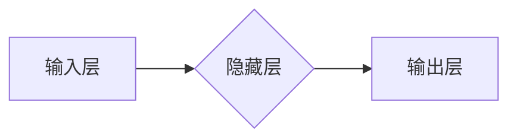

> 神经网络,深度学习,机器学习,人工智能,卷积神经网络,循环神经网络,自然语言处理,计算机视觉

## 1. 背景介绍

人工智能（AI）正以惊人的速度发展，深刻地改变着我们生活的方方面面。其中，神经网络作为人工智能的核心技术之一，在过去几年取得了突破性的进展，并在图像识别、自然语言处理、语音识别等领域展现出强大的应用潜力。

从感知机到深度学习，神经网络的发展历程充满了挑战和机遇。早期神经网络受限于计算能力和数据量，难以实现复杂任务。随着硬件技术的进步和海量数据的积累，深度学习时代到来，神经网络的规模和复杂度大幅提升，取得了令人瞩目的成就。

## 2. 核心概念与联系

### 2.1 神经网络的结构

神经网络的结构灵感来源于人脑的神经元网络。它由 interconnected nodes（节点）组成，这些节点被组织成多个层级，包括输入层、隐藏层和输出层。

* **输入层:**接收原始数据，例如图像像素、文本字符等。
* **隐藏层:**对输入数据进行处理和转换，提取特征和模式。
* **输出层:**输出最终结果，例如分类标签、预测值等。

每个节点都连接着其他节点，并赋予每个连接权重。权重决定了节点之间信息传递的强度。

**Mermaid 流程图:**



### 2.2 激活函数

激活函数是神经网络中一个重要的组成部分，它决定了神经元对输入信号的响应。常见的激活函数包括 sigmoid 函数、ReLU 函数、tanh 函数等。

激活函数的作用是引入非线性，使神经网络能够学习复杂的数据模式。

### 2.3 损失函数

损失函数用于衡量神经网络预测结果与真实值的差异。常见的损失函数包括均方误差（MSE）、交叉熵损失等。

神经网络的训练过程就是通过不断调整权重，最小化损失函数的过程。

## 3. 核心算法原理 & 具体操作步骤

### 3.1 算法原理概述

深度学习的核心算法是反向传播算法（Backpropagation）。反向传播算法通过计算损失函数对每个权重的梯度，并利用梯度下降法更新权重，从而逐步优化神经网络的性能。

### 3.2 算法步骤详解

1. **前向传播:** 将输入数据通过神经网络传递，计算输出结果。
2. **损失函数计算:** 计算输出结果与真实值的差异，得到损失值。
3. **反向传播:** 计算损失函数对每个权重的梯度。
4. **权重更新:** 利用梯度下降法更新每个权重，减小损失值。
5. **重复步骤1-4:** 迭代训练，直到损失值达到预设阈值或训练次数达到上限。

### 3.3 算法优缺点

**优点:**

* 能够学习复杂的数据模式。
* 性能优于传统机器学习算法。
* 可应用于多种领域。

**缺点:**

* 训练时间长，需要大量数据和计算资源。
* 容易陷入局部最优解。
* 模型解释性差，难以理解模型的决策过程。

### 3.4 算法应用领域

* **图像识别:** 人脸识别、物体检测、图像分类等。
* **自然语言处理:** 文本分类、机器翻译、情感分析等。
* **语音识别:** 语音转文本、语音助手等。
* **推荐系统:** 商品推荐、内容推荐等。
* **医疗诊断:** 病情预测、疾病诊断等。

## 4. 数学模型和公式 & 详细讲解 & 举例说明

### 4.1 数学模型构建

神经网络的数学模型可以表示为一个多层感知机（MLP）。

**输入:** $x = (x_1, x_2, ..., x_n)$

**隐藏层:** $h = f(W_1x + b_1)$

**输出层:** $y = f(W_2h + b_2)$

其中:

* $x$ 是输入向量。
* $h$ 是隐藏层激活值。
* $y$ 是输出向量。
* $W_1$ 和 $W_2$ 是权重矩阵。
* $b_1$ 和 $b_2$ 是偏置向量。
* $f$ 是激活函数。

### 4.2 公式推导过程

损失函数通常采用均方误差（MSE）：

$$L = \frac{1}{2} \sum_{i=1}^{m} (y_i - \hat{y}_i)^2$$

其中:

* $y_i$ 是真实值。
* $\hat{y}_i$ 是预测值。
* $m$ 是样本数量。

利用梯度下降法，更新权重:

$$W = W - \alpha \frac{\partial L}{\partial W}$$

其中:

* $\alpha$ 是学习率。

### 4.3 案例分析与讲解

假设我们训练一个简单的线性回归模型，预测房价。输入特征包括房屋面积和房间数量，输出是房价。

我们可以使用 MSE 作为损失函数，并利用反向传播算法训练模型。通过不断调整权重，模型最终能够学习到房屋面积和房间数量与房价之间的关系。

## 5. 项目实践：代码实例和详细解释说明

### 5.1 开发环境搭建

* Python 3.x
* TensorFlow 或 PyTorch 等深度学习框架
* Jupyter Notebook 或 VS Code 等代码编辑器

### 5.2 源代码详细实现

```python
import tensorflow as tf

# 定义模型
model = tf.keras.models.Sequential([
    tf.keras.layers.Dense(64, activation='relu', input_shape=(2,)),
    tf.keras.layers.Dense(1)
])

# 编译模型
model.compile(optimizer='adam', loss='mse')

# 训练模型
model.fit(x_train, y_train, epochs=10)

# 评估模型
loss = model.evaluate(x_test, y_test)
```

### 5.3 代码解读与分析

* 我们使用 TensorFlow 框架构建了一个简单的线性回归模型。
* 模型包含两层全连接神经元，第一层有 64 个神经元，激活函数为 ReLU，输入形状为 (2,)，表示输入有两个特征。
* 第二层只有一个神经元，输出房价。
* 我们使用 Adam 优化器和均方误差损失函数训练模型。
* 训练过程迭代 10 次，每次迭代使用训练数据进行训练。
* 最后，我们使用测试数据评估模型的性能。

### 5.4 运行结果展示

训练完成后，我们可以查看模型的损失值，以及在测试数据上的预测结果。

## 6. 实际应用场景

### 6.1 图像识别

* **人脸识别:** 用于解锁手机、身份验证等。
* **物体检测:** 用于自动驾驶、安防监控等。
* **图像分类:** 用于医学影像诊断、产品分类等。

### 6.2 自然语言处理

* **机器翻译:** 将文本从一种语言翻译成另一种语言。
* **文本摘要:** 自动生成文本的简短摘要。
* **情感分析:** 分析文本的情感倾向，例如正面、负面、中性。

### 6.3 语音识别

* **语音转文本:** 将语音转换为文本。
* **语音助手:** 例如 Siri、Alexa 等。
* **语音搜索:** 通过语音进行搜索。

### 6.4 未来应用展望

* **个性化推荐:** 基于用户的行为和偏好，提供个性化的产品和服务推荐。
* **自动写作:** 自动生成新闻报道、小说等文本。
* **医疗诊断辅助:** 辅助医生进行疾病诊断和治疗方案制定。

## 7. 工具和资源推荐

### 7.1 学习资源推荐

* **书籍:**
    * 深度学习 (Deep Learning) - Ian Goodfellow, Yoshua Bengio, Aaron Courville
    * 神经网络与深度学习 (Neural Networks and Deep Learning) - Michael Nielsen
* **在线课程:**
    * Coursera: 深度学习 Specialization
    * Udacity: Deep Learning Nanodegree
    * fast.ai: Practical Deep Learning for Coders

### 7.2 开发工具推荐

* **TensorFlow:** Google 开发的开源深度学习框架。
* **PyTorch:** Facebook 开发的开源深度学习框架。
* **Keras:** TensorFlow 上的深度学习 API，易于使用。

### 7.3 相关论文推荐

* **ImageNet Classification with Deep Convolutional Neural Networks** - Alex Krizhevsky, Ilya Sutskever, Geoffrey E. Hinton
* **Sequence to Sequence Learning with Neural Networks** - Ilya Sutskever, Oriol Vinyals, Quoc V. Le
* **Attention Is All You Need** - Ashish Vaswani, Noam Shazeer, Niki Parmar, Jakob Uszkoreit, Llion Jones, Aidan N. Gomez, Łukasz Kaiser, Illia Polosukhin

## 8. 总结：未来发展趋势与挑战

### 8.1 研究成果总结

神经网络技术取得了令人瞩目的进展，在图像识别、自然语言处理、语音识别等领域取得了突破性成果。

### 8.2 未来发展趋势

* **模型规模和复杂度进一步提升:** 训练更大规模、更复杂的神经网络模型。
* **模型解释性和可解释性增强:** 研究更易于理解和解释的神经网络模型。
* **边缘计算和部署:** 将神经网络模型部署到边缘设备，实现更低延迟和更高效率的应用。
* **跨模态学习:** 研究能够处理多种模态数据（例如文本、图像、音频）的神经网络模型。

### 8.3 面临的挑战

* **数据获取和标注:** 训练高质量的神经网络模型需要大量数据和标注。
* **计算资源:** 训练大型神经网络模型需要大量的计算资源。
* **模型安全性:** 神经网络模型容易受到攻击，需要研究更安全的模型架构和训练方法。

### 8.4 研究展望

未来，神经网络技术将继续发展，在更多领域发挥重要作用。我们需要不断探索新的算法、模型和应用场景，推动神经网络技术向更智能、更安全、更普惠的方向发展。

## 9. 附录：常见问题与解答

* **什么是激活函数？**

激活函数是神经网络中一个重要的组成部分，它决定了神经元对输入信号的响应。常见的激活函数包括 sigmoid 函数、ReLU 函数、tanh 函数等。

* **什么是反向传播算法？**

反向传播算法是深度学习的核心算法，它通过计算损失函数对每个权重的梯度，并利用梯度下降法更新权重，从而逐步优化神经网络的性能。

* **如何选择合适的激活函数？**

不同的激活函数适用于不同的任务和模型架构。例如，ReLU 函数通常用于隐藏层，而 sigmoid 函数常用于输出层。

* **如何评估神经网络模型的性能？**

常用的评估指标包括准确率、召回率、F1 值等。

* **如何防止神经网络模型过拟合？**

过拟合是指模型在训练数据上表现很好，但在测试数据上表现较差。常用的防止过拟合的方法包括正则化、数据增强、Dropout 等。


作者：禅与计算机程序设计艺术 / Zen and the Art of Computer Programming 
<end_of_turn>