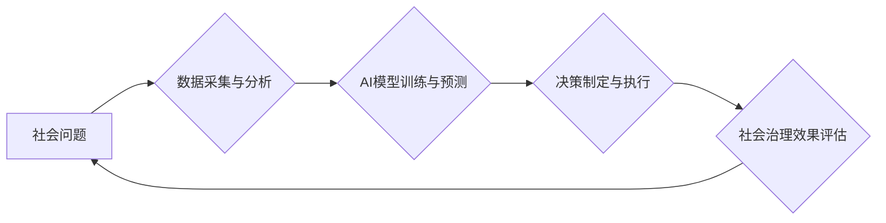

>人工智能、社会治理、科技创新、算法、数据驱动、可持续发展

## 1. 背景介绍

当今世界，科技创新正以惊人的速度发展，人工智能（AI）作为科技创新的重要驱动力，正在深刻地改变着人类社会生活的方方面面。从医疗保健、教育、金融到交通、能源，AI技术的应用正在推动着各行各业的数字化转型和智能升级。

然而，科技创新的发展也面临着新的挑战。一方面，AI技术的快速发展带来了伦理、安全、隐私等一系列问题，需要我们认真思考和解决。另一方面，科技创新需要与社会治理相结合，才能更好地服务于人类社会，促进可持续发展。

## 2. 核心概念与联系

**2.1 社会治理**

社会治理是指社会成员共同参与，通过制度安排、规则规范、社会力量协调等方式，解决社会问题、维护社会秩序、促进社会发展的一种过程。

**2.2 科技创新**

科技创新是指利用科学知识和技术手段，创造出新的产品、服务、工艺和模式，从而推动社会进步的一种活动。

**2.3 AI技术与社会治理的融合**

AI技术可以为社会治理提供新的思路和方法，帮助我们更有效地解决社会问题。例如：

* **数据分析与决策支持:** AI算法可以对海量社会数据进行分析，识别社会问题和趋势，为政府决策提供科学依据。
* **智能监管与执法:** AI技术可以辅助监管部门进行智能监管，提高监管效率，减少人为错误。
* **公共服务优化:** AI技术可以用于优化公共服务，例如智能客服、精准医疗、个性化教育等，提高服务质量和效率。

**2.4 融合架构**



## 3. 核心算法原理 & 具体操作步骤

**3.1 算法原理概述**

深度学习算法是AI技术的重要组成部分，其核心原理是通过多层神经网络模拟人类大脑的学习过程，从数据中学习特征和规律。

**3.2 算法步骤详解**

1. **数据预处理:** 收集和清洗数据，将其转换为深度学习模型可以理解的格式。
2. **网络结构设计:** 根据具体任务选择合适的网络结构，例如卷积神经网络（CNN）、循环神经网络（RNN）等。
3. **模型训练:** 使用训练数据训练深度学习模型，调整模型参数，使其能够准确地预测或分类数据。
4. **模型评估:** 使用测试数据评估模型的性能，例如准确率、召回率、F1-score等。
5. **模型部署:** 将训练好的模型部署到实际应用场景中，用于预测或分类新的数据。

**3.3 算法优缺点**

**优点:**

* 能够学习复杂的数据特征，具有较高的准确率。
* 可以处理海量数据，具有良好的扩展性。

**缺点:**

* 需要大量的训练数据，训练时间较长。
* 模型解释性较差，难以理解模型的决策过程。

**3.4 算法应用领域**

* **图像识别:** 人脸识别、物体检测、图像分类等。
* **自然语言处理:** 文本分类、机器翻译、情感分析等。
* **语音识别:** 语音转文本、语音助手等。
* **预测分析:** 销售预测、风险评估、医疗诊断等。

## 4. 数学模型和公式 & 详细讲解 & 举例说明

**4.1 数学模型构建**

深度学习模型可以看作是一个复杂的数学模型，其核心是神经网络。神经网络由多个层组成，每一层包含多个神经元。神经元之间通过连接权重进行信息传递。

**4.2 公式推导过程**

深度学习模型的训练过程是通过优化连接权重来实现的。常用的优化算法包括梯度下降法、动量法、Adam算法等。这些算法都基于梯度下降的原理，通过计算误差梯度来更新连接权重，最终使模型的预测结果尽可能接近真实值。

**4.3 案例分析与讲解**

例如，在图像分类任务中，深度学习模型会将图像输入到神经网络中，经过多层神经元的处理，最终输出一个类别概率分布。

假设模型预测图像属于类别A的概率为0.8，类别B的概率为0.2。如果设定阈值为0.5，则模型将图像分类为类别A。

**4.4 数学公式**

* **激活函数:** sigmoid函数、ReLU函数等
* **损失函数:** 交叉熵损失函数、均方误差损失函数等
* **梯度下降算法:**

$$
\theta = \theta - \alpha \nabla J(\theta)
$$

其中：

* $\theta$ 是连接权重
* $\alpha$ 是学习率
* $\nabla J(\theta)$ 是损失函数的梯度

## 5. 项目实践：代码实例和详细解释说明

**5.1 开发环境搭建**

使用Python语言开发深度学习模型，需要安装相关的库和工具，例如TensorFlow、PyTorch、NumPy等。

**5.2 源代码详细实现**

```python
import tensorflow as tf

# 定义模型结构
model = tf.keras.models.Sequential([
    tf.keras.layers.Conv2D(32, (3, 3), activation='relu', input_shape=(28, 28, 1)),
    tf.keras.layers.MaxPooling2D((2, 2)),
    tf.keras.layers.Conv2D(64, (3, 3), activation='relu'),
    tf.keras.layers.MaxPooling2D((2, 2)),
    tf.keras.layers.Flatten(),
    tf.keras.layers.Dense(10, activation='softmax')
])

# 编译模型
model.compile(optimizer='adam',
              loss='sparse_categorical_crossentropy',
              metrics=['accuracy'])

# 训练模型
model.fit(x_train, y_train, epochs=5)

# 评估模型
loss, accuracy = model.evaluate(x_test, y_test)
print('Test loss:', loss)
print('Test accuracy:', accuracy)
```

**5.3 代码解读与分析**

这段代码定义了一个简单的卷积神经网络模型，用于手写数字识别任务。

* `tf.keras.models.Sequential` 创建了一个顺序模型，神经层按顺序连接。
* `tf.keras.layers.Conv2D` 定义了一个卷积层，用于提取图像特征。
* `tf.keras.layers.MaxPooling2D` 定义了一个最大池化层，用于降低特征图的维度。
* `tf.keras.layers.Flatten` 将多维特征图转换为一维向量。
* `tf.keras.layers.Dense` 定义了一个全连接层，用于分类。
* `model.compile` 编译模型，指定优化器、损失函数和评价指标。
* `model.fit` 训练模型，使用训练数据进行训练。
* `model.evaluate` 评估模型，使用测试数据评估模型的性能。

**5.4 运行结果展示**

训练完成后，模型可以用于预测新的手写数字图像的类别。

## 6. 实际应用场景

**6.1 智能交通管理**

AI技术可以用于智能交通管理，例如：

* **交通流量预测:** 利用历史交通数据和实时路况信息，预测未来交通流量，优化交通信号灯控制。
* **车辆识别与跟踪:** 利用摄像头识别车辆，跟踪车辆行驶轨迹，辅助交通执法。
* **自动驾驶:** 利用传感器数据和AI算法，实现车辆自动驾驶。

**6.2 智能医疗诊断**

AI技术可以用于智能医疗诊断，例如：

* **图像分析:** 利用AI算法分析医学影像，辅助医生诊断疾病。
* **疾病预测:** 利用患者的医疗历史和基因信息，预测患者患病风险。
* **个性化治疗:** 根据患者的个体特征，制定个性化的治疗方案。

**6.3 智能城市管理**

AI技术可以用于智能城市管理，例如：

* **环境监测:** 利用传感器数据监测空气质量、水质等环境指标，及时预警环境问题。
* **公共安全:** 利用视频监控和AI算法，识别犯罪嫌疑人，提高公共安全水平。
* **资源管理:** 利用AI算法优化城市资源分配，提高资源利用效率。

**6.4 未来应用展望**

随着AI技术的不断发展，其应用场景将更加广泛，例如：

* **教育:** 个性化学习、智能辅导等。
* **金融:** 风险评估、欺诈检测等。
* **娱乐:** 个性化推荐、虚拟现实等。

## 7. 工具和资源推荐

**7.1 学习资源推荐**

* **在线课程:** Coursera、edX、Udacity等平台提供丰富的AI课程。
* **书籍:** 《深度学习》、《机器学习实战》等书籍。
* **开源项目:** TensorFlow、PyTorch等开源项目。

**7.2 开发工具推荐**

* **Python:** AI开发的主要编程语言。
* **TensorFlow:** 深度学习框架。
* **PyTorch:** 深度学习框架。
* **Jupyter Notebook:** 用于代码编写和可视化分析的工具。

**7.3 相关论文推荐**

* **《ImageNet Classification with Deep Convolutional Neural Networks》**
* **《Attention Is All You Need》**
* **《BERT: Pre-training of Deep Bidirectional Transformers for Language Understanding》**

## 8. 总结：未来发展趋势与挑战

**8.1 研究成果总结**

近年来，AI技术取得了长足的进步，在图像识别、自然语言处理、语音识别等领域取得了突破性进展。

**8.2 未来发展趋势**

* **模型规模和能力的提升:** 模型参数规模将继续扩大，模型能力将进一步提升。
* **算法的创新:** 新的AI算法将不断涌现，例如强化学习、联邦学习等。
* **跨模态学习:** AI模型将能够处理多种模态数据，例如文本、图像、音频等。

**8.3 面临的挑战**

* **数据安全和隐私保护:** AI模型训练需要大量数据，如何保证数据安全和隐私保护是一个重要挑战。
* **算法可解释性和公平性:** AI模型的决策过程难以理解，如何提高算法的可解释性和公平性是一个重要问题。
* **伦理和社会影响:** AI技术的应用可能带来伦理和社会问题，需要我们认真思考和解决。

**8.4 研究展望**

未来，AI技术将继续发展，为人类社会带来更多福祉。我们需要加强AI基础研究，探索更安全、更可靠、更可解释的AI算法。同时，我们需要加强AI伦理和社会治理研究，确保AI技术的发展造福人类。

## 9. 附录：常见问题与解答

**9.1 如何选择合适的AI算法？**

选择合适的AI算法需要根据具体任务和数据特点进行选择。例如，对于图像识别任务，可以使用卷积神经网络；对于文本分类任务，可以使用循环神经网络或Transformer网络。

**9.2 如何解决AI模型过拟合问题？**

过拟合是指AI模型在训练数据上表现很好，但在测试数据上表现较差。

解决过拟合问题的方法包括：

* 增加训练数据量。
* 使用正则化技术，例如L1正则化、L2正则化。
* 使用Dropout技术，随机丢弃神经元。
* 使用交叉验证技术，评估模型在不同数据集上的性能。

**9.3 如何评估AI模型的性能？**

常用的AI模型性能评价指标包括：

* **准确率:** 正确预测的样本数占总样本数的比例。
* **召回率:** 真阳性样本数占所有阳性样本数的比例。
* **F1-score:** 准确率和召回率的调和平均值。
* **AUC:** 曲线下面积，用于评估模型的二分类能力。


作者：禅与计算机程序设计艺术 / Zen and the Art of Computer Programming 
<end_of_turn>