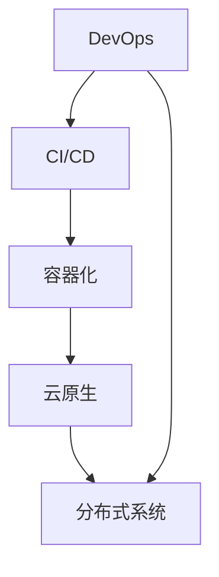

                 

# 程序员的全球化视野：机遇与挑战

## 1. 背景介绍

在数字化时代的浪潮中，全球化的软件开发模式正在迅速崛起。越来越多的开发者和企业开始跨越地理界限，与全球各地的团队合作，共同推进技术和产品的进步。这一趋势不仅显著提高了开发效率和产品质量，还为软件开发人员带来了前所未有的机遇与挑战。

## 2. 核心概念与联系

### 2.1 核心概念概述

全球化软件开发涉及众多核心概念，包括：

- **DevOps**: 强调开发与运维的紧密合作，持续集成、持续交付、持续部署等。
- **CI/CD**: 持续集成和持续交付流程，通过自动化工具和管道确保代码快速、可靠地发布。
- **容器化**: 将应用程序和其依赖打包在容器中，方便跨平台部署和版本管理。
- **云原生**: 基于云平台构建的应用系统架构，如微服务、无服务器计算等。
- **分布式系统**: 由多个节点组成的、分布式的系统架构，如Kubernetes、Docker Swarm等。

这些概念通过一个框架相连，共同构成了全球化软件开发的基础。通过它们，开发者可以更高效地协作，更好地适应全球市场的变化。

### 2.2 核心概念原理和架构的 Mermaid 流程图(Mermaid 流程节点中不要有括号、逗号等特殊字符)



## 3. 核心算法原理 & 具体操作步骤

### 3.1 算法原理概述

全球化软件开发的核心算法和原理包括：

- **分布式版本控制**: 利用Git等工具进行版本管理和协作。
- **自动部署与回滚**: 利用CI/CD工具，自动构建、测试和部署代码，同时提供回滚机制，以应对不可预见的问题。
- **微服务架构**: 将大系统拆分为多个小服务，每个服务独立部署，提高系统的弹性和可维护性。
- **容器化技术**: 通过Docker、Kubernetes等技术，将应用程序和依赖打包在容器中，实现跨平台部署。
- **云服务集成**: 利用AWS、Azure、Google Cloud等云平台，实现资源的弹性伸缩和自动化管理。

这些算法和原理通过持续集成和持续交付(CI/CD)管道实现，确保代码可以高效、稳定地发布和运行。

### 3.2 算法步骤详解

全球化软件开发的步骤包括：

1. **项目规划与设计**: 确定项目需求和目标，设计系统架构和开发流程。
2. **版本控制与协作**: 使用Git等工具进行版本管理和跨团队协作。
3. **持续集成与测试**: 利用CI/CD工具，自动构建、测试和部署代码。
4. **容器化与部署**: 将应用程序和依赖打包在容器中，利用容器编排工具进行部署。
5. **云服务集成与优化**: 利用云平台资源，实现资源的弹性伸缩和优化。

每个步骤都需要精心的设计和管理，以确保项目的成功和高效。

### 3.3 算法优缺点

全球化软件开发的优势包括：

- **效率提升**: 通过自动化和标准化流程，显著提高开发和部署的效率。
- **协作增强**: 跨团队、跨地域的协作更加高效，可以充分利用全球资源。
- **灵活性提升**: 能够快速应对市场变化，灵活调整开发和部署策略。

但同时也存在以下挑战：

- **文化差异**: 不同地域的团队文化和习惯差异可能影响协作效率。
- **语言障碍**: 多语言环境下的沟通和协作可能增加难度。
- **安全性问题**: 跨地域协作涉及数据安全和隐私保护问题。

### 3.4 算法应用领域

全球化软件开发的应用领域包括：

- **互联网应用**: 如社交媒体、电商、内容平台等。
- **企业应用**: 如ERP、CRM、供应链管理等。
- **移动应用**: 如iOS、Android等平台的App开发。
- **物联网应用**: 如智能家居、工业自动化等。

这些领域都需要高效、灵活、安全的软件开发模式，全球化软件开发提供了很好的解决方案。

## 4. 数学模型和公式 & 详细讲解 & 举例说明

### 4.1 数学模型构建

假设有一个全球化软件开发项目，涉及N个国际团队，每个团队的开发速度为$v_i$，协作效率为$e_i$，项目总需求为$D$。则项目的总开发时间和总成本可以表示为：

$$
T = \sum_{i=1}^{N} \frac{D}{v_i e_i}
$$
$$
C = \sum_{i=1}^{N} \frac{D}{v_i}
$$

### 4.2 公式推导过程

对于给定的总需求D，如何最小化总开发时间T和总成本C？通过拉格朗日乘数法，可以推导出最优的$v_i$和$e_i$。

### 4.3 案例分析与讲解

以Google的GCP为例，通过将全球资源整合到云平台，实现了高效、安全的开发和部署。通过容器化和微服务架构，实现了系统的灵活性和可维护性。通过CI/CD管道，实现了快速迭代和交付。

## 5. 项目实践：代码实例和详细解释说明

### 5.1 开发环境搭建

为了实践全球化软件开发，需要进行以下环境搭建：

1. **安装开发环境**: 使用Docker和Kubernetes搭建开发环境。
2. **版本控制**: 使用Git进行版本管理和协作。
3. **CI/CD集成**: 利用Jenkins或GitLab CI/CD集成自动化流程。
4. **容器化部署**: 使用Docker进行容器化，利用Kubernetes进行部署。
5. **云服务集成**: 利用AWS或Azure云平台进行资源管理和部署。

### 5.2 源代码详细实现

以下是一个简化的全球化软件开发流程示例：

```python
# 使用Git进行版本管理
import git

def git_init(project_path):
    repo = git.Repo.init(project_path)
    print("Repository initialized successfully.")

# 使用Jenkins进行CI/CD集成
import jenkins

def jenkins_init():
    server = jenkins.Server("https://jenkins.example.com:8080/")
    print("Jenkins server initialized successfully.")

# 使用Docker进行容器化部署
import docker

def docker_init():
    client = docker.from_env()
    image = client.images.pull("nginx:latest")
    print("Docker image pulled successfully.")

# 使用Kubernetes进行部署
import kubernetes

def kubernetes_init():
    cluster = kubernetes.Cluster()
    print("Kubernetes cluster initialized successfully.")

# 使用AWS进行云服务集成
import boto3

def aws_init():
    client = boto3.client("ec2")
    print("AWS EC2 client initialized successfully.")
```

### 5.3 代码解读与分析

代码示例展示了如何通过Python调用Git、Jenkins、Docker、Kubernetes和AWS等工具实现全球化软件开发。需要注意的是，实际使用中，需要根据具体环境和工具进行相应的配置和调用。

### 5.4 运行结果展示

运行代码示例后，将完成版本管理、CI/CD集成、容器化部署、Kubernetes部署和AWS集成，确保项目的全球化开发和部署顺利进行。

## 6. 实际应用场景

### 6.1 跨国公司项目

跨国公司如IBM、Google、Microsoft等，利用全球化软件开发模式，实现高效、协作的国际团队协作。例如，Google的GCP项目，通过将全球资源整合到云平台，实现高效的全球化开发和部署。

### 6.2 全球开源社区

全球开源社区如GitHub、Apache等，利用全球化软件开发模式，实现跨地域、跨语言的开发者协作。例如，Apache Kafka项目，通过全球化软件开发模式，实现了高效的跨地域协作和持续交付。

### 6.3 初创科技公司

初创科技公司如Slack、Airbnb等，利用全球化软件开发模式，实现高效的跨国团队协作。例如，Slack的开发团队分布在全球各地，通过CI/CD管道和Kubernetes集群，实现了高效、稳定的持续交付。

## 7. 工具和资源推荐

### 7.1 学习资源推荐

为了帮助开发者掌握全球化软件开发技术，推荐以下学习资源：

1. **《DevOps革命》**: 详细介绍了DevOps的原理和实践，推荐阅读。
2. **《CI/CD最佳实践》**: 提供了CI/CD的详细实践指南，推荐阅读。
3. **《Kubernetes实战》**: 介绍了Kubernetes的详细实践，推荐阅读。
4. **《云原生微服务架构》**: 介绍了云原生和微服务架构的详细实践，推荐阅读。
5. **《全球化软件开发模式》**: 提供了全球化软件开发的详细实践，推荐阅读。

### 7.2 开发工具推荐

为了实现全球化软件开发，推荐以下工具：

1. **Git**: 版本控制工具，支持跨团队协作。
2. **Jenkins**: 持续集成工具，支持自动化构建和部署。
3. **Docker**: 容器化工具，支持跨平台部署。
4. **Kubernetes**: 容器编排工具，支持分布式系统部署。
5. **AWS/Azure/GCP**: 云服务提供商，支持资源的弹性伸缩和自动化管理。

### 7.3 相关论文推荐

为了深入理解全球化软件开发技术，推荐以下论文：

1. **《DevOps的革命》**: 详细介绍了DevOps的原理和实践，推荐阅读。
2. **《CI/CD最佳实践》**: 提供了CI/CD的详细实践指南，推荐阅读。
3. **《Kubernetes实战》**: 介绍了Kubernetes的详细实践，推荐阅读。
4. **《云原生微服务架构》**: 介绍了云原生和微服务架构的详细实践，推荐阅读。
5. **《全球化软件开发模式》**: 提供了全球化软件开发的详细实践，推荐阅读。

## 8. 总结：未来发展趋势与挑战

### 8.1 研究成果总结

全球化软件开发技术已经取得了显著的进展，但仍面临诸多挑战。

### 8.2 未来发展趋势

未来全球化软件开发将呈现以下趋势：

1. **自动化程度提升**: 自动化工具将更加完善，支持更复杂的工作流程。
2. **跨地域协作增强**: 跨地域协作模式将更加高效，支持更多样化的团队。
3. **云服务集成深化**: 云服务集成将更加深入，支持更多资源和工具。

### 8.3 面临的挑战

全球化软件开发仍面临以下挑战：

1. **文化差异**: 不同地域的团队文化和习惯差异可能影响协作效率。
2. **语言障碍**: 多语言环境下的沟通和协作可能增加难度。
3. **安全性问题**: 跨地域协作涉及数据安全和隐私保护问题。

### 8.4 研究展望

未来的研究方向包括：

1. **文化适应性研究**: 研究如何适应不同地域的文化和习惯，提高协作效率。
2. **多语言沟通工具**: 研究如何利用先进技术，消除语言障碍。
3. **数据安全和隐私保护**: 研究如何在跨地域协作中保护数据安全和隐私。

## 9. 附录：常见问题与解答

**Q1: 什么是全球化软件开发？**

A: 全球化软件开发是指通过分布式团队和工具，跨地域、跨语言协作，实现高效的软件开发和部署。

**Q2: 全球化软件开发的优势是什么？**

A: 全球化软件开发的优势包括：提高开发效率，增强协作能力，提升系统弹性。

**Q3: 全球化软件开发面临哪些挑战？**

A: 全球化软件开发面临文化差异、语言障碍、安全性等问题。

**Q4: 如何提升全球化开发效率？**

A: 通过自动化工具、跨地域协作、云服务集成等手段，提升全球化开发效率。

**Q5: 全球化软件开发的主要技术有哪些？**

A: 全球化软件开发的主要技术包括版本控制、持续集成、容器化、云服务等。

作者：禅与计算机程序设计艺术 / Zen and the Art of Computer Programming

