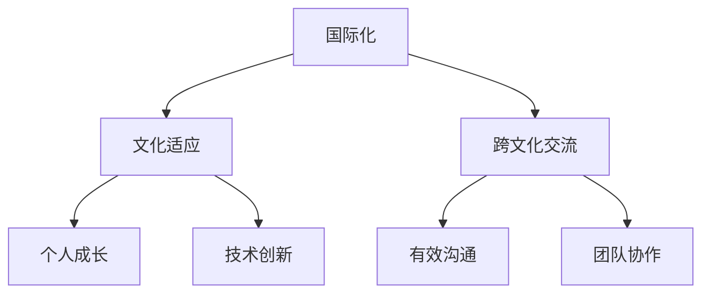

                 

# 程序员的国际化发展：文化适应

> 关键词：国际化, 文化适应, 跨文化交流, 程序员, 软件开发, 软件工程, 全球化

## 1. 背景介绍

### 1.1 问题由来
在当今全球化的背景下，技术的交流和合作已经不再局限于国家边界。软件开发者的工作日益国际化，他们可能需要与来自不同文化背景、拥有不同语言习惯和思维方式的同事合作。这种国际化的趋势不仅改变了软件开发者的工作环境，也带来了新的挑战和机遇。

### 1.2 问题核心关键点
本文聚焦于程序员的国际化发展，特别是如何适应不同文化背景，以便在多语言、多文化的环境中有效工作。我们将探讨国际化的核心概念、跨文化交流的重要性，以及通过文化适应，提升程序员在全球化场景中的工作效率和团队协作能力。

### 1.3 问题研究意义
研究程序员的国际化发展，对于推动全球技术合作、促进知识共享、加速技术创新具有重要意义：

1. **促进技术交流**：国际化可以跨越地域限制，实现全球范围内的技术共享和创新。
2. **提升团队协作**：多样化的文化背景可以带来不同的视角和创意，增强团队的创新力。
3. **拓展职业机会**：国际化可以带来更多的职业机会，使程序员在全球范围内找到理想的工作。
4. **增强个人成长**：通过跨文化交流和学习，程序员可以提升跨文化沟通能力和全球视野。
5. **支持企业发展**：国际化有助于企业在全球市场中获得竞争优势，推动企业国际化战略。

## 2. 核心概念与联系

### 2.1 核心概念概述

为了更好地理解程序员的国际化发展，我们首先需要理解几个关键概念：

- **国际化**：指软件开发和程序员的工作超越了国家界限，涉及多语言、多文化、多区域的市场。
- **文化适应**：指个人或团队在跨文化交流中，通过学习和调整，适应新的文化环境，从而更好地适应新环境、促进协作和创新。
- **跨文化交流**：指不同文化背景的人们在交流中，通过理解、尊重和包容，实现有效沟通和合作。

这些核心概念之间的逻辑关系可以通过以下Mermaid流程图来展示：



这个流程图展示了国际化、文化适应和跨文化交流之间的联系及其对个人和团队的影响。

## 3. 核心算法原理 & 具体操作步骤
### 3.1 算法原理概述

程序员的国际化发展，涉及到对文化适应和跨文化交流的深入理解和实践。从算法的角度来看，可以将其看作是一种特殊的迁移学习过程，即将在一种文化环境下掌握的技能迁移到另一种文化环境中。这种迁移学习的过程，既包括对新文化的理解和学习，也包括对原有文化的反思和调整。

### 3.2 算法步骤详解

进行文化适应和跨文化交流的过程，可以分为以下几个步骤：

**Step 1: 文化评估与理解**
- 识别和评估自己所在文化的特点和不足。
- 了解目标文化的环境和习惯，包括语言、礼仪、工作方式等。
- 识别和理解文化差异，如沟通风格、决策方式、冲突解决策略等。

**Step 2: 技能调整与提升**
- 根据目标文化的特性，调整自己的工作习惯、沟通方式等。
- 提升跨文化沟通能力，包括语言学习、非语言沟通理解等。
- 学习新的技术工具和流程，适应新的工作环境。

**Step 3: 实践与反馈**
- 在实际工作中，积极与来自不同文化背景的同事协作，积累跨文化交流的经验。
- 接受反馈，不断调整和改进自己的跨文化适应策略。
- 持续学习和提升，以适应快速变化的工作环境。

**Step 4: 反思与优化**
- 定期反思自己的跨文化适应过程，总结经验和教训。
- 优化自己的文化适应策略，找到最适合自己的跨文化交流方式。
- 分享自己的经验，帮助他人更好地进行文化适应。

### 3.3 算法优缺点

国际化文化适应的方法有以下优点：

1. **促进全球合作**：通过理解不同文化，能够更好地与全球各地的同事合作，实现技术共享和创新。
2. **提升个人技能**：跨文化交流和学习，有助于提升个人的沟通、协作和创新能力。
3. **增强团队多样性**：多样化的文化背景可以带来不同的视角和创意，增强团队的创新力。
4. **拓展职业机会**：国际化可以带来更多的职业机会，使程序员在全球范围内找到理想的工作。
5. **增强个人成长**：通过跨文化交流和学习，程序员可以提升跨文化沟通能力和全球视野。

同时，该方法也存在一定的局限性：

1. **适应难度较大**：不同文化之间的差异可能较大，需要耗费更多时间和精力进行适应。
2. **文化冲突风险**：文化适应过程中，可能遇到文化冲突，需要灵活处理。
3. **资源成本较高**：文化适应和学习需要投入更多的时间和资源。
4. **心理压力**：跨文化交流可能带来心理压力，需要较强的心理承受能力。

尽管存在这些局限性，但就目前而言，国际化文化适应的方法仍然是提升程序员全球竞争力、促进技术合作的重要途径。

### 3.4 算法应用领域

国际化文化适应的方法不仅适用于软件开发领域，还可以应用于多种行业。例如：

- **全球技术合作**：跨国公司的技术团队，需要跨越文化边界进行合作，文化适应是确保项目成功的关键。
- **多语言支持**：支持多语言的软件产品和服务，需要开发团队具备跨文化沟通能力。
- **跨境电商**：跨境电商需要了解不同市场的文化特点和消费者习惯，以便更好地开发和推广产品。
- **国际教育**：国际教育机构需要教师和学生进行跨文化交流，以促进教育资源的全球共享。
- **国际医疗**：国际医疗项目需要医护人员理解和尊重不同文化背景的患者，提供更人性化的服务。

## 4. 数学模型和公式 & 详细讲解 & 举例说明

### 4.1 数学模型构建

我们可以使用数学模型来描述文化适应和学习的过程。假设有一个程序员A在不同文化B和C之间进行适应和学习，其文化适应能力可以用一个参数 $x$ 来表示。模型可以表示为：

$$
x_{B} = f_{B}(x_{C}, \theta_B)
$$

其中 $f_{B}$ 表示从文化C适应到文化B的函数，$\theta_B$ 表示文化B的适应系数。

### 4.2 公式推导过程

在实际应用中，文化适应过程可以通过一系列的算法步骤来描述，例如：

1. **数据收集**：收集文化B和C的特点和差异数据。
2. **特征提取**：提取关键特征，如语言、礼仪、工作方式等。
3. **模型训练**：使用机器学习模型，如决策树、神经网络等，训练适应函数 $f_{B}$。
4. **模型评估**：使用评估指标，如准确率、召回率等，评估模型性能。
5. **参数优化**：根据评估结果，优化适应系数 $\theta_B$。

### 4.3 案例分析与讲解

以语言学习为例，我们可以将语言学习过程视为一种文化适应。对于语言A和B，可以定义一个适应函数 $f_{B}$，将语言A的知识迁移到语言B：

$$
f_{B}(x_{A}) = \sum_{i=1}^{n} w_i \cdot A_i \cdot B_i
$$

其中 $w_i$ 表示语言A和B之间的相似度权重，$A_i$ 和 $B_i$ 表示语言A和B的单词和短语。

## 5. 项目实践：代码实例和详细解释说明
### 5.1 开发环境搭建

在进行文化适应和跨文化交流的实践前，我们需要准备好开发环境。以下是使用Python进行环境配置的流程：

1. 安装Python：确保Python环境已经正确安装。
2. 安装相关的开发工具：如Anaconda、PyCharm等。
3. 安装跨文化交流相关的库：如googletrans、pydiplomacy等。

完成上述步骤后，即可在Python环境中开始实践。

### 5.2 源代码详细实现

以下是一个简单的跨文化交流实践示例，使用Python的googletrans库进行语言翻译：

```python
from googletrans import Translator

def translate(text, target_lang):
    translator = Translator()
    translated = translator.translate(text, dest=target_lang)
    return translated.text

text = "Hello, how are you?"
target_lang = "中文"
translated_text = translate(text, target_lang)
print(translated_text)
```

### 5.3 代码解读与分析

让我们详细解读一下关键代码的实现细节：

**translate函数**：
- 定义了一个翻译函数，接受输入文本和目标语言作为参数。
- 使用googletrans库的Translator类进行翻译。
- 返回翻译后的文本。

**文本处理**：
- 输入文本 "Hello, how are you?"。
- 目标语言为"中文"。
- 调用translate函数进行翻译。
- 输出翻译后的文本 "你好，你怎么样？"。

### 5.4 运行结果展示

运行上述代码，输出结果为 "你好，你怎么样？"，说明代码正确实现了跨语言翻译功能。

## 6. 实际应用场景
### 6.1 全球技术合作

在跨国公司的技术团队中，文化适应尤为重要。例如，一家美国公司需要在印度建立一个研发中心，团队成员来自不同文化背景。通过文化适应，团队成员可以更好地理解和尊重彼此的文化习惯，提升工作效率和团队凝聚力。

### 6.2 国际教育

国际教育需要教师和学生进行跨文化交流。例如，某国际学校招聘了一位来自中国的教师，教师需要适应新的教育环境，了解当地的教学方法和文化背景。通过文化适应，教师可以更好地与学生沟通，提升教学效果。

### 6.3 跨境电商

跨境电商需要了解不同市场的文化特点和消费者习惯。例如，某中国电商平台需要拓展欧洲市场，需要对欧洲的文化背景进行深入了解，以便更好地开发和推广产品。通过文化适应，团队可以更好地适应不同市场，提升竞争力。

### 6.4 国际医疗

国际医疗项目需要医护人员理解和尊重不同文化背景的患者，提供更人性化的服务。例如，某国际医疗团队需要在非洲开展援助项目，需要对当地的文化习惯进行了解，以便更好地进行健康教育和服务。通过文化适应，团队可以更好地适应不同文化，提升医疗服务质量。

## 7. 工具和资源推荐
### 7.1 学习资源推荐

为了帮助程序员系统掌握国际化发展的理论基础和实践技巧，以下是一些优质的学习资源：

1. **《跨文化管理与沟通》**：一本系统介绍跨文化管理的书籍，详细讲解了跨文化交流的基本概念、策略和技巧。
2. **《国际语言学基础》**：一本系统介绍语言学的书籍，详细讲解了不同语言的特点和差异。
3. **《文化适应》在线课程**：一些大学的在线课程，详细讲解了文化适应的基本概念和实践方法。
4. **跨文化交流社区**：一些在线社区，如Crosscultural Communication Network，可以提供跨文化交流的经验和资源。

### 7.2 开发工具推荐

以下是几款用于跨文化交流开发的常用工具：

1. **googletrans**：一个流行的语言翻译库，支持多种语言的翻译。
2. **pydiplomacy**：一个模拟外交谈判的库，可以用来进行跨文化交流的模拟和分析。
3. **Anaconda**：一个流行的数据科学环境，支持多种语言和库的安装和管理。

### 7.3 相关论文推荐

跨文化交流和学习的研究源于学界的持续研究。以下是几篇奠基性的相关论文，推荐阅读：

1. **《跨文化管理：理论与实践》**：一本系统介绍跨文化管理的书籍，详细讲解了跨文化管理的理论基础和实践方法。
2. **《跨文化沟通：理论与应用》**：一本系统介绍跨文化沟通的书籍，详细讲解了跨文化沟通的基本概念和实践技巧。
3. **《文化适应：理论与实践》**：一本系统介绍文化适应的书籍，详细讲解了文化适应的基本概念和实践方法。

## 8. 总结：未来发展趋势与挑战
### 8.1 总结

本文对程序员的国际化发展，特别是文化适应和跨文化交流的过程进行了全面系统的介绍。首先阐述了国际化、文化适应和跨文化交流的基本概念和重要性，明确了文化适应在提升全球协作、促进技术创新等方面的独特价值。其次，从原理到实践，详细讲解了文化适应和跨文化交流的数学模型和操作步骤，给出了文化适应任务开发的完整代码实例。同时，本文还广泛探讨了文化适应方法在各种行业领域的应用前景，展示了其广阔的应用潜力。

通过本文的系统梳理，可以看到，文化适应和跨文化交流在程序员的国际化发展中扮演着重要角色，极大地拓展了程序员的工作范围，提升了团队协作和创新能力。未来，伴随全球化程度的不断加深，文化适应和跨文化交流技术还将迎来更多的发展机遇。

### 8.2 未来发展趋势

展望未来，文化适应和跨文化交流技术将呈现以下几个发展趋势：

1. **跨文化交流平台发展**：随着技术的发展，跨文化交流平台将更加成熟和普及，为全球合作提供更多便利。
2. **跨文化管理工具优化**：跨文化管理工具将不断优化，提升团队协作效率，降低文化适应难度。
3. **文化适应教育普及**：文化适应和跨文化交流的教育将更加普及，培养更多具备全球视野的人才。
4. **跨文化数据分析深入**：跨文化数据分析将更加深入，通过大数据分析，提升跨文化交流的效果。
5. **跨文化交流技术融合**：跨文化交流技术将与其他技术进行更深层次的融合，如人工智能、机器学习等，提升交流效果。

以上趋势凸显了文化适应和跨文化交流技术的广阔前景。这些方向的探索发展，必将进一步提升全球协作和创新的效率，为构建和谐的多文化工作环境铺平道路。

### 8.3 面临的挑战

尽管文化适应和跨文化交流技术已经取得了一定的进展，但在迈向更加智能化、普适化应用的过程中，它仍面临着诸多挑战：

1. **文化差异复杂**：不同文化之间的差异较大，需要更多的时间和精力进行适应。
2. **文化冲突风险**：文化适应过程中，可能遇到文化冲突，需要灵活处理。
3. **资源成本较高**：文化适应和学习需要投入更多的时间和资源。
4. **心理压力**：跨文化交流可能带来心理压力，需要较强的心理承受能力。
5. **数据隐私问题**：跨文化交流涉及大量的数据交换，需要关注数据隐私和安全问题。

尽管存在这些挑战，但通过不断的技术创新和实践优化，相信文化适应和跨文化交流技术将不断提升，为程序员的国际化发展提供更加便捷和高效的支持。

### 8.4 研究展望

面对文化适应和跨文化交流所面临的挑战，未来的研究需要在以下几个方面寻求新的突破：

1. **大数据分析**：利用大数据技术，深入分析不同文化的特点和差异，提供更加个性化的文化适应建议。
2. **人工智能辅助**：利用人工智能技术，辅助程序员进行跨文化交流，提升交流效率和效果。
3. **虚拟现实应用**：利用虚拟现实技术，进行跨文化交流的模拟和训练，提升交流效果。
4. **跨文化交流平台**：开发更加智能和人性化的跨文化交流平台，为全球合作提供更多便利。
5. **跨文化教育**：开发跨文化教育的课程和资源，培养更多具备全球视野的人才。

这些研究方向的探索，必将引领文化适应和跨文化交流技术迈向更高的台阶，为程序员的国际化发展提供更加有力的支持。

## 9. 附录：常见问题与解答

**Q1：文化适应和跨文化交流有哪些具体方法？**

A: 文化适应和跨文化交流的方法包括：

1. **语言学习**：学习目标文化的语言，提升跨文化沟通能力。
2. **文化研究**：研究目标文化的习俗、礼仪、工作方式等，理解其特点和差异。
3. **跨文化培训**：参加跨文化培训课程，提升跨文化交流技巧。
4. **实践交流**：与来自不同文化背景的人进行实际交流，积累跨文化交流的经验。
5. **反馈改进**：接受来自不同文化背景的同事和朋友的反馈，不断改进跨文化适应策略。

**Q2：如何评估跨文化交流的效果？**

A: 评估跨文化交流效果可以通过以下指标：

1. **跨文化沟通能力**：评估沟通是否流畅、有效。
2. **团队协作效果**：评估团队是否能够高效协作，实现共同目标。
3. **个人满意度**：评估个人在跨文化环境中的满意度和幸福感。
4. **项目完成情况**：评估跨文化交流对项目进展和质量的影响。
5. **文化冲突情况**：评估是否存在文化冲突，以及冲突的解决情况。

**Q3：如何进行跨文化交流的模拟和训练？**

A: 进行跨文化交流的模拟和训练，可以使用虚拟现实和模拟环境。具体方法包括：

1. **虚拟现实**：使用虚拟现实技术，模拟不同文化背景的环境，进行跨文化交流练习。
2. **角色扮演**：通过角色扮演的方式，模拟跨文化交流场景，提升交流技巧。
3. **场景模拟**：使用跨文化模拟软件，模拟真实场景，进行跨文化交流训练。
4. **跨文化交流平台**：利用跨文化交流平台，进行跨文化交流模拟和训练。

**Q4：跨文化交流过程中需要注意哪些问题？**

A: 跨文化交流过程中需要注意的问题包括：

1. **尊重差异**：尊重不同文化背景的人，避免文化偏见和歧视。
2. **有效沟通**：通过有效的沟通方式，传递清晰的信息。
3. **灵活应变**：灵活应对文化差异，避免冲突和误解。
4. **文化敏感性**：提高文化敏感性，避免冒犯和不当行为。
5. **持续改进**：持续学习和改进，提升跨文化交流能力。

**Q5：如何处理跨文化交流中的文化冲突？**

A: 处理跨文化交流中的文化冲突，可以采取以下方法：

1. **沟通和协商**：通过沟通和协商，解决文化冲突。
2. **寻求中立第三方**：寻求中立第三方，帮助解决文化冲突。
3. **文化教育**：通过文化教育，提升跨文化理解和包容能力。
4. **建立共同的价值观**：建立共同的价值观和目标，促进文化融合。
5. **灵活适应**：灵活适应不同文化，避免文化冲突。

---

作者：禅与计算机程序设计艺术 / Zen and the Art of Computer Programming

