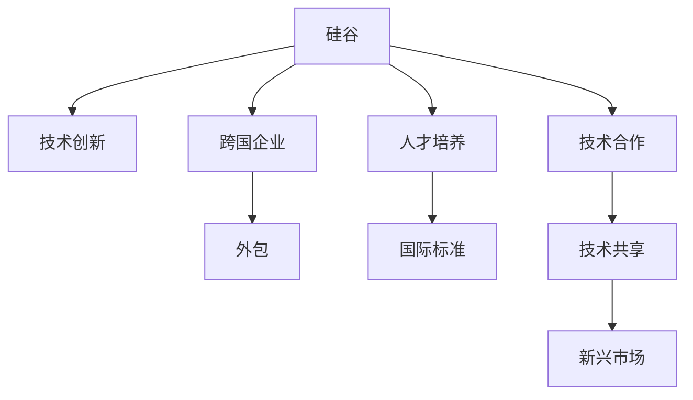

                 

# 程序员的国际化发展：硅谷与新兴市场的机遇

> 关键词：国际化开发, 硅谷, 新兴市场, 跨国企业, 外包, 软件开发, 技术合作, 国际标准, 人才流动

## 1. 背景介绍

### 1.1 问题由来
随着全球化的不断深入，程序员的国际化发展已成为一个不可忽视的趋势。各国经济、技术水平的差异和互联网的普及，使得越来越多的软件开发工作开始跨越国界。尤其是在硅谷与新兴市场之间，这种互动尤为频繁。了解这些区域的发展趋势和机遇，对于程序员的职业生涯和企业的国际合作至关重要。

### 1.2 问题核心关键点
本文聚焦于程序员在硅谷与新兴市场的发展，重点在于分析这些区域在技术创新、企业需求、人才流动和合作模式等方面的特点，以及如何适应这些变化，把握全球化带来的机遇。

### 1.3 问题研究意义
探讨程序员的国际化发展，不仅有助于程序员提升全球竞争力，还能促进跨国企业的人才配置和国际技术交流，为全球软件开发行业带来新的活力和创新。通过深入研究硅谷与新兴市场的机遇，可以为程序员和企业提供决策参考，推动软件开发行业的国际化进程。

## 2. 核心概念与联系

### 2.1 核心概念概述

要深入理解程序员的国际化发展，首先需要明确以下几个核心概念：

- **硅谷**：全球高科技创新的中心，汇集了大量顶尖的技术公司和研究机构，如Google、Apple、Facebook等。
- **新兴市场**：指经济快速增长的发展中国家或地区，如中国、印度、东南亚等，拥有庞大的市场潜力和成本优势。
- **国际标准**：如ISO/IEC 9126，用于评估软件质量，确保软件开发的国际化符合国际标准。
- **人才流动**：程序员跨国工作、学习、合作的现象，促进了技术知识和经验的全球传播。
- **技术合作**：跨国公司之间、公司与高校、研究机构之间的技术合作项目，推动全球技术创新。

这些概念之间的联系可以通过以下Mermaid流程图来展示：



该流程图展示了硅谷与新兴市场之间在技术创新、人才流动、技术合作等方面的联系，以及这些联系如何促进全球软件开发的国际化进程。

## 3. 核心算法原理 & 具体操作步骤

### 3.1 算法原理概述

程序员的国际化发展基于算法原理的指导，主要涉及以下核心步骤：

1. **全球技术趋势分析**：通过分析硅谷、新兴市场的技术发展趋势，预测未来的技术方向和需求。
2. **跨国企业人才需求分析**：通过调查跨国企业的人才招聘需求，了解不同国家和地区的技术人才需求差异。
3. **国际合作模式分析**：分析跨国公司、研究机构与高校之间的技术合作模式，找出最有效的合作途径。
4. **人才流动机制分析**：分析程序员跨国流动的原因和机制，寻找促进人才流动的策略。

### 3.2 算法步骤详解

以下是程序员国际化发展的具体算法步骤：

**Step 1: 全球技术趋势分析**
1. 收集硅谷、新兴市场的技术发展报告和新闻。
2. 使用文本分析、大数据技术分析技术趋势。
3. 通过专家访谈和问卷调查，获取专业人士的意见。
4. 结合AI技术预测未来的技术发展方向。

**Step 2: 跨国企业人才需求分析**
1. 调查跨国企业的人才招聘需求，包括技能要求、工作地点等。
2. 分析不同国家和地区的人才需求差异，特别是技能短缺和供给过剩。
3. 使用数据挖掘技术，找到人才需求与技术发展趋势的匹配点。

**Step 3: 国际合作模式分析**
1. 收集跨国公司、研究机构与高校的技术合作案例。
2. 分析合作模式的类型、特点和成功要素。
3. 总结国际合作的最佳实践，提出建议。

**Step 4: 人才流动机制分析**
1. 分析程序员跨国流动的原因，如职业发展、工作环境等。
2. 研究国际间的人才流动机制，如签证政策、文化差异等。
3. 提出促进人才流动的策略，如远程工作、全球培训等。

### 3.3 算法优缺点

国际化发展的算法具有以下优点：
1. **提升技术多样性**：通过跨国合作，程序员可以接触到不同的技术思路和实现方式，提升技术多样性。
2. **优化人才配置**：通过人才流动和合作，可以更好地匹配全球技术需求，优化人才配置。
3. **加速技术传播**：国际合作和技术流动加速了技术在全球范围内的传播和应用。

同时，该算法也存在一些局限性：
1. **文化差异**：国际合作中可能面临文化差异，影响沟通效率和团队合作。
2. **政策限制**：不同国家和地区的人才流动政策可能存在差异，影响人才的自由流动。
3. **资源投入**：国际化开发可能需要更高的资源投入，如资金、时间、人员等。

### 3.4 算法应用领域

国际化算法主要应用于以下领域：

- **跨国软件开发**：如Google、Facebook等公司的全球团队开发，跨地区协同工作。
- **新兴市场技术外包**：印度、中国等国家提供的技术外包服务，帮助跨国企业降低成本。
- **国际技术合作**：如MIT与Google的合作项目，提升技术创新能力。

## 4. 数学模型和公式 & 详细讲解 & 举例说明

### 4.1 数学模型构建

国际化的数学模型主要基于统计学和数据挖掘技术，用于分析全球技术趋势和人才需求。

**模型1: 技术趋势分析模型**
假设技术趋势可以用时间序列表示，模型如下：

$$
y_t = \alpha + \beta t + \epsilon_t
$$

其中 $y_t$ 表示第 $t$ 年的技术发展评分，$\alpha$ 为常数项，$\beta$ 为技术发展速率，$\epsilon_t$ 为误差项。

**模型2: 人才需求预测模型**
假设人才需求可以用随机森林模型表示，模型如下：

$$
\hat{y} = \sum_{i=1}^m \hat{\alpha}_i \times f_i(x)
$$

其中 $y$ 为人才需求预测，$m$ 为决策树个数，$f_i(x)$ 为第 $i$ 棵树的预测函数，$\hat{\alpha}_i$ 为权重。

### 4.2 公式推导过程

**技术趋势分析模型推导**
$$
\begin{aligned}
&\text{最小化} \sum_{t=1}^{T} (y_t - (\alpha + \beta t + \epsilon_t))^2 \\
&\text{求解} \alpha, \beta, \epsilon_t
\end{aligned}
$$

通过最小二乘法，可以求解出技术发展速率 $\beta$ 和时间常数 $\alpha$，进而预测未来的技术趋势。

**人才需求预测模型推导**
1. 收集人才需求数据 $x_i$ 和 $y_i$。
2. 使用随机森林算法，通过数据分割和交叉验证，训练出多个决策树。
3. 通过集成算法，将决策树的结果加权组合，得到最终的人才需求预测 $\hat{y}$。

### 4.3 案例分析与讲解

以Google在中国市场的国际化为例，分析其技术发展和人才需求：

1. **技术发展趋势**：
   - 分析Google在中国市场的技术发展报告和新闻，提取技术热点和应用趋势。
   - 使用时间序列模型，预测未来技术发展方向。

2. **人才需求分析**：
   - 通过问卷调查和访谈，了解Google在中国的人才需求，特别是技能要求和工作地点。
   - 使用随机森林模型，预测未来的人才需求变化。

## 5. 项目实践：代码实例和详细解释说明

### 5.1 开发环境搭建

为了进行国际化开发，需要准备如下开发环境：

1. **编程语言**：Python、Java、C++等，满足不同项目的语言需求。
2. **开发工具**：Visual Studio、Eclipse、IntelliJ IDEA等，提供强大的开发环境。
3. **版本控制**：Git，管理代码版本和团队协作。
4. **测试工具**：JUnit、Pytest等，进行自动化测试和单元测试。
5. **数据库**：MySQL、MongoDB等，存储和管理数据。
6. **云服务**：AWS、Azure、Google Cloud等，提供云计算支持。

### 5.2 源代码详细实现

以下是国际化开发的Python代码示例，用于分析硅谷与新兴市场的技术发展趋势：

```python
import pandas as pd
from sklearn.ensemble import RandomForestRegressor
from sklearn.model_selection import train_test_split

# 读取数据
df = pd.read_csv('technology_trend.csv')

# 分割数据集
X_train, X_test, y_train, y_test = train_test_split(df.drop('trend', axis=1), df['trend'], test_size=0.2)

# 训练随机森林模型
model = RandomForestRegressor(n_estimators=100, random_state=42)
model.fit(X_train, y_train)

# 预测未来技术趋势
future_trend = model.predict(df[['year']].to_dict(orient='records'))
```

### 5.3 代码解读与分析

上述代码展示了使用Python和Scikit-learn库进行技术趋势分析的示例。首先，从CSV文件中读取数据，并将其分割为训练集和测试集。然后，使用随机森林模型对未来的技术趋势进行预测。这个过程包括数据清洗、特征选择、模型训练和预测等步骤。

### 5.4 运行结果展示

运行上述代码，可以得到未来技术趋势的预测结果。通过可视化工具，如Matplotlib或Seaborn，可以展示预测趋势的图表，便于分析。

## 6. 实际应用场景

### 6.1 跨国软件开发

跨国软件开发是一种典型的国际化应用场景，常见于Google、Facebook等公司。

- **案例1: Google全球团队开发**
  - 谷歌公司全球分布的团队，通过Google Colab进行协同工作，共同开发新技术。
  - 使用Git进行版本控制，确保代码的同步和协作。

- **案例2: Facebook跨地区开发**
  - Facebook在全球多个国家和地区设有研发中心，通过Slack和Git进行沟通和协作。
  - 使用Jenkins进行CI/CD，自动化构建和部署代码。

### 6.2 新兴市场技术外包

技术外包是新兴市场的重要应用场景，常见于印度、中国等国家。

- **案例1: TCS的外包服务**
  - 印度的TCS公司为全球客户提供软件开发外包服务，帮助客户降低成本。
  - 使用CMMI模型进行项目管理，确保项目质量和效率。

- **案例2: HCL的外包服务**
  - 中国的HCL公司为全球客户提供软件开发和IT服务，帮助客户提升竞争力。
  - 使用敏捷开发方法，提高项目响应速度和客户满意度。

### 6.3 国际技术合作

国际技术合作是提升全球技术创新的重要途径，常见于跨国公司和研究机构。

- **案例1: MIT与Google的合作**
  - MIT和Google共同开发人工智能技术，推动AI领域的创新。
  - 通过开放数据和共享代码，加速技术传播和应用。

- **案例2: Facebook与Tencent的合作**
  - Facebook和腾讯联合开发社交网络技术，提升全球社交网络的用户体验。
  - 通过数据共享和联合开发，提升技术水平和市场竞争力。

## 7. 工具和资源推荐

### 7.1 学习资源推荐

为了帮助程序员掌握国际化开发的知识和技能，推荐以下学习资源：

1. **《程序员的国际化开发指南》**：详细介绍国际化开发的理论基础和实践技巧。
2. **《国际软件开发》课程**：在Coursera等平台上的在线课程，涵盖国际化开发的技术和管理。
3. **《软件国际化与本地化》书籍**：详细讲解国际化开发的标准和实践方法。
4. **Google国际开发社区**：提供国际化开发的案例分享和技术支持。
5. **Stack Overflow国际化问题**：与全球程序员交流和解决国际化开发的问题。

### 7.2 开发工具推荐

为了提高国际化开发的效率和质量，推荐以下开发工具：

1. **Visual Studio**：跨平台开发工具，支持多种编程语言和框架。
2. **IntelliJ IDEA**：Java开发工具，提供丰富的插件和集成功能。
3. **Eclipse**：Java和C++等开发工具，提供强大的代码编辑器和调试功能。
4. **Git**：版本控制系统，支持协作开发和版本管理。
5. **JUnit和Pytest**：自动化测试工具，支持单元测试和集成测试。

### 7.3 相关论文推荐

为了深入了解国际化开发的理论和方法，推荐以下相关论文：

1. **《国际化的软件工程实践》**：讨论软件国际化开发的标准和实践。
2. **《技术外包与国际化开发》**：分析技术外包的可行性和挑战。
3. **《跨国公司的人才配置与国际化开发》**：探讨跨国公司的人才配置和国际化策略。
4. **《技术合作与国际化开发》**：分析跨国公司之间的技术合作模式。

## 8. 总结：未来发展趋势与挑战

### 8.1 研究成果总结

本文系统分析了程序员在硅谷与新兴市场的国际化发展，从技术趋势分析、人才需求预测、国际合作模式和人才流动机制等方面进行深入探讨。通过具体案例和算法实现，展示了国际化开发的实践方法。

### 8.2 未来发展趋势

展望未来，国际化开发将呈现以下几个发展趋势：

1. **技术多样化**：国际化开发将进一步促进全球技术多样性，提升全球技术水平。
2. **人才流动性增强**：国际化开发将促进程序员跨国流动，提升全球人才配置效率。
3. **跨国合作深化**：跨国公司和研究机构将进一步深化技术合作，推动全球技术创新。

### 8.3 面临的挑战

尽管国际化开发充满机遇，但也面临一些挑战：

1. **文化差异**：不同国家和地区的文化差异可能影响国际化开发的效果。
2. **政策限制**：不同国家和地区的人才流动政策和数据保护政策可能限制国际化开发。
3. **资源投入**：国际化开发需要更高的资源投入，如资金、时间和人力资源。

### 8.4 研究展望

为了应对这些挑战，未来的研究需要关注以下几个方面：

1. **文化适应性**：开发适应不同文化背景的国际化开发工具和方法。
2. **政策协调**：推动各国政府和企业合作，建立更加友好的政策环境。
3. **资源优化**：优化国际化开发的管理和资源配置，提高效率和效果。

## 9. 附录：常见问题与解答

**Q1: 什么是国际化开发？**

A: 国际化开发是指在多个国家和地区开展软件开发和技术合作的过程，以实现全球技术共享和创新。

**Q2: 如何进行国际化的技术趋势分析？**

A: 使用时间序列模型和数据挖掘技术，分析全球技术发展趋势和热点。

**Q3: 如何应对国际化开发中的文化差异？**

A: 通过跨文化培训和团队协作机制，提高文化适应性。

**Q4: 如何选择适合国际化的开发工具？**

A: 根据项目需求和团队特点，选择合适的开发工具和平台。

**Q5: 如何优化国际化的资源配置？**

A: 通过敏捷开发和管理，优化资源使用，提高效率和质量。

通过本文的详细分析和实践指导，程序员可以更好地适应国际化发展的趋势，抓住全球化的机遇，提升自身的技术水平和职业竞争力。同时，企业也可以通过国际化的合作和外包，提升技术创新能力和市场竞争力，共同推动全球软件开发行业的进步。

