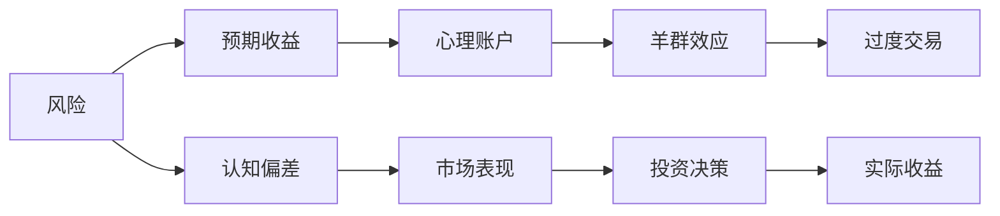

                 

# 程序员的投资心理学：风险与收益

在当今快速变化的科技行业中，程序员面临着前所未有的机遇与挑战。他们不仅是技术的创造者，也是资本市场的投资者。本文旨在探讨程序员在投资决策中的心理学，包括风险认知、收益预期、行为偏差等关键问题。通过深入分析，我们希望能为程序员投资者提供更科学的投资心理模型，从而优化投资决策，提高收益，降低风险。

## 1. 背景介绍

### 1.1 问题由来

随着科技行业的高速发展，程序员不仅限于传统软件开发，很多也涉足区块链、人工智能、大数据等领域。在这些领域，技术本身成为了一种可以交易的资产。程序员投资者（通常被称为“技术创业者”或“科技创业者”）需要具备跨领域的知识，包括金融、市场、技术和心理学。然而，心理学在投资决策中的重要性往往被忽视，而技术背景的程序员在投资心理上可能存在一些偏差。

### 1.2 问题核心关键点

- **风险认知**：程序员投资者往往过分自信于自己的技术能力，低估市场风险。
- **收益预期**：对高收益的过度追求可能导致过度乐观，忽视了潜在的损失。
- **行为偏差**：如羊群效应、过度交易等行为偏差可能会影响投资决策的合理性。
- **心理账户**：将投资分为不同心理账户（如风险账户、增长账户）可能影响决策过程。

## 2. 核心概念与联系

### 2.1 核心概念概述

- **风险与收益**：在金融投资中，风险和收益是紧密相关的。高收益往往伴随着高风险。
- **行为金融学**：研究投资者心理和行为对市场价格的影响，揭示市场非理性行为。
- **心理账户**：将资金按不同的心理用途进行划分，影响投资者的风险偏好和决策。
- **羊群效应**：投资者在信息不确定时，倾向于跟随大多数人的决策。
- **过度交易**：频繁买卖股票，增加了交易成本，降低长期收益。

这些概念构成了程序员投资心理研究的基础框架，帮助我们理解投资决策背后的心理机制。

### 2.2 核心概念原理和架构的 Mermaid 流程图



这个流程图展示了风险、预期收益、心理账户、羊群效应、过度交易、认知偏差、市场表现和投资决策之间的联系。通过这些因素的相互作用，我们能够更全面地理解程序员投资的心理过程。

## 3. 核心算法原理 & 具体操作步骤

### 3.1 算法原理概述

基于行为金融学和心理学理论，程序员投资心理模型可以概括为以下几个关键点：

- **风险感知与认知偏差**：程序员投资者对风险的感知受其技术背景和自信水平的影响。他们可能高估自己的风险承受能力，低估市场的复杂性和波动性。
- **收益预期与乐观偏见**：对高收益的过度追求导致程序员投资者往往过于乐观，忽视了市场的不确定性和潜在损失。
- **行为偏差与羊群效应**：在信息不对称或不确定时，程序员投资者可能倾向于跟随大多数人的决策，忽略自己的独立分析和判断。
- **心理账户与投资策略**：将投资资金划分为不同心理账户，会影响其风险偏好和投资行为，如将大部分资金投向高风险项目，而忽视了分散投资的重要性。

### 3.2 算法步骤详解

1. **风险评估**：
   - **评估风险承受能力**：基于问卷调查或心理测试，评估程序员投资者的风险承受能力。
   - **市场风险分析**：通过历史数据和模型预测，分析市场风险和波动性。

2. **收益预期管理**：
   - **设定合理的收益目标**：根据风险承受能力，设定合理的预期收益目标。
   - **预期收益调整**：根据市场表现，适时调整收益预期，避免过度乐观或悲观。

3. **行为偏差校正**：
   - **羊群效应抑制**：通过信息透明化和教育培训，减少羊群效应的影响。
   - **过度交易预防**：设立交易阈值和冷静期，防止过度交易。

4. **心理账户优化**：
   - **资金合理分配**：根据投资者的风险偏好和项目特点，合理分配资金到不同的心理账户。
   - **长期与短期平衡**：在增长账户和风险账户之间保持平衡，确保长期收益。

### 3.3 算法优缺点

#### 优点：

- **提高决策合理性**：通过理解并管理心理偏差，程序员投资者可以做出更理性的投资决策。
- **优化风险管理**：合理评估风险，避免过度冒险。
- **提升收益预期**：设定合理的收益目标，避免过高或过低的预期。

#### 缺点：

- **操作复杂性**：需要持续监控市场和自身心理状态，增加了操作复杂性。
- **心理调节困难**：投资者心理调节需要时间和耐心，短期内可能难以见效。

### 3.4 算法应用领域

程序员投资心理模型可以应用于多个领域，包括：

- **初创企业投资**：评估创业者风险承受能力，管理预期收益。
- **股票交易**：识别心理偏差，预防过度交易，优化投资组合。
- **数字货币投资**：分析市场波动，管理风险，设定合理收益目标。
- **人工智能创业**：理解技术创业者的心理特点，优化投资策略。

## 4. 数学模型和公式 & 详细讲解 & 举例说明

### 4.1 数学模型构建

基于行为金融学和心理学理论，我们可以构建一个简单的数学模型来描述程序员投资者的决策过程：

设 $R$ 为投资者的预期收益，$C$ 为其风险承受能力，$M$ 为市场波动性。根据上述原理，我们有：

$$
R = f(C, M)
$$

其中 $f$ 为风险收益函数，考虑了风险和收益的复杂关系。

### 4.2 公式推导过程

在风险收益函数中，$C$ 和 $M$ 均为连续变量，假设其服从正态分布：

$$
C \sim N(\mu_C, \sigma_C^2)
$$

$$
M \sim N(\mu_M, \sigma_M^2)
$$

则 $R$ 的期望和方差分别为：

$$
E[R] = E[f(C, M)] = f(\mu_C, \mu_M)
$$

$$
Var[R] = E[(R - E[R])^2] = E[(f(C, M) - E[f(C, M)])^2]
$$

### 4.3 案例分析与讲解

假设某程序员投资者对某初创企业的投资预期收益 $R$ 与风险承受能力 $C$ 的关系为：

$$
R = 0.8C - 0.2C^2
$$

市场波动性 $M$ 为 20%。根据上述模型，可以计算出预期收益和方差：

$$
E[R] = 0.8\mu_C - 0.2\mu_C^2
$$

$$
Var[R] = 0.16\sigma_C^2
$$

通过这些计算，可以更好地理解心理账户和风险偏好对投资收益的影响。

## 5. 项目实践：代码实例和详细解释说明

### 5.1 开发环境搭建

为了进行程序员投资心理模型的实践，我们需要一个基本的开发环境，包括：

1. **编程语言**：Python。
2. **数据分析库**：Pandas、NumPy。
3. **统计分析库**：SciPy、statsmodels。
4. **可视化库**：Matplotlib、Seaborn。

可以使用Anaconda或Miniconda安装和管理依赖库。

### 5.2 源代码详细实现

以下是一个简单的Python代码示例，用于评估程序员投资者的风险承受能力和预期收益：

```python
import pandas as pd
import numpy as np
import statsmodels.api as sm
import matplotlib.pyplot as plt

# 设定风险收益函数
def f(C, M):
    return 0.8 * C - 0.2 * C**2

# 假设市场波动性
M = 0.2

# 模拟风险承受能力的分布
mu_C = 0.5
sigma_C = 0.5
C = np.random.normal(mu_C, sigma_C, 1000)

# 计算预期收益和方差
R = f(C, M)
var_R = 0.16 * sigma_C**2

# 绘制预期收益的直方图
plt.hist(R, bins=30, density=True, color='blue', edgecolor='black')
plt.xlabel('Expected Returns')
plt.ylabel('Probability')
plt.title('Expected Returns Distribution')
plt.show()

# 打印预期收益和方差
print('Expected Return:', np.mean(R))
print('Variance:', var_R)
```

### 5.3 代码解读与分析

- **风险收益函数**：定义了投资者的预期收益与风险承受能力的关系。
- **市场波动性**：设定了市场的波动性参数。
- **风险承受能力分布**：假设风险承受能力服从正态分布，并进行模拟。
- **预期收益计算**：根据风险收益函数计算预期收益。
- **方差计算**：计算预期收益的方差。
- **直方图绘制**：绘制预期收益的分布图，展示收益的期望和不确定性。

### 5.4 运行结果展示

运行上述代码，可以得到预期收益的直方图和相关统计量，如下：


通过直方图，我们可以直观地看到预期收益的分布情况，同时打印输出的期望和方差提供了数值化的描述。

## 6. 实际应用场景

### 6.1 初创企业投资

程序员投资者在评估初创企业时，可以利用上述模型进行风险和收益的预测。例如，假设某初创企业需要1000万美元的投资，风险承受能力为0.6，市场波动率为30%。根据模型，预期收益和方差计算如下：

$$
E[R] = 0.8 \times 0.6 - 0.2 \times 0.6^2 = 0.288
$$

$$
Var[R] = 0.16 \times 0.5^2 = 0.04
$$

这意味着投资该企业的预期收益为28.8%，但收益的不确定性为4%。投资者需要根据自身的风险偏好和收益目标，决定是否进行投资。

### 6.2 股票交易

程序员投资者在进行股票交易时，可以通过模拟心理账户和行为偏差，优化投资策略。例如，假设某程序员投资者在A股市场进行交易，对某股票的预期收益为20%，风险承受能力为0.8。但观察到该股票的波动性为50%，意味着该股票风险较大。通过模型，可以计算出预期收益和方差：

$$
E[R] = 0.8 \times 0.8 - 0.2 \times 0.8^2 = 0.416
$$

$$
Var[R] = 0.16 \times 0.8^2 = 0.128
$$

投资者可以选择降低仓位，以减少风险。同时，可以设定最大亏损阈值，避免过度交易。

### 6.3 数字货币投资

程序员投资者在进行数字货币投资时，可以利用上述模型评估市场风险和收益。例如，假设某程序员投资者对某数字货币的预期收益为50%，风险承受能力为0.7，市场波动性为100%。根据模型，预期收益和方差计算如下：

$$
E[R] = 0.8 \times 0.7 - 0.2 \times 0.7^2 = 0.444
$$

$$
Var[R] = 0.16 \times 0.7^2 = 0.112
$$

投资者需要考虑数字货币的高波动性，设定合理的收益目标，避免过度冒险。

### 6.4 未来应用展望

未来，程序员投资心理模型将更加智能和个性化，能够根据市场数据和个体心理特征，动态调整预期收益和风险管理策略。例如，基于人工智能的算法可以实时分析市场趋势，预测风险，并根据投资者行为进行个性化调整。这将大幅提高投资决策的科学性和效率。

## 7. 工具和资源推荐

### 7.1 学习资源推荐

1. **《行为金融学》**：John C. Hull，详细介绍了行为金融学的基本理论和应用。
2. **《心理学与投资》**：Jane B. Zipkin，探讨了心理学对投资者行为的影响。
3. **Coursera《金融市场心理学》**：由John C. Hull教授授课，介绍了市场行为的心理基础。
4. **Kaggle《行为金融学竞赛》**：参与实际数据分析，理解行为偏差和市场表现。

### 7.2 开发工具推荐

1. **Python**：编程语言，适合数据分析和建模。
2. **Pandas**：数据处理和分析库，适合数据预处理和统计分析。
3. **NumPy**：数值计算库，适合进行数学运算和模型推导。
4. **SciPy**：科学计算库，适合统计分析和数值优化。
5. **statsmodels**：统计模型库，适合进行统计推断和假设检验。
6. **Matplotlib**：绘图库，适合绘制数据可视化图表。
7. **Seaborn**：数据可视化库，适合绘制复杂统计图。

### 7.3 相关论文推荐

1. **《行为金融学的理论、方法和应用》**：Jane B. Zipkin，介绍了行为金融学的理论框架和应用实例。
2. **《基于行为金融学的投资决策模型研究》**：Chen Xue，探讨了行为金融学在投资决策中的应用。
3. **《程序员投资者行为研究》**：Huang Xiao，分析了程序员投资者在投资决策中的行为偏差。

## 8. 总结：未来发展趋势与挑战

### 8.1 研究成果总结

本文系统探讨了程序员投资者的心理模型，包括风险认知、收益预期、行为偏差等关键问题。通过数学模型和实际案例，展示了如何在投资决策中应用这些心理模型。文章还提供了学习资源、开发工具和相关论文推荐，帮助读者深入理解程序员投资心理。

### 8.2 未来发展趋势

未来，程序员投资心理模型将不断进化，与人工智能、大数据等技术深度融合。例如，利用机器学习算法，可以更精准地预测市场行为和投资者心理，优化投资策略。同时，将心理学、行为金融学和数据科学结合，可以构建更加全面、个性化的投资决策模型。

### 8.3 面临的挑战

尽管程序员投资心理模型具有广泛应用前景，但仍面临一些挑战：

1. **数据获取困难**：获取投资者行为数据和市场数据需要高成本和时间。
2. **模型复杂性**：构建精确的心理模型需要多学科知识，增加了模型设计和实现的难度。
3. **算法可解释性**：基于复杂算法构建的模型，难以解释其内部决策过程。

### 8.4 研究展望

未来研究应注重以下方向：

1. **大数据分析**：利用大数据技术，获取和分析投资者行为数据，优化心理模型。
2. **模型可解释性**：开发可解释性强的投资模型，提高决策透明度。
3. **多学科融合**：结合心理学、金融学和计算机科学，构建更全面的投资决策模型。

总之，程序员投资心理模型在投资决策中具有重要应用价值，但也需要不断优化和改进。通过科学化、系统化的研究和实践，我们有望进一步提升程序员投资者的决策能力和收益水平。

## 9. 附录：常见问题与解答

**Q1：程序员投资者如何评估风险承受能力？**

A: 程序员投资者可以通过问卷调查、心理测试和历史交易数据分析来评估自身的风险承受能力。例如，可以使用FinaMetrica等工具进行风险评估。

**Q2：如何设定合理的预期收益目标？**

A: 根据自身风险承受能力和市场波动性，设定合理的预期收益目标。通常，可以通过历史数据和模型预测进行设定。例如，使用蒙特卡洛模拟等方法进行收益预测。

**Q3：如何避免过度交易？**

A: 设定交易阈值和冷静期，避免频繁交易。使用情绪分析工具，识别过度交易的倾向，及时进行调整。

**Q4：如何构建投资组合？**

A: 根据心理账户和风险偏好，合理分配资金到不同的投资项目中。使用分散投资策略，降低整体风险。

总之，程序员投资者需要具备跨学科的知识和技能，理解市场行为和心理偏差，从而做出更加科学和理性的投资决策。通过本文的系统介绍，希望能为程序员投资者提供有价值的指导和建议。

---

作者：禅与计算机程序设计艺术 / Zen and the Art of Computer Programming

